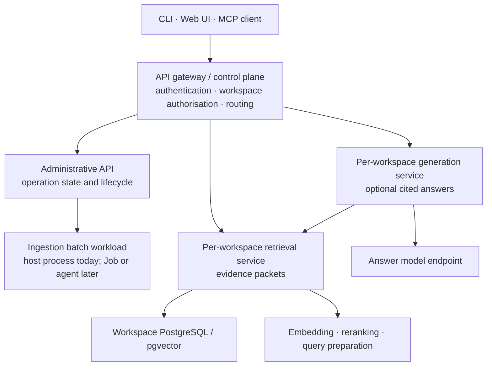

# API Server & Multi-Interface Architecture

**Version:** `0.2.0`

**Status:** target architecture of record — **nothing in this document is
built yet.** The host CLI and three-store infrastructure remain the shipped
system. This file owns the public/control-plane interface and the boundary
between workloads; `docs/ingestion-design.md`, `docs/retrieval-design.md`,
`docs/generation-design.md`, and `docs/workspace-isolation.md` own their
respective mechanics.

---

## 1. Direction

Today `pocket-advisor` is a single CLI binary that directly implements
everything it does — uploads, discovery, worker pools, schema bootstrap,
resets (`ingestion-design.md` §8). The long-term direction is an authenticated
API/control plane over specialised workloads:

1. **The API Server becomes the source of truth for public API behaviour,
   identity, workspace authorisation, and operation state.** It is not a
   monolith that must execute every workload itself. The CLI progressively
   becomes a client of this control plane.
2. **Two API surfaces, split by audience:**
   * **Administrative API** — bootstrapping and operational concerns:
     workspace lifecycle (`docs/workspace-isolation.md` §3), schema
     bootstrap, corpus load/reset operations currently under
     `internal/cli` (`ingestion-design.md` §8.1).
   * **User API** — per-workspace retrieval, and later optional generation.
     Retrieval already follows §2's bridge rule: its logic is a
     transport-agnostic Go package, so HTTP and MCP remain thin adapters.
3. **A WebUI is a future client of the same API Server** — not a separate
   backend, not a reason to grow a second source of truth.
4. **Standing rule for all new work from here on:** any new management or
   operational functionality is designed **API-first**, with CLI support
   and WebUI support built in parallel against that same API — never CLI
   logic first with an API retrofitted later.

**Why this order, not the reverse:** retrofitting an API onto
CLI-embedded logic means re-deriving the same behavior twice and risking
the two drifting apart (input validation, error semantics, confirmation
prompts vs. structured responses). Designing the API surface first and
having the CLI consume it means there is exactly one implementation of
each operation, ever.

---

## 2. What Changes, What Doesn't

**Unaffected:** the ingestion pipeline itself (`ingestion-design.md` §1–§9)
does not become an API — it is a batch process invoked to
completion (`--ingest-all`, `--scan`, `--reconcile`), and nothing about
this document changes that shape. What moves behind an API is the
*invocation and management* of these operations, not the pipeline's own
internal architecture (worker pools, JetStream, the three stores).

**Changes:** where a caller reaches an operation, how it is authorised, and
which workload executes it.

* **Today:** `internal/cli` parses flags and calls straight into
  `internal/app`, `internal/pipeline`, `internal/uploader`, etc.
* **Direction:** the API/control plane authorises and records an operation,
  then routes it to the correct specialised workload. `internal/cli` becomes
  a thin client issuing requests and rendering responses. The live dashboard
  becomes a client-side view of operation progress, not a competing controller.

**Bridge, before any of this exists:** write new operational logic as plain,
transport-agnostic Go functions in a reusable package — not inline in CLI flag
handling. (The original example here was `--create-workspace`/
`--delete-workspace`; both were deleted once the chart took over provisioning
entirely — `ingestion-design.md` deviation 24 — which is the strongest version
of the same point: logic that belongs somewhere else should live there.) A CLI mode calls the function directly today;
an API handler calls the identical function later. This is the entire cost
of being "API-first" before an API Server exists, and it's the only part
of this document actionable right now.

---

## 3. Surface Scope

| Surface | Owns | Backed by |
| --- | --- | --- |
| Administrative API | Workspace lifecycle (create/delete), schema bootstrap, corpus load/scan/reconcile, dataset reset (delete-data/forget) | `internal/cli` modes today; `workspace-isolation.md` §3 for workspace lifecycle specifically |
| User API | Per-workspace retrieval; later optional generation | `retrieval-design.md` §7's transport-agnostic `internal/retrieval` package, exposed by HTTP and MCP adapters. `generation-design.md` owns the separately-failable answer service, which calls retrieval rather than its database. |

All existing ingestion and reset modes are Administrative operations. They
remain bounded jobs, never HTTP handlers.

---

## 4. Service Shape

The control plane is long-running. Retrieval is a distinct long-running
Deployment and Service **per workspace**; the same image can be reused, but
each Deployment has one fixed workspace id and only that workspace's
least-privilege credentials. Generation follows the same boundary when it is
implemented. This deliberately prevents a cross-workspace query at the
database-credential boundary.

MCP is an adapter over retrieval today, and may be an adapter over generation
later. It does not select a workspace by itself. The edge authenticates the
caller and authorises the workspace before routing; a URL segment, tool name,
or request parameter is never authority to choose a corpus.

Kubernetes owns the deployment/network boundary: Services, health checks,
rollouts, network policy, and gateway integration for TLS and authentication.
It does not implement MCP or make an unauthenticated service safe. Initial
exposure is cluster-internal or by port-forward; remote access requires an
authenticated gateway before an Ingress is created.

The existing `pocket-advisor-infra` chart continues to deploy only RustFS,
PostgreSQL, and NATS. API and data-plane workloads belong in a separate chart
or release, so an infrastructure upgrade cannot roll them out.

---

## 5. Ingestion Operations and Open Decisions

The Administrative API records an authorised ingestion/reset operation and
dispatches it; it does not execute worker pools in an HTTP handler. Source
folders are host staging feeds and the current OCR/model toolchain is
host-local, so the first executor is a host agent using the existing CLI. A
Kubernetes Job is a later migration only after corpus upload and model access
have deliberate cluster-native designs.

Open decisions:

1. **Identity provider and gateway.** Select authentication and MCP-client
   compatibility before any remote ingress is exposed.
2. **Administrative dispatcher.** Define the authenticated host-agent contract
   before the control plane becomes authoritative for ingest operations.
3. **Model placement.** Decide whether embedding, reranking, query preparation,
   and future answer models remain host-local or become cluster Services.
4. **API contract.** Establish versioning, routes, durable operation records,
   and streaming policy before third-party clients depend on them.
5. **Web UI shape.** Decide its rendering model and whether it includes
   administration as well as retrieval.
