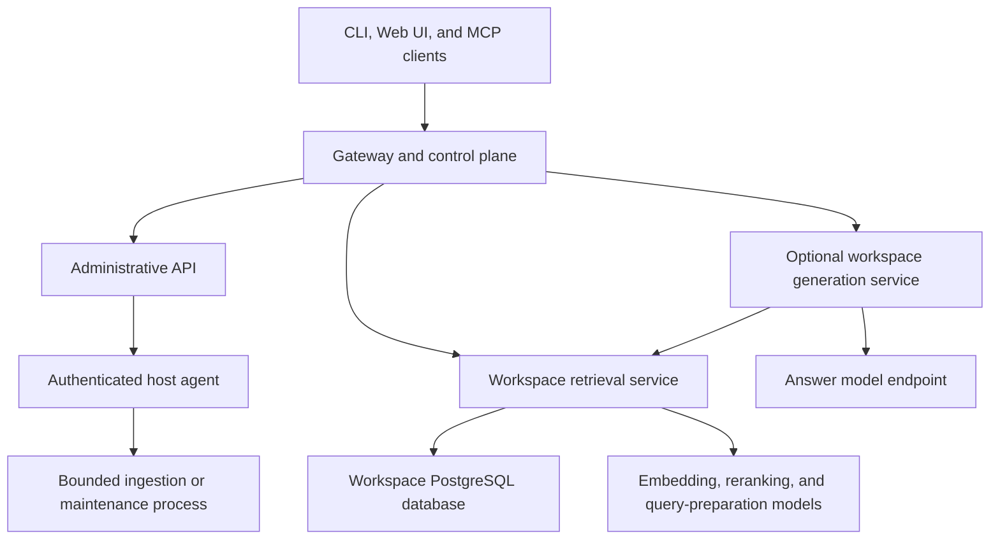

# API Server Design

This document is the design authority for Pocket Advisor's public and control-plane APIs, service boundaries, interface adapters, and CLI coupling. It describes intended architecture. No API server, authenticated gateway, Web UI, host agent, or Kubernetes application workload defined here is implemented yet.

[Ingestion design](ingestion-design.md), [retrieval design](retrieval-design.md), [generation design](generation-design.md), and [workspace isolation](workspace-isolation.md) remain authoritative for their own mechanics.

## Current interfaces

Pocket Advisor currently runs as a host CLI process. `internal/cli` parses commands and calls the ingestion, retrieval, storage, and reset packages directly. The implemented interfaces are:

- bounded ingestion and maintenance commands;
- an interactive ingestion listener;
- a direct query command; and
- a workspace-bound stdio MCP server over newline-delimited JSON-RPC.

The current MCP server is an adapter over `internal/retrieval`. It is fixed to one workspace when launched and does not provide an HTTP or network MCP endpoint. Answer generation is performed by the MCP client or another external consumer of evidence packets.

## Target architecture

The intended architecture adds an authenticated gateway and control plane over specialized workloads:

The control plane becomes authoritative for public API behavior, caller identity, workspace authorization, routing, and administrative operation state. It does not become a monolith that performs ingestion, retrieval, and generation inside request handlers.

## API surfaces

### Administrative API

The administrative surface authorizes, records, dispatches, and reports bounded operations such as:

- workspace provisioning and removal;
- schema application and compatibility checks;
- ingest-all, scan, reconcile, and listener lifecycle;
- dataset reset and selected-source forgetting; and
- operation status and failure details.

An HTTP handler must not run worker pools or a long reset inline. The API records an operation and dispatches it to an executor with an explicit lifecycle.

Local corpus paths and the current model endpoints exist on the host, so the first executor is a separately authenticated host agent that invokes reusable application packages or the supported CLI workflow. A cluster Job becomes appropriate only after corpus staging, model access, credentials, cancellation, and progress reporting have cluster-native designs.

### User API

The user surface exposes retrieval and, when implemented, optional cited generation. Retrieval's Go package remains transport-independent; HTTP and network MCP handlers translate their requests to `retrieval.Request` and preserve `retrieval.Result` semantics. Generation is a separate consumer of retrieval packets and never queries storage directly.

The Web UI is a client of these APIs. It must not introduce a parallel backend or implement its own workspace authorization rules.

## Identity and workspace routing

The gateway authenticates a caller, authorizes a workspace, and selects the corresponding service route. A workspace ID in a URL, request body, MCP argument, or tool name is a requested resource, not proof of authority.

Each retrieval and generation workload is configured for exactly one workspace and receives only that workspace's least-privilege credentials. Downstream requests must not override that fixed scope. This preserves the separate database, bucket, and NATS boundaries defined in [workspace isolation](workspace-isolation.md).

Administrative access is distinct from user query access. Destructive operations require explicit permissions, an auditable operation record, and confirmation semantics suitable for non-interactive clients. The API must not expose shared PostgreSQL or RustFS administrative credentials.

## Service topology

The target control plane is a long-running workload. Retrieval is a separate long-running Deployment and Service per workspace. Generation follows the same workspace boundary when enabled. The same image may support several roles, but each workload has a distinct command, credentials, network policy, health check, and failure domain.

Kubernetes provides scheduling, service discovery, health checks, rollout control, and network policy. It does not supply protocol authorization. Initial development access may be cluster-internal or through port forwarding; remote ingress requires TLS, authentication, authorization, request limits, and audit policy first.

The current `pocket-advisor-infra` chart remains responsible only for PostgreSQL, RustFS, and NATS. Target control-plane and application workloads belong in a separate chart or release so infrastructure changes do not implicitly roll application services.

## Package boundary and CLI migration

Operational behavior should live in reusable Go packages with explicit inputs and results. CLI commands, future HTTP handlers, and the host agent are adapters around those packages. Transport-specific concerns such as flags, JSON, streaming, and status codes must not enter ingestion or retrieval business logic.

During transition, the CLI may continue calling packages directly. Once an API operation is stable and available, the CLI should become its client so authorization, validation, operation state, and error semantics have one public implementation. The migration must preserve a supported local recovery path for bringing up or repairing the control plane itself.

## Operation model

Every administrative request receives a durable operation ID and records at least:

- authenticated actor and authorized workspace;
- operation type and validated parameters;
- queued, running, succeeded, failed, or canceled state;
- creation, start, update, and completion times;
- executor identity and retry attempt; and
- structured error and safe progress information.

Operation records must not contain credentials, corpus paths, source content, query text, or model prompts. Logs and metrics use opaque or low-cardinality labels rather than workspace names.

Idempotency keys are required for create, dispatch, and destructive requests where client retries could duplicate work. Cancellation must distinguish stopping active processing from rolling back completed external changes; no operation should claim rollback unless its implementation provides it.

## Protocol behavior

Before third-party clients depend on the API, define:

- versioned HTTP routes and schemas;
- a consistent structured error envelope;
- authentication and authorization failures that do not reveal workspace existence;
- request size, timeout, concurrency, and rate limits;
- pagination and filtering for operation lists;
- streaming semantics for progress and generated answers; and
- compatibility rules for HTTP and MCP adapters.

Health endpoints must separate process liveness from dependency readiness. A retrieval service is ready only after configuration, workspace scope, database schema, and required model endpoints pass their startup checks.

## Failure and degradation

- If authorization fails, the gateway does not route the request.
- If the control plane cannot dispatch an accepted operation, the operation remains failed or retryable with an explicit reason; it is never reported as running without an executor.
- If retrieval fails, the user request fails without invoking generation.
- If generation fails, the retrieval result remains independently available.
- Retrieval warning codes survive every adapter unchanged.
- A workspace workload with a scope or credential mismatch fails readiness and does not accept traffic.

## Verification expectations

Implementation must add contract tests for authentication, authorization, workspace routing, operation idempotency, errors, and adapter parity. Isolation tests must prove that a caller authorized for one workspace cannot reach another through route manipulation, request fields, MCP tools, or direct service access. Use the general repository checks in [README §9](../README.md#9-verification) for existing components.

## Open decisions

- Select the identity provider, gateway, and authorization policy model.
- Define the host-agent authentication, dispatch, progress, cancellation, and upgrade protocol.
- Choose the API versioning scheme, route shapes, durable operation store, and event-streaming protocol.
- Decide whether model endpoints remain host-local or move behind cluster services.
- Define Web UI scope and whether it includes administrative operations.
- Define the bootstrap and recovery workflow when the control plane itself is unavailable.
