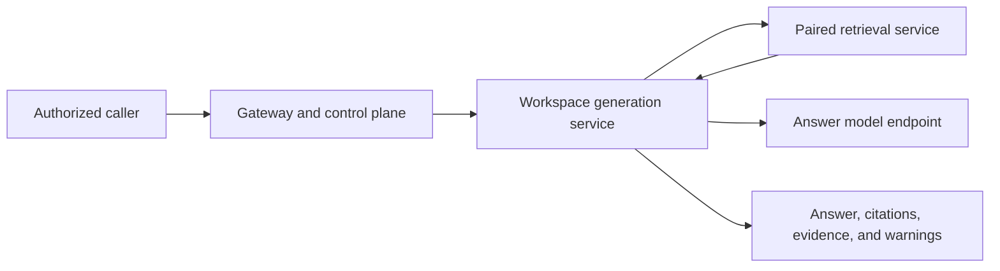

# Generation Design

This document is the design authority for cited answer generation, answer-model access, evidence isolation, and the intended generation service. It describes target state. Pocket Advisor does not currently run an in-repository generation service.

In the current system, the workspace-bound stdio MCP server returns retrieval evidence to an external agent, and that agent writes any answer. [Retrieval design](retrieval-design.md) owns evidence selection, [API server design](api-server-design.md) owns authentication and routing, and [workspace isolation](workspace-isolation.md) owns credential boundaries.

## Purpose and boundary

Generation composes a cited answer from a retrieval result. It does not search PostgreSQL, fetch arbitrary RustFS objects, ingest content, modify the index, or decide which workspace a caller may access.

The dependency is one-way: generation calls its paired retrieval service. Retrieval remains complete and usable without generation and never receives answer-model credentials.

## Deployment and isolation

Generation is a separate long-running Deployment and Service for one fixed workspace. It may share an image family with retrieval but has distinct credentials, network policy, scaling, and failure behavior.

The generation workload receives:

- network access to its paired retrieval service;
- network access to the configured answer-model endpoint; and
- only the credential needed for that model endpoint, if one is required.

It receives no PostgreSQL, RustFS, NATS, provisioning, ingestion, or Kubernetes administrative credential. Giving generation direct storage access would create a second retrieval path and weaken the workspace boundary.

The gateway authenticates the caller, authorizes the workspace, and routes to the matching generation workload. A workspace value in the request cannot override that workload's configured scope.

## External-model egress

If the answer model runs outside the local trust boundary, generation is the explicit egress point for source-derived text. Operators must be able to determine what provider receives evidence, which credential is used, and what retention policy applies.

External model support requires:

- an explicit per-workspace or deployment policy allowing egress;
- bounded evidence and prompt size;
- TLS and authenticated model access;
- provider retention and training settings compatible with private content;
- logs that omit questions, evidence, prompts, and generated text; and
- failure behavior that never falls back to an unapproved provider.

Retrieval must not gain provider credentials or general outbound access merely because generation is enabled.

## Evidence contract

Generation receives the complete `retrieval.Result`: original question, effective sub-queries, evidence packets, retrieval warnings, and context-budget use. Each packet includes stable document and chunk identifiers, UTF-8 byte offsets, source hash, Tier 1 URI, text admitted by the retrieval budget, and related-document labels.

Generation may reason over only the evidence supplied for that request. It must not ask the model to fill evidentiary gaps from general knowledge while presenting the result as grounded in the workspace. When evidence is absent, insufficient, or conflicting, the answer shape must say so.

The model-facing prompt assigns a compact packet reference to every supplied packet. The model returns structured claims and packet references rather than free-form citation strings.

## Citation contract

Before returning a successful answer, generation validates that every citation:

1. names a packet supplied to this request;
2. resolves to that packet's immutable provenance;
3. does not invent a document, URI, byte range, relationship, or speaker; and
4. is attached to a claim in the response schema.

Reference validation proves that a cited source exists; it does not prove that the source entails the claim. The response therefore retains the evidence packets or stable references needed for independent inspection. Whether semantic entailment checking is also required remains an open decision.

Every factual claim derived from workspace material must cite at least one packet. Introductory phrasing, uncertainty statements, and clearly labeled reasoning may follow a separately specified policy, but they must not obscure which claims are evidenced.

## Request flow

1. Receive an authorized question for the workload's fixed workspace.
2. Call the paired retrieval service using a bounded timeout.
3. If retrieval succeeds, construct a prompt from the question, evidence packets, warning state, and answer policy.
4. Call the configured answer model.
5. Parse the structured response and validate its citations.
6. Return the answer, validated citations, retrieval warnings, evidence references, and model/degradation metadata allowed by policy.

Generation is stateless between requests. Multi-turn conversation, if added, uses bounded caller-supplied history under an explicit API contract. Hidden server-side model state is not part of the design.

## Failure semantics

- A retrieval failure ends the generation request; the model is not asked to guess.
- An empty retrieval result produces an evidence-insufficient response without a model call unless the API explicitly needs the model to phrase a refusal.
- An answer-model timeout, unavailable endpoint, malformed output, or failed citation validation is a generation failure.
- A generation failure does not make retrieval unavailable; clients can request evidence directly.
- Retrieval warnings are preserved in the generation response and may require a qualified answer.
- The service never changes provider, model, workspace, or evidence source as an implicit fallback.

Streaming, if enabled, must not expose an unvalidated answer as final. One acceptable design streams provisional text with an explicit state and emits a final validated response; another buffers until validation. The protocol decision must be made before streaming is implemented.

## Persistence and privacy

Generated answers, prompts, model responses, conversation state, and caches are not source documents. They must never enter `documents.normalized_text`, `document_chunks`, or the retrieval index.

Any persistent answer history requires a separate store and explicit workspace scope, retention, deletion, backup, export, and audit rules. Until that design exists, generation remains request-stateless and does not persist prompts or answers.

Telemetry records timings, response states, model identifiers, citation counts, and bounded cardinalities. It must not record questions, evidence text, prompts, model output, source paths, document titles, or workspace names.

## Relationship to MCP

Current MCP exposes retrieval only, and the MCP client acts as the generation layer. When the target service exists, an MCP adapter may offer generation as an additional tool, but it must use the same authenticated route and response contract as HTTP. A tool name or workspace argument is never authorization.

The local chat-completions model used by retrieval decomposition is not implicitly the answer model. Reusing it requires an explicit quality, privacy, and capacity decision.

## Verification expectations

Implementation must test citation-reference validation, refusal and insufficient-evidence behavior, workspace route enforcement, prompt-size limits, provider allowlists, log redaction, timeouts, malformed model output, and retrieval-warning propagation. Security tests must prove the service has no data-store credentials and cannot reach another workspace's retrieval service.

Use the repository checks in [README §9](../README.md#9-verification) for existing components; service-specific tests will be added with implementation.

## Open decisions

- Choose the answer model or models, placement, and per-workspace egress policy.
- Define the prompt, structured answer schema, claim granularity, refusal behavior, and treatment of conflicting evidence.
- Decide whether citation validation also performs quotation or entailment checks.
- Decide whether answers remain ephemeral or use a separate workspace-scoped history store.
- Choose streaming semantics that preserve final citation validation.
- Define quality, latency, cost, and privacy acceptance tests for answer-model changes.
