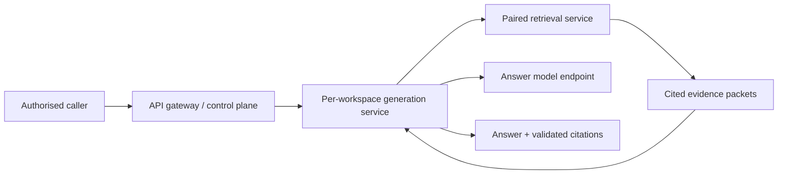
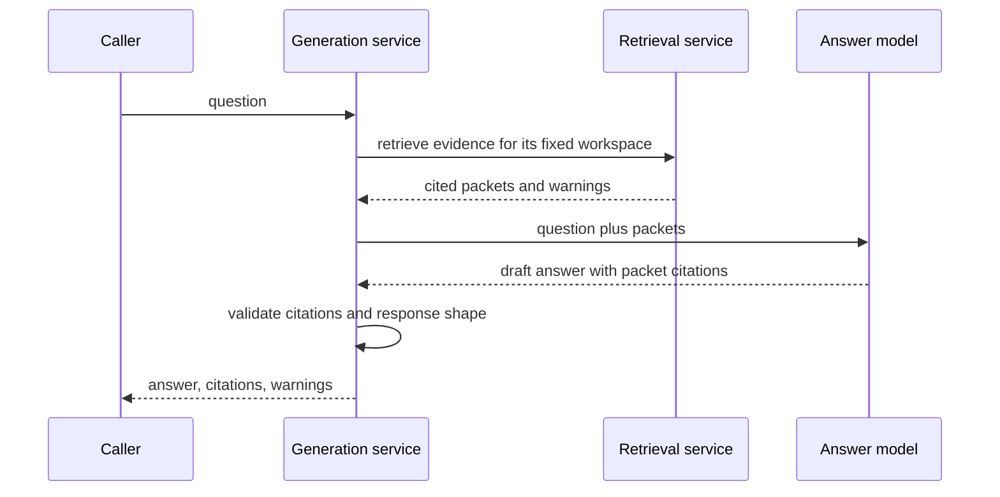

# Answer Generation Design

**Version:** `1.0.0`

**Status:** target design of record. Pocket Advisor does not yet run an
in-repository generation service: an MCP client currently reads retrieval
packets and writes the answer. This document defines the boundary for the
future service without changing that shipped behaviour.

---

## 1. Purpose and Boundary

Generation composes a cited answer from evidence packets. It does not search
the corpus, index documents, write derived text into Tier 2/3, or decide which
workspace a caller may access. Those responsibilities belong respectively to
retrieval, ingestion, and the API gateway/control plane.

Retrieval is useful and complete without generation. Therefore the dependency
is one-way: generation calls retrieval; retrieval must never call generation.
A generation outage degrades to source packets, not to an unavailable search
system.

---

## 2. Deployment and Isolation

Generation is a separate long-running Kubernetes Deployment beside the
retrieval Deployment for the same workspace. A workspace gets one deployment
of each, configured with its own identity and route. The services may use the
same application image family, but they have different credentials, network
policy, scaling, and failure domains.

The generation pod has:

- network access to its paired retrieval Service;
- access to its configured answer-model endpoint; and
- only the secret needed to authenticate to that endpoint, if any.

It has no PostgreSQL, RustFS, NATS, ingestion-worker, or Kubernetes API
credentials. Direct evidence-store access would create a second, unaudited
retrieval implementation and would weaken workspace isolation.

If an answer model is external, generation is the sole egress boundary for
corpus-derived material. Retrieval has neither provider credentials nor egress
permission, so a normal search cannot export evidence merely as a side effect
of serving a request.

---

## 3. Evidence and Citation Contract

The input to generation is a retrieval result: the original question, searched
sub-queries, warnings, and source packets with `doc_id`, Tier 1 URI, character
range, and packet index. Generation may summarise and reason over packet text,
but every factual claim in its response must cite one or more supplied packet
indexes.

Before returning an answer, the service validates that each emitted citation:

1. names a packet supplied to this request;
2. retains that packet's immutable provenance; and
3. does not fabricate a document, URI, offset, or speaker attribution.

Citation validation proves provenance linkage, not that the model's reasoning
is correct. The response must therefore retain the original packets or their
stable references so a caller can inspect the source material independently.

Generated answers, prompts, model traces, and caches are not source text. They
must never enter `documents.normalized_text`, `document_chunks`, or any other
retrieval index. Any future answer history has a separate store, schema,
retention policy, and deletion behaviour.

---

## 4. Request Flow and Failure Semantics

If retrieval fails, generation returns that failure without asking the model to
guess. If the model fails or citations do not validate, generation returns a
clear generation failure and the retrieval packets remain available through the
retrieval API/MCP tool. A client may then answer manually or retry generation.

Generation is stateless with respect to conversation history. Multi-turn chat,
if introduced, is an explicit API feature: bounded caller-supplied history is
an auditable input, never hidden state held by the model service.

---

## 5. Relationship to MCP and the API Server

Today MCP exposes retrieval only. The agent is the generation layer and the
operator chooses when evidence enters that conversation. This remains the
default until the service defined here is implemented.

When generation is introduced, the API gateway authorises the workspace before
routing to the paired generation service. MCP may expose a generation tool as
an additional adapter, but an MCP tool name, URL path, or request parameter is
not authority to select a workspace. The gateway/control plane owns that
decision, as defined in `docs/api-server-design.md`.

The query-preparation LLM used by retrieval is not an answer model. It remains
inside the retrieval path for mechanical decomposition only; it must not be
reused for answer generation without a separate quality decision.

---

## 6. Open Decisions

1. **Answer model and placement.** Local model, external provider, or both;
   the choice determines quality, cost, latency, and egress policy.
2. **Prompt and output schema.** Define the answer format, claim-to-citation
   requirements, refusal behaviour, and treatment of conflicting evidence.
3. **Citation-validation depth.** Packet-reference validation is required;
   determine whether additional quote/entailment checks are necessary.
4. **Persistence.** Decide whether answers are ephemeral or stored outside the
   retrieval corpus, including retention, deletion, and audit requirements.
5. **Streaming.** Decide whether answer streaming is worth supporting. It must
   not emit uncited partial claims as though they were final evidence.
