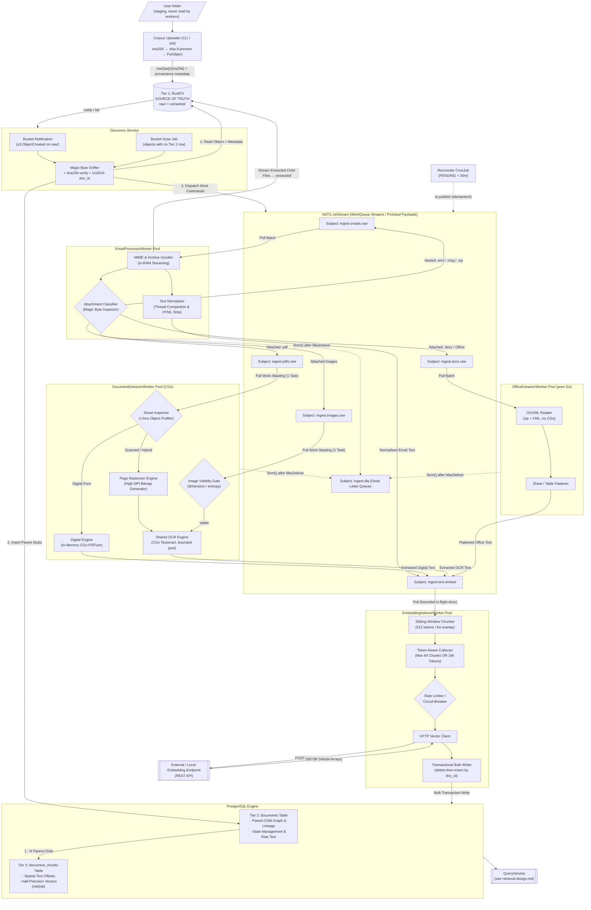

# High-Throughput Event-Driven Enterprise RAG Ingestion Engine Architecture

**Version:** `3.7.0`

**Architecture Paradigm:** Event-Driven Microservices, In-Memory Pipeline Processing, 3-Tier Storage Model

**Target Runtime:** 100% Go Worker Microservices with CGo Bindings (`PDFium`, `Tesseract`)

**Target Deployment:** Kubernetes Self-Hosted On-Premise or Cloud

**Status:** holistic design of record for the write path. Everything about
ingestion — pipeline, storage, failure semantics, codebase layout,
observability — lives in this file. Its only peer is
`docs/retrieval-design.md`, which owns every read-path concern; §7 here
states the contract between them. There are no other v3 design documents.

**Changes in 3.7.0:** Tier 1 migrated from MinIO to RustFS (§12.7) — four
bugs found and fixed en route, one still open (§11.5): live bucket
notifications don't yet fire end-to-end in-cluster, despite working in
isolated testing of the same version. `discovery.scan` remains the
operational backstop until that's resolved.

**Changes in 3.6.0:** the uploader resolves the user's
`workspaces/workspace-config.yaml` instead of taking a directory (§5.1). Two
parameters — registry path and workspace id — identify every collection in a
matter, and registry attributes travel onto the Tier 1 objects.

**Changes in 3.5.0:** Helm is the only deployment path (§6.2); the
write-authority split of §5.1 is now enforced by two scoped RustFS identities
rather than described.

**Changes in 3.4.0:** implementation landed (§12 records where the code
deliberately differs from this design).

**Changes in 3.3.0:**

* **`EmbedTextCommand` now carries a `doc_id` reference, not text** (§4.1).
  Extractors write `documents.normalized_text`; the indexer reads it back.
  Avoids NATS's 1 MB payload cap on large OCR output.
* **Storage sized against the measured corpus** (§6.4): RustFS 10Gi → 50Gi,
  PostgreSQL 5Gi → 20Gi, NATS 2Gi → 5Gi.
* **Single-replica, no-backup storage recorded as an accepted risk**
  (§11.2) rather than an open question.

**Changes in 3.2.0:**

* **Tier 1 (RustFS) is now the sole source of truth.** User filesystems are a
  staging feed, never read by the system (pillar 2, §5.1).
* **New `Corpus Uploader`** (§5.1) — CLI/Job that moves a folder into
  `raw/`, skipping content already present, with `--wipe` and `--forget`
  resets that cascade into PostgreSQL.
* **Discovery no longer walks a filesystem** (§5.2) — it consumes RustFS bucket
  notifications, with a bucket scan as an exact reconciliation. No corpus
  volume mount anywhere in the cluster.
* **Two Tier 1 prefixes with distinct write authorities:** `raw/` (uploader
  only) and `extracted/` (email worker only), enforced by bucket policy.

**Changes in 3.1.0:**

* **Thread summarisation removed entirely** — no `thread_summaries` table, no
  summary generation worker, no summary index (pillar 8, §4.3).
* **Embedding model set to `jina-embeddings-v5-text-small` over an external
  REST API**, with vector dimensionality discovered by probing the endpoint
  rather than hardcoded (§4.4).
* **Retrieval mechanics moved out** to `docs/retrieval-design.md`; §7
  reduced to the ingestion-side contract.
* **`project-layout.md` and `observability.md` folded in** as §8 and §9 and
  deleted; both were drifting from the services added in 3.0.0.

**Changes in 3.0.0:** added the `DiscoveryService` specification (§5.2),
`OfficeExtractorWorker` (§5.5), image OCR routing (§5.4), real JetStream DLQ
mechanics (§2.5), the write-then-publish reconciliation protocol (§2.2), and
corrected the chunker/batcher ordering (§2.4) and vector dimensionality
(§4.2).

---

## 1. Executive Summary & Architecture Principles

This system provides a high-throughput, deterministic document ingestion pipeline optimized for enterprise, multi-workspace RAG solutions. It is designed to handle complex, deeply nested document trees (such as emails containing nested `.eml` attachments, archives, scanned contracts, and digital bank statements) with **zero local disk I/O** and **zero OS subprocess forking**.

### Core Pillars

1. **In-Memory CGo Processing:** Direct C-library memory integration (`libpdfium` and `libtesseract`) inside Go microservices eliminates shell execution overhead and disk I/O latency.
2. **Strict 3-Tier Data Lifecycle:**
* **Tier 1 (Immutable Vault):** Object storage (`RustFS` / S3-compatible) preserves exact byte representations of original files, and is the **sole source of truth** for document content. User filesystems are a feed into it, never read by the system itself (§5.1).
* **Tier 2 (Relational Graph & Lineage):** Relational storage (`PostgreSQL`) tracks workspace boundaries, thread contexts, and parent-child document trees.
* **Tier 3 (Vector Similarity Index):** Vector storage (`pgvector`) retains spatial text chunk offsets and half-precision (`halfvec`) HNSW similarity indices.


3. **Smart Work-Stealing & Backpressure:** Message broker queues with pull-based consumers manage load dynamically across workers based on CPU and memory demands.
4. **Binary Wire Protocol:** Protocol Buffers over high-speed messaging minimize serialization penalties and network footprint.
5. **Deterministic Classification:** In-memory object inspection routes digital documents through microsecond parsing paths while directing scanned or hybrid assets to specialized OCR pipelines.
6. **Single Entry Point:** Only `DiscoveryService` mints root documents. Every other worker creates children. "What entered the system, and when" is answerable from one component.
7. **Content-Addressed Identity:** A document's durable identity is its content hash within a collection, never its path. Re-uploading and re-scanning are therefore free and idempotent rather than duplicative, at every layer: object key, `doc_id`, and chunk set all derive from the same hash.
8. **Source of Truth Only — No Generated Text in the Index:** The pipeline indexes exactly two things: compacted email bodies and the extracted text of attached documents (PDF, Office, OCR). It generates no summaries, abstracts, or synthetic descriptions, and stores none. Summarisation is deferred wholly to the user-level LLM at answer-generation time, where it operates on retrieved sources with the question in hand.

---

## 2. Dynamic Workflow & Failure Recovery Mechanisms

### 2.1 Async Parent Stubbing (Preventing Race Conditions)

To eliminate foreign key lookup failures caused by concurrent event consumption, ingestion tasks record a **Document Stub** in Tier 2 before issuing work to down-stream processing queues.

Bytes arrive in Tier 1 first, and separately — the uploader (§5.1) puts them there before the pipeline knows they exist:

```
[Uploader]  ─── Write Raw Object ────────────────────────► [Tier 1: RustFS raw/]
                                                                   │
                                              (bucket notification │ or scan)
                                                                   ▼
[Discovery Service]
       │
       ├─── 1. Read Object + Provenance Metadata ────────► [Tier 1: RustFS raw/]
       │
       ├─── 2. Transactional Create Document Stub ───────► [Tier 2: PostgreSQL Documents]
       │       (State: 'PENDING', parent_doc_id NULL)
       │
       └─── 3. Emit Async Command Payload ───────────────► [NATS JetStream WorkQueue]

```

`EmailProcessorWorker` follows the same protocol for children it unrolls,
except that it *does* write Tier 1 first (to `extracted/`, §5.1) because those
bytes exist nowhere else. Either way the stub lands before the command, so
when a child is processed its `parent_doc_id` already exists in Tier 2 and
relational integrity holds regardless of consumption order.

### 2.2 The Write-Then-Publish Gap and Reconciliation

Steps 2 and 3 above are **not atomic**: PostgreSQL commits, then NATS is told. A crash between them leaves a document `PENDING` forever with no message in flight. This is silent data loss, and it is the failure mode most likely to survive into production unnoticed, because nothing errors — the document simply never arrives.

Two mechanisms close the gap.

**Acknowledged publish with bounded retry.** Publishing uses JetStream's acknowledged path (`PublishMsg` awaiting `PubAck`), never fire-and-forget. A publish still failing after retry is logged at `ERROR` with `doc_id` and left to the reconciler.

**Reconciliation sweep.** A `CronJob` (every 15 min) re-publishes any document `PENDING` longer than 30 minutes:

```sql
SELECT doc_id, minio_raw_uri, mime_type, workspace_id
FROM documents
WHERE processing_status = 'PENDING'
  AND updated_at < now() - interval '30 minutes'
ORDER BY updated_at
LIMIT 500;
```

Re-publishing is safe precisely because `doc_id` is deterministic (§5.2) and every worker is idempotent on it: a duplicate delivery redoes work, it does not create a second document. The sweep exports `rag_discovery_stale_pending`; a non-zero steady state is an alertable symptom, not routine.

The same reasoning applies to the child stubs created by `EmailProcessorWorker` — it uses the identical stub-then-publish protocol and is covered by the same sweep.

**A second gap exists upstream:** an object can land in `raw/` and its bucket notification be dropped, leaving bytes with no Tier 2 row at all — invisible to the `PENDING` sweep, which only sees documents that already exist. The bucket scan (§5.2) closes it, and because Tier 1 is authoritative the check is exact rather than best-effort: enumerate `raw/`, anti-join `documents`, publish the difference. Running it after every upload is the normal operating procedure, not a repair action.

### 2.3 Idempotency Contract

Every worker must be safe to run twice on the same `doc_id`, because at-least-once delivery guarantees it eventually will be. Concretely:

* Tier 1 writes are content-addressed — rewriting the same key with the same bytes is a no-op.
* Tier 2 stub creation uses `INSERT ... ON CONFLICT (doc_id) DO NOTHING`.
* Tier 3 chunk writes **delete-then-insert by `doc_id`** inside the same transaction as the Tier 2 status update. Appending would duplicate chunks on redelivery and quietly corrupt retrieval ranking, which is far worse than the redundant write.

### 2.4 Token-Aware Dynamic Micro-Batching

Instead of fetching fixed message counts, embedding workers collect tasks using dual constraints: **Max Task Count** or **Max Cumulative Token/Character Budget**. This prevents memory spikes and HTTP gateway timeouts when processing large text payloads.

**Ordering: chunk first, then batch.** The v2 topology placed the batcher before the chunker, which put the token budget on the wrong side of the component that multiplies token count — a 16k-token batch of documents becomes an unbounded number of chunks, so the constraint that exists to bound the outbound HTTP request did not bound it. The corrected pipeline is:

```
Fetch (bounded by in-flight docs)
   └─► Chunker (512 tokens / 64 overlap)
         └─► Token-Aware Collector (max 64 chunks OR 16k tokens)
               └─► Circuit Breaker ─► HTTP Embedder ─► Transactional Writer
```

The budget now applies to exactly what leaves the process. A single document whose chunk count exceeds the budget is split across several embedding requests but still written in **one** transaction, so a document is never half-indexed.

### 2.5 DLQ and Poison Pill Management

NATS JetStream has no native dead-letter queue. What it provides is `MaxDeliver` plus an advisory on `$JS.EVENT.ADVISORY.CONSUMER.MAX_DELIVERIES.<stream>.<consumer>`. The DLQ is therefore application code, and must be built rather than assumed:

1. Consumers are configured `MaxDeliver = 3`, `AckWait = 5m` (OCR tasks can legitimately exceed a default 30s ack window; without this, slow work is redelivered as if it had failed).
2. On a terminal error the worker calls `Term()` — not `Nak()` — and republishes the original payload to `ingest.dlq` with headers `X-Failure-Reason`, `X-Failure-Worker`, `X-Delivery-Count`, and `X-Traceparent`.
3. On the third redelivery the worker itself performs step 2 rather than relying on the advisory, which is a backstop for crashed workers that never reach their own error path.
4. The Tier 2 row is set `FAILED` with the reason recorded in `metadata_headers`.

**Declined is not failed.** A format the system knowingly does not support (§5.2 routing table, legacy binary Office formats per §5.5) sets Tier 2 status `SKIPPED` with a reason code and produces **zero** DLQ messages. Mixing "we can't parse this" with "this broke" makes the DLQ unactionable — it fills with expected outcomes and stops being read. The DLQ is reserved for work that should have succeeded.

---

## 3. End-to-End System Architecture



---

## 4. Contract Specifications & Data Schemas

### 4.1 Interface Protocols (Protobuf System Contracts)

The internal messaging protocol relies on immutable command messages containing tracing headers, workspace scope, and document lineage pointers.

* **DocumentMetadata Schema:** Captures context including `workspace_id`, `collection_id`, `thread_id`, `parent_doc_id` (empty for root entities), `source_filename`, `mime_type`, `raw_sha256`, and OpenTelemetry correlation headers (`trace_parent`).
* **ProcessEmailCommand:** Wraps object storage references (`minio_raw_uri`) and metadata for inbound email and archive tasks.
* **ProcessPdfCommand:** Contains object references, lineage metadata, and explicit processing priority flags for PDF processing.
* **ProcessOfficeCommand:** Object reference plus detected OOXML sub-type (`docx` / `xlsx` / `pptx` / `rtf` / `odt`) for the pure-Go Office path.
* **ProcessImageCommand:** Object reference plus pixel dimensions and byte size recorded at discovery, so the viability gate (§5.4) can decide without a second fetch.
* **EmbedTextCommand:** Carries a `doc_id` **reference**, not the text itself.

**Commands carry references, never document content.** Every extractor writes
its output to `documents.normalized_text` before publishing, and
`EmbeddingIndexerWorker` reads the text back from Tier 2. This is a change
from earlier drafts, in which `EmbedTextCommand` transported the extracted
text on the wire.

Three reasons, in order of severity:

1. **NATS caps message payload at 1 MB by default.** A 60-page OCR'd document
   produces more extracted text than that, so the publish fails — and it fails
   at the end of the most expensive work in the pipeline, on exactly the
   documents most worth indexing. Raising `max_payload` trades a hard failure
   for an unbounded one.
2. It settles who owns `normalized_text`. Previously nothing did: extractors
   emitted text and the indexer wrote status, leaving the column's author
   unspecified.
3. The text stops crossing the wire twice (extractor → NATS → indexer →
   Postgres) and stops occupying JetStream's PVC, which sizes the queue for
   backlog depth rather than document size (§6.4).

All five carry `DocumentMetadata` as their first field. `traceparent` is mandatory, not optional: a command without it produces an orphaned trace and is rejected at the consumer.

---

### 4.2 Database Storage Architecture (PostgreSQL)

```
+-----------------------------------------------------------------------------------+
| TIER 2: DOCUMENTS (Relational Lineage & Normalization Graph)                      |
+-----------------------------------------------------------------------------------+
| - doc_id (UUID, PK)              -- deterministic UUIDv5, see §5.2                |
| - parent_doc_id (UUID, FK -> documents.doc_id ON DELETE CASCADE)                  |
| - workspace_id (VARCHAR, Indexed)                                                 |
| - collection_id (VARCHAR, Indexed)                                                |
| - thread_id (VARCHAR, Indexed)                                                    |
| - processing_status (ENUM: PENDING, PROCESSING, COMPLETED, SKIPPED, FAILED)       |
| - doc_type & mime_type (VARCHAR)                                                  |
| - minio_raw_uri & raw_sha256 (TEXT/VARCHAR)                                       |
| - normalized_text (TEXT)                                                          |
| - metadata_headers (JSONB)       -- incl. skip/failure reason codes               |
| - created_at / updated_at (TIMESTAMPTZ)                                           |
+-----------------------------------------------------------------------------------+
                                          │
                                          │ 1 : N Lineage
                                          ▼
+-----------------------------------------------------------------------------------+
| TIER 3: DOCUMENT CHUNKS (Vector Index & Positional Provenance)                    |
+-----------------------------------------------------------------------------------+
| - chunk_id (UUID, PK)                                                             |
| - doc_id (UUID, FK -> documents.doc_id ON DELETE CASCADE)                         |
| - workspace_id (VARCHAR, Composite Index)                                         |
| - chunk_index (INT)                                                               |
| - start_char_offset & end_char_offset (INT)                                       |
| - chunk_text (TEXT)                                                               |
| - embed_model (VARCHAR)          -- index namespace; see §4.4                     |
| - embedding (halfvec(N), HNSW Cosine Index m=16, ef_construction=64)              |
| - fulltext_search (TSVECTOR GENERATED, GIN Index for Hybrid Search)               |
+-----------------------------------------------------------------------------------+

```

`N` is resolved at schema bootstrap by probing the embedding endpoint — see §4.4. It is never a literal in checked-in DDL.

`embed_model` exists so a model swap writes into a distinct namespace rather than silently mixing incomparable vectors in one index — the same guarantee v2 got from separate cache directories.

**Full-text configuration.** `fulltext_search` is a generated column using the `simple` text-search configuration, not `english`:

```sql
fulltext_search tsvector
  GENERATED ALWAYS AS (to_tsvector('simple', chunk_text)) STORED
```

The corpus is bilingual (`ingestion.ocr.langs: eng+rus`). English stemming applied to Russian text produces wrong stems silently, and Postgres cannot pick a stemmer per row. `simple` does no stemming, matching the recall behaviour of v2's SQLite FTS5 index.

### 4.3 No Derived-Text Tables (Deliberate Deviation from v2)

There is **no `thread_summaries` table**, and no other table holding
model-generated text. Tier 2 stores only text extracted from the bytes in
Tier 1; Tier 3 embeds only that text. This is a deliberate departure from v2,
which generated and indexed per-thread summaries
(`v2/docs/ingestion/email-thread-summaries.md`, config keys
`ingestion.summarize_threads` and `ingestion.thread_summary_max_tokens` —
both dropped in v3).

The reasoning:

* **A summary competes with the sources it summarises.** Indexed alongside
  its own members, it occupies candidate slots that would otherwise hold
  primary evidence, and it ranks well precisely because it is dense and
  on-topic — the failure mode is retrieving a lossy paraphrase instead of the
  document that proves the point.
* **It has to be labelled everywhere, forever.** v2 required every retrieval
  path to mark summary hits as generated navigation rather than evidence. A
  single missed label turns model output into apparent source text, which for
  this corpus is the one error that matters.
* **Staleness is a standing tax.** A summary is invalidated by any change to
  thread membership, so the system must track membership drift, flag stale
  rows, and exclude them from retrieval — machinery that exists solely to
  maintain a derivative.
* **The summarising model is better positioned later.** At answer time an LLM
  sees the actual question and the retrieved sources. An ingestion-time
  summariser sees neither, so it must guess what will matter and compress
  accordingly. Deferring costs nothing at index time and produces a better
  summary when one is actually needed.

What remains is compaction, not summarisation: `EmailProcessorWorker` strips
quoted reply chains, HTML markup, and signature boilerplate (§5.3). That is
lossless with respect to the author's own words — it removes duplication and
markup, and never rewrites content.

### 4.4 Embedding Model and Dimensionality Discovery

**Model:** `jinaai/jina-embeddings-v5-text-small`, served over an **external
REST API**. The engine loads no models itself — it holds a URL and an HTTP
client (`models.embedding_endpoint`). This is a change from earlier drafts,
which assumed bge-m3 on a local oMLX endpoint.

**Dimensionality is discovered, never hardcoded.** `halfvec(N)` is a typed
SQL column, so `N` must be known before the first `CREATE TABLE` — but the
authority on `N` is the model, not this document. Pinning a literal in
checked-in DDL is how an index silently ends up the wrong shape when the
endpoint changes.

The resolution is a **schema bootstrap step**, run once before the DDL and
again on any model change:

1. `GET {embedding_endpoint}/../models` (or the endpoint's model-info route)
   to read the served model identifier and its declared output dimension.
2. If the endpoint exposes no model metadata, fall back to embedding a single
   probe string and measuring `len(data[0].embedding)`. Every OpenAI-shaped
   embeddings API supports this, so it always terminates.
3. Record the resolved `(model_id, dimension)` pair in a
   `schema_metadata` row.
4. Apply the Tier 3 DDL with `N` interpolated, and create the HNSW index.

Every worker startup re-probes and compares against `schema_metadata`. A
mismatch is a **fatal startup error**, not a warning: a worker that embeds at
one dimension into a column sized for another either errors per-row or, worse
with a Matryoshka-capable model that will happily return a truncated vector,
writes vectors that are silently not comparable to their neighbours.

**A dimension change is a re-embed, not a migration.** `ALTER TABLE ... TYPE
halfvec(M)` cannot reinterpret existing vectors. The procedure is: write into
a new `embed_model` namespace, backfill, then drop the old namespace. Because
`embed_model` already partitions Tier 3, this is a normal operation rather
than an outage, and the old index stays queryable throughout.

**Matryoshka truncation, if the model supports it,** is a deliberate choice
recorded in `schema_metadata` alongside the model id — not something inferred
from response length. A truncated dimension is a different index namespace
from the full one, because the vectors are not mutually comparable.

---

## 5. Microservice Domain Blueprint

### 5.1 Corpus Uploader (`cmd/uploader`)

**Role:** move bytes from wherever the user keeps them into Tier 1. It is the
**only** writer to the `raw/` prefix, and the only component that ever touches
a user filesystem.

#### The inversion

Tier 1 is the source of truth for every document in the system. A user's
folder is a *source for* the source of truth, not the source of truth itself.
Nothing downstream — no worker, no query, no citation — ever reads a local
path.

This is a deliberate reversal of v2, where a gitignored `workspaces/corpora`
directory in the repo was authoritative and the engine read it directly. Three
consequences follow, and they are the reason for the change:

* The repo carries no corpus, gitignored or otherwise. The code is the repo;
  the documents are in a bucket.
* The cluster needs no corpus volume mount. Workers reach documents the same
  way whether they run on a laptop or in a datacentre.
* Reproducing an environment means restoring a bucket, not reassembling a
  directory tree that only one machine ever had.

The cost is honest and accepted: bytes exist twice, once in the user's folder
and once in RustFS. That duplication buys a single authoritative store with
uniform access, and it is the user's folder — not the bucket — that is free to
be reorganised, moved, or deleted afterwards.

#### What to upload comes from the workspace registry

The uploader is not told a directory. It is given the user's
`workspaces/workspace-config.yaml` — the same registry v2 used — and a
workspace id, and it resolves the rest:

```
uploader --workspace-config <path>/workspace-config.yaml
         --workspace-id     <workspace id>
```

The registry declares `collections[]` (each with an `id`, a `path`, and an
`ingestion-type`) and `workspaces[]` that reference collections by id. Those
two flags therefore identify every document in a matter, and "what this
workspace contains" has one definition instead of one per invocation.

Collection paths are relative to the registry file's own directory, so the
registry and the corpora travel together: mounting that one directory is
enough, and paths resolve in the cluster exactly as they do on the host.

Resolution happens **before any store is touched**. An unknown workspace id
fails immediately and reports the ids that do exist; a workspace referencing an
undefined collection is an error rather than a smaller upload, because silently
ingesting less than the matter contains is the worst available outcome.

Registry attributes are written onto the Tier 1 object alongside the file's own
provenance — `ingestion-type`, and for bank collections the BSB, account
number, account type and owners. The registry does not live in the cluster, so
anything it knows that the bytes do not is lost the moment the bucket outlives
the checkout.

#### Operation

For each file in each of the workspace's collections:

1. Stream the file, computing `sha256` as it reads.
2. Form the key `workspaces/{workspace_id}/raw/{sha256[0:2]}/{sha256}`.
3. `StatObject` on that key. **If it exists, skip** — counted as `duplicate`,
   not re-uploaded.
4. Otherwise `PutObject` with provenance metadata attached.

Skip-if-present is exact rather than heuristic, because the key *is* the
content hash: two files with the same bytes produce the same key no matter
what they are named or where they sit. Re-running the uploader over a folder
that has grown by ten files uploads exactly those ten.

#### Provenance travels with the bytes

Content-addressed keys carry no filename, and RustFS is now the authoritative
store — so the provenance has to live on the object, not in a filesystem the
system no longer reads:

| Object metadata | Purpose |
| --- | --- |
| `x-amz-meta-source-filename` | original basename, becomes `documents.source_filename` |
| `x-amz-meta-source-path` | path relative to the upload root |
| `x-amz-meta-collection-id` | collection scope for `doc_id` derivation (§5.2) |
| `x-amz-meta-ingestion-type` | `general` or `bank-transactions`, from the registry |
| `x-amz-meta-account-*` | BSB, number, type, owners — bank collections only |
| `x-amz-meta-uploaded-at` | RFC 3339 timestamp |
| `x-amz-meta-uploader-run-id` | which upload run introduced this object |

When the same bytes arrive under a second filename, the object is not
rewritten — the additional name is appended to `x-amz-meta-alias-filenames`.
One content, one object, one document; the aliases are recorded because they
are sometimes evidence in themselves.

**The uploader does not sniff formats.** It is a byte mover. All format
knowledge lives in discovery (§5.2), in one place, so a new supported type is
a one-component change.

#### Two prefixes, two write authorities

```
workspaces/{workspace_id}/
  raw/{aa}/{sha256}          ← uploader only; workers may read, never write
  extracted/{aa}/{sha256}    ← EmailProcessorWorker only (unrolled children)
```

v2's hard rule — source corpora are read-only, never written, renamed, or
deleted — transfers from a filesystem mount to the `raw/` prefix. It is
enforced by a RustFS access policy on the worker service account rather than by
convention, because a convention that only holds while everyone remembers it
is not an invariant.

#### `--wipe` is a corpus reset, not a bucket delete

The flag purges everything for a workspace and re-uploads from scratch. It
**must cascade into PostgreSQL**:

```
1. Confirm (interactive prompt, or --yes for a Job)
2. Remove objects under workspaces/{workspace_id}/     (raw/ and extracted/)
3. DELETE FROM documents WHERE workspace_id = $1       (chunks cascade)
4. Re-upload from the source directory
```

Tier 2 and Tier 3 are derivatives of Tier 1 objects. Purging the bucket while
leaving the database populated leaves every `minio_raw_uri` dangling and every
citation unresolvable — retrieval keeps returning confident results that point
at nothing, which is worse than either a clean reset or no action at all. The
uploader therefore refuses to do half of this: if it cannot reach PostgreSQL,
it does not touch the bucket.

#### Absence is not deletion

The uploader is additive. It never infers that a document should be removed
because this run's folder did not contain it — a staging directory is
legitimately partial, and inferring deletion from absence would let an
incomplete run silently destroy the corpus. Removing a document is an explicit
operation (`--forget <sha256>`), which deletes the object and cascades the
same way `--wipe` does for one document.

#### Interface

```
uploader --workspace-config <path> --workspace-id <id>
         [--dry-run] [--concurrency N] [--yes]
         [--wipe | --forget <sha256>]
```

Ships as a CLI binary and as a K8s `Job` wrapping the same binary. Reports
`uploaded`, `duplicate`, `failed` counts per run, keyed by `uploader-run-id`.

### 5.2 Discovery Service (`DiscoveryService`)

**Role:** the sole entry point *to the pipeline*. The only component that
creates root documents (`parent_doc_id IS NULL`). Discovery reads Tier 1; it
never writes it and never sees a user filesystem.

#### Intake modes

| Mode | Trigger | Shape | Phase |
| --- | --- | --- | --- |
| **Bucket notification** | RustFS `s3:ObjectCreated:*` on `raw/` | event → NATS, live path | 1 |
| **Bucket scan** | operator-invoked / post-upload | `Job` listing `raw/` objects with no Tier 2 row | 1 |
| **HTTP ingest** | `POST /v1/ingest` | direct upload for one-off files, writes Tier 1 then proceeds | 2 |

With Tier 1 authoritative, the scan becomes something the filesystem version
could never be: an **exact reconciliation**. The invariant is "every object
under `raw/` has a Tier 2 row", both sides of which are now enumerable from
one store. The scan is the backstop that makes a dropped bucket notification a
delay rather than a loss, which is why notification can safely be the live
path.

The scan is a `Job`, not a loop inside the Deployment — two HTTP replicas
enumerating the same prefix would duplicate work, and a leader lease is more
machinery than a one-shot Job needs.

#### Durable identity

Identity is content, never path:

```
doc_id = UUIDv5(namespace = POCKET_ADVISOR_NS,
                name      = workspace_id || collection_id || sha256)
```

A deterministic `doc_id` is what makes the entire entry path idempotent — re-scanning a collection, retrying a failed publish, and two racing intake requests for the same bytes all converge on one row:

```sql
INSERT INTO documents (doc_id, workspace_id, collection_id, ...)
VALUES ($1, $2, $3, ...)
ON CONFLICT (doc_id) DO NOTHING
RETURNING doc_id;
```

An empty `RETURNING` means the document is already known. Discovery re-publishes only if the existing row is still `PENDING`, otherwise drops the task and increments `rag_discovery_duplicates_total`.

The `sha256` component comes from the object key, which the uploader derived
from the bytes (§5.1). Discovery **re-verifies it while streaming the object
it is already reading** — a key that disagrees with its own content means a
corrupted or tampered object, and catching it here prevents a document whose
identity lies about what it contains.

`collection_id`, `source_filename`, and the rest of the provenance come from
the object's user metadata, not from any path.

#### Tier 1 object naming

Content-addressed, written by the uploader (§5.1) and never rewritten:

```
s3://workspaces/{workspace_id}/raw/{sha256[0:2]}/{sha256}         (uploaded)
s3://workspaces/{workspace_id}/extracted/{aa}/{sha256}            (unrolled children)
```

A thread-scoped key is impossible at this stage — root documents have no
`thread_id` until `EmailProcessorWorker` derives it — and would need renaming
whenever re-threading occurred. Content addressing is stable before threading
is known, deduplicates identical bytes for free, and never moves. Mutable,
human-readable naming lives in Tier 2 (`source_filename`), where it belongs.

#### Format routing

Routing is by magic bytes, never file extension. Extensions in an email corpus lie routinely: `.pdf` attachments that are actually `.docx`, extensionless `ATT00001` parts.

| Detected type | Subject | Command |
| --- | --- | --- |
| `message/rfc822`, `.msg` (CFBF), `.mbox` | `ingest.emails.raw` | `ProcessEmailCommand` |
| `application/zip`, `.tar`, `.tar.gz`, `.7z` | `ingest.emails.raw` | `ProcessEmailCommand` |
| `application/pdf` | `ingest.pdfs.raw` | `ProcessPdfCommand` |
| OOXML, `.rtf`, `.odt` | `ingest.docx.raw` | `ProcessOfficeCommand` |
| `image/{png,jpeg,tiff,bmp,webp}` | `ingest.images.raw` | `ProcessImageCommand` |
| `text/plain`, `text/markdown`, `.csv` | `ingest.text.embed` | `EmbedTextCommand` |
| anything else | — | stub set `SKIPPED`, reason `UNSUPPORTED_FORMAT` |

Archives route to the email worker because that worker already owns in-RAM container unrolling; an archive is a container with no body text.

#### Backpressure

The scan is the one component that can outrun the entire pipeline — listing a bucket enqueues far faster than OCR drains, and unbounded it fills JetStream's `max_msgs` and starts rejecting publishes. The scan Job checks `num_pending` on the target stream before each publish batch and blocks above 10 000 pending, resuming below 2 000. Deliberately crude: a batch job with no latency requirement makes a sleep loop the right amount of machinery.

A bulk upload of 100 000 files followed immediately by a scan is the expected worst case, not an edge case, so this path must hold under it.

#### Tracing

Discovery **starts the trace**. It creates the root span (`discovery.ingest_file`) and injects `traceparent` into `DocumentMetadata`. Every downstream span descends from it. If discovery does not inject, the whole cascade produces orphaned traces — this is the most load-bearing tracing call site in the system.

### 5.3 Email Processor Service (`EmailProcessorWorker`)

* **Role:** Unrolls MIME structures, `.msg` containers, and archive formats (`.zip`, `.tar.gz`) directly in RAM.
* **Key Operations:**
* Extracts body text, strips HTML markup, and removes boilerplate signature lines.
* Streams nested attachments directly to Tier 1 Object Storage.
* Creates Tier 2 stubs for child documents before publishing commands back to NATS topic routes based on magic-byte classification.
* Assigns `thread_id` from `In-Reply-To`/`References`, falling back to normalized-subject plus shared-participant matching within a 60-day window.

**Recursion bound.** Nested containers are adversarially unbounded — a zip bomb or a mail loop can recurse until the pod OOMs. Unrolling stops at depth 8 and at a cumulative expansion ratio of 100×, whichever comes first; exceeding either sets the child `SKIPPED` with reason `RECURSION_LIMIT`.

### 5.4 Document Extractor Service (`DocumentExtractorWorker`)

**Renamed from `PdfExtractorWorker`,** and now consumes both `ingest.pdfs.raw` and `ingest.images.raw`.

Image OCR is folded into this pool rather than given its own, because both paths execute the same CGo Tesseract engine against the same finite CPU budget. A separate image-OCR Deployment would create two pools competing for cores with no coordination, and the cluster budget (6 cores / 8 GB) has no room for a fourth CPU-heavy pool. One pool, one bounded OCR semaphore, one memory ceiling.

* **Role:** High-speed document inspection and dual-engine text extraction.
* **Key Operations:**
* Runs a sub-2ms inspection pass on incoming PDFs (checking character densities and image bounding box dimensions).
* Directs pure digital PDFs to the `PDFium` engine for low-latency text extraction.
* Directs scanned or hybrid PDFs to an intermediate rasterizer, rendering high-DPI bitmaps page-by-page before passing them to the `Tesseract` OCR engine.
* Runs standalone images through the viability gate, then the same OCR engine.
* Manages C-heap memory lifecycles explicitly per request to prevent runtime memory growth.

#### Image viability gate

Email corpora are full of images that are not documents: tracking pixels, logos, signature graphics, social icons. Sending them all to OCR wastes the scarcest resource in the cluster and floods Tier 3 with noise chunks that degrade retrieval precision. An image is skipped, `SKIPPED` / `IMAGE_NOT_VIABLE`, when any holds:

* either dimension < 200 px, or total area < 40 000 px²;
* byte size < 8 KB;
* OCR returns fewer than 20 alphanumeric characters (post-hoc — the result is recorded, not retried).

A skipped image still exists in Tier 1 and Tier 2 with its lineage intact; it is simply not embedded.

#### Rasterization memory ceiling

"Zero local disk I/O" means page bitmaps live entirely in RAM, and they are the memory hot spot in the whole system: an A4 page at 300 DPI is ~2480×3508 px, ~35 MB uncompressed RGBA. With a 1 GiB pod limit, unbounded page concurrency reaches the limit in under 30 pages.

Pages are therefore rasterized **one at a time per document**, with a process-wide semaphore of 2 concurrent OCR operations, and each bitmap is explicitly freed before the next is rendered. Without this the `RAGWorkerMemorySpike` alert becomes the control mechanism, which means the control mechanism is pod eviction.

OCR language flags are `eng+rus`, matching the corpus. A missing language does not error — it silently produces plausible-looking garbage, which is worse than a failure because it reaches the index.

### 5.5 Office Extractor Service (`OfficeExtractorWorker`)

**New.** Consumes `ingest.docx.raw`, which prior drafts produced but nothing consumed — attachments routed there accumulated in the stream indefinitely.

* **Role:** Extract text from OOXML and other structured office formats.
* **Runtime:** pure Go, **no CGo**. OOXML is a zip of XML; `archive/zip` plus `encoding/xml` covers it. This makes the worker cheap, fast, and free of the C-heap lifecycle concerns that dominate §5.4 — which is why it is a separate binary from the extractor pool despite the topological similarity.

| Format | Handling |
| --- | --- |
| `.docx` | paragraph text in document order; table cells flattened row-wise |
| `.xlsx` | per sheet, `# {sheet name}` header then one line per row, tab-separated; formulas resolved to cached values |
| `.pptx` | per slide, `# Slide {n}` header then shape text and speaker notes |
| `.rtf` | control-word stripping to plain text |
| `.odt` | ODF is also zip+XML; same reader, different element names |
| `.doc`, `.xls`, `.ppt` (legacy CFBF) | `SKIPPED` / `UNSUPPORTED_FORMAT` |

Legacy binary Office formats are declined rather than attempted: there is no credible pure-Go parser, and the alternatives are a CGo dependency on LibreOffice or an OS subprocess, the latter explicitly prohibited by Core Pillar 1. If the corpus turns out to contain enough of them to matter, the honest options are a dedicated conversion sidecar or accepting the gap — not a quiet subprocess.

**Spreadsheet flattening matters for this corpus.** Bank statements and transaction tables are a primary document class. Emitting cells without row structure destroys the association between a date, a counterparty, and an amount, which is exactly what a retrieval query needs to match. Row-wise flattening with a sheet header preserves it in a form the chunker will not split mid-record more often than necessary.

### 5.6 Embedding & Indexing Service (`EmbeddingIndexerWorker`)

* **Role:** Text chunking, vector embedding generation, and database persistence.
* **Key Operations:**
* Reads `normalized_text` from Tier 2 by `doc_id` — the command carries a reference, not the text (§4.1).
* Applies sliding-window chunking (512 tokens with 64-token overlap), then collects chunks under the dual token/count budget (§2.4).
* Manages outbound REST requests to embedding endpoints via rate limiters and circuit breakers.
* Performs transactional multi-row writes across Tier 2 (updating status to `COMPLETED`) and Tier 3 (delete-then-insert by `doc_id`).

**Chunk boundary preference.** v2 split at a paragraph break, then any newline, within the last 40% of the target length, rather than at a hard token count. A plain sliding window regresses that: it cuts mid-sentence and mid-table-row, and the resulting chunk embeds a truncated fragment. v3 keeps the v2 behaviour — prefer a paragraph break, then a newline, within the final 40% of the window; fall back to a hard cut only when neither exists.

---

## 6. Deployment Infrastructure Strategy

### 6.1 Unified Deployment Topology

```
+-----------------------------------------------------------------------------------+
| KUBERNETES CLUSTER (Namespace: pocket-advisor)                                    |
+-----------------------------------------------------------------------------------+
|                                                                                   |
|   [ Uploader CLI / Job ] ──► RustFS raw/   (only writer; runs on demand)           |
|   [ Ingress ] ──► [ Query API ]                                                    |
|                                                                                   |
|   +--------------------------+   +--------------------------+                     |
|   | StatefulSet: RustFS      |   | StatefulSet: NATS        |                     |
|   | - Tier 1 Immutable Vault |   | - JetStream WorkQueues   |                     |
|   +--------------------------+   +--------------------------+                     |
|                                                                                   |
|   +---------------------------------------------------------+                     |
|   | StatefulSet: PostgreSQL + pgvector                      |                     |
|   | - Tier 2 Document Tree & Tier 3 HNSW Vector Indices     |                     |
|   +---------------------------------------------------------+                     |
|                                                                                   |
|   | Job:        Corpus Uploader            (operator-invoked)  |                   |
|   | Deployment: Discovery Service          (HPA: Queue Depth)  |                   |
|   | Job:        Bucket Scan / Reconcile    (operator-invoked)  |                   |
|   | CronJob:    Stale-PENDING Reconciler   (*/15 * * * *)      |                   |
|   | Deployment: Email Processor Worker     (HPA: Queue Depth)  |                   |
|   | Deployment: Document Extractor Worker  (HPA: CPU)          |                   |
|   | Deployment: Office Extractor Worker    (HPA: Queue Depth)  |                   |
|   | Deployment: Embedding Indexer Worker   (HPA: Queue Depth)  |                   |
|   | Deployment: Query Service              (HPA: Request Rate) |                   |
|                                                                                   |
+-----------------------------------------------------------------------------------+

```

### 6.2 Deployment Mechanism

`infra/charts/pocket-advisor` is the only deployment path. There is no
docker-compose: a second way to stand the system up is a second thing to keep
correct, and the two drift the moment one of them is the one people actually
use.

Two Helm hooks run before any worker starts, in this order:

1. **`rustfs-setup`** (weight -10) creates the bucket, both scoped identities
   with their policies (§5.1), and the bucket notification (§5.2).
2. **`schema-bootstrap`** (weight -5) probes the embedding endpoint and applies
   the DDL with the resolved dimension (§4.4). Workers re-probe at startup and
   refuse to run against a mismatched index, so this hook failing must block
   the rollout rather than let them come up.

The uploader and the bucket scan are **operator-invoked Jobs**, disabled by
default and enabled per invocation (`--set uploader.enabled=true`). Uploading a
corpus is an act, not a deployment state, and modelling it as one would re-run
it on every `helm upgrade`.

The two RustFS identities are the enforcement point for the write-authority
split. `pa-uploader` holds `s3:*` on the bucket; `pa-worker` holds `GetObject`
everywhere but `PutObject` only under `workspaces/*/extracted/*`, and no
delete at all. A worker that tries to write `raw/` is refused by RustFS, not by
a code-level guard.

### 6.3 Component Resource Planning

| Service Role | Min Scaling Unit | CPU req/limit (each) | Primary Bottleneck | HPA Metric |
| --- | --- | --- | --- | --- |
| **Corpus Uploader** | Job (on demand) | 200m / 500m | Network I/O to RustFS | n/a |
| **Discovery Service** | 2 Replicas | 100m / 300m | Network I/O | Queue Depth / Request Rate |
| **Email Processor** | 2 Replicas | 150m / 500m | RAM / Parsing | Queue Depth (`ingest.emails.raw`) |
| **Document Extractor** | 3 Replicas | 400m / 1000m | CPU / CGo RAM | CPU Utilization / Queue Depth |
| **Office Extractor** | 1 Replica | 150m / 400m | Zip/XML CPU | Queue Depth (`ingest.docx.raw`) |
| **Embedding Indexer** | 2 Replicas | 200m / 500m | Network I/O / DB Ops | Queue Depth (`ingest.text.embed`) |
| **Query Service** | 2 Replicas | 200m / 500m | Reranker latency | Request Rate |
| **PostgreSQL + pgvector** | StatefulSet | 300m / 1000m | Disk IOPS / RAM | Memory / Storage Capacity |
| **NATS JetStream** | StatefulSet | 150m / 300m | Network / Memory | Queue Backpressure |
| **RustFS** | StatefulSet | 200m / 500m | Disk IOPS | Storage Capacity |

Against the stated 6-core / 8 GB budget this totals ~3.3 cores and ~3.8 GiB of **requests** (the schedulable figure), leaving headroom for burst to limits. The Document Extractor pool remains the dominant consumer by design — OCR is the bottleneck, and giving it 3 of the 6 cores is the intended allocation, which is precisely why image OCR was folded into it (§5.4) rather than given a competing pool.

### 6.4 Storage Sizing

Sized against the actual corpus as measured 2026-07-27: **559 MB across 1101
files — 868 `.eml`, 221 `.pdf`, 3 `.csv`.** Everything below that figure is an
estimate derived from it.

**Tier 1 (RustFS)**

| Component | Estimate | Basis |
| --- | --- | --- |
| `raw/` | 559 MB | measured |
| `extracted/` | ~280 MB | attachments unrolled from 868 `.eml`; base64 in the source inflates ~37%, so decoded children are smaller than their share of the `.eml` bytes |
| **Today** | **~850 MB** | |
| **PVC** | **50 Gi** | ~60× headroom |

The headroom is deliberate and cheap. Tier 1 is the source of truth (§5.1),
the matter is active and accrues correspondence, and re-ingestion churn writes
new `extracted/` objects without reclaiming old ones.

**Tier 2 + Tier 3 (PostgreSQL)**

| Component | Estimate | Basis |
| --- | --- | --- |
| `normalized_text` | ~30 MB | 868 emails × ~3 KB + 221 PDFs × ~50 KB + ~1000 extracted children × ~5 KB |
| `chunk_text` | ~34 MB | same text again, +13% for 64-token overlap |
| `fulltext_search` | ~30 MB | tsvector ≈ 1× source text |
| `embedding` | ~34 MB | ~17k chunks × `halfvec(1024)` = 2 KB |
| HNSW graph + B-trees | ~40 MB | m=16 |
| TOAST, bloat, overhead | ~80 MB | |
| **Today** | **~250 MB** | |
| **PVC** | **20 Gi** | ~80× headroom |

**This corrects an earlier claim in this document that 5 Gi was undersized —
the arithmetic says the opposite.** 20 Gi is chosen not because the steady
state needs it but because three transient operations do: a re-embed holds two
`embed_model` namespaces at once (§4.4), a `REINDEX` needs roughly double the
index size, and `max_wal_size` defaults to 1 GB independent of corpus size.

**NATS JetStream**

Messages are Protobuf commands carrying object references and `doc_id`s, ~1 KB
each — document text no longer travels on the wire (§4.1). A 100 000-message
backlog is ~100 MB, and the WorkQueue retention policy deletes on ack. **PVC:
5 Gi**, sized for backlog depth rather than document volume.

**When these stop holding.** Every figure above scales linearly with corpus
size except the HNSW graph, which grows slightly faster. The corpus would need
to grow roughly 50× before any PVC is the binding constraint; the embedding
throughput and OCR CPU budget bind long before storage does.

---

## 7. Retrieval Contract

Retrieval mechanics — fusion, ranking, expansion, the query service — live in
`docs/retrieval-design.md`. This section states only what ingestion
guarantees to the read path, because these guarantees constrain ingestion and
would otherwise be invisible here.

**Four commitments this pipeline makes to retrieval:**

1. **Two index legs, both over source text.** Every embedded chunk carries
   both an HNSW vector and a GIN `tsvector` (§4.2), so hybrid dense+lexical
   retrieval needs no additional ingestion work. There is no third leg:
   with summarisation removed (§4.3), the only searchable text is
   source-of-truth text.
2. **Exact provenance.** Every chunk carries `doc_id`,
   `start_char_offset`/`end_char_offset` into `documents.normalized_text`,
   and a path to the original bytes in Tier 1. A retrieved passage can always
   be traced to a byte range of a real file, which is what makes citation
   possible and what makes answers auditable.
3. **Traversable lineage.** `parent_doc_id` and `thread_id` are populated at
   ingestion, so retrieval can expand a chunk hit into its parent email, its
   sibling attachments, and its thread without a separate index.
4. **A single index namespace per model.** `embed_model` partitions Tier 3
   (§4.2), so retrieval never fuses vectors from two models. A model change
   is a re-embed, never a silent mixing.

**One ingestion-side decision the read path depends on:** the `simple`
text-search configuration (§4.2). The corpus is bilingual (`eng+rus`) and
Postgres cannot select a stemmer per row; English stemming applied to Russian
produces wrong stems silently. `simple` does no stemming, which is also why
the query side does not translate — the embedding model is cross-lingual and
the lexical leg is stem-neutral. Changing this on the query side alone would
mismatch the index.

**Downstream of retrieval,** the answer-generation LLM is the only component
that summarises anything, per pillar 8.

---

## 8. Codebase Layout

Absorbed from the former `v3/docs/project-layout.md` and brought current with
§5. One Go module, one build pipeline, one binary per worker role.

### 8.1 Directory Layout

```text
pocket-advisor/                    # repo root — single Go module
├── cmd/                          # Entry points (each compiles to its own binary)
│   ├── uploader/                 # user folder → RustFS raw/         (§5.1)
│   ├── discovery/                # --mode=serve | scan | reconcile   (§5.2)
│   ├── email-processor/          # consumes ingest.emails.raw        (§5.3)
│   ├── document-extractor/       # consumes ingest.pdfs.raw + images (§5.4)
│   ├── office-extractor/         # consumes ingest.docx.raw          (§5.5)
│   ├── embed-indexer/            # consumes ingest.text.embed        (§5.6)
│   ├── query-api/                # read path (see retrieval-design.md)
│   └── schema-bootstrap/         # probes endpoint, applies DDL      (§4.4)
│
├── api/proto/v1/
│   ├── ingestion.proto           # DocumentMetadata + 5 commands     (§4.1)
│   └── gen/                      # generated .pb.go
│
├── internal/
│   ├── config/                   # env + flag configuration
│   ├── domain/                   # Document, DocumentChunk, Status enums
│   │
│   ├── uploader/                 # ingress to Tier 1                 (§5.1)
│   │   ├── walker.go             # source directory walk
│   │   ├── dedupe.go             # StatObject skip-if-present
│   │   └── reset.go              # --wipe / --forget, cascades to Tier 2
│   │
│   ├── discovery/                # entry-path logic                  (§5.2)
│   │   ├── sniffer.go            # magic-byte classification
│   │   ├── identity.go           # sha256 verify + UUIDv5 doc_id
│   │   ├── scanner.go            # raw/ enumeration + anti-join + backpressure
│   │   └── reconciler.go         # stale-PENDING sweep               (§2.2)
│   │
│   ├── engine/                   # pure logic, no transport
│   │   ├── email/                # mime_parser.go, body_compact.go, recursion guard
│   │   ├── pdf/                  # classifier.go, pdfium_engine.go, rasterizer.go
│   │   ├── ocr/                  # tesseract.go, viability.go — SHARED by pdf + image
│   │   ├── office/               # ooxml.go, sheet_flatten.go, rtf.go  (pure Go)
│   │   └── embed/                # chunker.go, batcher.go            (§2.4 order)
│   │
│   ├── worker/                   # NATS consumer loops (transport glue)
│   │   ├── email_worker.go
│   │   ├── document_worker.go    # both pdfs.raw and images.raw
│   │   ├── office_worker.go
│   │   ├── embed_worker.go
│   │   └── dlq.go                # Term() + republish + headers     (§2.5)
│   │
│   ├── retrieval/                # query path internals — see retrieval-design.md
│   │
│   ├── storage/
│   │   ├── minio/vault.go        # Tier 1 (RustFS), content-addressed keys
│   │   └── postgres/
│   │       ├── db.go
│   │       ├── document_repo.go  # Tier 2
│   │       ├── chunk_repo.go     # Tier 3, delete-then-insert       (§2.3)
│   │       └── bootstrap.go      # schema_metadata, DDL with resolved N
│   │
│   ├── client/embedding/
│   │   ├── client.go             # external REST embeddings client  (§4.4)
│   │   ├── probe.go              # model + dimension discovery
│   │   └── circuit_breaker.go
│   │
│   └── telemetry/                # metrics.go, tracer.go, logger.go (§9)
│
├── pkg/
│   ├── bytepool/                 # buffer reuse, GC pressure
│   └── cgohelpers/               # C-heap lifecycle scopes
│
├── infra/charts/pocket-advisor/  # Helm chart (existing)
├── infra/observability/          # VictoriaMetrics stack values
├── build/Dockerfile              # multi-stage; CGo variant for document-extractor
├── go.mod
└── go.sum
```

### 8.2 Layering Rules

**`cmd/`** does dependency injection and lifecycle only — construct clients,
wire engines, start consumer loops, handle graceful shutdown via
`context.Context`. No business logic.

**`internal/engine/`** is framework-agnostic: no NATS, no HTTP, no SQL. It
takes bytes and returns text. This is what makes the extraction paths
testable without a cluster.

**`internal/worker/`** is the only layer that knows about JetStream. It
fetches, unmarshals Protobuf, extracts `traceparent` into a child span, calls
an engine, and dispatches `Ack()` / `Nak()` / `Term()`.

**`internal/storage/`** hides all SQL and object-store calls behind
interfaces:

```go
type DocumentRepository interface {
    CreateStub(ctx context.Context, doc *domain.Document) (created bool, err error)
    UpdateStatus(ctx context.Context, docID string, status domain.Status, reason string) error
    ClaimStalePending(ctx context.Context, olderThan time.Duration, limit int) ([]domain.Document, error)
}

type ChunkRepository interface {
    // Deletes existing chunks for docID and inserts the new set in one
    // transaction, together with the Tier 2 status update (§2.3).
    ReplaceChunks(ctx context.Context, docID string, chunks []domain.DocumentChunk) error
}
```

`CreateStub` returns `created bool` rather than an error on conflict — a
duplicate is an expected outcome of the idempotent entry path (§5.2), not a
failure.

### 8.3 Two Build Variants

`document-extractor` is the only binary requiring CGo and the PDFium /
Tesseract shared libraries; its image is consequently the largest and slowest
to build. Every other binary — including `office-extractor`, which is pure Go
by design (§5.5) — builds `CGO_ENABLED=0` and ships on a minimal base.
Keeping that split explicit in `build/Dockerfile` prevents the C toolchain
from silently becoming a dependency of the whole system.

### 8.4 Cross-Cutting Practices

1. **Constructor injection, no DI framework.** Pass interfaces explicitly:
   `NewDocumentWorker(repo storage.DocumentRepository, ocr ocr.Engine, js jetstream.JetStream)`.
2. **`context.Context` first parameter, everywhere,** from consumer down to
   storage — this is what carries the trace span the whole way (§9).
3. **Explicit C-heap scopes** (`pkg/cgohelpers`) around every PDFium and
   Tesseract call, so a leak cannot outlive the request that caused it.

---

## 9. Observability

Absorbed from the former `v3/docs/observability.md`, updated for the services
added in 3.0.0. The stack is `victoria-metrics-k8s-stack`, whose operator
supplies the `VMServiceScrape`, `VMRule`, `VLSingle`/`VLAgent`, and `VTSingle`
CRDs. Read-path metrics live in `retrieval-design.md` §9.

### 9.1 Metrics

Every worker exposes `/metrics` via `prometheus/client_golang`.

| Metric | Type | Description |
| --- | --- | --- |
| `rag_ingestion_tasks_total{worker, status}` | Counter | `completed`, `skipped`, `failed`, `dlq` |
| `rag_ingestion_duration_seconds{worker, doc_type}` | Histogram | Per-stage latency distribution |
| `rag_uploader_files_total{outcome}` | Counter | `uploaded`, `duplicate`, `failed` per run |
| `rag_uploader_bytes_total` | Counter | Tier 1 ingress volume |
| `rag_discovery_files_total{mode, outcome}` | Counter | `accepted`, `duplicate`, `unsupported`, `error` |
| `rag_discovery_unstubbed_objects` | Gauge | `raw/` objects with no Tier 2 row (§2.2 upstream gap) |
| `rag_discovery_stale_pending` | Gauge | Documents awaiting reconciliation (§2.2) |
| `rag_discovery_scan_backpressure_seconds` | Counter | Time the scan spent blocked on high water |
| `rag_pdf_classification_total{type}` | Counter | Digital vs. scanned routing split |
| `rag_image_skipped_total{reason}` | Counter | Viability-gate rejections (§5.4) |
| `rag_office_extracted_total{format}` | Counter | Per-format Office throughput |
| `rag_skipped_total{reason}` | Counter | `UNSUPPORTED_FORMAT`, `RECURSION_LIMIT`, `IMAGE_NOT_VIABLE` |
| `rag_dlq_total{worker, reason}` | Counter | DLQ arrivals **by reason** — the actionable one |
| `rag_embedding_tokens_processed_total` | Counter | Token throughput vs. micro-batch budget |
| `rag_cgo_tesseract_active_instances` | Gauge | Live Tesseract instances (leak / spike detection) |

`rag_skipped_total` and `rag_dlq_total` are deliberately separate series.
Declined work and broken work have different responses (§2.5), so folding
them into one counter makes the alert meaningless.

### 9.2 Scrape Configuration

```yaml
apiVersion: operator.victoriametrics.com/v1beta1
kind: VMServiceScrape
metadata:
  name: rag-ingestion-workers
  namespace: pocket-advisor
  labels:
    release: victoria-metrics-k8s-stack   # matches operator selector
spec:
  selector:
    matchLabels:
      app.kubernetes.io/part-of: rag-ingestion-engine
  endpoints:
  - port: metrics
    path: /metrics
    interval: 15s
    scrapeTimeout: 10s
```

Every worker Deployment must carry
`app.kubernetes.io/part-of: rag-ingestion-engine`, or it is silently not
scraped.

### 9.3 Distributed Tracing

A single document cascades across several queues (email → child PDF → OCR →
embedding), so trace context propagation is mandatory, not optional.

1. **Root span is created by `DiscoveryService`** (§5.2). Nothing else starts
   a trace.
2. `traceparent` travels in
   `DocumentMetadata.custom_attributes["traceparent"]`; a command missing it
   is rejected at the consumer (§4.1).
3. OTLP spans export over HTTP to the VictoriaTraces collector
   (`vtsingle-*.monitoring.svc:4318/v1/traces`).

```text
[Trace Root] discovery.ingest_file (workspace, sha256, doc_id)
  ├── [Span] email.unroll_mime
  │     ├── [Span] minio.write_child   # package name predates the migration, see §12.7
  │     └── [Span] postgres.create_stub
  ├── [Span] document.process_pdf (doc_id: child)
  │     ├── [Span] pdf.inspect (<2ms)
  │     ├── [Span] pdf.rasterize_page (n of N)
  │     └── [Span] ocr.tesseract_execute
  ├── [Span] office.extract_xlsx
  └── [Span] embed.index_document
        ├── [Span] embed.chunk
        ├── [Span] http.post_embeddings
        └── [Span] postgres.write_tier2_tier3
```

### 9.4 Structured Logging

JSON to stdout/stderr for `VLAgent` parsing. Mandatory fields: `trace_id`,
`span_id` (click-through to the trace in Grafana), `workspace_id`, `doc_id`,
`parent_doc_id`, `worker_type`, and — on the CGo paths —
`cgo_memory_allocated_bytes`.

### 9.5 Alerting

```yaml
apiVersion: operator.victoriametrics.com/v1beta1
kind: VMRule
metadata:
  name: rag-ingestion-alerts
  namespace: pocket-advisor
spec:
  groups:
  - name: RAGIngestionAlerts
    rules:
    - alert: RAGIngestionHighQueueBacklog
      expr: nats_stream_messages{stream="INGESTION"} > 5000
      for: 5m
      labels: {severity: warning}
      annotations:
        summary: "Ingestion queue backlog growing on {{ $labels.stream }}"

    - alert: RAGDeadLetterQueueSpike
      expr: increase(rag_dlq_total[5m]) > 10
      for: 1m
      labels: {severity: critical}
      annotations:
        summary: "Documents failing that should have parsed ({{ $labels.reason }})"

    - alert: RAGStalePendingDocuments
      expr: rag_discovery_stale_pending > 0
      for: 30m
      labels: {severity: warning}
      annotations:
        summary: "Documents stuck PENDING — write-then-publish gap not closing (§2.2)"

    - alert: RAGUnstubbedObjects
      expr: rag_discovery_unstubbed_objects > 0
      for: 30m
      labels: {severity: warning}
      annotations:
        summary: "Objects in raw/ with no documents row — bytes accepted but never ingested"

    - alert: RAGWorkerMemorySpike
      expr: container_memory_working_set_bytes{container=~"document-extractor.*"}
            / container_spec_memory_limit_bytes > 0.85
      for: 3m
      labels: {severity: warning}
      annotations:
        summary: "Extractor pod {{ $labels.pod }} nearing memory limit (possible CGo leak)"
```

`RAGStalePendingDocuments` firing at all means documents are being accepted
and then lost — it is the highest-signal alert in the set, because that
failure is otherwise invisible.

### 9.6 Dashboard Layout

1. **Pipeline throughput** — docs/min by stage, chunks written, embeddings
   indexed.
2. **Entry health** — uploader uploaded vs. duplicate; discovery accepted vs.
   duplicate vs. skipped; stale-PENDING and unstubbed-objects gauges.
3. **Worker pool health** — memory working set vs. Go heap vs. CGo allocated
   (isolates CGo leaks).
4. **Queue backpressure heatmap** — `num_pending` per subject, including
   `ingest.docx.raw` and `ingest.images.raw`.
5. **Latency** — p95/p99 split by digital PDF vs. OCR vs. Office.
6. **Rejection breakdown** — `rag_skipped_total` by reason next to
   `rag_dlq_total` by reason, side by side.

---

## 10. Verification & Operational Lifecycle

```
[ Phase 1: Setup ]
  │── Run Schema Bootstrap: probe embedding endpoint, resolve (model_id, N) (§4.4)
  │── Apply Storage Schemas with N interpolated (PostgreSQL DDL & HNSW Indices)
  └── Provision NATS JetStream Streams & Retries (WorkQueue mode, MaxDeliver=3, AckWait=5m)

[ Phase 2: Deployment ]
  │── helm upgrade --install pocket-advisor infra/charts/pocket-advisor
  │     hook -10: rustfs-setup     bucket + scoped identities + notification
  │     hook  -5: schema-bootstrap probe endpoint, apply DDL with resolved N
  └── Workers roll out only after both hooks succeed

[ Phase 2b: Corpus Load ]
  │── helm upgrade --set uploader.enabled=true --set uploader.hostPath=...
  └── helm upgrade --set discovery.scan.enabled=true --set discovery.scan.workspace=...

[ Phase 3: Observability & Tuning ]
  │── Trace Execution via OpenTelemetry Spans (root span = discovery)
  │── Track CGo Heap Allocations & Process Recycling Thresholds
  └── Monitor Dynamic Micro-Batch Budgets against Embedding Latencies
```

### 10.1 Acceptance Criteria

**Upload and Tier 1 authority**

1. Running the uploader twice over the same folder uploads every file once; the second run reports all of them as `duplicate` and issues zero `PutObject` calls.
2. The same file present twice under different names produces one object, one `doc_id`, and both names recorded (`source_filename` plus alias).
3. A worker service account attempting to write, rename, or delete under `raw/` is refused by the RustFS policy, not by application code.
4. `--wipe` removes objects **and** the corresponding `documents` rows; a wipe that cannot reach PostgreSQL aborts without touching the bucket.
5. Deleting a file from the source folder and re-running the uploader does **not** remove it from Tier 1 — only `--forget` does.
6. Nothing in the running system reads a user filesystem path: the cluster has no corpus volume mount and ingestion succeeds with the source folder unmounted.

**Discovery and idempotency**

7. Every object under `raw/` has a `documents` row after a bucket scan; the anti-join returns empty.
8. An object whose bytes disagree with its key hash is rejected at discovery rather than becoming a document.
9. Killing the process between the Tier 2 commit and the NATS publish leaves a `PENDING` row that the reconciler re-publishes within one cycle, and the document reaches `COMPLETED` with **no duplicate chunks**.
10. A dropped bucket notification costs a delay, not a document: the next scan picks it up.
11. A file whose extension disagrees with its magic bytes routes on magic bytes.
12. A scan of a corpus larger than the high-water mark completes with zero JetStream publish rejections.

**Format coverage**

6. Every subject the attachment router can emit to has a running consumer; `num_pending` on `ingest.docx.raw` and `ingest.images.raw` returns to zero after a mixed-attachment corpus is ingested.
7. An `.xlsx` bank statement yields chunks in which a date, counterparty, and amount from the same row remain in the same chunk.
8. A legacy `.doc` produces a `SKIPPED` row with reason `UNSUPPORTED_FORMAT` and **zero** DLQ messages.
9. A tracking pixel produces a `SKIPPED` row and zero Tier 3 chunks.

**Failure handling**

10. A corrupt PDF is delivered exactly 3 times, lands on `ingest.dlq` with `X-Failure-Reason` and `X-Traceparent` headers, and its Tier 2 row is `FAILED`.
11. A zip bomb terminates at the depth or expansion limit without OOM-killing the pod.
12. OCR of a 40-page scanned PDF stays within the pod memory limit.

**Index integrity (retrieval contract, §7)**

13. Every row in `document_chunks` resolves to a byte range of a real Tier 1
    object via `doc_id` + char offsets; no chunk exists whose text cannot be
    located in its parent document.
14. No table contains model-generated text. `SELECT` across Tier 2 and Tier 3
    returns only text extracted from ingested bytes.
15. A model change writes into a distinct `embed_model` namespace; no single
    query can retrieve vectors produced by two different models.
16. Every document reaching Tier 3 carries a trace whose root span was created by discovery.

Read-path acceptance criteria (fusion, filter recall, packet budgets) belong
to `docs/retrieval-design.md`.

---

## 11. Open Decisions

1. **Legacy Office formats.** Currently declined (§5.5). Revisit only if the corpus proves to contain enough `.doc`/`.xls` to matter, and then via a conversion sidecar, not a subprocess.
2. **Single-replica storage with no backup — accepted risk, decided
   2026-07-27.** RustFS and PostgreSQL each run as a one-replica `StatefulSet`
   with no replication and no backup job. Losing the RustFS volume loses the
   corpus, since Tier 1 is the source of truth (§5.1). This is accepted for
   now and is **not** an open question; it is recorded here so the exposure is
   explicit rather than forgotten.

   The partial mitigation is real but incomplete, and worth knowing precisely:
   the user's source folders reconstruct `raw/` (re-run the uploader), but
   nothing outside the cluster holds `extracted/`. Recovering those means
   re-ingesting every container to regenerate them — recoverable, but a full
   OCR pass, not a restore. Revisit if that regeneration time stops being
   acceptable.

3. **PostgreSQL write/read contention.** One instance serves both bulk ingest
   writes and query latency. Not yet a measured problem; sizing is settled
   (§6.4) but contention is not. Revisit if `rag_query_duration_seconds`
   degrades during ingestion runs.
4. **`cmd/query-api` has no chart template.** Everything on the write path is
   deployed by `infra/charts/pocket-advisor`; the read path is unbuilt, so its
   Deployment and Service are absent. Add both with the service
   (`retrieval-design.md` §7).

5. **TODO — continue investigation: RustFS live bucket notifications do not
   fire end-to-end in-cluster.** Full migration record and root-cause trail
   in §12.7. Summary for whoever picks this up next: three distinct RustFS
   bugs were found and fixed (webhook queue-dir default unwritable; a target
   name gets silently lowercased in RustFS's config store so an
   uppercase-registered event rule never matches it; a target
   ("`Failed to initialize target`, `error: Target not connected`") can fail
   to connect at boot if `discovery` isn't up yet). After fixing all three,
   on a from-scratch install with no manual chart tampering: pods healthy,
   IAM/bucket/notification-rule all correctly set up (confirmed via `mc
   admin`/`mc event list`), network connectivity `rustfs-0` → `discovery`
   confirmed working (tested from inside `rustfs-0`'s own network namespace),
   yet a real object PUT still produces zero effect — no document row, no
   error in `discovery`'s logs (which only log on `Ingest` failure, not
   success — check the `documents` table, not logs, for ground truth), no
   further error in `/logs/rustfs.log` on the RustFS pod. This is confirmed
   to work end-to-end in an isolated single-container `docker run` test
   against the identical version and configuration (see §12.7) — something
   about the in-cluster environment (StatefulSet + PVC + Kubernetes Service
   networking + our IAM layering, versus a single ad-hoc container) makes the
   difference, not yet identified. Current operational stance: rely on
   `discovery.scan` after every upload (§5.1, §3.3 in `README.md`) exactly as
   before the migration — nothing about the migration regresses the backstop
   path, only the live path is unconfirmed working in-cluster.

---

## 12. Implementation Deviations

Recorded where the shipped code differs from the design above. Each is a
deliberate choice with a reason, not drift.

1. **PDFium runs as WebAssembly, not CGo.** §5.4 and Core Pillar 1 specify CGo
   bindings to `libpdfium`. The implementation uses `go-pdfium`'s wazero
   backend instead. It satisfies what the pillar is actually protecting —
   in-process, in-memory, no OS subprocess — while removing the prebuilt
   `libpdfium` dependency and the C-heap lifecycle risk that §5.4 spends most
   of its length mitigating. Tesseract remains CGo, so `document-extractor` is
   still the only image carrying a C toolchain (§8.3).

2. **`.msg` (Outlook CFBF) is declined, not parsed.** The §5.2 routing table
   sends `.msg` to the email worker. In practice CFBF has the same problem as
   legacy binary Office: no credible pure-Go parser. It is classified as
   `legacy-office` and recorded `SKIPPED` / `UNSUPPORTED_FORMAT`. If the corpus
   turns out to contain `.msg` in quantity, this needs the same conversion
   sidecar decision as open decision 1.

3. **Go 1.25 is the minimum toolchain**, required by `go-pdfium`.

4. **OCR is behind the `ocr` build tag.** Only the `document-extractor` image
   sets it. Any other build links a stub that returns `ErrUnavailable`, which
   callers treat as `SKIPPED` / `OCR_UNAVAILABLE` rather than a failure. The
   binary logs a startup warning when it is not linked, because scanned
   documents being skipped rather than indexed must not be discovered by
   surprise.

5. **`schema_metadata` is a single-row table** keyed on a `CHECK (id)` boolean
   rather than a key/value store. §4.4 does not specify the shape; this makes
   "there is exactly one index configuration" a constraint rather than a
   convention.

6. **Vectors are written as text and cast to `halfvec`** rather than through
   `pgvector-go`. Keeps the dependency set smaller; the cost is paid once per
   chunk at write time and never at query time.

7. **Tier 1 migrated from MinIO to RustFS (2026-07-28), a deliberate,
   business-driven change** — not a technical failing of MinIO itself. Full
   record below, since this is a large deviation with an unresolved tail
   (open decision 5, above).

   ### Why

   MinIO Inc. has been progressively stripping the free Community Edition
   since mid-2025 (access control, bucket deletion, user management, and OIDC
   all removed from the web console) and archived the Community Edition
   repository in February 2026, shifting all development to a commercial
   "AIStor" product. RustFS (Apache-2.0, still under active OSS development)
   was chosen as the replacement specifically because it deliberately
   implements MinIO's admin wire protocol (`/minio/admin/v3`) — so `mc admin`
   (policy create, user add, policy attach) works completely unchanged, and
   the entire scoped-identity security model in §5.1 carried over with no
   redesign.

   ### Version pinned to 1.0.0-beta.8, not `latest`

   `rustfs/rustfs:latest` currently resolves to `1.0.0-beta.11`. Bisecting
   available tags after discovering a live-notification failure (below)
   found a regression introduced between `beta.8` and `beta.9` in the
   disk/erasure-store startup path (unrelated to notifications specifically —
   related subsystems like `admin/kms` report the identical
   `reason:"storage_uninitialized"` around the same startup window),
   which leaves the notify subsystem permanently degraded
   (`"storage layer not initialized"`, reconciliation retries every ~5s
   forever, confirmed never recovering after 45+ seconds and across a full
   container restart):

   | Version | `storage layer not initialized`? | Webhook delivery (isolated `docker run` test) |
   |---|---|---|
   | `1.0.0-beta.1` | No | ✅ confirmed working |
   | `1.0.0-beta.5` | No | not re-confirmed end-to-end, log clean |
   | `1.0.0-beta.8` | No | ✅ confirmed working |
   | `1.0.0-beta.9` | **Yes** | ❌ |
   | `1.0.0-beta.10` | Yes | ❌ |
   | `1.0.0-beta.11` (`:latest`) | Yes | ❌ |

   Filed upstream: [rustfs/rustfs#2756 (comment)](https://github.com/rustfs/rustfs/issues/2756)
   is the closest existing issue (a different, already-"fixed" config
   footgun — see bug 1 below); the beta.9 regression is distinct and was
   reported as a new issue with the full bisection.

   **Do not bump `rustfs.image` past `beta.8` without re-running the
   bisection.** `values.yaml` carries this constraint in a comment.

   ### Three bugs found and fixed during migration

   **Bug 1 — default webhook queue directory is unwritable.** RustFS's
   default (`/opt/rustfs/events`) doesn't exist and its non-root runtime user
   (uid 10001) gets `Permission denied` trying to create it, silently
   preventing the webhook target from constructing
   (`"Failed to open store for Webhook target ...: Permission denied"` in
   `/logs/rustfs.log`, when using verbose logs — `docker logs` alone shows
   almost nothing, per rustfs#2756). Fixed: `RUSTFS_NOTIFY_WEBHOOK_QUEUE_DIR_DISCOVERY`
   set explicitly to `/data/.rustfs-events`, under the persistent volume so
   it survives restarts (`values.yaml: rustfs.notifyQueueDir`,
   `templates/rustfs.yaml`).

   **Bug 2 — a Helm v4.2.3 hook-completion bug, not a chart bug.** This
   cluster runs Helm v4.2.3. Its generic Job-readiness watcher (used
   whenever `--wait` is passed as bare `--wait` or `--wait=legacy`) polls a
   hook Job's status a fixed number of times (observed: exactly 5), never
   recognizes a `batch/v1` Job as reaching its expected `Current` state, and
   then proceeds to delete the Job anyway per its `hook-succeeded`
   delete-policy — regardless of whether the Job's script had actually
   finished running. This silently killed `rustfs-setup` mid-script on every
   install that passed `--wait`, while Helm still reported the overall
   release as successfully deployed. Confirmed via `helm install --debug`:
   `"waiting for resource ... expectedStatus=Current actualStatus=InProgress"`
   five times, then `"starting delete resource ... kind=Job"`. Direct
   `kubectl apply` of the identical rendered manifest (bypassing Helm's hook
   orchestration) always completes correctly, proving the manifest itself is
   fine. Fixed two ways together: `templates/job-rustfs-setup.yaml`'s
   `hook-delete-policy` no longer includes `hook-succeeded` (only
   `before-hook-creation` — the Job lingers after success, cleaned up on the
   next install/upgrade, same tradeoff already accepted for the schema
   bootstrap hook's failure case); and operational commands should avoid
   passing `--wait`/`--wait=legacy` for this chart until this is resolved
   upstream or a newer Helm fixes it (`README.md` needs this note added when
   the migration is finalized).

   **Bug 3 — RustFS silently lowercases env-configured target names in its
   own config store.** `RUSTFS_NOTIFY_WEBHOOK_ENABLE_DISCOVERY` (uppercase
   suffix, our existing naming convention, matching how MinIO's equivalent
   `MINIO_NOTIFY_WEBHOOK_ENABLE_DISCOVERY` was named) gets materialized by
   RustFS into its persistent config store under a **lowercased** key
   (confirmed via `mc admin config get local notify_webhook` showing an
   auto-generated `notify_webhook:discovery` stanza). A bucket event rule
   registered with the matching uppercase ARN
   (`arn:rustfs:sqs::DISCOVERY:webhook`, mirroring MinIO's convention) never
   resolves against that lowercased target — logged forever, once per
   uploaded object, with no indication anything is broken from the
   uploader's or operator's point of view: `"Target ID TargetID { id:
   \"DISCOVERY\", name: \"webhook\" } found in rules but not in target
   list."` A related, second symptom of the same underlying region handling:
   the ARN's region segment must match the bucket's actual region
   (`us-east-1`, S3's default when none is set) rather than being left empty
   as MinIO's ARN convention (`arn:minio:sqs::ID:webhook`) allows, or
   loading the bucket's notification config logs `"Bucket notification
   config references missing target ARN"`. Fixed:
   `templates/job-rustfs-setup.yaml`'s `mc event add` now registers
   `arn:rustfs:sqs:us-east-1:discovery:webhook` (lowercase name, explicit
   region) — env var suffix stays uppercase `DISCOVERY` (RustFS lowercases
   it internally regardless of the env var's case, so the naming convention
   used elsewhere in this chart didn't need to change).

   ### Still open: live notifications don't work end-to-end in-cluster

   See open decision 5, above, for the current status and full symptom
   description. Not yet explained: an isolated `docker run
   rustfs/rustfs:1.0.0-beta.8` with equivalent configuration delivers
   webhooks correctly and reproducibly; the in-cluster StatefulSet
   deployment, after fixing all three bugs above, still delivers nothing for
   a real object PUT, with no further error surfaced anywhere checked so far
   (`/logs/rustfs.log`, `discovery`'s logs, `documents` table, direct
   connectivity test from `rustfs-0`'s own network namespace to
   `discovery`'s `/v1/notify` endpoint — all clean). A fourth bug was found
   and fixed along the way (`"Failed to initialize target" error:"Target not
   connected"` at boot, apparently a race against `discovery` not yet being
   up — resolved by restarting the RustFS pod once `discovery` is stable),
   but delivery still doesn't happen afterward. The working assumption
   going in to the next session: there is likely at least one more distinct
   bug, following the exact pattern of the first four (something silently
   wrong, requiring the `/logs/rustfs.log` JSON log rather than `docker
   logs`/`kubectl logs` to surface at all). Operationally, this costs
   nothing beyond typing one extra `helm upgrade --set discovery.scan.enabled=true`
   after every upload — the backstop path is unaffected and this chart's
   behavior here is identical to MinIO's.
