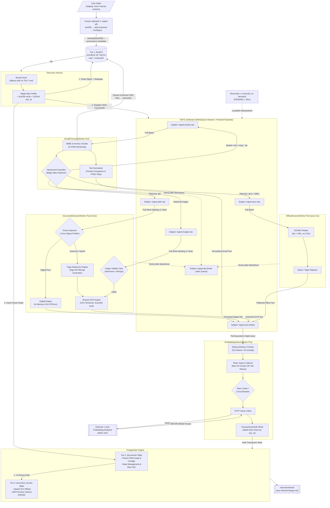

# High-Throughput RAG Ingestion Engine Architecture

**Version:** `4.0.0`

**Architecture Paradigm:** Single-Process Worker Pools over a Durable Queue, In-Memory Pipeline Processing, 3-Tier Storage Model

**Target Runtime:** One Go binary on the host, CGo-linked to `Tesseract`; `PDFium` via WebAssembly

**Target Deployment:** Stores in a local Kubernetes cluster; the pipeline runs on the host

**Status:** holistic design of record for the write path. Everything about
ingestion — pipeline, storage, failure semantics, codebase layout,
observability — lives in this file. Its peers are `docs/retrieval-design.md`,
which owns every read-path concern (§7 here states the contract between
them); `docs/workspace-isolation.md`, which owns how workspaces are
kept apart across all three stores — the per-workspace database, bucket,
and NATS account this file's uploader/discovery/worker code will need to
address once that design is implemented; and `docs/api-server-design.md`,
which owns the longer-term direction of exposing this pipeline's
operations (and workspace lifecycle) behind an API Server rather than
only a CLI — forward-looking, not yet begun.

**Changes in 4.0.0:** the pipeline is one process, not five Deployments.

* **Roles became pools, not pods** (§5, §6.1). Every worker role runs as a
  bounded pool of goroutines inside a single `pocket-advisor` binary on the
  host. The role boundaries are unchanged — they were always separate
  packages under `internal/`, and only the process boundary between them is
  gone. Parallelism is no longer a replica count: pool sizes derive from
  `runtime.NumCPU()` and are not configurable.
* **One CPU budget instead of several** (§5.4). PDF rasterisation and OCR
  share a single process-wide semaphore sized at the core count. This
  replaced a plain mutex in the PDF engine, which would have collapsed all
  rasterisation into one global lane once the roles shared a process, and an
  OCR limit of 2 that had been sized for a 1-core container.
* **Bucket notifications removed entirely** (§5.2). With no long-running
  consumer in the cluster there is nothing for a webhook to deliver to
  between runs, so ingestion is driven by reconciliation: the scan compares
  `raw/` against Tier 2 and enqueues the difference. This is what makes an
  interrupted run resumable, and it retires the whole notification failure
  class tracked in §12.7.
* **Interrupt and resume are first-class** (§2.6). The first Ctrl+C stops
  fetching and lets in-flight work finish and ack; the second aborts. A
  Deployment never needed either, because it ran until something killed it.
* **The chart carries only the three stores** (§6.2): RustFS,
  PostgreSQL+pgvector, NATS. No images are built.
* **The terminal shows live pipeline state** (§9.5), and each role writes its
  own log file — the monolith took away `kubectl logs -l app=<role>`, and
  these replace it.

**Changes in 3.9.0:** RustFS provisioning is now a release-owned,
revision-named Job rather than an untracked Helm hook (§6.2, §12.7). It still
runs idempotently on every install and upgrade, while `helm uninstall` now
removes its Job, Pod, and policy ConfigMap. PersistentVolumeClaims remain
deliberately retained because Tier 1 is the corpus source of truth.

**Changes in 3.8.0:** live RustFS bucket notifications now honor the S3
contract end-to-end (§5.2, §12.7). Discovery form-decodes notification object
keys, admits only canonical `raw/` keys as root documents, acknowledges
`extracted/` events without ingesting them, and returns a retryable non-2xx
response when ingestion fails. Notification setup is idempotent.

**Changes in 3.7.0:** Tier 1 migrated from MinIO to RustFS (§12.7). Three
RustFS/Helm integration problems were fixed during the migration; the
remaining application-side notification contract bug was fixed in 3.8.0.

**Changes in 3.6.0:** the uploader resolves the user's
`workspaces/workspace-config.yaml` instead of taking a directory (§5.1). Two
parameters — registry path and workspace id — identify every collection in a
matter, and registry attributes travel onto the Tier 1 objects.

**Changes in 3.5.0:** Helm is the only deployment path (§6.2); the
write-authority split of §5.1 is now enforced by two scoped RustFS identities
rather than described.

**Changes in 3.4.0:** implementation landed (§12 records where the code
deliberately differs from this design).

**Changes in 3.3.0:**

* **`EmbedTextCommand` now carries a `doc_id` reference, not text** (§4.1).
  Extractors write `documents.normalized_text`; the indexer reads it back.
  Avoids NATS's 1 MB payload cap on large OCR output.
* **Storage sized against the measured corpus** (§6.4): RustFS 10Gi → 50Gi,
  PostgreSQL 5Gi → 20Gi, NATS 2Gi → 5Gi.
* **Single-replica, no-backup storage recorded as an accepted risk**
  (§11.2) rather than an open question.

**Changes in 3.2.0:**

* **Tier 1 (RustFS) is now the sole source of truth.** User filesystems are a
  staging feed, never read by the system (pillar 2, §5.1).
* **New `Corpus Uploader`** (§5.1) — CLI/Job that moves a folder into
  `raw/`, skipping content already present, with `--wipe` and `--forget`
  resets that cascade into PostgreSQL.
* **Discovery no longer walks a filesystem** (§5.2) — it consumes RustFS bucket
  notifications, with a bucket scan as an exact reconciliation. No corpus
  volume mount anywhere in the cluster.
* **Two Tier 1 prefixes with distinct write authorities:** `raw/` (uploader
  only) and `extracted/` (email worker only), enforced by bucket policy.

**Changes in 3.1.0:**

* **Thread summarisation removed entirely** — no `thread_summaries` table, no
  summary generation worker, no summary index (pillar 8, §4.3).
* **Embedding model set to `jina-embeddings-v5-text-small` over an external
  REST API**, with vector dimensionality discovered by probing the endpoint
  rather than hardcoded (§4.4).
* **Retrieval mechanics moved out** to `docs/retrieval-design.md`; §7
  reduced to the ingestion-side contract.
* **`project-layout.md` and `observability.md` folded in** as §8 and §9 and
  deleted; both were drifting from the services added in 3.0.0.

**Changes in 3.0.0:** added the `DiscoveryService` specification (§5.2),
`OfficeExtractorWorker` (§5.5), image OCR routing (§5.4), real JetStream DLQ
mechanics (§2.5), the write-then-publish reconciliation protocol (§2.2), and
corrected the chunker/batcher ordering (§2.4) and vector dimensionality
(§4.2).

---

## 1. Executive Summary & Architecture Principles

This system provides a high-throughput, deterministic document ingestion pipeline optimized for enterprise, multi-workspace RAG solutions. It is designed to handle complex, deeply nested document trees (such as emails containing nested `.eml` attachments, archives, scanned contracts, and digital bank statements) with **zero local disk I/O** and **zero OS subprocess forking**.

### Core Pillars

1. **In-Memory CGo Processing:** Direct C-library memory integration (`libpdfium` and `libtesseract`) inside Go microservices eliminates shell execution overhead and disk I/O latency.
2. **Strict 3-Tier Data Lifecycle:**
* **Tier 1 (Immutable Vault):** Object storage (`RustFS` / S3-compatible) preserves exact byte representations of original files, and is the **sole source of truth** for document content. User filesystems are a feed into it, never read by the system itself (§5.1).
* **Tier 2 (Relational Graph & Lineage):** Relational storage (`PostgreSQL`) tracks workspace boundaries, thread contexts, and parent-child document trees.
* **Tier 3 (Vector Similarity Index):** Vector storage (`pgvector`) retains spatial text chunk offsets and half-precision (`halfvec`) HNSW similarity indices.


3. **Smart Work-Stealing & Backpressure:** Message broker queues with pull-based consumers manage load dynamically across workers based on CPU and memory demands.
4. **Binary Wire Protocol:** Protocol Buffers over high-speed messaging minimize serialization penalties and network footprint.
5. **Deterministic Classification:** In-memory object inspection routes digital documents through microsecond parsing paths while directing scanned or hybrid assets to specialized OCR pipelines.
6. **Single Entry Point:** Only `DiscoveryService` mints root documents. Every other worker creates children. "What entered the system, and when" is answerable from one component.
7. **Content-Addressed Identity:** A document's durable identity is its content hash within a collection, never its path. Re-uploading and re-scanning are therefore free and idempotent rather than duplicative, at every layer: object key, `doc_id`, and chunk set all derive from the same hash.
8. **Source of Truth Only — No Generated Text in the Index:** The pipeline indexes exactly two things: compacted email bodies and the extracted text of attached documents (PDF, Office, OCR). It generates no summaries, abstracts, or synthetic descriptions, and stores none. Summarisation is deferred wholly to the user-level LLM at answer-generation time, where it operates on retrieved sources with the question in hand.

---

## 2. Dynamic Workflow & Failure Recovery Mechanisms

### 2.1 Async Parent Stubbing (Preventing Race Conditions)

To eliminate foreign key lookup failures caused by concurrent event consumption, ingestion tasks record a **Document Stub** in Tier 2 before issuing work to down-stream processing queues.

Bytes arrive in Tier 1 first, and separately — the uploader (§5.1) puts them there before the pipeline knows they exist:

```
[Uploader]  ─── Write Raw Object ────────────────────────► [Tier 1: RustFS raw/]
                                                                   │
                                                            (bucket scan, §5.2)
                                                                   ▼
[Discovery Service]
       │
       ├─── 1. Read Object + Provenance Metadata ────────► [Tier 1: RustFS raw/]
       │
       ├─── 2. Transactional Create Document Stub ───────► [Tier 2: PostgreSQL Documents]
       │       (State: 'PENDING', parent_doc_id NULL)
       │
       └─── 3. Emit Async Command Payload ───────────────► [NATS JetStream WorkQueue]

```

`EmailProcessorWorker` follows the same protocol for children it unrolls,
except that it *does* write Tier 1 first (to `extracted/`, §5.1) because those
bytes exist nowhere else. Either way the stub lands before the command, so
when a child is processed its `parent_doc_id` already exists in Tier 2 and
relational integrity holds regardless of consumption order.

### 2.2 The Write-Then-Publish Gap and Reconciliation

Steps 2 and 3 above are **not atomic**: PostgreSQL commits, then NATS is told. A crash between them leaves a document `PENDING` forever with no message in flight. This is silent data loss, and it is the failure mode most likely to survive into production unnoticed, because nothing errors — the document simply never arrives.

Two mechanisms close the gap.

**Acknowledged publish with bounded retry.** Publishing uses JetStream's acknowledged path (`PublishMsg` awaiting `PubAck`), never fire-and-forget. A publish still failing after retry is logged at `ERROR` with `doc_id` and left to the reconciler.

**Reconciliation sweep.** There is no in-cluster scheduler for this — the
monolith has no long-running consumer to schedule one against (§5, §6.2). The
operator re-publishes stale work on demand with `--reconcile`
(`internal/cli/ingest.go`), which claims every document `PENDING` longer than
`--stale-after` (default 30 minutes) and re-ingests it:

```sql
SELECT doc_id, workspace_id, collection_id, mime_type,
       rustfs_raw_uri, raw_sha256, source_filename, parent_doc_id
FROM documents
WHERE processing_status = 'PENDING'
  AND updated_at < now() - $1::interval
ORDER BY updated_at
LIMIT 500;
```

Re-publishing is safe precisely because `doc_id` is deterministic (§5.2) and every worker is idempotent on it: a duplicate delivery redoes work, it does not create a second document. The sweep exports `rag_discovery_stale_pending`; a non-zero steady state after a `--reconcile` run is an alertable symptom, not routine.

The same reasoning applies to the child stubs created by `EmailProcessorWorker` — it uses the identical stub-then-publish protocol and is covered by the same sweep.

**A second gap exists upstream:** an object can land in `raw/` between runs — or a run can be interrupted before discovery ever reads it — leaving bytes with no Tier 2 row at all, invisible to the `PENDING` sweep, which only sees documents that already exist. The bucket scan (§5.2) closes it, and because Tier 1 is authoritative the check is exact rather than best-effort: enumerate `raw/`, anti-join `documents`, publish the difference. `--ingest-all` and `--scan` both run it every time, which is why re-running either is the normal way to pick up anything a previous run missed, not a repair action reached for only when something looks wrong.

### 2.3 Idempotency Contract

Every worker must be safe to run twice on the same `doc_id`, because at-least-once delivery guarantees it eventually will be. Concretely:

* Tier 1 writes are content-addressed — rewriting the same key with the same bytes is a no-op.
* Tier 2 stub creation uses `INSERT ... ON CONFLICT (doc_id) DO NOTHING`.
* Tier 3 chunk writes **delete-then-insert by `doc_id`** inside the same transaction as the Tier 2 status update. Appending would duplicate chunks on redelivery and quietly corrupt retrieval ranking, which is far worse than the redundant write.

### 2.4 Token-Aware Dynamic Micro-Batching

Instead of fetching fixed message counts, embedding workers collect tasks using dual constraints: **Max Task Count** or **Max Cumulative Token/Character Budget**. This prevents memory spikes and HTTP gateway timeouts when processing large text payloads.

**Ordering: chunk first, then batch.** The v2 topology placed the batcher before the chunker, which put the token budget on the wrong side of the component that multiplies token count — a 16k-token batch of documents becomes an unbounded number of chunks, so the constraint that exists to bound the outbound HTTP request did not bound it. The corrected pipeline is:

```
Fetch (bounded by in-flight docs)
   └─► Chunker (512 tokens / 64 overlap)
         └─► Token-Aware Collector (max 64 chunks OR 16k tokens)
               └─► Circuit Breaker ─► HTTP Embedder ─► Transactional Writer
```

The budget now applies to exactly what leaves the process. A single document whose chunk count exceeds the budget is split across several embedding requests but still written in **one** transaction, so a document is never half-indexed.

### 2.5 DLQ and Poison Pill Management

NATS JetStream has no native dead-letter queue. What it provides is `MaxDeliver` plus an advisory on `$JS.EVENT.ADVISORY.CONSUMER.MAX_DELIVERIES.<stream>.<consumer>`. The DLQ is therefore application code, and must be built rather than assumed:

1. Consumers are configured `MaxDeliver = 3`, `AckWait = 5m` (OCR tasks can legitimately exceed a default 30s ack window; without this, slow work is redelivered as if it had failed).
2. On a terminal error the worker calls `Term()` — not `Nak()` — and republishes the original payload to `ingest.dlq` with headers `X-Failure-Reason`, `X-Failure-Worker`, `X-Delivery-Count`, and `X-Traceparent`.
3. On the third redelivery the worker itself performs step 2 rather than relying on the advisory, which is a backstop for crashed workers that never reach their own error path.
4. The Tier 2 row is set `FAILED` with the reason recorded in `metadata_headers`.

**Declined is not failed.** A format the system knowingly does not support (§5.2 routing table, legacy binary Office formats per §5.5) sets Tier 2 status `SKIPPED` with a reason code and produces **zero** DLQ messages. Mixing "we can't parse this" with "this broke" makes the DLQ unactionable — it fills with expected outcomes and stops being read. The DLQ is reserved for work that should have succeeded.

---

### 2.6 Interrupt and Resume

A Deployment never had to answer "when is the work finished" or "what happens
on Ctrl+C" — it ran until something killed it, and Kubernetes restarted it. A
one-shot host process has to answer both.

**Stopping** is two-stage. The first interrupt stops *fetching* but lets
in-flight handlers finish and acknowledge; the second aborts them. The gap
matters because a message abandoned unacked is redelivered, and consumers are
`MaxDeliver = 3` — so three interrupted runs would dead-letter a document that
was never broken. A grace period bounds the drain, set below the broker's
`AckWait` so anything still running when it elapses would have been
redelivered anyway.

**Finishing** requires more than "no work in flight". Completing an email
publishes attachment work that has not yet reached its queue, so the pipeline
passes through momentarily empty on its way to being busy. A run therefore
ends only when every pool is idle *and* every queue is empty, held for a
settling period. Depth is read from the broker — including work handed out but
not yet acked — rather than counted locally, because the broker is the only
authority on redeliveries this process has not seen.

**Resuming** needs no bookkeeping at all, because three existing properties
compose into it:

| Layer | What survives | Why |
| --- | --- | --- |
| Tier 1 | uploaded objects | keys are content hashes, so re-upload is an exact skip |
| Tier 2 | document rows | `doc_id` is deterministic; a stub already present is not re-created |
| JetStream | queued and unacked work | `WorkQueue` retention on file storage with durable consumers |

Re-running `--ingest-all` therefore re-hashes local files to find them already
present, enqueues only objects still missing a Tier 2 row, and drains whatever
the broker still holds. The one gap it cannot see is a stub that committed
while its publish failed (§2.2), which is what `--reconcile` is for.

The corollary is that the resume state lives in the NATS volume. Deleting that
PersistentVolumeClaim is a full restart, not a resume.

## 3. End-to-End System Architecture



---

## 4. Contract Specifications & Data Schemas

### 4.1 Interface Protocols (Protobuf System Contracts)

The internal messaging protocol relies on immutable command messages containing tracing headers, workspace scope, and document lineage pointers.

* **DocumentMetadata Schema:** Captures context including `workspace_id`, `collection_id`, `thread_id`, `parent_doc_id` (empty for root entities), `source_filename`, `mime_type`, `raw_sha256`, and OpenTelemetry correlation headers (`traceparent`).
* **ProcessEmailCommand:** Wraps object storage references (`rustfs_raw_uri`) and metadata for inbound email and archive tasks.
* **ProcessPdfCommand:** Contains object references, lineage metadata, and explicit processing priority flags for PDF processing.
* **ProcessOfficeCommand:** Object reference plus detected OOXML sub-type (`docx` / `xlsx` / `pptx` / `rtf` / `odt`) for the pure-Go Office path.
* **ProcessImageCommand:** Object reference plus pixel dimensions and byte size recorded at discovery, so the viability gate (§5.4) can decide without a second fetch.
* **EmbedTextCommand:** Carries a `doc_id` **reference**, not the text itself.

**Commands carry references, never document content.** Every extractor writes
its output to `documents.normalized_text` before publishing, and
`EmbeddingIndexerWorker` reads the text back from Tier 2. This is a change
from earlier drafts, in which `EmbedTextCommand` transported the extracted
text on the wire.

Three reasons, in order of severity:

1. **NATS caps message payload at 1 MB by default.** A 60-page OCR'd document
   produces more extracted text than that, so the publish fails — and it fails
   at the end of the most expensive work in the pipeline, on exactly the
   documents most worth indexing. Raising `max_payload` trades a hard failure
   for an unbounded one.
2. It settles who owns `normalized_text`. Previously nothing did: extractors
   emitted text and the indexer wrote status, leaving the column's author
   unspecified.
3. The text stops crossing the wire twice (extractor → NATS → indexer →
   Postgres) and stops occupying JetStream's PVC, which sizes the queue for
   backlog depth rather than document size (§6.4).

All five carry `DocumentMetadata` as their first field. `traceparent` is mandatory, not optional: a command without it produces an orphaned trace and is rejected at the consumer.

---

### 4.2 Database Storage Architecture (PostgreSQL)

```
+-----------------------------------------------------------------------------------+
| TIER 2: DOCUMENTS (Relational Lineage & Normalization Graph)                      |
+-----------------------------------------------------------------------------------+
| - doc_id (UUID, PK)              -- deterministic UUIDv5, see §5.2                |
| - parent_doc_id (UUID, FK -> documents.doc_id ON DELETE CASCADE)                  |
| - workspace_id (VARCHAR, Indexed)                                                 |
| - collection_id (VARCHAR, Indexed)                                                |
| - thread_id (VARCHAR, Indexed)                                                    |
| - processing_status (ENUM: PENDING, PROCESSING, COMPLETED, SKIPPED, FAILED)       |
| - doc_type & mime_type (VARCHAR)                                                  |
| - rustfs_raw_uri & raw_sha256 (TEXT/VARCHAR)                                      |
| - normalized_text (TEXT)         -- body prose only; headers are columns, §5.3    |
| - email_subject / email_from / email_to (TEXT), email_date (TIMESTAMPTZ, Indexed) |
| - metadata_headers (JSONB)       -- incl. skip/failure reason codes               |
| - created_at / updated_at (TIMESTAMPTZ)                                           |
+-----------------------------------------------------------------------------------+
                                          │
                                          │ 1 : N Lineage
                                          ▼
+-----------------------------------------------------------------------------------+
| TIER 3: DOCUMENT CHUNKS (Vector Index & Positional Provenance)                    |
+-----------------------------------------------------------------------------------+
| - chunk_id (UUID, PK)                                                             |
| - doc_id (UUID, FK -> documents.doc_id ON DELETE CASCADE)                         |
| - workspace_id (VARCHAR, Composite Index)                                         |
| - chunk_index (INT)                                                               |
| - start_char_offset & end_char_offset (INT)                                       |
| - chunk_text (TEXT)              -- exactly normalized_text[start:end]; all of it, §5.6 |
| - embed_model (VARCHAR)          -- index namespace; see §4.4                     |
| - embedding (halfvec(N), HNSW Cosine Index m=16, ef_construction=64)              |
| - fulltext_search (TSVECTOR GENERATED, GIN Index for Hybrid Search)               |
+-----------------------------------------------------------------------------------+

```

`N` is resolved at schema bootstrap by probing the embedding endpoint — see §4.4. It is never a literal in checked-in DDL.

`embed_model` exists so a model swap writes into a distinct namespace rather than silently mixing incomparable vectors in one index — the same guarantee v2 got from separate cache directories.

`metadata_headers` is write-mostly provenance and failure auditing — nothing in the codebase queries into it; it exists for a human to inspect via `psql` when a document is stuck or failed. `source_path` inside it looks redundant with the top-level `source_filename` column because every collection today is ingested flat: `source_path` is `filepath.Rel` against the collection root (`internal/uploader/uploader.go`) and `source_filename` is just `filepath.Base`, so they coincide whenever there are no subdirectories under a collection. They are not the same field — `source_path` is the one that would carry real information if a collection ever gained nested subdirectories.

**Full-text configuration.** `fulltext_search` is a generated column using the `simple` text-search configuration, not `english`:

```sql
fulltext_search tsvector
  GENERATED ALWAYS AS (to_tsvector('simple', chunk_text)) STORED
```

It indexes the chunk's own text and nothing else — not the document's subject
or filename. Folding a shared subject line in here would make every chunk of a
thread match on it, which is the same cross-contamination in the lexical leg
that atomic embedding avoids in the dense one (§5.6).

The corpus is bilingual (`ingestion.ocr.langs: eng+rus`). English stemming applied to Russian text produces wrong stems silently, and Postgres cannot pick a stemmer per row. `simple` does no stemming, matching the recall behaviour of v2's SQLite FTS5 index.

### 4.3 No Derived-Text Tables (Deliberate Deviation from v2)

There is **no `thread_summaries` table**, and no other table holding
model-generated text. Tier 2 stores only text extracted from the bytes in
Tier 1; Tier 3 embeds only that text. This is a deliberate departure from v2,
which generated and indexed per-thread summaries
(`v2/docs/ingestion/email-thread-summaries.md`, config keys
`ingestion.summarize_threads` and `ingestion.thread_summary_max_tokens` —
both dropped in v3).

The reasoning:

* **A summary competes with the sources it summarises.** Indexed alongside
  its own members, it occupies candidate slots that would otherwise hold
  primary evidence, and it ranks well precisely because it is dense and
  on-topic — the failure mode is retrieving a lossy paraphrase instead of the
  document that proves the point.
* **It has to be labelled everywhere, forever.** v2 required every retrieval
  path to mark summary hits as generated navigation rather than evidence. A
  single missed label turns model output into apparent source text, which for
  this corpus is the one error that matters.
* **Staleness is a standing tax.** A summary is invalidated by any change to
  thread membership, so the system must track membership drift, flag stale
  rows, and exclude them from retrieval — machinery that exists solely to
  maintain a derivative.
* **The summarising model is better positioned later.** At answer time an LLM
  sees the actual question and the retrieved sources. An ingestion-time
  summariser sees neither, so it must guess what will matter and compress
  accordingly. Deferring costs nothing at index time and produces a better
  summary when one is actually needed.

What remains is compaction, not summarisation: `EmailProcessorWorker` strips
quoted reply chains, HTML markup, and signature boilerplate (§5.3). That is
lossless with respect to the author's own words — it removes duplication and
markup, and never rewrites content.

### 4.4 Embedding Model and Dimensionality Discovery

**Model:** `jina-embeddings-v5-text-small-mlx` by default, served over an
**external REST API**. The engine loads no models itself — it holds a URL and
an HTTP client (`infra.embedding.endpoint` in `config.yaml`, or
`EMBEDDING_ENDPOINT`). This is a change from earlier drafts, which assumed
bge-m3 on a local oMLX endpoint.

**Dimensionality is discovered, never hardcoded.** `halfvec(N)` is a typed
SQL column, so `N` must be known before the first `CREATE TABLE` — but the
authority on `N` is the model, not this document. Pinning a literal in
checked-in DDL is how an index silently ends up the wrong shape when the
endpoint changes.

The resolution is a **schema bootstrap step**, run once before the DDL and
again on any model change:

1. `GET {embedding_endpoint}/../models` (or the endpoint's model-info route)
   to read the served model identifier and its declared output dimension.
2. If the endpoint exposes no model metadata, fall back to embedding a single
   probe string and measuring `len(data[0].embedding)`. Every OpenAI-shaped
   embeddings API supports this, so it always terminates.
3. Record the resolved `(model_id, dimension)` pair in a
   `schema_metadata` row.
4. Apply the Tier 3 DDL with `N` interpolated, and create the HNSW index.

Every worker startup re-probes and compares against `schema_metadata`. A
mismatch is a **fatal startup error**, not a warning: a worker that embeds at
one dimension into a column sized for another either errors per-row or, worse
with a Matryoshka-capable model that will happily return a truncated vector,
writes vectors that are silently not comparable to their neighbours.

**A dimension change is a re-embed, not a migration.** `ALTER TABLE ... TYPE
halfvec(M)` cannot reinterpret existing vectors. The procedure is: write into
a new `embed_model` namespace, backfill, then drop the old namespace. Because
`embed_model` already partitions Tier 3, this is a normal operation rather
than an outage, and the old index stays queryable throughout.

**Matryoshka truncation, if the model supports it,** is a deliberate choice
recorded in `schema_metadata` alongside the model id — not something inferred
from response length. A truncated dimension is a different index namespace
from the full one, because the vectors are not mutually comparable.

---

## 5. Microservice Domain Blueprint

### 5.1 Corpus Uploader (`--ingest-all`)

**Role:** move bytes from wherever the user keeps them into Tier 1. It is the
**only** writer to the `raw/` prefix, and the only component that ever touches
a user filesystem.

#### The inversion

Tier 1 is the source of truth for every document in the system. A user's
folder is a *source for* the source of truth, not the source of truth itself.
Nothing downstream — no worker, no query, no citation — ever reads a local
path.

This is a deliberate reversal of v2, where a gitignored `workspaces/corpora`
directory in the repo was authoritative and the engine read it directly. Three
consequences follow, and they are the reason for the change:

* The repo carries no corpus, gitignored or otherwise. The code is the repo;
  the documents are in a bucket.
* The cluster needs no corpus volume mount. Workers reach documents the same
  way whether they run on a laptop or in a datacentre.
* Reproducing an environment means restoring a bucket, not reassembling a
  directory tree that only one machine ever had.

The cost is honest and accepted: bytes exist twice, once in the user's folder
and once in RustFS. That duplication buys a single authoritative store with
uniform access, and it is the user's folder — not the bucket — that is free to
be reorganised, moved, or deleted afterwards.

#### What to upload comes from the workspace registry

The uploader is not told a directory. It is given the user's
`workspaces/workspace-config.yaml` — the same registry v2 used — and a
workspace id, and it resolves the rest:

```
pocket-advisor --ingest-all
               --workspace-config <path>/workspace-config.yaml
               --workspace-id     <workspace id>
```

The registry declares `collections[]` (each with an `id`, a `path`, and an
`ingestion-type`) and `workspaces[]` that reference collections by id. Those
two flags therefore identify every document in a matter, and "what this
workspace contains" has one definition instead of one per invocation.

Collection paths are relative to the registry file's own directory, so the
registry and the corpora travel together: mounting that one directory is
enough, and paths resolve in the cluster exactly as they do on the host.

Resolution happens **before any store is touched**. An unknown workspace id
fails immediately and reports the ids that do exist; a workspace referencing an
undefined collection is an error rather than a smaller upload, because silently
ingesting less than the matter contains is the worst available outcome.

Registry attributes are written onto the Tier 1 object alongside the file's own
provenance — `ingestion-type`, and for bank collections the BSB, account
number, account type and owners. The registry does not live in the cluster, so
anything it knows that the bytes do not is lost the moment the bucket outlives
the checkout.

#### Operation

For each file in each of the workspace's collections:

1. Stream the file, computing `sha256` as it reads.
2. Form the key `workspaces/{workspace_id}/raw/{sha256[0:2]}/{sha256}`.
3. `StatObject` on that key. **If it exists, skip** — counted as `duplicate`,
   not re-uploaded.
4. Otherwise `PutObject` with provenance metadata attached.

Skip-if-present is exact rather than heuristic, because the key *is* the
content hash: two files with the same bytes produce the same key no matter
what they are named or where they sit. Re-running the uploader over a folder
that has grown by ten files uploads exactly those ten.

#### Provenance travels with the bytes

Content-addressed keys carry no filename, and RustFS is now the authoritative
store — so the provenance has to live on the object, not in a filesystem the
system no longer reads:

| Object metadata | Purpose |
| --- | --- |
| `x-amz-meta-source-filename` | original basename, becomes `documents.source_filename` |
| `x-amz-meta-source-path` | path relative to the upload root |
| `x-amz-meta-collection-id` | collection scope for `doc_id` derivation (§5.2) |
| `x-amz-meta-ingestion-type` | `general` or `bank-transactions`, from the registry |
| `x-amz-meta-account-*` | BSB, number, type, owners — bank collections only |
| `x-amz-meta-uploaded-at` | RFC 3339 timestamp |
| `x-amz-meta-uploader-run-id` | which upload run introduced this object |

When the same bytes arrive under a second filename, the object is not
rewritten — the additional name is appended to `x-amz-meta-alias-filenames`.
One content, one object, one document; the aliases are recorded because they
are sometimes evidence in themselves.

**The uploader does not sniff formats.** It is a byte mover. All format
knowledge lives in discovery (§5.2), in one place, so a new supported type is
a one-component change.

#### Two prefixes, two write authorities

```
workspaces/{workspace_id}/
  raw/{aa}/{sha256}          ← uploader only; workers may read, never write
  extracted/{aa}/{sha256}    ← EmailProcessorWorker only (unrolled children)
```

v2's hard rule — source corpora are read-only, never written, renamed, or
deleted — transfers from a filesystem mount to the `raw/` prefix. It is
enforced by a RustFS access policy on the worker service account rather than by
convention, because a convention that only holds while everyone remembers it
is not an invariant.

#### `--delete-data` is a corpus reset, not a bucket delete

The flag purges every Tier 1 object and every Tier 2 row for a workspace. It
**must cascade into PostgreSQL**, and it does not re-upload anything —
repopulating the workspace is a separate, later `--ingest-all`:

```
1. Confirm (interactive prompt, or --yes)
2. Remove objects under workspaces/{workspace_id}/     (raw/ and extracted/)
3. DELETE FROM documents WHERE workspace_id = $1       (chunks cascade)
```

Tier 2 and Tier 3 are derivatives of Tier 1 objects. Purging the bucket while
leaving the database populated leaves every `rustfs_raw_uri` dangling and every
citation unresolvable — retrieval keeps returning confident results that point
at nothing, which is worse than either a clean reset or no action at all. The
uploader therefore refuses to do half of this: if it cannot reach PostgreSQL,
it does not touch the bucket.

#### Absence is not deletion

The uploader is additive. It never infers that a document should be removed
because this run's folder did not contain it — a staging directory is
legitimately partial, and inferring deletion from absence would let an
incomplete run silently destroy the corpus. Removing a document is an explicit
operation (`--forget <sha256>`), which deletes the object and cascades the
same way `--delete-data` does for the whole workspace.

#### Interface

The uploader is not a separate binary — it is one mode of the single
`pocket-advisor` host process (§8):

```
pocket-advisor --ingest-all --workspace-id <id>
               [--workspace-config <path>] [--dry-run] [--yes]

pocket-advisor --delete-data --workspace-id <id> [--yes]
pocket-advisor --forget <sha256> --workspace-id <id> [--yes]
```

Runs on the host, not in the cluster — nothing in the chart wraps it (§6.2).
Reports `uploaded`, `duplicate`, `failed` counts per run, keyed by
`uploader-run-id`.

### 5.2 Discovery (`internal/discovery`)

**Role:** the sole entry point *to the pipeline*. The only component that
creates root documents (`parent_doc_id IS NULL`). Discovery reads Tier 1; it
never writes it and never sees a user filesystem.

#### Intake

Discovery has exactly one intake path: **reconciliation of `raw/` against
Tier 2**. It lists the workspace prefix, admits only canonical root keys, and
ingests every object with no Tier 2 row.

```
workspaces/<workspace_id>/raw/<sha256[0:2]>/<lowercase-sha256>
```

Anything else under the prefix — including
`workspaces/<workspace_id>/extracted/...`, which the email worker owns — is
counted as ignored. Admitting an extracted child as a new root would race the
extractor's own child-row creation and lose lineage, so the shape check is not
optional hygiene; it is what keeps the two write authorities of §5.1 from
colliding.

With Tier 1 authoritative this is something the filesystem version could never
be: an **exact reconciliation**. The invariant is "every object under `raw/`
has a Tier 2 row", and both sides are enumerable from one store.

##### Bucket notifications: history and the 2026-07-31 live path

Earlier revisions drove ingestion from RustFS `s3:ObjectCreated:*` events
delivered to a long-running discovery Deployment, with the scan as a backstop.
Once the pipeline moved to a host process invoked on demand, that arrangement
had no consumer: between runs nothing is listening, and during a run the
uploader and discovery are in the same process. A webhook would have been a
network round trip from RustFS back to the machine that had just written the
object. Removing it deleted the notification target configuration, the queue
directory, the HTTP listener, the reverse-networking dependency on the host,
and the entire class of delivery bugs recorded in §12 deviation 7 — at the
cost of nothing, because the scan was always the authority and the
notification was only ever an optimisation for latency the batch workflow did
not need at the time.

It also produced the resume semantics of §2.6 for free, and still does: a run
that is interrupted leaves objects in `raw/` with no Tier 2 row, which is
precisely the difference the next scan enqueues. There is no separate resume
state to maintain, because "what still needs doing" is derivable from the two
stores. **The scan remains this system's reconciliation authority — none of
what follows changes that.**

What changed: RustFS's own notify subsystem gained a native NATS JetStream
target (not available when notifications were removed), and the upstream
regression that made bucket notifications unreliable on this project's
first attempt (§12 deviation 7) is fixed as of `1.0.0-beta.12` for the
disabled-notify case. That reopened the question the TODO here used to ask —
can an object be picked up the moment it lands, without waiting for the next
scan — and it was tested live before being built, not assumed:

- **RustFS→NATS delivery works**, live-verified against `beta.12` in a
  scratch RustFS+NATS pair: a real upload produced a correct
  `s3:ObjectCreated:Put` event with a `Nats-Msg-Id` dedup header on a real
  JetStream stream. Three deployment-config fixes were required to get there,
  none of them code: `RUSTFS_NOTIFY_ENABLE` is a separate top-level gate from
  the per-target env vars; the default queue dir (`/opt/rustfs/events`) is
  unwritable by RustFS's non-root user (the identical bug class as the old
  webhook target's queue-dir bug); and the target's JetStream stream needs a
  duplicate window wider than RustFS's own retry lifetime (~274s observed),
  or RustFS refuses to publish into it at all.
- **The event payload is the same `Records[].s3.object.*` shape** used by
  every notify target, including the exact form-URL-encoding of the key
  that the pre-4.0.0 webhook handler had to decode — confirmed live with a
  nested `workspaces/<id>/raw/...` key, not assumed from the old code. That
  handler's translation logic (JSON-decode → `url.QueryUnescape` the key →
  validate via `domain.ParseRawObjectKey`, rejecting `extracted/` children →
  call `Ingest`) is reused unchanged in shape, just over NATS instead of
  HTTP: `internal/worker.RustFSNotifyWorker` (in `internal/worker` rather
  than `internal/discovery`, to avoid an import cycle — `internal/worker`
  already imports `internal/discovery` for `Classify`).
- **A touch mechanism exists**, live-verified: a same-source/dest
  server-side copy (S3 `CopyObject` with `x-amz-metadata-directive: REPLACE`,
  zero bytes transferred) reliably fires a fresh `s3:ObjectCreated:Copy` —
  same eTag, no re-upload. This is what lets the scan stop being the thing
  that does the work: `Vault.Touch` issues this copy, and when
  `discovery.Service.LiveNotify` is set, `Scan` calls it instead of `Ingest`
  for every gap, leaving the actual fetch/verify/classify/stub/publish to the
  live path — the same code a fresh upload goes through.

**Scoped to the workspace being operated on, and always on** (revised
2026-08-03; the previous revision wired this for the `test` workspace only and
left generalising it as follow-up).

RustFS is a single server with one server-wide notify-target config, while
NATS accounts are fully isolated subject spaces per workspace
(`workspace-isolation.md` §2.3) — so one target can only authenticate as one
workspace's NATS user at a time. That reads like a blocker for
"notifications for every workspace" and is not, because **every mode is
already scoped to exactly one workspace.** There is never a moment when two
workspaces need notifications simultaneously. The target therefore carries the
credentials of whichever workspace was last provisioned, and a bucket
notification rule on that workspace's bucket alone decides what actually
publishes.

Isolation is preserved rather than traded away: RustFS authenticates to NATS
**as the workspace user**, never as an administrator, so events land in that
workspace's own account and nowhere else. The only administrative act is
installing the target, which is provisioning's job.

**The target is installed by `--create-workspace`, not by the chart.** The
chart declares the environment variables unconditionally and sources their
values from an *optional* Secret that provisioning owns. A fresh install has
no Secret, so the variables are unset and notification is simply off; the
first `--create-workspace` writes it and restarts RustFS. Two properties fall
out of that arrangement: `helm upgrade` cannot revert the target, because the
chart never contained its values; and there is no `enabled` flag, because
"configured" and "enabled" are the same fact.

**Runtime reconfiguration was tried and rejected — it crashes RustFS.**
`madmin-go`'s `SetConfigKV` would have avoided the restart entirely, and the
admin API is genuinely reachable: `GetConfigKV("notify_nats")` returns the
current target and `GetBucketNotification` works normally. But *writing*
config kills the server — a single `SetConfigKV` call took the pod down
(`restarts=1`) and the change did not survive the restart, leaving
`enable="off"`. Recorded so the runtime path is not attempted again on this
version; it is the obviously better mechanism and it does not work.

So installing a target restarts RustFS. That is the pattern deliberately
removed from NATS provisioning the same day (deviation 10), and the
distinction matters: a NATS restart drops every JetStream client mid-flight,
whereas RustFS is restarted by `--create-workspace` before any upload begins,
with nothing connected to lose. The restart is skipped entirely when the
target already names the requested workspace, so repeated runs pay nothing.

**One workspace at a time is now an explicit constraint, not a latent race.**
Two concurrent `--create-workspace` runs for different workspaces would fight
over a single target; the second would win and the first workspace's events
would stop. Nothing enforces this, and nothing needs to for a single-operator
tool — but it is a real limit and belongs written down rather than discovered.

**How to run it.** `--create-workspace --workspace-id <id>` provisions all
three stores and the notify target, and is the only mode that uses shared root
credentials. Everything afterwards — `--ingest-all`, `--scan`, `--query`,
`--mcp` — connects with that workspace's own credentials and no others.
`--ingest-all` therefore starts processing the moment the first object lands,
rather than waiting for the upload to finish and a scan to run.

`--listen` still exists for the case where objects arrive from something other
than our uploader, and the scan remains the reconciliation authority for
anything a notification missed.

#### Durable identity

Identity is content, never path:

```
doc_id = UUIDv5(namespace = POCKET_ADVISOR_NS,
                name      = workspace_id || collection_id || sha256)
```

A deterministic `doc_id` is what makes the entire entry path idempotent — re-scanning a collection, retrying a failed publish, and two racing intake requests for the same bytes all converge on one row:

```sql
INSERT INTO documents (doc_id, workspace_id, collection_id, ...)
VALUES ($1, $2, $3, ...)
ON CONFLICT (doc_id) DO NOTHING
RETURNING doc_id;
```

An empty `RETURNING` means the document is already known. Discovery re-publishes only if the existing row is still `PENDING`, otherwise drops the task and increments `rag_discovery_duplicates_total`.

The `sha256` component comes from the object key, which the uploader derived
from the bytes (§5.1). Discovery **re-verifies it while streaming the object
it is already reading** — a key that disagrees with its own content means a
corrupted or tampered object, and catching it here prevents a document whose
identity lies about what it contains.

`collection_id`, `source_filename`, and the rest of the provenance come from
the object's user metadata, not from any path.

#### Tier 1 object naming

Content-addressed, written by the uploader (§5.1) and never rewritten:

```
s3://workspaces/{workspace_id}/raw/{sha256[0:2]}/{sha256}         (uploaded)
s3://workspaces/{workspace_id}/extracted/{aa}/{sha256}            (unrolled children)
```

A thread-scoped key is impossible at this stage — root documents have no
`thread_id` until `EmailProcessorWorker` derives it — and would need renaming
whenever re-threading occurred. Content addressing is stable before threading
is known, deduplicates identical bytes for free, and never moves. Mutable,
human-readable naming lives in Tier 2 (`source_filename`), where it belongs.

#### Format routing

Routing is by magic bytes, never file extension. Extensions in an email corpus lie routinely: `.pdf` attachments that are actually `.docx`, extensionless `ATT00001` parts.

| Detected type | Subject | Command |
| --- | --- | --- |
| `message/rfc822`, `.msg` (CFBF), `.mbox` | `ingest.emails.raw` | `ProcessEmailCommand` |
| `application/zip`, `.tar`, `.tar.gz`, `.7z` | `ingest.emails.raw` | `ProcessEmailCommand` |
| `application/pdf` | `ingest.pdfs.raw` | `ProcessPdfCommand` |
| OOXML, `.rtf`, `.odt` | `ingest.docx.raw` | `ProcessOfficeCommand` |
| `image/{png,jpeg,tiff,bmp,webp}` | `ingest.images.raw` | `ProcessImageCommand` |
| `text/plain`, `text/markdown`, `.csv` | `ingest.text.embed` | `EmbedTextCommand` |
| anything else | — | stub set `SKIPPED`, reason `UNSUPPORTED_FORMAT` |

Archives route to the email worker because that worker already owns in-RAM container unrolling; an archive is a container with no body text.

#### Backpressure

The scan is the one component that can outrun the entire pipeline — listing a bucket enqueues far faster than OCR drains, and unbounded it fills JetStream's `max_msgs` and starts rejecting publishes. The scan Job checks `num_pending` on the target stream before each publish batch and blocks above 10 000 pending, resuming below 2 000. Deliberately crude: a batch job with no latency requirement makes a sleep loop the right amount of machinery.

A bulk upload of 100 000 files followed immediately by a scan is the expected worst case, not an edge case, so this path must hold under it.

#### Tracing

Discovery **starts the trace**. It creates the root span (`discovery.ingest_file`) and injects `traceparent` into `DocumentMetadata`. Every downstream span descends from it. If discovery does not inject, the whole cascade produces orphaned traces — this is the most load-bearing tracing call site in the system.

### 5.3 Email Processor Service (`EmailProcessorWorker`)

* **Role:** Unrolls MIME structures, `.msg` containers, and archive formats (`.zip`, `.tar.gz`) directly in RAM.
* **Key Operations:**
* Extracts body text, strips HTML markup, and removes boilerplate signature lines.
* Streams nested attachments directly to Tier 1 Object Storage.
* Creates Tier 2 stubs for child documents before publishing commands back to NATS topic routes based on magic-byte classification.
* Assigns `thread_id` from `In-Reply-To`/`References`, falling back to normalized-subject plus shared-participant matching within a 60-day window.

**Recursion bound.** Nested containers are adversarially unbounded — a zip bomb or a mail loop can recurse until the host process OOMs. Unrolling stops at depth 8 and at a cumulative expansion ratio of 100×, whichever comes first; exceeding either sets the child `SKIPPED` with reason `RECURSION_LIMIT`.

**Headers are columns, not body text.** `normalized_text` holds body prose
only. `Subject`, `From`, `To` and `Date` are written to their own columns
(§4.2) instead of being rendered into a block above the body, which is what
earlier versions did so that a retrieved chunk showed who wrote what and when.

That block turned out to be actively harmful. It is identical for every
message in a thread — same subject, the same two participants swapping places
— so it pulled a whole conversation into one embedding neighbourhood.
Measured against this corpus (two real threads, 33 messages): dropping
`From`/`To`/`Date` from the embedded text left same-thread similarity
essentially unchanged (0.676 → 0.627) while *improving* thread-vs-thread
separation (0.200 → 0.212) and improving match quality on a Russian-language
question (0.688 → 0.745). Those three headers were contributing noise and
nothing else. Dates written as `2026-01-07 08:12:30 +1100` in particular are
close to meaningless to an embedding model, while being highly repetitive.

The subject goes the same way, and for the same reason: nothing about a
message's container reaches its indexed text (§5.6). An intermediate design
kept the subject and re-attached it per chunk; that was removed on
2026-08-03 once it was clear it solved a retrieval problem at indexing time.

The cost is real and is accepted with open eyes. Removing the subject drops
same-thread similarity from 0.627 to 0.389, and 75% of this corpus's emails
are a single chunk. The shortest message in that thread is `Сегодня в 22.00`
— 15 characters that mean nothing without knowing which conversation they
belong to, and that no amount of embedding will make findable on its own.
Recovering that meaning is the read path's problem, solved by walking to the
parent and the thread (`retrieval-design.md` §3.5), not ingestion's problem
to pre-solve by contaminating the index.

"Who wrote what and when" is still answerable, from the row rather than from
the prose — and now it is answerable by *query*, which it never was while the
data lived only inside a text blob.

### 5.4 Document Extractor Service (`DocumentExtractorWorker`)

**Renamed from `PdfExtractorWorker`,** and now consumes both `ingest.pdfs.raw` and `ingest.images.raw`.

Image OCR is folded into this pool rather than given its own, because both paths execute the same CGo Tesseract engine against the same finite CPU budget. A separate image-OCR pool would compete with this one for the same cores with no coordination, and the host has one CPU count to divide, not a fourth CPU-heavy pool's worth to spare (§6.3). One pool, one bounded OCR semaphore.

* **Role:** High-speed document inspection and dual-engine text extraction.
* **Key Operations:**
* Runs a sub-2ms inspection pass on incoming PDFs (checking character densities and image bounding box dimensions).
* Directs pure digital PDFs to the `PDFium` engine for low-latency text extraction.
* Directs scanned or hybrid PDFs to an intermediate rasterizer, rendering high-DPI bitmaps page-by-page before passing them to the `Tesseract` OCR engine.
* Runs standalone images through the viability gate, then the same OCR engine.
* Manages C-heap memory lifecycles explicitly per request to prevent runtime memory growth.

#### Image viability gate

Email corpora are full of images that are not documents: tracking pixels, logos, signature graphics, social icons. Sending them all to OCR wastes the scarcest resource in the cluster and floods Tier 3 with noise chunks that degrade retrieval precision. An image is skipped, `SKIPPED` / `IMAGE_NOT_VIABLE`, when any holds:

* either dimension < 200 px, or total area < 40 000 px²;
* byte size < 8 KB;
* OCR returns fewer than 20 alphanumeric characters (post-hoc — the result is recorded, not retried).

A skipped image still exists in Tier 1 and Tier 2 with its lineage intact; it is simply not embedded.

#### Rasterization memory ceiling

"Zero local disk I/O" means page bitmaps live entirely in RAM, and they are the memory hot spot in the whole system: an A4 page at 300 DPI is ~2480×3508 px, ~35 MB uncompressed RGBA. There is no per-pod limit to bound this against any more — the process runs on the host (§6.1) — so unbounded page concurrency is bounded only by however much host RAM is free, which is exactly why §6.3's CPU semaphore, not a memory ceiling, is the real backstop.

Pages are therefore rasterized **one at a time per document**, and each bitmap
is explicitly freed before the next is rendered. Parallelism comes from other
lanes working other documents, never from one document rendering ahead of
itself.

Rasterisation and OCR share **one process-wide semaphore sized at
`runtime.NumCPU()`**, labelled so the split between them stays visible. One
budget rather than two, because they burn the same cores: independent limits
would oversubscribe the machine by their sum. This replaced two mechanisms
that both made sense per-pod and stopped making sense in one process — a plain
mutex around rasterisation, which bounded a single container to one render at
a time and would have become one render for the whole pipeline, and an OCR
limit of 2 chosen for a 1-core CPU limit.

The PDFium instance pool is sized to the document lane count rather than to
the render concurrency, because opening a document holds an instance for that
document's whole lifetime, not just while a page is being drawn. A pool
smaller than the lane count starves lanes on the instance timeout instead of
queueing them briefly.

OCR language flags are `eng+rus`, matching the corpus. A missing language does not error — it silently produces plausible-looking garbage, which is worse than a failure because it reaches the index.

### 5.5 Office Extractor Service (`OfficeExtractorWorker`)

**New.** Consumes `ingest.docx.raw`, which prior drafts produced but nothing consumed — attachments routed there accumulated in the stream indefinitely.

* **Role:** Extract text from OOXML and other structured office formats.
* **Runtime:** pure Go, **no CGo**. OOXML is a zip of XML; `archive/zip` plus `encoding/xml` covers it. This makes the worker cheap, fast, and free of the C-heap lifecycle concerns that dominate §5.4 — which is why it is a separate binary from the extractor pool despite the topological similarity.

| Format | Handling |
| --- | --- |
| `.docx` | paragraph text in document order; table cells flattened row-wise |
| `.xlsx` | per sheet, `# {sheet name}` header then one line per row, tab-separated; formulas resolved to cached values |
| `.pptx` | per slide, `# Slide {n}` header then shape text and speaker notes |
| `.rtf` | control-word stripping to plain text |
| `.odt` | ODF is also zip+XML; same reader, different element names |
| `.doc`, `.xls`, `.ppt` (legacy CFBF) | `SKIPPED` / `UNSUPPORTED_FORMAT` |

Legacy binary Office formats are declined rather than attempted: there is no credible pure-Go parser, and the alternatives are a CGo dependency on LibreOffice or an OS subprocess, the latter explicitly prohibited by Core Pillar 1. If the corpus turns out to contain enough of them to matter, the honest options are a dedicated conversion sidecar or accepting the gap — not a quiet subprocess.

**Spreadsheet flattening matters for this corpus.** Bank statements and transaction tables are a primary document class. Emitting cells without row structure destroys the association between a date, a counterparty, and an amount, which is exactly what a retrieval query needs to match. Row-wise flattening with a sheet header preserves it in a form the chunker will not split mid-record more often than necessary.

### 5.6 Embedding & Indexing Service (`EmbeddingIndexerWorker`)

* **Role:** Text chunking, vector embedding generation, and database persistence.
* **Key Operations:**
* Reads `normalized_text` from Tier 2 by `doc_id` — the command carries a reference, not the text (§4.1).
* Applies sliding-window chunking (512 tokens with 64-token overlap), then collects chunks under the dual token/count budget (§2.4).
* Manages outbound REST requests to embedding endpoints via rate limiters and circuit breakers.
* Performs transactional multi-row writes across Tier 2 (updating status to `COMPLETED`) and Tier 3 (delete-then-insert by `doc_id`).

**Chunk boundary preference.** v2 split at a paragraph break, then any newline, within the last 40% of the target length, rather than at a hard token count. A plain sliding window regresses that: it cuts mid-sentence and mid-table-row, and the resulting chunk embeds a truncated fragment. v3 keeps the v2 behaviour — prefer a paragraph break, then a newline, within the final 40% of the window; fall back to a hard cut only when neither exists.

**Chunks are atomic. Nothing is borrowed from their container.**

A chunk is embedded as exactly its own text — no subject line, no filename,
nothing about the document or thread it belongs to. `chunk_text` is
byte-identical to `normalized_text[start_char_offset:end_char_offset]`, that
string is what goes to the embedding endpoint, and `fulltext_search` indexes
the same string and no more.

An earlier version of this design did the opposite: it carried a
`context_header` column (an email's subject, a document's filename) that was
prepended to every chunk before embedding and folded into the full-text index.
It was removed on 2026-08-03, and the reason is worth recording because the
measurements at the time appeared to support it.

**Why it was removed.** It conflated two different jobs. Retrieval has to
*locate* a passage and separately *situate* it — and situating is not a
similarity problem, because the answer is already stored exactly, as
`parent_doc_id`, `thread_id`, `email_subject`. Encoding a known-exact fact
into a lossy 1024-dimensional approximation, then recovering it approximately
at query time, is strictly worse than a join.

Three concrete costs followed from that:

* **It committed, at write time, to a tradeoff that is query-dependent.**
  A shared subject helps a question about what a thread is broadly about and
  is pure noise for a question about a specific fact — and worse, noise that
  is *identical* across every message in the thread, so it compresses exactly
  the distinctions the second kind of question needs. Same-thread chunk
  similarity rose to 0.514 under prefixing, against a measured 0.403
  without it (0.270 cross-thread, over 586 same-thread pairs on the live
  corpus). Worth being precise about what that did and did not buy back:
  removing the prefix moved the retrieval result for a thread-dominated
  query from 10 of 10 to 9 of 10 hits in that thread. The prefix made
  concentration worse; it was never its main cause.
* **It spent representation capacity in inverse proportion to what a chunk
  says.** For a 15-character body like `Сегодня в 22.00` behind a 54-character
  subject, the vector predominantly encodes the subject. The chunks most in
  need of a faithful representation got the least faithful one.
* **It coupled index content to policy.** Any change to what context a chunk
  carries meant a full re-embed. As a retrieval-time lookup it is free to
  change.

The supporting measurements were also weaker than they looked. They compared
similarity against *topical* queries — precisely the query class that benefits
from a title — and never measured the cost on specific-fact queries where the
prefix is noise. The one test that measured ranking rather than raw similarity
could not discriminate at all (every variant scored 5/5). So the honest
summary of that evidence is "prefixing raises similarity on the queries
designed to benefit from it", which is a good deal weaker than "prefixing
improves retrieval".

**Removed from the lexical index too, not just the vector.** Keeping the
subject in `fulltext_search` was tempting — it costs no vector-space
distortion, and subjects are mostly proper nouns and identifiers, which is
what the lexical leg is good at. But it reproduces the same failure one leg
over: every chunk of a thread matches on the shared subject, so a single
thread can consume most of the lexical candidate budget. Subject matching
belongs at the document level, against `documents.email_subject`, where it is
one row per message rather than one per chunk.

**What replaces it.** Nothing, at ingestion. The associations are all
recorded — `parent_doc_id`, `thread_id`, `email_subject`, `email_from`,
`email_date`, `source_filename` — and reassembling them is the read path's
job: match atomic chunks, then walk to the parent document and the thread by
key. `retrieval-design.md` §3.5 owns that side, including the case this makes
hardest: a one-line reply whose meaning lives entirely in what it replied to.

**Quoted reply chains stay stripped** (§5.3). They are duplication of text
indexed elsewhere, and keeping the embedded messages lean is the same
principle as keeping chunks atomic. This does discard a linking signal — a
message quoting another is evidence of a reply edge that survives broken
threading — and that is an accepted cost, not an oversight.

---

## 6. Deployment Infrastructure Strategy

### 6.1 Unified Deployment Topology

The pipeline runs on the host. The cluster carries only the three stores it
talks to.

```
  HOST (macOS)                              KUBERNETES CLUSTER (ns: pocket-advisor)
+--------------------------------+        +----------------------------------------+
|                                |        |                                        |
|  pocket-advisor (one binary)   |        |  +----------------------------------+  |
|                                |        |  | StatefulSet: RustFS              |  |
|  uploader ───────────────────────────────► | Tier 1 immutable vault           |  |
|  discovery ──────────────────────────────► |  raw/       (uploader identity)  |  |
|                                |        |  |  extracted/ (worker identity)    |  |
|  worker pools:                 |        |  +----------------------------------+  |
|    email-processor    2xCPU    |        |                                        |
|    document-extractor  CPU  ─┐ |        |  +----------------------------------+  |
|    office-extractor    CPU   │ |◄──────────► StatefulSet: NATS                |  |
|    embed-indexer      2xCPU  │ |        |  | JetStream work queues            |  |
|                              │ |        |  |  (durable = the resume state)    |  |
|  shared CPU semaphore ◄──────┘ |        |  +----------------------------------+  |
|    ocr + rasterize    = CPU    |        |                                        |
|                                |        |  +----------------------------------+  |
|  dashboard → terminal          |        |  | StatefulSet: PostgreSQL+pgvector |  |
|  logs/<role>.log               ├───────────► Tier 2 lineage, Tier 3 vectors   |  |
|                                |        |  +----------------------------------+  |
+--------------------------------+        +----------------------------------------+
        │
        └──► embedding endpoint on localhost (8 concurrent sessions)
```

Two consequences worth stating plainly.

**Scaling is vertical now.** There is no HPA and no replica count; the pools
size themselves from the host's core count. That is a smaller ceiling than a
cluster could offer and an honest one for a single-user corpus — and it is not
a reduction in parallelism, because per-pod concurrency was previously 1.

**Nothing in the cluster runs pipeline code**, so there is nothing to roll out.
Changing the pipeline means rebuilding a binary, not building an image,
pushing it, and upgrading a release.

Reaching the stores from the host needs no port-forwarding: OrbStack resolves
cluster Service DNS from macOS, so the defaults are the `.svc.cluster.local`
names. This works through the system resolver, which Go consults only when cgo
is enabled — the same requirement Tesseract already imposes, pinned in
`mise.toml` so the two cannot drift apart.

### 6.2 Deployment Mechanism

Two artefacts, with a clean split of responsibility.

**`make build`** produces `bin/pocket-advisor`. Go is pinned by `mise.toml`
alongside `CGO_ENABLED=1` and the Homebrew include and library paths Tesseract
needs, so a working toolchain is checked into the repo rather than described
in a README.

**`charts/pocket-advisor`** deploys RustFS, PostgreSQL+pgvector and
NATS, and nothing else. It builds no images. One setup task accompanies every
install and upgrade:

**There is no setup Job.** One existed until deviation 19, creating a global
bucket and two scoped identities that per-workspace isolation had already made
redundant; it was deleted along with them. The chart now renders only the three
stores, their Services, the NATS config and one Secret.

Schema bootstrap is no longer a Helm hook. It is the last step of
`--create-workspace`, which probes the embedding endpoint and applies the DDL
with the resolved dimension (§4.4). Making it a hook was a way to guarantee it
ran before the workers did; with the workers on the host, the binary re-probes
at startup and refuses to run against a mismatched index, so the ordering
enforces itself.

It was briefly its own CLI mode, `--bootstrap-schema`. That was removed: it
repeated provisioning's schema step without calling it, and everything it
covered is covered by `--create-workspace` re-applying the DDL on every run
and by `VerifyDimension` failing at the start of `--ingest-all` and
`--listen` (deviation 16).

The two RustFS identities remain the enforcement point for the write-authority
split, and matter *more* now rather than less. `pa-uploader` holds `s3:*` on
the bucket; `pa-worker` holds `GetObject` everywhere but `PutObject` only under
`workspaces/*/extracted/*`, and no delete at all. One process now performs both
roles, so it holds two clients — which is what keeps RustFS enforcing the split
rather than this code merely promising it. A single root credential would have
demoted a server-enforced policy to a convention.

### 6.3 Concurrency Planning

Pool sizes derive from `runtime.NumCPU()` and are not configurable. Replica
counts were the tuning surface when roles were Deployments; the host is the
honest authority now, and a knob per pool would be six ways to misconfigure
one machine.

| Pool | Lanes | Bounded by |
| --- | --- | --- |
| **Email Processor** | 2 × CPU | RustFS and Postgres I/O |
| **Document Extractor** (PDF) | CPU | shared CPU semaphore; one PDFium instance per lane |
| **Document Extractor** (images) | CPU | shared CPU semaphore |
| **Office Extractor** | CPU | zip/XML parsing, pure Go |
| **Embedding Indexer** | 2 × CPU | embedding sessions |
| **shared CPU semaphore** | CPU | rasterisation + OCR, one budget |
| **embedding sessions** | 8 | the endpoint, not the host |
| **Postgres pool** | 50 | must exceed total lanes |

A *lane* is one in-flight message, not one core. Lanes spend most of their
life blocked on object-store and database I/O, so sizing them at core count
would leave the machine idle waiting on RustFS; the CPU-bound fraction is
bounded separately and globally.

Two of these numbers are load-bearing in a way that is easy to miss.
**Embedding sessions are paired with the HTTP transport's per-host connection
limit** — Go defaults to 2 idle connections per host, so a wider semaphore
without a matching transport spends its extra concurrency dialling and
discarding connections rather than embedding. And **the Postgres pool must
exceed the total lane count**: `pgxpool` defaults to `max(4, NumCPU)`, which
was adequate when each role was a pod with its own pool and becomes the
pipeline's narrowest point when all of them share one.

Peak memory is dominated by rasterisation. At 300 DPI an A4 page is ~35 MB as
RGBA, and a Tesseract instance adds roughly 100–200 MB, so the CPU semaphore
caps live bitmaps and OCR clients together at around 2.4 GB on a 10-core host.
The old per-pod memory limit is gone, which means eviction is no longer the
backstop — the semaphore has to be the real bound rather than a first line of
defence.

### 6.4 Storage Sizing

Sized against the actual corpus as measured 2026-07-27: **559 MB across 1101
files — 868 `.eml`, 221 `.pdf`, 3 `.csv`.** Everything below that figure is an
estimate derived from it.

**Tier 1 (RustFS)**

| Component | Estimate | Basis |
| --- | --- | --- |
| `raw/` | 559 MB | measured |
| `extracted/` | ~280 MB | attachments unrolled from 868 `.eml`; base64 in the source inflates ~37%, so decoded children are smaller than their share of the `.eml` bytes |
| **Today** | **~850 MB** | |
| **PVC** | **50 Gi** | ~60× headroom |

The headroom is deliberate and cheap. Tier 1 is the source of truth (§5.1),
the matter is active and accrues correspondence, and re-ingestion churn writes
new `extracted/` objects without reclaiming old ones.

**Tier 2 + Tier 3 (PostgreSQL)**

| Component | Estimate | Basis |
| --- | --- | --- |
| `normalized_text` | ~30 MB | 868 emails × ~3 KB + 221 PDFs × ~50 KB + ~1000 extracted children × ~5 KB |
| `chunk_text` | ~34 MB | same text again, +13% for 64-token overlap |
| `fulltext_search` | ~30 MB | tsvector ≈ 1× source text |
| `embedding` | ~34 MB | ~17k chunks × `halfvec(1024)` = 2 KB |
| HNSW graph + B-trees | ~40 MB | m=16 |
| TOAST, bloat, overhead | ~80 MB | |
| **Today** | **~250 MB** | |
| **PVC** | **20 Gi** | ~80× headroom |

**This corrects an earlier claim in this document that 5 Gi was undersized —
the arithmetic says the opposite.** 20 Gi is chosen not because the steady
state needs it but because three transient operations do: a re-embed holds two
`embed_model` namespaces at once (§4.4), a `REINDEX` needs roughly double the
index size, and `max_wal_size` defaults to 1 GB independent of corpus size.

**NATS JetStream**

Messages are Protobuf commands carrying object references and `doc_id`s, ~1 KB
each — document text no longer travels on the wire (§4.1). A 100 000-message
backlog is ~100 MB, and the WorkQueue retention policy deletes on ack. **PVC:
5 Gi**, sized for backlog depth rather than document volume.

**When these stop holding.** Every figure above scales linearly with corpus
size except the HNSW graph, which grows slightly faster. The corpus would need
to grow roughly 50× before any PVC is the binding constraint; the embedding
throughput and OCR CPU budget bind long before storage does.

---

## 7. Retrieval Contract

Retrieval mechanics — fusion, ranking, expansion, the query service — live in
`docs/retrieval-design.md`. This section states only what ingestion
guarantees to the read path, because these guarantees constrain ingestion and
would otherwise be invisible here.

**Four commitments this pipeline makes to retrieval:**

1. **Two index legs, both over source text.** Every embedded chunk carries
   both an HNSW vector and a GIN `tsvector` (§4.2), so hybrid dense+lexical
   retrieval needs no additional ingestion work. There is no third leg:
   with summarisation removed (§4.3), the only searchable text is
   source-of-truth text.
2. **Exact provenance.** Every chunk carries `doc_id`,
   `start_char_offset`/`end_char_offset` into `documents.normalized_text`,
   and a path to the original bytes in Tier 1. A retrieved passage can always
   be traced to a byte range of a real file, which is what makes citation
   possible and what makes answers auditable.
3. **Traversable lineage.** `parent_doc_id` and `thread_id` are populated at
   ingestion, so retrieval can expand a chunk hit into its parent email, its
   sibling attachments, and its thread without a separate index.
4. **A single index namespace per model.** `embed_model` partitions Tier 3
   (§4.2), so retrieval never fuses vectors from two models. A model change
   is a re-embed, never a silent mixing.

**One ingestion-side decision the read path depends on:** the `simple`
text-search configuration (§4.2). The corpus is bilingual (`eng+rus`) and
Postgres cannot select a stemmer per row; English stemming applied to Russian
produces wrong stems silently. `simple` does no stemming, which is also why
the query side does not translate — the embedding model is cross-lingual and
the lexical leg is stem-neutral. Changing this on the query side alone would
mismatch the index.

**Downstream of retrieval,** the answer-generation LLM is the only component
that summarises anything, per pillar 8.

---

## 8. Codebase Layout

Absorbed from the former `v3/docs/project-layout.md` and brought current with
§5. One Go module, one build pipeline, one binary total — the roles are
packages, not processes (§8.2).

### 8.1 Directory Layout

```text
pocket-advisor/                    # repo root — single Go module
├── mise.toml                     # pinned Go + CGo paths for Tesseract
├── config.yaml                   # infra: endpoints, credentials, concurrency
├── Makefile                      # build / test / deploy-infra
│
├── cmd/pocket-advisor/           # the only binary; flag parsing only
│
├── api/proto/v1/
│   ├── ingestion.proto           # DocumentMetadata + 5 commands     (§4.1)
│   └── gen/                      # generated .pb.go
│
├── internal/
│   ├── cli/                      # flag surface + mode dispatch
│   │   ├── cli.go                # modes, validation, two-stage interrupt (§2.6)
│   │   ├── ingest.go             # --ingest-all | --scan | --reconcile
│   │   └── reset.go              # --delete-data | --forget
│   │
│   ├── pipeline/                 # starts every role pool, drain detection (§2.6)
│   ├── limits/                   # CPU-derived pool sizes + CPU semaphore (§6.3)
│   ├── dashboard/                # live terminal display               (§9.5)
│   │
│   ├── app/                      # shared dependency graph (stores, logs, CPU)
│   ├── config/                   # defaults < config.yaml < env
│   ├── domain/                   # Document, Chunk, Status enums
│   │
│   ├── uploader/                 # ingress to Tier 1                 (§5.1)
│   │   ├── uploader.go           # walk, hash, skip-if-present
│   │   └── reset.go              # --delete-data / --forget, cascades to Tier 2
│   │
│   ├── discovery/                # entry-path logic                  (§5.2)
│   │   ├── sniffer.go            # magic-byte classification
│   │   └── service.go            # raw/ reconciliation + backpressure
│   │
│   ├── engine/                   # pure logic, no transport
│   │   ├── email/                # mime.go, compact.go, recursion guard
│   │   ├── pdf/                  # pdfium.go — classify, extract, rasterize
│   │   ├── ocr/                  # tesseract.go, viability.go — SHARED by pdf + image
│   │   ├── office/               # OOXML, sheets, RTF (pure Go)
│   │   └── embed/                # chunker.go                        (§2.4 order)
│   │
│   ├── worker/                   # transport glue: the only NATS-aware layer
│   │   ├── runtime.go            # the worker pool: fetch, dispatch, ack/nak/DLQ
│   │   ├── email_worker.go
│   │   ├── document_worker.go    # both pdfs.raw and images.raw
│   │   ├── office_worker.go
│   │   └── embed_worker.go
│   │
│   ├── storage/
│   │   ├── rustfs/vault.go       # Tier 1 (RustFS), content-addressed keys
│   │   └── postgres/             # Tier 2 rows, Tier 3 chunks, schema
│   │
│   ├── client/embedding/         # external REST client + circuit breaker (§4.4)
│   ├── telemetry/                # metrics, per-role log files, live stats
│   └── bus/                      # JetStream streams, consumers, DLQ  (§2.5)
│
├── charts/pocket-advisor/  # RustFS + PostgreSQL + NATS only
├── logs/                         # one file per role, gitignored
└── docs/
    ├── ingestion-design.md       # this file
    └── retrieval-design.md
```

`cmd/` holds one binary where it once held eight. The roles did not merge —
they were already separate packages under `internal/`, addressed by subject,
and each still owns its own consumer, lane count and log file. What
disappeared is the process boundary between them, and with it eight `main`
functions that differed only in which consumer they wired up.

### 8.2 Layering Rules

**`cmd/`** is flag parsing and an exit code, nothing else: `main.go` calls
`cli.Parse` then `cli.Run` and translates the returned error into
`os.Exit`. Dependency injection and lifecycle live one layer in —
**`internal/app`** builds the shared graph (store clients, per-role logs, the
CPU budget) once per process, and **`internal/pipeline`** wires engines into
worker pools and starts and drains them. No business logic in `cmd/`.

**`internal/engine/`** is framework-agnostic: no NATS, no HTTP, no SQL. It
takes bytes and returns text. This is what makes the extraction paths
testable without a cluster.

**`internal/worker/`** is the only layer that knows about JetStream. It
fetches, unmarshals Protobuf, extracts `traceparent` into a child span, calls
an engine, and dispatches `Ack()` / `Nak()` / `Term()`.

**`internal/storage/`** hides all SQL and object-store calls behind package
boundaries, not Go interfaces — there is no DI framework (§8.4), so callers
take the concrete `*postgres.DocumentRepo` / `*postgres.ChunkRepo` /
`*rustfs.Vault` types directly, wired once in `internal/app` and passed down
as public struct fields:

```go
type DocumentRepo struct{ /* unexported db handle */ }

func (r *DocumentRepo) CreateStub(ctx context.Context, doc *domain.Document) (created bool, err error)
func (r *DocumentRepo) UpdateStatus(ctx context.Context, docID string, status domain.Status, reason string) error
func (r *DocumentRepo) ClaimStalePending(ctx context.Context, olderThan time.Duration, limit int) ([]domain.Document, error)

type ChunkRepo struct{ /* unexported db handle */ }

// ReplaceChunks deletes existing chunks for docID and inserts the new set in
// one transaction, together with the Tier 2 status update (§2.3).
func (r *ChunkRepo) ReplaceChunks(ctx context.Context, docID string, chunks []domain.Chunk) error
```

`CreateStub` returns `created bool` rather than an error on conflict — a
duplicate is an expected outcome of the idempotent entry path (§5.2), not a
failure.

### 8.3 The OCR Build Tag

One binary, one build, but OCR stays behind the `ocr` tag. With the tag,
Tesseract is linked via CGo; without it, a stub returns `ErrUnavailable` and
callers record `SKIPPED` / `OCR_UNAVAILABLE` rather than failing. `make build`
sets the tag, so the default binary can read scanned documents — the tag marks
a *linkage* boundary, not an optional feature.

Running on the host turned out to simplify this considerably. There is no
image to keep small and no C toolchain leaking into unrelated builds; the
Homebrew Tesseract and Leptonica already present on a developer machine are
linked directly, with the include and library paths pinned in `mise.toml`. The
same file pins `CGO_ENABLED=1`, which OrbStack's cluster DNS also depends on
(§6.1) — one setting, two reasons, and neither can be lost without the other
breaking loudly.

A build without the tag still starts, warns once at startup, and indexes
everything except scanned PDFs and images.

### 8.4 Cross-Cutting Practices

1. **Struct-literal injection, no DI framework.** Public fields set at
   construction, not constructor parameters, and concrete types throughout,
   not interfaces — for example `worker.DocumentWorker` has exported `Vault
   *rustfs.Vault`, `Docs *postgres.DocumentRepo`, `Bus *bus.Bus`, `PDF
   *pdf.Engine`, `OCR *ocr.Engine`, and `Log *slog.Logger` fields, built once
   in `internal/pipeline` from the graph `internal/app` assembled.
2. **`context.Context` first parameter, everywhere,** from consumer down to
   storage — this is what carries the trace span the whole way (§9).
3. **Explicit lifetime management around every CGo call**, not through a
   shared helper package: `internal/engine/pdf` borrows a PDFium instance from
   a pool per document and returns it, `internal/engine/ocr` closes its
   Tesseract client with `defer` on every call. Either way a leak cannot
   outlive the request that caused it.

---

## 9. Observability

Absorbed from the former `v3/docs/observability.md`, updated for the services
added in 3.0.0. Read-path metrics live in `retrieval-design.md` §9.

### 9.1 Metrics

The process exposes one `/metrics` endpoint on the host
(`infra.observability.metrics_port` in `config.yaml`, default `9090`) via
`prometheus/client_golang` — every role shares the process's default
registry, so there is nothing per-worker left to label or scrape. Nothing in
the cluster runs pipeline code (§6.1), so there is no Kubernetes scrape
config either; `curl localhost:9090/metrics` while a run is in flight, or
point a local Prometheus at it.

| Metric | Type | Description |
| --- | --- | --- |
| `rag_ingestion_tasks_total{worker, status}` | Counter | `completed`, `skipped`, `failed`, `dlq` |
| `rag_ingestion_duration_seconds{worker, doc_type}` | Histogram | Per-stage latency distribution |
| `rag_uploader_files_total{outcome}` | Counter | `uploaded`, `duplicate`, `failed` per run |
| `rag_uploader_bytes_total` | Counter | Tier 1 ingress volume |
| `rag_discovery_files_total{mode, outcome}` | Counter | `accepted`, `duplicate`, `unsupported`, `error`; the scan also records `ignored` (non-canonical key under `raw/`) and `backpressure` |
| `rag_discovery_unstubbed_objects` | Gauge | `raw/` objects with no Tier 2 row (§2.2 upstream gap) |
| `rag_discovery_stale_pending` | Gauge | Documents awaiting reconciliation (§2.2) |
| `rag_pdf_classification_total{type}` | Counter | Digital vs. scanned routing split |
| `rag_office_extracted_total{format}` | Counter | Per-format Office throughput |
| `rag_skipped_total{reason}` | Counter | `UNSUPPORTED_FORMAT`, `RECURSION_LIMIT`, `IMAGE_NOT_VIABLE` |
| `rag_dlq_total{worker, reason}` | Counter | DLQ arrivals **by reason** — the actionable one |
| `rag_embedding_tokens_processed_total` | Counter | Token throughput vs. micro-batch budget |

`rag_skipped_total` and `rag_dlq_total` are deliberately separate series.
Declined work and broken work have different responses (§2.5), so folding
them into one counter makes the alert meaningless.

### 9.2 Distributed Tracing

A single document cascades across several queues (email → child PDF → OCR →
embedding), so trace context propagation is mandatory, not optional.

1. **Root span is created by `DiscoveryService`** (§5.2). Nothing else starts
   a trace.
2. `traceparent` travels in
   `DocumentMetadata.custom_attributes["traceparent"]`; a command missing it
   is rejected at the consumer (§4.1).
3. OTLP spans export over HTTP to the tracing collector.

```text
[Trace Root] discovery.ingest_file (workspace, sha256, doc_id)
  ├── [Span] email.unroll_mime
  │     ├── [Span] rustfs.write_child
  │     └── [Span] postgres.create_stub
  ├── [Span] document.process_pdf (doc_id: child)
  │     ├── [Span] pdf.inspect (<2ms)
  │     ├── [Span] pdf.rasterize_page (n of N)
  │     └── [Span] ocr.tesseract_execute
  ├── [Span] office.extract_xlsx
  └── [Span] embed.index_document
        ├── [Span] embed.chunk
        ├── [Span] http.post_embeddings
        └── [Span] postgres.write_tier2_tier3
```

### 9.3 Structured Logging

JSON, one file per role under `logs/<role>.log` rather than stdout/stderr —
the terminal belongs to the live dashboard while a run is in flight (§9.5).
`worker_type` is on every line (`internal/telemetry`); `trace_id`, `doc_id`,
`workspace_id`, and `parent_doc_id` (on children) are attached at the call
sites that have them, not enforced by the logger itself. There is no
`span_id` field or CGo memory gauge in the logs today — tracing is joined on
`trace_id` alone (§9.2).

### 9.4 Alerting

There is no Alertmanager or scrape config in this deployment (§9.1) — these
are the signals worth an operator's attention, checked manually or wired up
against whatever the operator points at `/metrics`, not rules already firing
anywhere today:

* **High queue backlog** — JetStream's own `/jsz?streams=true` (README §4)
  reports `INGESTION` growing rather than draining.
* **Dead-letter spike** — `rag_dlq_total` increasing: documents failing that
  should have parsed.
* **Stale pending documents** — `rag_discovery_stale_pending` above 0 after a
  `--reconcile` run: documents stuck PENDING, the write-then-publish gap not
  closing (§2.2).
* **Unstubbed objects** — `rag_discovery_unstubbed_objects` above 0 after a
  `--scan`: bytes accepted into Tier 1 but never ingested into Tier 2.

There is no memory gauge for the CGo paths today (§9.1) — a suspected leak is
diagnosed from host-level RSS for the `pocket-advisor` process, not from a
metric this system exports.

Stale pending firing at all means documents are being accepted
and then lost — it is the highest-signal alert in the set, because that
failure is otherwise invisible.

### 9.5 Live Terminal Display

Prometheus remains the record for anything asked *after* a run. During one,
the terminal shows live state, because the monolith removed the thing that
used to answer "what is happening right now": six roles that each had a pod
and a `kubectl logs` stream now share one stdout, where interleaving them
produces noise rather than insight.

The display owns stdout while a run is live — every log line goes to
`logs/<role>.log` instead — and repaints roughly four times a second:

* **upload progress**, files and bytes, with duplicates and failures split out
* **per-queue table**: pending, active lanes over pool size, done, skipped,
  retried, dead-lettered, and a rate measured between repaints rather than
  averaged over the run, so a stalled stage reads as stalled
* **shared CPU pool** utilisation with the OCR/rasterise split — the direct
  answer to whether the machine is actually saturated
* **embedding sessions** in use and circuit-breaker state, since a tripped
  breaker stalls the whole embedding stage
* **Postgres pool** utilisation

Queue depth is read from the broker, including work handed out but not yet
acked, rather than counted locally — the broker is the only authority on
redeliveries this process has not seen.

Two behaviours are deliberate. Dead-lettered counts stay visible at zero and
turn red when non-zero, because a monolith that quietly dead-letters half a
corpus is the failure mode worth designing against. And a non-terminal stdout
(a pipe, a redirect, CI) drops to periodic one-line summaries, since repaint
escapes written to a file are unreadable.

## 10. Verification & Operational Lifecycle

```
[ Phase 1: Stores ]
  │── make deploy-infra: helm upgrade --install -f workspaces/values.yaml,
  │     then wait for the three StatefulSets to roll out. Renders one NATS
  │     account per workspace; creates nothing else workspace-specific.
  └── make build: produces bin/pocket-advisor (mise-pinned Go + CGo)

[ Phase 2: Workspace ]
  └── ./bin/pocket-advisor --create-workspace --workspace-id <id>
        Postgres database + role, RustFS bucket + identity, NATS account +
        user + JetStream streams, then the DDL — it probes the embedding
        endpoint, resolves (model_id, N) (§4.4) and interpolates N — the
        schema step is here, not a Helm hook and not its own mode (§6.2).
        Finally points RustFS's notify target at this workspace (§5.2).
        The only phase using shared root credentials; everything after it
        connects as the workspace. Required — the chart cannot do any of it,
        since all four resources are named after a workspace it never sees.

[ Phase 3: Corpus Load ]
  └── ./bin/pocket-advisor --ingest-all --workspace-id <id>
        uploads every collection the registry resolves, enqueues what is new,
        runs every pool until drained, live dashboard on stdout (§9.5)

[ Phase 4: Observability & Tuning ]
  │── Trace Execution via OpenTelemetry Spans (root span = discovery)
  │── Track CGo Heap Allocations & Process Recycling Thresholds
  └── Monitor Dynamic Micro-Batch Budgets against Embedding Latencies
```

### 10.1 Acceptance Criteria

**Upload and Tier 1 authority**

1. Running the uploader twice over the same folder uploads every file once; the second run reports all of them as `duplicate` and issues zero `PutObject` calls.
2. The same file present twice under different names produces one object, one `doc_id`, and both names recorded (`source_filename` plus alias).
3. A worker service account attempting to write, rename, or delete under `raw/` is refused by the RustFS policy, not by application code.
4. `--delete-data` removes objects **and** the corresponding `documents` rows; a run that cannot reach PostgreSQL aborts without touching the bucket.
5. Deleting a file from the source folder and re-running the uploader does **not** remove it from Tier 1 — only `--forget` does.
6. Nothing in the running system reads a user filesystem path: the cluster has no corpus volume mount and ingestion succeeds with the source folder unmounted.

**Discovery and idempotency**

7. Every object under `raw/` has a `documents` row after a bucket scan; the anti-join returns empty.
8. An object whose bytes disagree with its key hash is rejected at discovery rather than becoming a document.
9. Killing the process between the Tier 2 commit and the NATS publish leaves a `PENDING` row that `--reconcile` re-publishes, and the document reaches `COMPLETED` with **no duplicate chunks**.
10. Interrupting a run costs a delay, not a document: the objects left in `raw/` with no `documents` row are exactly what the next `--scan` (or `--ingest-all`) enqueues.
11. A file whose extension disagrees with its magic bytes routes on magic bytes.
12. A scan of a corpus larger than the high-water mark completes with zero JetStream publish rejections.

**Format coverage**

6. Every subject the attachment router can emit to has a running consumer; `num_pending` on `ingest.docx.raw` and `ingest.images.raw` returns to zero after a mixed-attachment corpus is ingested.
7. An `.xlsx` bank statement yields chunks in which a date, counterparty, and amount from the same row remain in the same chunk.
8. A legacy `.doc` produces a `SKIPPED` row with reason `UNSUPPORTED_FORMAT` and **zero** DLQ messages.
9. A tracking pixel produces a `SKIPPED` row and zero Tier 3 chunks.

**Failure handling**

10. A corrupt PDF is delivered exactly 3 times, lands on `ingest.dlq` with `X-Failure-Reason` and `X-Traceparent` headers, and its Tier 2 row is `FAILED`.
11. A zip bomb terminates at the depth or expansion limit without OOM-killing the host process.
12. OCR of a 40-page scanned PDF stays within the CPU semaphore's implied memory bound (§6.3).

**Index integrity (retrieval contract, §7)**

13. Every row in `document_chunks` resolves to a byte range of a real Tier 1
    object via `doc_id` + char offsets; no chunk exists whose text cannot be
    located in its parent document.
14. No table contains model-generated text. `SELECT` across Tier 2 and Tier 3
    returns only text extracted from ingested bytes.
15. A model change writes into a distinct `embed_model` namespace; no single
    query can retrieve vectors produced by two different models.
16. Every document reaching Tier 3 carries a trace whose root span was created by discovery.

Read-path acceptance criteria (fusion, filter recall, packet budgets) belong
to `docs/retrieval-design.md`.

---

## 11. Open Decisions

1. **Legacy Office formats.** Currently declined (§5.5). Revisit only if the corpus proves to contain enough `.doc`/`.xls` to matter, and then via a conversion sidecar, not a subprocess.
2. **Single-replica storage with no backup — accepted risk, decided
   2026-07-27.** RustFS and PostgreSQL each run as a one-replica `StatefulSet`
   with no replication and no backup job. Losing the RustFS volume loses the
   corpus, since Tier 1 is the source of truth (§5.1). This is accepted for
   now and is **not** an open question; it is recorded here so the exposure is
   explicit rather than forgotten.

   The partial mitigation is real but incomplete, and worth knowing precisely:
   the user's source folders reconstruct `raw/` (re-run the uploader), but
   nothing outside the cluster holds `extracted/`. Recovering those means
   re-ingesting every container to regenerate them — recoverable, but a full
   OCR pass, not a restore. Revisit if that regeneration time stops being
   acceptable.

3. **PostgreSQL write/read contention.** One instance serves both bulk ingest
   writes and query latency. Not yet a measured problem; sizing is settled
   (§6.4) but contention is not. Revisit if `rag_query_duration_seconds`
   degrades during ingestion runs.
4. **The read path is unbuilt.** `retrieval-design.md` §7 owns it. Whether it
   becomes a mode of this binary or a separate long-running service is open —
   the write path is one-shot and the read path is not, so the argument that
   collapsed the workers into one process does not automatically carry over.
5. **Vertical scaling only.** Pool sizes come from the host's core count
   (§6.3), so throughput is now bounded by one machine. Correct for a
   single-user corpus and the current measured volume. If ingest time stops
   being acceptable, the queues and their durable consumers are unchanged —
   a second process on another machine would join the same subjects — but
   nothing has been done to make that work, and the shared CPU semaphore
   would need to become per-process rather than global.
6. **No log rotation.** Role logs append across runs and are never trimmed.
   Fine at the current corpus size; revisit before it stops being.

7. **Reconciliation only sees `PENDING`, so failed and stalled documents are
   unreachable.** `discovery/service.go` re-publishes a known document only
   when its status is still `PENDING`; anything at `FAILED` or `PROCESSING` is
   counted as a duplicate and skipped by every mode, forever. Recovery today
   is `--forget <sha256>` per document followed by a re-ingest — and for an
   email attachment, forgetting the *parent*, since nothing else re-creates a
   child. This has now been hit twice: 49 documents dead-lettered by a RustFS
   OOM (deviation 28), and one stuck at `PROCESSING` by the ack-window
   bug (deviation 27).

   The fix belongs in Postgres rather than the DLQ: a `FAILED` row whose Tier 1
   object exists and whose chunks do not *is* the difference that "ingestion is
   reconciliation" already promises to close, whereas the DLQ is a copy of a
   command that can be regenerated from the row. Widening the predicate is a
   small change; what makes it a decision rather than a task is that a
   genuinely broken document would then re-fail on every run, burning three
   delivery attempts each time and turning the DLQ count into permanent noise.
   That argues for `--reconcile` rather than `--ingest-all`, and for recording
   attempts so "failed twice the same way" is visible.

   It also wants a distinction the reason codes cannot currently make. The 44
   PDFs lost to the OOM and a genuinely corrupt file both recorded
   `EXTRACTION_FAILED`; only the first kind is worth retrying. Classifying a
   Tier 1 read error as transient and a parse error after the bytes arrived as
   terminal would make automatic retry safe *and* make the dashboard's `dlq`
   column mean something.

---

## 12. Implementation Deviations

Recorded where the shipped code differs from the design above. Each is a
deliberate choice with a reason, not drift.

1. **PDFium runs as WebAssembly, not CGo.** §5.4 and Core Pillar 1 specify CGo
   bindings to `libpdfium`. The implementation uses `go-pdfium`'s wazero
   backend instead. It satisfies what the pillar is actually protecting —
   in-process, in-memory, no OS subprocess — while removing the prebuilt
   `libpdfium` dependency and the C-heap lifecycle risk that §5.4 spends most
   of its length mitigating. Tesseract remains CGo, so `document-extractor` is
   still the only image carrying a C toolchain (§8.3).

2. **`.msg` (Outlook CFBF) is declined, not parsed.** The §5.2 routing table
   sends `.msg` to the email worker. In practice CFBF has the same problem as
   legacy binary Office: no credible pure-Go parser. It is classified as
   `legacy-office` and recorded `SKIPPED` / `UNSUPPORTED_FORMAT`. If the corpus
   turns out to contain `.msg` in quantity, this needs the same conversion
   sidecar decision as open decision 1.

3. **Go 1.25 is the minimum toolchain**, required by `go-pdfium`.

4. **OCR is behind the `ocr` build tag** (§8.3). `make build` sets it, so the
   default binary reads scanned documents; a build without it records them
   `SKIPPED` / `OCR_UNAVAILABLE` and warns once at startup rather than failing.

5. **`schema_metadata` is a single-row table** keyed on a `CHECK (id)` boolean
   rather than a key/value store. §4.4 does not specify the shape; this makes
   "there is exactly one index configuration" a constraint rather than a
   convention.

6. **Vectors are written as text and cast to `halfvec`** rather than through
   `pgvector-go`. Keeps the dependency set smaller; the cost is paid once per
   chunk at write time and never at query time.

7. **Tier 1 migrated from MinIO to RustFS (2026-07-28), a deliberate,
   business-driven change** — not a technical failing of MinIO itself. Full
   record below, since this is a large deviation whose notification failure
   crossed the RustFS, Helm, and application boundaries.

   ### Why

   MinIO Inc. has been progressively stripping the free Community Edition
   since mid-2025 (access control, bucket deletion, user management, and OIDC
   all removed from the web console) and archived the Community Edition
   repository in February 2026, shifting all development to a commercial
   "AIStor" product. RustFS (Apache-2.0, still under active OSS development)
   was chosen as the replacement specifically because it deliberately
   implements MinIO's admin wire protocol (`/minio/admin/v3`) — so `mc admin`
   (policy create, user add, policy attach) works completely unchanged, and
   the entire scoped-identity security model in §5.1 carried over with no
   redesign.

   ### Version pinned to 1.0.0-beta.8, not `latest`

   `rustfs/rustfs:latest` currently resolves to `1.0.0-beta.11`. Bisecting
   available tags after discovering a live-notification failure (below)
   found a regression introduced between `beta.8` and `beta.9` in the
   disk/erasure-store startup path (unrelated to notifications specifically —
   related subsystems like `admin/kms` report the identical
   `reason:"storage_uninitialized"` around the same startup window),
   which leaves the notify subsystem permanently degraded
   (`"storage layer not initialized"`, reconciliation retries every ~5s
   forever, confirmed never recovering after 45+ seconds and across a full
   container restart):

   | Version | `storage layer not initialized`? | Webhook delivery (isolated `docker run` test) |
   |---|---|---|
   | `1.0.0-beta.1` | No | ✅ confirmed working |
   | `1.0.0-beta.5` | No | not re-confirmed end-to-end, log clean |
   | `1.0.0-beta.8` | No | ✅ confirmed working |
   | `1.0.0-beta.9` | **Yes** | ❌ |
   | `1.0.0-beta.10` | Yes | ❌ |
   | `1.0.0-beta.11` (`:latest`) | Yes | ❌ |

   Filed upstream: [rustfs/rustfs#2756 (comment)](https://github.com/rustfs/rustfs/issues/2756)
   is the closest existing issue (a different, already-"fixed" config
   footgun — see bug 1 below); the beta.9 regression is distinct and was
   reported as a new issue with the full bisection.

   **Update 2026-07-31: bumped to `1.0.0-beta.12`.** Root-caused from RustFS's
   own source (`init_event_notifier()` unconditionally refreshed notify
   config from storage before checking whether notify was even enabled) —
   fixed for the disabled-notify case in `775279b6f`, first in `beta.12`, not
   `beta.9`–`beta.11`. Live-verified on `beta.12` before the pin moved: clean
   boot, full object round trip, survived a restart, no notify-related error
   with notify disabled. §5.2's "Bucket notifications" section has the full
   account, including the live NATS notify test this pin bump was for. Any
   further bump past `beta.12` should still re-verify — a lot of unrelated
   code changed across this range and only the notify-boot path and plain
   object operations were exercised here, not the full surface this project
   touches.

   **Bug found immediately after, on the first real deployment attempt:**
   `templates/job-rustfs-setup.yaml`'s readiness gate, `mc admin info local`,
   exits 1 on `beta.12` — `mc: <ERROR> Unable to get service info` — hanging
   the setup Job forever, blocking every future install/upgrade, not just the
   notify feature. `mc --debug` showed the HTTP call itself succeeding (200
   OK, valid JSON, ~4ms); the failure is inside `mc`'s own client-side
   `clusterStruct.String()` formatter choking on some field `beta.12`'s
   `/minio/admin/v3/info` now returns differently than `beta.8` did.
   Confirmed as a genuine regression, not a pre-existing gap this project
   never hit: a fresh, empty, single-drive `beta.8` container passes `mc
   admin info` cleanly; the identical command against an equally fresh
   `beta.12` container fails identically to the cluster's. `mc admin info
   local --json` marshals the same parsed response without going through the
   broken formatter and exits 0 cleanly on `beta.12` — confirmed directly,
   and is the fix: the readiness gate now uses `--json`. This is exactly the
   caveat above about unexercised surface turning something up; the other
   `mc admin` calls later in the same script (`policy create`, `user add`,
   `policy attach`) are simple confirmation commands, not complex struct
   rendering, and were left as-is rather than preemptively rewritten —
   revisit only if one of them actually fails the same way.

   ### Three bugs found and fixed during migration

   **Bug 1 — default webhook queue directory is unwritable.** RustFS's
   default (`/opt/rustfs/events`) doesn't exist and its non-root runtime user
   (uid 10001) gets `Permission denied` trying to create it, silently
   preventing the webhook target from constructing
   (`"Failed to open store for Webhook target ...: Permission denied"` in
   `/logs/rustfs.log`, when using verbose logs — `docker logs` alone shows
   almost nothing, per rustfs#2756). Fixed: `RUSTFS_NOTIFY_WEBHOOK_QUEUE_DIR_DISCOVERY`
   set explicitly to `/data/.rustfs-events`, under the persistent volume so
   it survives restarts (`values.yaml: rustfs.notifyQueueDir`,
   `templates/rustfs.yaml`).

   **Bug 2 — a Helm v4.2.3 hook-completion bug, not a chart bug.** This
   cluster runs Helm v4.2.3. Its generic Job-readiness watcher (used
   whenever `--wait` is passed as bare `--wait` or `--wait=legacy`) polls a
   hook Job's status a fixed number of times (observed: exactly 5), never
   recognizes a `batch/v1` Job as reaching its expected `Current` state, and
   then proceeds to delete the Job anyway per its `hook-succeeded`
   delete-policy — regardless of whether the Job's script had actually
   finished running. This silently killed `rustfs-setup` mid-script on every
   install that passed `--wait`, while Helm still reported the overall
   release as successfully deployed. Confirmed via `helm install --debug`:
   `"waiting for resource ... expectedStatus=Current actualStatus=InProgress"`
   five times, then `"starting delete resource ... kind=Job"`. Direct
   `kubectl apply` of the identical rendered manifest (bypassing Helm's hook
   orchestration) always completes correctly, proving the manifest itself is
   fine. The initial workaround removed `hook-succeeded`, which protected the
   setup script but left an untracked completed Job, Pod, and policy ConfigMap
   after uninstall. Fixed without another cleanup hook in 3.9.0:
   `rustfs-setup-<release-revision>` and its policy ConfigMap are ordinary
   release-owned resources. The revision suffix reruns setup without patching
   immutable Job fields, and Helm now removes those resources on upgrade and
   uninstall. This takes the faulty hook watcher out of the setup lifecycle
   entirely.

   **Bug 3 — RustFS silently lowercases env-configured target names in its
   own config store.** `RUSTFS_NOTIFY_WEBHOOK_ENABLE_DISCOVERY` (uppercase
   suffix, our existing naming convention, matching how MinIO's equivalent
   `MINIO_NOTIFY_WEBHOOK_ENABLE_DISCOVERY` was named) gets materialized by
   RustFS into its persistent config store under a **lowercased** key
   (confirmed via `mc admin config get local notify_webhook` showing an
   auto-generated `notify_webhook:discovery` stanza). A bucket event rule
   registered with the matching uppercase ARN
   (`arn:rustfs:sqs::DISCOVERY:webhook`, mirroring MinIO's convention) never
   resolves against that lowercased target — logged forever, once per
   uploaded object, with no indication anything is broken from the
   uploader's or operator's point of view: `"Target ID TargetID { id:
   \"DISCOVERY\", name: \"webhook\" } found in rules but not in target
   list."` A related, second symptom of the same underlying region handling:
   the ARN's region segment must match the bucket's actual region
   (`us-east-1`, S3's default when none is set) rather than being left empty
   as MinIO's ARN convention (`arn:minio:sqs::ID:webhook`) allows, or
   loading the bucket's notification config logs `"Bucket notification
   config references missing target ARN"`. Fixed:
   `templates/job-rustfs-setup.yaml`'s `mc event add` now registers
   `arn:rustfs:sqs:us-east-1:discovery:webhook` (lowercase name, explicit
   region) — env var suffix stays uppercase `DISCOVERY` (RustFS lowercases
   it internally regardless of the env var's case, so the naming convention
   used elsewhere in this chart didn't need to change).

   ### Application-side root cause and resolution

   The remaining failure was not in Kubernetes networking or RustFS target
   delivery. RustFS correctly follows the S3 notification contract and
   form-URL-encodes `Records[].s3.object.key`. For example,
   `workspaces/test/raw/ab/<sha256>` arrives as
   `workspaces%2Ftest%2Fraw%2Fab%2F<sha256>`. Discovery treated that encoded
   value as a literal key, failed its `workspaces/` prefix check, silently
   skipped the record, and returned HTTP 200. That combination exactly
   explains the misleading evidence: the target and network were healthy,
   RustFS drained its persistent event queue, discovery emitted no ingest
   error, and no database row appeared.

   Fixed in 3.8.0 at the notification boundary: discovery form-decodes the
   key, validates the exact canonical `raw/` shape from §5.2, and returns 503
   on an `Ingest` failure so RustFS can retry. Events for `extracted/` children
   are acknowledged but never admitted as new roots, preserving the lineage
   written by the extractor. The setup Job now uses `mc event add
   --ignore-existing` through the same strict error wrapper as the rest of the
   Job, so upgrades neither accumulate duplicate rules nor hide genuine
   configuration failures.

   The observed boot-time `"Failed to initialize target", error:"Target not
   connected"` did not require an application-ordered RustFS restart. Beta.8's
   store-backed webhook target retries initialization; restarting after
   discovery became ready merely coincided with that recovery. The bucket
   scan remains the exact reconciliation backstop required by §5.2, not a
   workaround for a broken live path.

8. **Two pre-existing Tier 1 metadata bugs fixed during the 4.0.0 work
   (2026-07-29).** Both needed a *second* uploader run over non-ASCII
   filenames to appear, which is why they survived until a re-ingest was used
   to prove resumability.

   * `minio-go` RFC 2047-encodes non-ASCII user metadata on write and does not
     decode it on read. A Cyrillic filename therefore never compared equal to
     the name it had been stored under, so the uploader concluded every such
     document had been renamed and recorded a fresh alias on every run.
     `provenanceFrom` now decodes on the way in.
   * The alias list was joined on `\x1f`. That is a control character, which
     `net/http` rejects outright in a header value — so once an object had two
     aliases, every subsequent metadata write on it failed permanently with
     `invalid header field value`, and the failure was reported as an upload
     failure with no indication of the cause. The list is JSON now, which
     escapes control characters; the decoder still reads the old form so
     existing objects do not lose provenance.

   Together these had made re-uploading a Cyrillic corpus fail 23 files of 78.
   Both are covered by regression tests, including one that puts an encoded
   alias list through a real HTTP round trip rather than asserting on the
   encoding in isolation.

9. **Tier 1 keys dropped their workspace segment (2026-08-01).**
   `workspaces/<id>/raw/...`/`workspaces/<id>/extracted/...` became plain
   `raw/...`/`extracted/...` — pure redundancy since per-workspace buckets
   (workspace-isolation.md), where the bucket boundary already provides that
   scoping, confirmed live on the `test` workspace's own bucket. `domain
   .RawObjectKey`/`ExtractedObjectKey` dropped their `workspaceID` parameter;
   `ParseRawObjectKey` no longer returns one. `RustFSNotifyWorker` (§5.2)
   gained an explicit `WorkspaceID` field instead — the architecturally
   correct source now, since object keys never carried true workspace
   identity even before this, just a redundant label; identity comes from
   which bucket a Vault is connected to.

   Verified before changing anything, not assumed: `Vault.URI`/`KeyFromURI`
   never reconstruct a key from a formula, every key is stored explicitly in
   `documents.rustfs_raw_uri` and read back verbatim — so existing objects
   under the old shape keep working forever regardless of what new uploads
   look like. No migration, no re-ingest, no wipe was needed for that.

   **One real, one-time consequence, found live rather than by inspection:**
   the *uploader's* own skip-if-present check is keyed off the same
   function, so on the first `--ingest-all` after this change against a
   workspace that already had content under the old shape, every
   previously-uploaded file's `Exists` check misses (nothing exists yet at
   its new-shape key) and gets re-uploaded — a real, duplicate object, not
   just a log line. Confirmed harmless to correctness: `CreateStub`'s
   existing idempotency guard means the *document* (`doc_id` is
   content+workspace+collection derived, not key-derived) is still
   recognized as already known, so no duplicate rows, chunks, or re-embeds
   result — live-verified on `test` (96→97 `COMPLETED`, exactly the one
   genuinely new file added for this test, not 80). But the 79 re-uploaded
   duplicates are real bytes sitting in RustFS with no
   `rustfs_raw_uri` pointing at them, orphaned by design (the row that
   already existed keeps pointing at the original). Left in place on `test`
   (user's call — harmless, cheap to ignore in a throwaway workspace); a
   proper fix would rename old-shape objects to the new shape (server-side
   copy, the same mechanism `Vault.Touch` already uses) and repoint
   `rustfs_raw_uri`, not delete-and-reupload. This only affects workspaces
   that already had content *before* this change shipped — every other
   workspace's first ingest goes straight to the new shape with nothing to
   duplicate.

10. **`--ingest-all` provisions its workspace by default (2026-08-01).**
    Previously it required `--create-workspace` to have been run first —
    `app.New` connects with the workspace's own credentials, which don't
    exist on a fresh one. Now `runIngest` calls the same
    `provision.CreateWorkspace` `--create-workspace` uses, gated on
    `o.IngestAll` (not `--scan`/`--reconcile`), before `app.New`. Reuses
    `CreateWorkspace`'s own idempotency contract unchanged — safe to call on
    every run, not just the first.

    This surfaced (not assumed away) that `internal/provision/nats.go
    :createNATS`'s pod-restart-based reload was unconditional — it deleted
    the NATS pod and waited for Kubernetes to recreate it *even when the
    account already existed and nothing changed*, exactly what an earlier
    turn diagnosed as "why is `--create-workspace` slow." Calling it on
    every `--ingest-all` unmodified would have restarted NATS — dropping
    every connected client, any other workspace's in-flight pipeline
    included — on every single ingest run.

    Fixed by removing the restart entirely, not just skipping it when
    redundant: `createNATS`/`deleteNATS` now hot-reload the running
    `nats-server` process instead (`nats-server --signal reload=1`, sent via
    a new `execInPod` helper — `client-go/tools/remotecommand`, not
    previously used in this codebase, no new external dependency, already a
    transitive dependency of the pinned `k8s.io/client-go`). The ConfigMap
    is mounted as a full volume, so Kubernetes already syncs the file into
    the pod on its own; `reloadNATS` polls for that sync (byte-exact match
    against the config just written, works identically for an add or a
    remove) before signaling, since reloading a stale file would silently
    do nothing. `waitForAccount`'s existing `/accountz` poll is unchanged —
    already transport-agnostic to *how* the account became live.

    This reload path replaces a restart that a prior session's own comment
    on `restartNATS` explicitly chose over reload, citing that reload was
    "unverified for newly-added accounts" — not a stale worry, a specific,
    documented decision. Resolved live rather than by trusting general NATS
    reload documentation, and without touching the real `test` workspace to
    do it (`--delete-workspace` against real content is rightly gated behind
    confirmation): added a throwaway workspace
    (`verify-nats-reload-probe`) via `--ingest-all` alone, no separate
    `--create-workspace` — a genuinely new NATS account, the exact case in
    question. Confirmed in the logs: `"nats config reload signaled"`
    immediately followed by `"nats account and user provisioned"`, and the
    NATS pod's `AGE` never reset (27m → 30m across the run, 0 restarts,
    matching plain elapsed wall time) while all 74 documents in the probe
    workspace processed correctly end to end — proving the reloaded account
    was fully usable, not just that the process didn't crash. A second
    `--ingest-all` against the same now-provisioned workspace logged
    `"nats account already present"` and completed in ~6s, confirming the
    idempotent fast path costs nothing once provisioned. `--delete-workspace`
    against the probe afterward logged the identical `"nats config reload
    signaled"` pattern for teardown, with the pod again undisturbed.
    Workspace deleted, its `workspace-config.yaml` entry removed — nothing
    left behind from the test.

    Consequence worth naming, not hidden: `--ingest-all` now requires the
    same admin-level credentials `--create-workspace` does
    (`infra.postgres.admin_dsn`, `infra.rustfs.root_*`,
    `infra.kubernetes.*`), not just the workspace's own scoped ones. Not a
    real restriction in this project's actual single-operator usage, but a
    genuine widening of what the most commonly run command touches.

11. **Email headers moved out of `normalized_text` into columns, and the
    subject is re-attached per chunk at embed time (2026-08-03).**
    **Partly superseded by deviation 13** — the header promotion to columns
    stands, the per-chunk re-attachment was reversed the same day. The record
    below is left intact because the measurements in it are what deviation 13
    argues against, and because the reasoning it contains was wrong in an
    instructive way. Previously
    `EmailProcessorWorker.renderBody` rendered `Subject`/`From`/`To`/`Date`
    into a block above the body, and that block became part of
    `normalized_text`, part of chunk 0, and part of what was embedded. It is
    now four columns plus a `context_header` column on `documents`, copied
    onto every chunk and prepended only for the embedding call (§5.3, §5.6).

    The measurements behind each half of that decision are recorded in §5.3
    (why `From`/`To`/`Date` are dropped entirely) and §5.6 (why the subject
    is kept but re-attached per chunk instead of left inline). Both were taken
    against the live `test` workspace and its real corpus rather than reasoned
    about, because the intuition here was wrong in both directions: removing
    the whole header block looked obviously right and would have cost real
    recall on short messages, while the header's contribution to one thread
    dominating a result set turned out to be much smaller than assumed.

    Three consequences worth naming:

    * **`chunk_text` is now a strict invariant, not an incidental property.**
      It must equal `normalized_text[start_char_offset:end_char_offset]`. The
      context header is deliberately excluded from it and folded into
      `fulltext_search` instead, so citations keep resolving while subject
      lines stay keyword-searchable.

      Stating that invariant is what exposed the fact that it had never held.
      Verifying it byte-exactly against the rebuilt corpus, **255 of 348
      chunks failed**: `embed.Split` trimmed each piece with
      `strings.TrimSpace` but recorded the *pre-trim* `start`/`end`, so every
      chunk's stored range ran 1–3 bytes wider than its text at each boundary
      — and because `boundary()` prefers to split at newlines, nearly every
      chunk landed on whitespace. `Split` also trimmed its whole input while
      offsets were read against the untrimmed `normalized_text`, shifting one
      document further still. Both are fixed: offsets are now computed
      against the original string and adjusted for the per-piece trim, and
      the rebuilt corpus verifies **348 of 348 chunks resolving byte-exactly**
      against `normalized_text`, against 93 of 348 before the fix.

      This predates the header change and was never introduced by it — it was
      latent because the existing test asserted
      `strings.Contains(text[c.Start:c.End], c.Text[:20])`, which a range a
      few bytes too wide satisfies happily. `internal/engine/embed/offsets_test.go`
      now asserts equality over ASCII, Cyrillic, mixed, newline-heavy and
      leading/trailing-whitespace inputs.
    * **This is a schema change with no migration path.** `ApplySchema`
      returns early once `schema_metadata` exists, so `CREATE TABLE IF NOT
      EXISTS` will not add the new columns to an existing workspace. An
      existing workspace has to be dropped and rebuilt
      (`--delete-workspace`, then `--ingest-all`, which now provisions on its
      own — deviation 10). That is not extra cost imposed by the schema: the
      change alters `normalized_text` itself, so every document needs
      re-extracting and re-embedding regardless.
    * **A bodyless message is no longer a blank row.** It still gets no
      chunks, but its headers are persisted, so it stays answerable by
      subject, sender and date instead of disappearing from Tier 2 as an
      empty record. Zero of the 57 emails in the current corpus are affected;
      the branch exists so the case is handled rather than latent.

    Verified against a live rebuild of the `test` workspace (104 documents,
    96 `COMPLETED`, 348 chunks, 8 `SKIPPED` for `IMAGE_NOT_VIABLE` /
    `UNSUPPORTED_FORMAT` as before): all 57 emails carry `email_subject`,
    `email_from`, `email_date` and `context_header`; no body begins with a
    header block; every email chunk carries its subject as `context_header`.
    The eight chunks whose text still contains a `Subject:` line are quoted or
    forwarded correspondence inside the body — source text the sender actually
    wrote, correctly preserved. Chunk offsets resolve byte-exactly, 348 of 348.

    The filename context header for non-email documents (§5.6) was added
    afterwards and verified on a further rebuild: **348 of 348 chunks carry a
    context header** — 86 email (18 distinct subjects), 259 PDF (36 distinct,
    one per document), 3 image — with offsets still resolving 348 of 348.

    A populated column is not proof the embeddings used it, so that was
    checked separately: re-embedding a PDF continuation chunk as
    `context_header + "\n\n" + chunk_text` reproduces its stored vector at
    cosine `1.0000`, against `0.904` for the bare text. The header reaches the
    index, not just the row.

    Build note: `bin/pocket-advisor` is not rebuilt by any of these commands.
    The first attempt at this verification ran a two-day-old binary and
    silently re-applied the *old* schema, costing a full destroy-and-reingest
    cycle. `make build` (which routes through mise for `CGO_ENABLED` and the
    tesseract paths, §8.3) must run before any `./bin/pocket-advisor`
    invocation that is meant to exercise new code.

12. **`--delete-workspace` orphaned the workspace's NATS JetStream assets,
    poisoning the next `--create-workspace` (found and fixed 2026-08-03).**
    Deviation 10 replaced the NATS pod restart with a `SIGHUP` config reload,
    verified for *adding* an account to a running server. Delete-then-recreate
    — what every rebuild does — was not covered, and it failed.

    `removeAccountBlock` deleted the account from the ConfigMap; nothing
    deleted its JetStream assets. On the next create, the reload re-added the
    account, NATS found the orphaned store and reported its streams through
    `/jsz` — `INGESTION` with five consumers, apparently healthy — while never
    initialising JetStream for the account. No error in the server log; simply
    no initialisation line at all. Every publish then failed
    `nats: no response from stream`, every consumer fetch failed
    `nats: no responders available`, and the whole corpus sat `PENDING` while
    the run reported a clean `scan complete`. `--reconcile` does not recover
    it either — it republishes into the same dead streams and reports
    `republished: 0`. Only a NATS restart cleared it.

    **The first fix was wrong, in an instructive way.** Removing the store
    directory (`rm -rf /data/jetstream/<id>`) under a running server made
    things worse: JetStream holds account state in memory *and* on disk, so
    deleting files desynchronises the two. The streams kept appearing in
    `/jsz` with no backing files, and the next consumer creation died on
    `open .../obs/email-processor/meta.inf.tmp: no such file or directory`.
    Fighting a subsystem's own lifecycle management rarely ends well.

    The fix is to let JetStream delete its own streams. `deleteJetStreamAssets`
    connects as the workspace's own user and deletes every stream through the
    API, **before** the account leaves the config — once it is gone there is no
    user left to authenticate as and the streams become unreachable orphans.
    Both halves of JetStream's state then stay in step.

    `waitForAccount` was also rewritten. It polled `/accountz` for the account
    *name*, which an orphaned account satisfies immediately — so provisioning
    reported success on a dead account. It now connects as the workspace user
    and round-trips `js.AccountInfo()`, testing the thing that actually has to
    work over the same path the pipeline uses. Note that a fast return is not
    itself suspicious once the probe is honest: the verification run below
    completed the probe in 87ms against a genuinely healthy account. The
    original 0.136s was a symptom of the orphaned store, not the defect.

    `infra.nats.monitor_port` was removed as a side effect: nothing in Go read
    it once the `/accountz` poll was gone, and the chart carries its own
    `nats.monitorPort`. Dead config, deleted rather than left with a comment
    describing something that no longer happens.

    Verified live: `--delete-workspace` logged `nats jetstream streams deleted
    streams=3`, then `--ingest-all` rebuilt the workspace **without the NATS
    pod being restarted** (age 20m → 23m across the cycle) — 79 uploaded, 57
    emails, 36 PDFs, 3 images, 96 embedded, **0 dead-lettered**, in 1m22s,
    against the 4m30s of nothing the broken path produced. Corpus verified
    afterwards: 96 `COMPLETED`, 348 chunks all carrying a context header, and
    offsets resolving 348 of 348.

13. **Chunks made atomic: the per-chunk context header is removed entirely
    (2026-08-03, same day as deviation 11).** `context_header` is dropped from
    both `documents` and `document_chunks`, `fulltext_search` reverts to
    indexing `chunk_text` alone, and a chunk is embedded as exactly its own
    text. The header promotion from deviation 11 stands — `email_subject`,
    `email_from`, `email_to` and `email_date` remain columns, and
    `normalized_text` remains body prose only.

    The full reasoning is in §5.6. In short: prefixing every chunk with its
    container's subject or filename solved a *retrieval* problem — knowing
    what a passage is part of — inside the *indexing* stage, where the answer
    has to be encoded lossily into a vector instead of looked up exactly
    through `doc_id`. It committed at write time to a tradeoff that depends on
    the query, spent representation capacity in inverse proportion to what a
    chunk actually says, and coupled index content to a policy that should be
    free to change.

    **On the evidence in deviation 11.** It was not fabricated, but it was
    weaker than it read. It measured similarity against topical queries — the
    query class a title helps — and never measured the cost on specific-fact
    queries where the prefix is noise. The one ranking test could not
    discriminate (5/5 for every variant). "Prefixing raises similarity on
    queries designed to benefit from it" is a much narrower claim than
    "prefixing improves retrieval", and only the first was ever shown.

    **What this makes harder, deliberately.** A one-line reply — `Сегодня в
    22.00` — is now close to unfindable by vector search alone, because it has
    almost no semantic content of its own. That is not a regression being
    overlooked: it is the read path's problem, and the read path has the
    lineage to solve it properly (`retrieval-design.md` §3.5). The previous
    design did not make such a message findable either; it made it findable
    *as a member of its thread*, which is the thread being the real retrieval
    unit, expressed badly.

    Quoted reply chains remain stripped (§5.3). Keeping messages lean is the
    same principle; the linking signal that discards is an accepted cost.

    Verified on a live rebuild: `context_header` is absent from both tables,
    `fulltext_search` is back to `to_tsvector('simple', chunk_text)`, and
    stored vectors reproduce **bare** `chunk_text` at cosine 0.9999–1.0000
    while diverging from header-plus-text (0.954, 0.990) — the embeddings are
    genuinely atomic, not merely the column dropped. 104 documents, 96
    `COMPLETED`, 348 chunks, offsets resolving 348 of 348, and all 57 emails
    still carrying their promoted headers.

14. **Two extraction filters added after the first real-corpus ingest
    (2026-08-03).** Both were found by querying `case-documents-demo` — 1,438
    documents against the 96-document fixture everything had been built on —
    and neither was visible at fixture scale.

    The symptom was the retrieval relevance floor "leaking": off-domain
    questions ("what is the capital of Peru?") began returning one or two
    packets where the fixture returned none. The leaks were not marginal
    relevance. They were text that is not language at all — a cross-encoder
    cannot meaningfully score character soup, so it lands near-arbitrarily
    around zero, and with 4,501 chunks some lands above it.

    * **Machine-generated tracking URLs are stripped in email compaction.**
      Marketing and property-management mail carries click-tracking links
      whose encoded query strings run to thousands of characters; one measured
      chunk was nine tokens, four of them over 60 characters, the longest
      1,792. Only URLs over 120 characters are removed — short links are
      shared by people and can carry meaning. 213 chunks affected, all email.
    * **The post-OCR viability gate now counts words, not characters.**
      `MinOCRChars = 20` was far too weak: OCR over a *photograph* — a
      kitchen, a bedroom, a building exterior — yields hundreds of tokens and
      zero words, and passed easily. It now requires 5 tokens of 4+ letters.
      26 of 94 completed images become `IMAGE_NOT_VIABLE`; every one is a
      photograph or a letterhead fragment.

    **Both thresholds were set by measurement, and two earlier candidates were
    rejected by it.** Filtering on "fraction of characters in long tokens"
    would have destroyed bank statements, whose extracted dotted leader runs
    look like long tokens — statements are a primary document class here, and
    the filter scored them *worse* than the garbage it was meant to catch.
    Filtering on alphanumeric ratio failed the same way: PDFs bottom out at
    0.117 against the worst image at 0.285.

    The word-count gate separates cleanly where those did not: real payment
    screenshots hold 14, 24 and 47 words; the noise holds 0 to 4. Worth
    recording that this only became visible on **whole** extractions — judged
    on a truncated preview even the 47-word screenshot looks marginal, and
    calibrating against previews would have set the threshold too low to catch
    anything.

    What is lost is a handful of letterhead logos whose few words (a firm or
    school name) already appear in the surrounding document text. Nothing is
    deleted: the image stays in Tier 1, its document row stays, and the
    decline is recorded as `IMAGE_NOT_VIABLE` rather than being silent.

    Applying either filter to existing data requires a re-ingest — both change
    extraction, not the schema. Note that a re-ingest needs Tier 2 cleared
    first (`TRUNCATE document_chunks, documents`) and nothing else: the scan
    anti-joins the bucket against `documents`, so with rows present it
    correctly finds nothing to do. Tier 1 is untouched, so the uploader
    re-verifies all objects as duplicates and transfers nothing — 6m55s
    against ~20 minutes for the original ingest.

    **Verified, including what it did not fix.** After re-ingest: long URLs in
    chunks went 213 to zero, `IMAGE_NOT_VIABLE` went 55 to 80, chunks 4,501 to
    4,345, and no document was lost — declined images keep their row and their
    Tier 1 object. Of three off-domain questions that previously leaked
    packets, two now return nothing.

    The third still returns two, and neither is worth chasing:

    * One photograph OCR chunk survives with **14** word-like tokens — the
      same count as a genuine payment screenshot ("Reference no. E1907241453
      Amount $4,333.55"). Real content and noise are interleaved from 5 words
      upward: an awards image at 5, an email signature block at 7, property
      photographs at 6 and 7. No threshold separates them, so the gate is at
      its useful limit and raising it would trade financial evidence for one
      noisy chunk.
    * The other is not noise at all — a real email whose entire body is
      "Спасибо". A one-word message has almost no semantic content and scores
      near-arbitrarily, which is the limitation `retrieval-design.md` §12
      item 8 already records, not something these filters introduced.

    The lesson worth keeping is that extraction filters have a floor set by
    the corpus, not by the filter: past a point, the noise and the evidence
    are statistically indistinguishable, and the honest move is to stop rather
    than tune until something valuable disappears.


15. **Live notify never worked: four independent bugs in one path, each
    silent (found and fixed 2026-08-04).** Turning bucket notifications on
    for every workspace (§5.2) was supposed to be configuration work. It
    surfaced four defects stacked on top of each other, and the reason they
    survived this long is that not one of them produced an error message —
    the pipeline reported success at every stage while doing nothing.

    **The ARN needs two non-obvious things at once.** RustFS accepts only
    `arn:rustfs:sqs::primary:nats`. The partition is `rustfs`, not `minio`,
    even though RustFS implements MinIO's admin wire protocol everywhere
    else; and the target id is lowercase `primary` even though the chart
    declares the target as `RUSTFS_NOTIFY_NATS_*_PRIMARY`, because RustFS
    lowercases the env suffix when registering. `SetBucketNotification`
    validates ARN *shape* only, so the wrong-case form is accepted, stored,
    and returned by `GetBucketNotification` — it fails later, per event, in
    the RustFS log alone: `Matched notify target is missing from runtime`.
    Nothing on the S3 side ever reports it. Found by trying candidate forms
    against the live server; the two dimensions are independent, so testing
    them one at a time finds nothing.

    **Provisioning created the account but not the streams.** `EnsureStreams`
    ran only in the pipeline, so a freshly provisioned workspace had a NATS
    account with nothing in it, and the notify target named a stream that did
    not exist. `--create-workspace` now creates them, as the workspace user,
    before pointing RustFS at them.

    **`Scan` was refused every touch it attempted.** Scan re-triggers events
    by touching raw objects, but ran with the worker-role vault, and §5.1
    refuses the worker any write under `raw/`. All 79 touches failed. The
    errors went to the discovery log while the dashboard showed a clean
    `scan complete`, enqueued 0. Scan now holds an uploader-role vault
    (`Service.Uploads`) and reports its absence instead of silently doing
    nothing.

    **`Touch` erased the provenance it exists to redeliver.** `CopyObject`
    with `ReplaceMetadata: true` means "replace with what I supply" — and it
    supplied nothing, so every touched object came back with
    `userMetadata:{}`, losing the source filename and collection id that
    `Ingest` builds a document from. It now reads the existing metadata and
    writes it back. This one did real damage: it wiped provenance across the
    whole `test` bucket, and `--ingest-all` cannot repair it, because the
    uploader never re-uploads an existing key — only a delete and re-upload
    restores it. The real corpora escaped only by accident: the role guard
    above was refusing every touch, so the wipe never reached them.

    **The payload shape was wrong, and the tests encoded the same error.**
    `bucketNotification` read `Records[].s3.object.key`, the shape the
    pre-4.0.0 *webhook* handler parsed. RustFS's NATS target nests the S3
    event one level down, under `data`. `encoding/json` ignores unknown
    fields and reports no error, so the key came out empty, every key failed
    `ParseRawObjectKey`, and each message was counted ignored and acked. The
    signature was a queue draining at full speed and creating nothing: 79
    events done, zero documents, zero errors, zero DLQ, zero log lines. The
    unit tests passed throughout, because their fixture was built from the
    same webhook payload the parser expected — they agreed with each other
    and neither agreed with the server. The fixture is now a captured live
    message, with a test that rejects the webhook shape outright so reverting
    the struct cannot pass.

    **A shared target is an isolation hazard, not just an inconvenience.**
    RustFS has one server-wide notify config, so the last
    `--create-workspace` wins. Ingesting a different workspace while the
    target points elsewhere delivers *this* workspace's events into the
    *other* workspace's NATS account — measured: a 79-object run put all 79
    into the wrong account, and the run reported success. `--ingest-all` and
    `--listen` now refuse to start on a mismatch rather than warn; a warning
    was the first version, and it is precisely what let those 79 through.

    **Verified end to end** on the `test` workspace after all five fixes:
    `--scan` touched 82 objects, RustFS published 82 events into that
    workspace's own `RUSTFS_EVENTS`, and the live path processed them — 58
    emails, 36 PDFs, 3 images, 97 embeddings, 96 `COMPLETED`, 0
    dead-lettered. No scan-side processing was involved: scan is now purely
    a trigger, exactly as §5.2 describes.

    The common thread is worth stating plainly. Every one of these failed
    *open*: an unparsed key, a refused write, an erased metadata field, a
    misdirected target. Each was individually invisible, and the aggregate
    presented as "the pipeline is idle." Any code path that can decide to do
    nothing needs to say so — the empty-`Records` warning and the nil-vault
    error added here exist for that reason alone.

16. **`--bootstrap-schema` removed: it was a second copy of provisioning's
    schema step (2026-08-04).** The mode probed the embedding endpoint and
    applied the DDL to one workspace's database — which is exactly what
    `provision.applyWorkspaceSchema` does, step for step: workspace DSN,
    `RequireEmbedding`, `Probe`, resolve model, `ApplySchema`. Neither called
    the other. The comment on `applyWorkspaceSchema` still described
    `--bootstrap-schema` as "a future" mode; it had been written separately
    instead, and the two had been drifting quietly apart ever since.

    Every use it served is covered without it:

    * **Schema on a new workspace** — `--create-workspace`'s last step.
    * **Repairing a database that lost its tables** — `--create-workspace`
      re-applies the DDL on every run, idempotently. Verified against the
      already-provisioned `case-documents-demo`: it logs `workspace schema
      applied` and changes nothing.
    * **Catching endpoint drift** — `VerifyDimension` is fatal at the start
      of `--ingest-all` and `--listen`, so a mismatched dimension stops a run
      that would have written incomparable vectors. That is strictly better
      than a mode someone has to remember to invoke.

    The one property it alone had was needing only the workspace's own
    credentials, where `--create-workspace` needs root. Not worth a mode: a
    workspace whose tables have vanished is already an operator-level
    problem, and root is at hand.

    Worth recording because the documentation was wrong about it in a way the
    code was not. The README recommended reaching for it "after switching
    embedding models, when you want to re-resolve the vector dimension" —
    the single case where `ApplySchema` refuses outright, since `halfvec(N)`
    is fixed at `CREATE TABLE` and a dimension change is a re-embed. A mode
    with no unique behaviour attracts invented rationales; deleting it is
    also how that documentation stopped being wrong.

17. **RustFS had no readiness probe, so `Ready` meant nothing (2026-08-04).**
    `--create-workspace` took ~50s whenever it changed which workspace the
    notify target pointed at. Measured by phase, 43 of those 50 seconds were
    two waits, and one of them was self-inflicted.

    The RustFS StatefulSet declared neither a readiness nor a liveness probe.
    With no probe, Kubernetes flips a pod's `Ready` condition as soon as the
    container process starts — four seconds in, while RustFS is still bringing
    its object layer up. Its own log says so at that moment: `Notification
    runtime failed to start … storage layer not initialized`. So provisioning's
    post-restart wait returned on a pod that could not answer, and the real
    delay moved into `setBucketNotification`'s retry loop: one failed S3 call
    every three seconds for 18.3 seconds.

    That retry loop was doing its job — it exists precisely because the address
    is briefly unroutable after a restart — but it was compensating for a
    readiness signal that was wrong, which made the compensation look like the
    cost. A retry that always retries is indistinguishable from a wait.

    Both probes now hit `/minio/health/live`, RustFS's own unauthenticated
    endpoint, served only once the object layer is up. Readiness is tight
    (2s period, 30 failures allowed) because it gates traffic; liveness is
    deliberately slack (30s delay, 15s period) because it kills the container,
    and a slow start must not become a restart loop.

    **Measured, same scenario before and after:**

    | Phase | Before | After |
    |---|---|---|
    | restart → pod `Ready` | 4.0s (false) | 6.1s (true) |
    | `Ready` → notification set | 18.3s | 1.7s |
    | **workspace switch, total** | **~50s** | **9.9s** |

    The scope is wider than this command. Anything that waits on Ready was
    waiting on nothing: `helm upgrade --wait`, `kubectl rollout status`, and
    any `kubectl wait --for=condition=ready` in an operator's own scripts. It
    is a plausible contributor to earlier confusion in this session about
    uploads starting against a RustFS that was not serving yet.

    What remains is not ours to remove. Creating a *new* NATS account still
    costs 25–56s, all of it kubelet propagating the updated ConfigMap into the
    running pod before the reload can be signalled against a fresh file
    (`nats.go:233`) — signalling against a stale one reloads nothing and
    reports success. That variance is kubelet's sync period, not our code, and
    it is the price of hot-reloading NATS rather than restarting it
    (deviation 10). Re-running `--create-workspace` when nothing has changed
    is 2.1s.

18. **Workspace infrastructure moved into a Helm values interface, which
    removed two long-standing problems rather than documenting them
    (2026-08-04).** `workspaces/workspace-config.yaml` carried both what a
    workspace *holds* (collections, paths, bank details) and how to *reach* it
    (`postgres_password`, `rustfs_secret_key`, `nats_password`). Only the
    second is infrastructure, and it now lives in `workspaces/values.yaml`:

    * `charts/pocket-advisor/values.yaml` declares the generic interface,
      `workspaces: []` — no workspace name, no credential, nothing private in
      the committed chart.
    * `workspaces/values.yaml` is the gitignored override, one entry per
      workspace with `db`, `bucket` and `nats` objects. `make deploy-infra`
      passes it with `-f`, and `config.yaml`'s `workspaces.values` points the
      binary at the same file — so Helm and the CLI cannot disagree about a
      password.
    * `workspace-config.yaml` keeps the corpus side only. The two are joined
      on `id`.

    The three names under each object (`db.name`/`user`,
    `bucket.name`/`accessKey`, `nats.account`/`user`) all default to the
    workspace id, so nothing changes unless one of the three systems objects to
    an id. `config.Workspace` resolves them once; callers no longer pass the id
    around assuming Postgres, RustFS and NATS all agree with it.

    **The chart now renders the NATS accounts, and that is the point.** Two
    entrenched problems were both caused by provisioning patching a ConfigMap
    Helm also owned:

    * Every `helm upgrade` failed with a field-ownership conflict on
      `.data.nats-server.conf` — Helm applies server-side, provisioning used
      Update. The documented recovery, force-applying Helm's copy, silently
      discarded every workspace account, leaving a running cluster whose
      workspaces could not authenticate. That recovery is now unnecessary and
      has been removed from the README.
    * `--create-workspace` spent **25-56s** watching kubelet propagate the
      patched file into the pod before it could signal a reload. Measured after
      this change: **0.1s**, because the account is already there.

    `createNATS` became a liveness check with an actionable message, since a
    missing account now means "values.yaml and the deployed release disagree —
    run `make deploy-infra`", which no retry can fix. `deleteNATS` still drops
    the JetStream assets, and still before the account disappears (deviation
    12), but no longer edits the config. `addAccountBlock`,
    `removeAccountBlock`, `hasAccountBlock`, `reloadNATS` and `execInPod` were
    deleted with their tests — around 180 lines. `make lint` now renders the
    chart against `values.yaml.example` and asserts a workspace reaches
    `nats-server.conf`, which is the behaviour those unit tests were really
    protecting.

    The trade accepted knowingly: adding a workspace now needs a
    `helm upgrade`, which `make deploy-infra` does.

    **A measurement correction.** Deviation 17 reported the notify step at 1.7s
    and a workspace switch at 9.9s after adding the readiness probe. Repeated
    runs give **33s**, consistently — 1.7s was the outlier, and the figure
    should not have been published from a single observation. The cause was not
    the probe: RustFS answers a real S3 call 7s after a restart, but
    `setBucketNotification`'s first attempt blocked ~30s on a TCP connect to
    the dead pod's address, so the retry loop never got to retry. Giving that
    client a 3s dial and 5s response-header timeout makes the first attempt
    fail fast: **38.6s → 11.4s**, close to the 7s floor. The probe was still
    worth adding — it is what makes `Ready` mean ready for `helm --wait` and
    `kubectl rollout status` — but it was not what fixed this.

19. **Three RustFS identities reduced to one, and every credential moved out of
    committed files (2026-08-04).** Deviation 18 moved per-workspace
    credentials into `workspaces/values.yaml`; this finishes the job.

    **The scoped identities were dead.** `pa-uploader` and `pa-worker` existed
    to enforce the raw/-vs-extracted/ write split by policy on a single shared
    bucket (§5.1). Per-workspace isolation replaced that: each workspace has
    its own bucket and its own identity, and the split is enforced by
    `Vault.role` in application code (workspace-isolation.md §9). Neither
    access key was referenced anywhere in Go — confirmed by search, not by
    reading the design. The global bucket was equally vestigial:
    `cfg.RustFS.Bucket` was parsed, defaulted and env-overridable, and never
    used to address anything.

    Deleted with them: the `rustfs-setup` Job whose only remaining purpose was
    creating those three things, the `rustfs-policies` ConfigMap it mounted,
    the `mcImage` value, and the `RustFS.Bucket` config field. The chart went
    from ten rendered objects to seven, and a fresh namespace no longer
    accumulates Completed Job pods at all — which is a better answer to
    deviation 15's leftovers than the TTL and the explicit `destroy-infra`
    delete were.

    What remains is one administrative RustFS identity, used only to create and
    drop a workspace's bucket and user. `make deploy-infra` now waits on
    `kubectl rollout status` for the three StatefulSets rather than on that
    Job's completion — a real signal, and only meaningful because RustFS
    acquired a readiness probe in deviation 17.

    **Credentials left the committed files entirely.** They had been in two:
    `charts/pocket-advisor/values.yaml` and `config.yaml` — the latter holding
    a root access key and a full `admin_dsn` with the password inline. Both are
    committed, so both were publishing passwords, and the two could drift from
    each other and from the cluster.

    Now the chart declares the *shape* with empty values and `required` in
    `secret.yaml`, so a render without real values fails loudly rather than
    silently falling back to a published default. `config.yaml` keeps
    `admin_dsn` without any userinfo, and `applyWorkspaceValues` injects the
    user and password at load time from the same values file Helm is given.
    `workspaces/values.yaml` is the one place a credential is written.

    `workspaces/values.yaml.example` was deleted rather than updated. A second
    file describing the same shape is a fixture that drifts; the chart's own
    `values.yaml` documents it, which is what a values file is for. `make lint`
    correspondingly renders with `--set` instead of an example file.

20. **Postgres moved to CloudNativePG: one cluster per workspace, and the
    in-database role model deleted (2026-08-04).** A single shared server with
    a database and a role per workspace was the last place isolation was
    logical rather than physical — RustFS buckets and NATS accounts had been
    separate since workspace-isolation.md §2. Each workspace now has its own
    `Cluster` CRD: its own process, its own volume, its own failure domain,
    reconciled by the operator rather than by provisioning code.

    **What that deleted.** `createPostgres` ran CREATE ROLE, CREATE DATABASE
    and GRANT; `prepareWorkspaceDatabase` ran CREATE EXTENSION and ALTER SCHEMA
    public OWNER as a superuser, working around PostgreSQL 15's default that
    only the owner may create in `public`; `deletePostgres` dropped both. All
    of it existed because workspaces shared a server. With a cluster each there
    is nothing to separate *within* one, so every cluster uses the same owner —
    `app_user` — and the same database name, differing only by password. The
    superuser admin connection went with them: `infra.postgres.admin_dsn` no
    longer exists, and neither does the last credential in a committed file.

    What could not move is the schema. Its vector column is `halfvec(N)`, and N
    comes from probing the embedding endpoint on the operator's own machine,
    which nothing inside the cluster can reach (§4.4). So `--create-workspace`
    now waits for the cluster to accept connections and applies the DDL — that
    is all it does for Postgres.

    **Two things the obvious reading gets wrong, both found by testing rather
    than by reading.**

    * `postInitSQL` runs against the `postgres` database; the application
      database needs `postInitApplicationSQL`. Using the former installs
      pgvector where nothing uses it, and the failure surfaces much later, as
      `halfvec` being an unknown type when the DDL runs.
    * The application database cannot be `postgres`. The webhook accepts it and
      the cluster comes up `Cluster in healthy state`, but `postgres` already
      exists owned by the superuser and the operator will not reassign it, so
      the first `CREATE TABLE` fails with `permission denied for schema
      public`. It is named `workspace` instead — one name across every cluster,
      since the cluster name already says whose it is and a second
      workspace-derived name would only be another thing to keep in step.

    The operator is a cluster-wide prerequisite, not a chart dependency:
    `make deploy-operator`. It owns CRDs and its own namespace, and
    `helm uninstall pocket-advisor` must not take unrelated Postgres clusters
    with it. `make deploy-infra` refuses to run without it rather than failing
    on an unrecognised kind.

    **Verified** on a clean cluster: three Cluster CRDs healthy, database
    `workspace` owned by `app_user` with pgvector present and both tables
    created, ingest 96 COMPLETED / 8 SKIPPED / 0 dead-lettered, and a query
    returning cited passages at +0.204.

21. **One release per workspace, one namespace per workspace (2026-08-04).**
    The chart used to deploy a shared RustFS and NATS plus a Cluster per
    workspace, all in one namespace, driven by a `workspaces:` list. It now
    deploys a complete stack for exactly one workspace, into a namespace named
    after it, from `workspaces/values-<id>.yaml`:

        make deploy-infra WORKSPACE=test

    Every workspace gets its own RustFS, its own NATS and its own Postgres
    cluster. Nothing is shared, so nothing needs partitioning.

    **That is what let the names collapse.** Bucket, NATS account and Postgres
    database are all the constant `workspace`, because the namespace already
    says whose they are — a workspace-derived name would repeat, in three
    places, information the address already carries. The values file is
    credentials and nothing else.

    **It also deleted a class of bug rather than a line of code.** The
    cross-workspace notify guard existed because one RustFS served every
    workspace: pointing its single notify target at the wrong one delivered a
    run's events into another workspace's NATS account, measured at 79 objects
    into the wrong account while the run reported success (deviation 15). With
    a RustFS per namespace, a target here can only point here. The fatal check
    became a warning about a local misconfiguration — uploads that trigger
    nothing — because the isolation breach it guarded is now unreachable.

    **The rename bit once, in the way renames do.** The notify Secret carried a
    key called `workspace-id`, which RustFS passes to NATS as its *username*.
    That was fine while the account was named after the workspace; with the
    account renamed to `workspace` it silently became wrong, RustFS failed
    authentication, and an ingest uploaded 79 objects and processed none —
    queues at zero, no error anywhere. The key is now `nats-user`, named for
    what it holds rather than what it happened to equal.

    Config follows the same shape: `RustFS.Endpoint`, `NATS.URL` and
    `Postgres.HostTemplate` are templates taking the workspace id, since each
    is the same service name in a different namespace, and
    `infra.kubernetes.namespace` is gone — the namespace *is* the id.
    `Config.Workspace(id)` resolves every address and credential in one place,
    so no caller assembles an address from parts any more.

    **Verified** across three namespaces, each with 3 running pods and its own
    healthy Cluster: ingest of `test` gives 96 COMPLETED / 8 SKIPPED / 0
    dead-lettered.

22. **RustFS and NATS streams became CRDs too; the operators moved into their
    own chart (2026-08-04).** Postgres went to CloudNativePG in deviation 20;
    this finishes the pattern. Every store is now declared, not provisioned:

    * `Tenant` (rustfs.com/v1alpha1) — the RustFS server, its bucket, the
      workspace identity and that identity's IAM policy.
    * `Stream` (jetstream.nats.io/v1beta2) × 3 — INGESTION, INGESTION_DLQ and
      RUSTFS_EVENTS.
    * `Cluster` (postgresql.cnpg.io/v1) — unchanged from deviation 20.

    `charts/pocket-advisor-operators` installs the three operators as Helm
    dependencies, once per cluster. `charts/pocket-advisor-infra` installs
    every workspace's CRD instances, once, rendering a namespace per workspace.
    The split is not organisational: operators are cluster singletons owning
    CRDs and cluster RBAC, while workspace stacks are N-per-cluster. One chart
    holding both would install N copies of each operator — controllers fighting
    over the same CRDs — and uninstalling one workspace would delete the CRDs
    out from under the others.

    **What this deleted.** `createRustFS` no longer runs AddCannedPolicy,
    AddUser, AttachPolicy or EnsureBucket; it waits for the tenant to serve and
    returns. `bucketPolicy`, `alreadyDone` and the madmin admin client went
    with it, as `deleteRustFS`'s user and policy removal did — the Tenant owns
    those, so removing them from the CLI would only be undone by the next
    upgrade. `EnsureStreams`' role in provisioning went the same way.

    **Four things about these CRDs are not guessable, and each was found by
    building one and reading its status rather than its schema:**

    * `Tenant.spec.users[].name` is a *Secret* name, not a username. The
      operator reads accesskey/secretkey from it. With no such Secret it
      reports `user Secret 'workspace' was not found` and blocks provisioning
      while the pods themselves come up perfectly healthy.
    * A tenant user must carry at least one policy, and a policy's document
      must come from a ConfigMap — it cannot be inlined.
    * `persistence.volumesPerServer` is required, but the schema only says so
      once the rest of the object validates.
    * NACK has no username/password authentication — only creds files, nkeys
      and tokens. This NATS uses username and password, so the credentials go
      in the Stream's server URL. And the duplicate-window field is
      `duplicateWindow`, not `duplicates`; the wrong name made the CRD silently
      absent rather than rejected.

    **One operator bug is worked around rather than fixed.** The RustFS
    operator (0.0.5) attempts provisioning once, and that attempt races
    RustFS's own storage initialisation. When it loses, the tenant sits at
    `failed to list RustFS canned policies` indefinitely — measured still stuck
    after three minutes — while its pods run healthily and `kubectl get pods`
    looks entirely normal. A no-op annotation forces the reconcile the operator
    should retry itself, so `make deploy-infra` annotates every tenant after
    the upgrade. That workaround should be removed once the operator backs off
    and retries on its own.

    **Rotating the RustFS root credential needs a manual pod restart.** The
    operator updates the Secret but does not roll the StatefulSet, and env
    from a secretKeyRef is resolved at pod start — so the server keeps the old
    credential while the operator begins using the new one, and every tenant
    goes to `failed to list RustFS canned policies: upstream returned 403
    Forbidden`. Deleting the tenant pods fixes it in seconds. Found while
    replacing the vendor-default `rustfsadmin`/`rustfsadminpassword` pair,
    which RustFS compares by value and warns about on every start.

    Two smaller things came out of the same change. The S3 endpoint is now the
    operator's Service, `<tenant>-io`, so config.yaml's endpoint template ends
    in `-io`. And a `range` in a Helm template needs a leading `---` inside the
    loop: without it every iteration merges into one YAML document and only the
    last survives — it rendered cleanly and produced 8 objects for two
    workspaces and 11 for the third, visible only by counting per namespace.

    **Verified** across three namespaces: all Tenants, Clusters and Streams
    Ready; ingest of `test` at 96 COMPLETED / 8 SKIPPED / 0 dead-lettered, and
    a query returning cited passages at +0.221.

23. **NATS stayed shared while every other store went per-workspace
    (2026-08-04).** Deviation 21 gave each workspace its own namespace and its
    own everything; deviation 22 turned each store into a CRD. NATS is the one
    exception, and the reason is the operator rather than a judgement about
    isolation.

    **NACK does not deploy NATS.** CloudNativePG deploys a Postgres per
    `Cluster` and the RustFS operator deploys a server per `Tenant`, so
    "per-workspace" falls out of using them at all. NACK reconciles JetStream
    resources against a server that already exists, and its documented model is
    one controller and one server serving `Stream` CRDs across many namespaces.
    Giving each workspace its own NATS would have meant deploying and
    maintaining N servers by hand, next to three operators doing exactly that
    job for the other two stores.

    **Accounts are NATS's own tenancy boundary, so nothing is given up.** One
    server in the release namespace, one account per workspace, each with
    JetStream enabled independently, its own store, its own limits and one user
    that can see nothing outside it. A workspace's three `Stream` CRDs live in
    its own namespace and each names its own server URL, authenticating as that
    workspace's account — NACK is deliberately configured with no default
    server URL, so a stream cannot land in the wrong account by omission.

    **It is also the one place a name still carries the workspace id.** The
    bucket, the database and the Postgres owner are all constants, because a
    namespace holds exactly one of each and already says whose it is
    (deviation 21). Accounts share one server, so the id is the only thing
    keeping them apart.

    Two smaller consequences. `config.yaml`'s `nats.url` is a plain address
    while `rustfs.endpoint` and `postgres.host_template` are `%s` templates —
    an asymmetry that looks like an oversight and is not. And `make
    destroy-state` has to list the release namespace as well as the workspace
    ones: the shared server's JetStream volume lives there, and only workspace
    namespaces carry the `part-of` label, so selecting by label alone silently
    left it behind.

24. **One chart, and the binary stopped provisioning anything (2026-08-04).**
    Deviations 20 and 22 moved each store to a CRD; this collapses what was
    left. `charts/pocket-advisor-operators` merged into
    `charts/pocket-advisor-infra`, which now installs the three operators as
    dependencies *and* every workspace's CRD instances from one values file.

    Merging is only safe because there is exactly one release for the whole
    cluster. Deviation 22 argued against it, and that argument still holds for
    the shape it was made about: a release per workspace would install N copies
    of each operator, fighting over one set of CRDs, and uninstalling one
    workspace would delete the CRDs out from under the others. With N=1 the
    objection disappears.

    **It costs one thing.** CloudNativePG installs a mutating webhook, and
    applying a Cluster requires that webhook to be serving — but one release
    applies the operator Deployment and our CRs in the same pass, so on a fresh
    cluster the first apply fails with "no endpoints available for service
    cnpg-webhook-service". The operators come up regardless, so a retry
    succeeds; `make deploy-infra` does that automatically. Helm cannot express
    "wait for a subchart to become ready" mid-apply, so this is inherent to
    merging rather than something to fix.

    **The binary now provisions nothing.** `--create-workspace` and
    `--delete-workspace` are gone, along with `internal/provision`'s NATS,
    RustFS and Postgres files: the notify Secret write, the RustFS restart that
    followed it, the JetStream stream creation, the tenant/cluster/account
    waits, and every rollback path. What remains is two functions, run by
    `--ingest-all` and `--listen` on every invocation because both are
    idempotent and cheap:

      * the schema, because halfvec(N) needs N from an embedding endpoint on
        localhost that nothing in the cluster can reach;
      * the bucket notification rule, because the Tenant CRD declares buckets,
        users and policies but has no field for which bucket publishes where.

    Verified by clearing the bucket rule and running `--ingest-all` with no
    preparation: the rule came back.

    **Two things fell out of that.** The chart renders the notify identity
    itself — it already holds every workspace's NATS password — which removed
    the Secret write *and* the pod restart that existed only because env from a
    secretKeyRef resolves at pod start. And the binary no longer holds
    administrative credentials at all: setting a bucket notification is within
    the s3:* the Tenant policy already grants its own identity, measured rather
    than assumed. `infra.rustfs.root_*`, `infra.kubernetes.*` and
    `RequireProvisioning` are all deleted; the root credentials still exist in
    workspaces/pocket-advisor-infra.yaml, but only the chart ever reads them.

    The upshot for an operator is one command each way: `make deploy-infra`,
    then `--ingest-all`.

    **Startup profiling, once that command was the only one.** Time to first
    output was 2.38s, and the attribution was wrong twice before it was right.
    Consumer creation looked like ~1.05s because it sat between two log lines;
    measured directly it is **6ms**. The second was `pdf.NewEngine` — pdfium is
    compiled to WebAssembly and `webassembly.Init` compiles the module, ~1.01s,
    larger than every store connection (~360ms total) and every JetStream round
    trip combined.

    The fix is to build the instance pool on first use rather than at startup.
    A run that touches no PDF never pays it, and one that does pays it against
    the first document. Time to first output is now **0.11-0.34s**.

    Two smaller things went with it: `app.New` was still calling
    `EnsureStreams`, creating from Go the three streams the CRDs already own —
    wasted round trips and a second writer of an operator-managed resource,
    the same conflict that broke every `helm upgrade` in deviation 18. And the
    embedding endpoint was probed twice per run, once to verify the index
    dimension and once inside the schema check; `EnsureWorkspace` now takes the
    probe result.

    **The last item was not ours at all.** Runs still varied wildly — 18.4s
    once, 8.0s the next — at 0% CPU, with the dashboard reporting only 6s. The
    gap was in front of the dashboard, and it was the embedding endpoint: its
    first request on a fresh connection costs ~650ms even warm, and far more
    when it has been idle long enough to page its model back in. Reproducible
    with curl, which shows ~0.68s for the first request on a new connection and
    ~13ms for every one after it on the same keep-alive.

    Two changes followed. The probe now starts before `app.New` and is
    collected after it, so up to ~360ms of connecting to the three stores hides
    inside it — and the log line records `probe_ms`, because a slow endpoint is
    otherwise indistinguishable from a slow program: the process simply sits at
    0% CPU with nothing on screen.

    What remains in a no-op run is ~5.5s wall, and startup is no longer any of
    it: **0.09-0.30s** to first paint, ~0.45s reconciling the bucket against
    Postgres, and ~3s of `settle` — the idle window the pipeline must observe
    before calling a run finished, because finishing an email publishes
    attachment work that has not reached its queue yet (§2.6). On a run that
    ingests, the settle is noise; on a no-op it is nearly the whole runtime.

25. **The one chart could not install itself on a virgin cluster, and
    deviation 24's documented recovery could never have fixed it
    (2026-08-05).** A full teardown — `make destroy-infra`, then
    `make destroy-state` — followed by `make deploy-infra` failed with

        no matches for kind "Cluster" in version "postgresql.cnpg.io/v1"
        ensure CRDs are installed first

    for all three workspaces, and identically on every retry.

    **Helm validates the whole template manifest before applying any of it.**
    CloudNativePG ships its CRDs as an ordinary template guarded by
    `crds.create`, so `clusters.postgresql.cnpg.io` and our three `Cluster` CRs
    were in one manifest. The CRs cannot be mapped, the manifest is rejected,
    and *nothing* is installed — including the CRD that would have made the
    next attempt work. The retry in `make deploy-infra` fails identically
    forever; its `kubectl wait ... deploy --all` said `no matching resources
    found`, which was the tell that zero objects had been created.

    **nack and rustfs-operator were unaffected, and that asymmetry is the
    proof.** Both ship their CRDs in `crds/`, which Helm applies *before* it
    renders templates — so `tenants.rustfs.com` and the six
    `jetstream.nats.io` CRDs were created by the failed attempts and outlived
    them, while CNPG's never landed at all. Their creation timestamps matched
    the failed runs, not the earlier working cluster.

    **Why deviation 24 did not catch this.** Its "fresh cluster" still had
    CNPG's CRDs, left behind by the two-chart era's separate operators release
    — they carry `helm.sh/resource-policy: keep`, so an uninstall does not
    remove them. The webhook race 24 documents is real but *later*: it is only
    reachable once the CRDs already exist. 24's claim that "the operators come
    up regardless, so a retry succeeds" holds for that case and not for a
    genuinely bare cluster, where no operator is installed either.

    **The fix is to make CloudNativePG behave like the other two.** Its CRDs
    are vendored into `charts/pocket-advisor-infra/crds/cloudnative-pg.yaml`
    (11 definitions, the `{{- if }}` guard stripped, since Helm does not
    template `crds/`) and `cloudnative-pg.crds.create` is set to `false`.

    No Makefile change was needed, which is the part worth knowing:
    `helm upgrade --install` runs the *install* path when the release does not
    exist, and that is exactly when Helm applies `crds/`. The first deploy on a
    bare cluster therefore works in one pass. The webhook retry stays, because
    that race is unchanged — and now it can actually succeed, since the first
    pass installs the operators instead of failing before it applies anything.

    **What it costs, and why the cost is not new.** Helm applies `crds/` only
    on install, and only when the CRD is not already present — never on
    upgrade. CNPG's definitions are therefore frozen at first install: a
    subchart bump updates the operator but not the CRDs, silently. That was
    already true of nack's and rustfs-operator's CRDs, neither of which offers
    a values toggle at all, so this makes all three consistent rather than
    adding a hazard to a clean system. Any operator bump now needs the CRDs
    re-vendored and applied by hand — worth remembering for rustfs-operator in
    particular, whose 0.0.5 reconcile bug (deviation 22) will eventually be
    fixed in a release whose CRDs will not install themselves.

    **Migrating an existing cluster is safe because of one annotation.** All 11
    CNPG CRDs carry `helm.sh/resource-policy: keep`, so dropping them from the
    template manifest does not delete them — which would otherwise have
    cascaded to every workspace's `Cluster` and its volumes. Without that
    annotation this change would need a very different migration.

    **One upstream oddity found while confirming this.** rustfs-operator 0.0.5
    ships `tenants.rustfs.com` twice, in `crds/tenant-crd.yaml` and
    `crds/tenant.yaml`, byte-identical at 2,049 lines. Harmless while they
    agree — Helm skips a CRD that is already present — but if a future release
    updates one and not the other, whichever sorts first wins, silently.

    **Verified** on the cluster this was found on: operators installed first,
    all 11 CNPG CRDs present, then a full `make deploy-infra` bringing up three
    workspaces — Tenants Ready, Clusters running, nine Streams Created. The
    chart now renders zero CustomResourceDefinitions into its template manifest
    and 20 with `--include-crds` (11 CNPG, 6 nack, 3 rustfs).

26. **Workspace paths resolve against the config file, not the working
    directory (2026-08-05).** `config.yaml` names two files —
    `workspaces.config` and `workspaces.values` — with relative paths, and both
    were resolved against the process's cwd. From the repository root that is
    the same directory, so everything worked; from anywhere else the binary
    could not find its own credentials:

        read workspace values workspaces/pocket-advisor-infra.yaml:
        open workspaces/pocket-advisor-infra.yaml: no such file or directory

    **This is the second time the same bug shipped.** `--workspace-config` was
    added precisely to work around it for the registry. The credentials file
    was split out of the registry later (deviation 18) and got no equivalent
    flag, so a client passing absolute paths for *both* documented flags still
    died — the third path had no override at all, only the `WORKSPACES_VALUES`
    environment variable.

    Fixing it per-path would have meant a third flag and a third chance to
    forget one. `applyFile` now anchors both to `filepath.Dir` of the config it
    just read, since they name files sitting beside `config.yaml` and its
    location is the only anchor that means anything. Absolute paths are left
    untouched, so a registry outside the repository still works, and the
    environment still wins and is taken literally — it is set by whoever
    launched the process, in their own directory.

    Anchoring applies to the built-in defaults as well as to what the file set,
    because the defaults describe the same repository layout. A bare
    `config.yaml` yields a directory of `.`, so every command run from the
    repository root behaves exactly as before.

    **`--config <abs path>` is now sufficient on its own**, which is what an
    MCP client needs: it launches the server from a directory of its choosing.
    `--workspace-config` stays as a genuine override for pointing at a
    different registry, rather than as something every client configuration has
    to carry. README §5's Claude Desktop example dropped it.

    **Verified** by running the read path from three working directories with
    no environment variable set: the previously failing invocation from `/tmp`,
    `--config` alone from `/`, and the relative form `.mcp.json` uses from the
    repository root. All three reach `mcp server ready` with all 18 collections
    resolved. Unit tests cover the anchor, the defaults, an absolute path left
    alone, the environment override, a missing config file, and that `.` is a
    no-op.

27. **Slow work was being punished for being slow, and the punishment made it
    slower (2026-08-05).** One document held a PDF worker for an entire
    13-minute run without ever logging a line, while Tesseract flooded the
    terminal and destroyed the dashboard. Three separate defects, found
    together.

    **The document.** `Contract for land exchanged.pdf` — 6.6MB, **208 pages,
    zero fonts, 208 `/CCITTFaxDecode` image XObjects at 2340×1654**. A pure
    bilevel fax-grade scan with no text layer, so every page needs OCR. It is
    an email attachment rather than a file on disk, which is why it only
    appeared once its parent was re-extracted. At the ~4.5s/page this corpus
    measures (8 pages in 43s, 15 pages in 33s, from the extractor log), 208
    pages is **~15 minutes of OCR inside a single message**.

    **`AckWait` was 5 minutes, and nothing extended it.** The constant's own
    comment said it "must exceed the slowest legitimate unit of work" — the
    intent was right and the value could not satisfy it, because no single
    number can: `AckWait` was silently answering two different questions at
    once, *how long before we conclude a worker died* and *how long may the
    largest document in the corpus take*. What followed was deterministic. At
    5 minutes the broker redelivered while the first attempt was still
    running, so a second worker started the same 208 pages from scratch, then
    a third — each slower than the last, because they compete for the same
    cores — until `MaxDeliver` routed a document with nothing wrong with it to
    the DLQ as a *terminal* failure. A positive feedback loop into guaranteed
    failure, and almost certainly several of the 9 pdf dead-letters in the
    preceding full run.

    `Runtime.heartbeat` now calls `InProgress` every 30s (`AckWait/4`, capped)
    for as long as a handler is running, started and stopped around `invoke` in
    `handle` — so it covers every worker, not just OCR, and the runtime that
    already owns Ack/Nak/Term owns this too. `AckWait` went to 10 minutes and
    means only crash detection now; the margin over what that needs is for the
    heartbeat itself, which is a goroutine on a host that also runs the
    embedding endpoint and can be scheduled late under load. Raising `AckWait`
    *instead* of heartbeating was considered and rejected: it would have made
    recovery from a genuinely dead worker proportionally slower while still
    being a guess about the largest document.

    **Two C libraries were writing to fd 2, and silencing one did nothing for
    the other.** Thousands of lines bypassed the Go logger and interleaved with
    the live display until it was unreadable. They are per-line notes about
    degenerate regions — typically the vertical rules and signature lines of a
    scanned contract on a 1-bit image — and the page still OCRs regardless.

    The first fix set Tesseract's `debug_file` via `client.DisableOutput()`,
    which was verified live and removed exactly half the output: `Image too
    small to scale!!`, `Line cannot be recognized!!`, `Bad pix from ImageData!`
    and `Scaling pix ... made null pix!!` all stopped. What kept coming was
    `Error in pixScaleAreaMap: pixd too small`, `Error in pixClone: pixs not
    defined`, `Error in pixCreateHeader: width must be > 0`.

    Those are **Leptonica**, not Tesseract. Two libraries, two independent
    error paths: Tesseract routes through `tprintf()` and honours `debug_file`,
    while Leptonica's `L_ERROR` writes straight to stderr and has never heard
    of it. Only `setMsgSeverity` reaches those, so `NewEngine` now calls it
    once per process behind a `sync.Once`. It must be `L_SEVERITY_NONE`: the
    noise is emitted *at error severity*, so no milder threshold keeps genuine
    errors while dropping it — to Leptonica they are the same thing. Nothing is
    lost, because Go learns about failures from gosseract's return values and
    never from this stream.

    That call is the first C (rather than C++) include in the codebase, so
    `mise.toml` gained `CGO_CFLAGS` alongside the `CGO_CXXFLAGS` gosseract's
    own C++ bridge needed.

    Redirecting fd 2 process-wide was rejected throughout — it would take the
    Go logger's own output with it, and ten OCR lanes would race over it.

    **A document stuck in `PROCESSING` is invisible to every mode**, the same
    blind spot `FAILED` has: `discovery/service.go` re-publishes only
    `PENDING`, so neither `--ingest-all` nor `--reconcile` will retry it. That
    is unfixed and belongs with the reconciliation change in open decision 7.

    **Verified:** three unit tests pin the heartbeat — that it keeps extending,
    that it stops when the handler returns, that `stop` is idempotent, and that
    the interval leaves several ticks of margin inside `AckWait`.

28. **RustFS and Postgres were sized for a corpus a third the size of the real
    one (2026-08-05).** A 1,891-file / 1.5GB ingest OOMKilled the object store
    **13 times** — `lastState.terminated.reason: OOMKilled`, exit 137 — against
    a 768Mi limit. Each kill took its in-flight uploads with it (31 failed) and
    dead-lettered documents whose Tier 1 reads died mid-extraction. Postgres was
    killed once on the same run, exit 137 after its own probes timed out.

    The limits dated from a measured corpus of 559Mi. The corpus roughly
    tripled; the limits never moved.

    **CPU mattered as much as memory, for a reason that is not obvious.** The
    RustFS operator sets `timeoutSeconds: 1` on both its liveness and readiness
    probes, and `tenant.spec` exposes no field to soften them — checked, not
    assumed. A server starved at half a core queues, a queued `/health` takes
    over a second, three in a row kill the container. So headroom is the only
    available defence against probe-induced restarts; the probe cannot be tuned.

    RustFS went to 2 CPU / 2Gi and Postgres to 2 CPU / 1536Mi, with requests at
    500m/512Mi on both. Limits are ceilings and requests are what the scheduler
    commits, so the node sits at 99% memory in *limits* against 28% in requests
    — deliberate, and safe only because one workspace ingests at a time. Two
    concurrent ingests on this node would contend and the kernel would start
    killing things.

    **A caution this cost us.** The first sizing was chosen against the node's
    ~8Gi allocatable without checking that the host underneath is a 16GB
    machine also running the embedding model. Cluster limits are not free
    memory; on a single-machine deployment they compete with the model server
    for the same unified memory, and that competition is what makes MLX
    inference collapse. Size against the *host*, not the node.

29. **OCR ran at the wrong page segmentation mode for its entire existence
    (2026-08-05).** Every scanned document in the corpus was extracted as
    garbage, and the failure hid for months because it needs a page that mode 6
    cannot cope with before it becomes visible.

    A 208-page scanned contract produced 400,000 characters containing **zero**
    occurrences of "vendor", "purchaser" or "COPYRIGHT" — in a land contract —
    while the `tesseract` CLI read the identical bitmap perfectly. Rendering was
    never the problem; our own bitmap OCR'd cleanly through the CLI.

    **`SetPageSegMode` does not work.** It writes to the API immediately, but
    `Client.Text()` then calls `Init()`, and `TessBaseAPI::Init` resets the mode
    — so every value set that way is discarded and Tesseract runs at its
    post-`Init` default of 6, a single uniform block, with no layout or
    orientation analysis at all. Upstream, `otiai10/gosseract` issue 167.
    Measured before it was found: all five page-seg modes returned byte-
    identical output, and `PSM_OSD_ONLY` ran ordinary OCR instead of returning
    an orientation report.

    The fix is to set it as a *variable*, `tessedit_pageseg_mode`, because
    gosseract deliberately applies variables after `Init` — there is even a
    comment in its source saying `SetVariable` must be called after `Init`.
    Nobody applied that reasoning to PSM.

    **Mode 1, not the CLI's default of 3**, because only mode 1 runs orientation
    detection. Measured across all four quarter-turns of the same page: mode 1
    recovered every one, mode 3 only the two that happened to suit. That matters
    because the pages in question carry no rotation metadata — `Page rot: 0` —
    the scan was fed through the machine sideways and baked in that way, so
    nothing but the pixels can reveal it.

    **No detection code of our own.** An earlier attempt built exactly that:
    four-way rotation with mean-confidence scoring to pick the best. It worked
    (93.0 upright against 61.8 and 52.5) and was deleted, because Tesseract does
    it better and per *block* rather than per page — a page with upright body
    text and a sideways margin note yields both, 33 of 34 words recovered. Any
    page-wide criterion of ours would have had to sacrifice one or the other.

    A length heuristic would have chosen exactly wrong, which is worth
    remembering: the garbage runs were consistently *longer* than the correct
    ones, 3,075 characters against 2,423 on the same page.

    **Verified end to end.** Re-ingesting that contract: latin 25% → **69%**,
    cyrillic 14% → **2.35%**, and `vendor` 0 → 280, `purchaser` 0 → 269,
    `COPYRIGHT` 0 → 23, `CAMERON PARK` 0 → 220. Grayscale conversion went in
    alongside, halving the PNG the client decodes, which more than paid for
    OSD's ~10%: the whole document went from ~21 minutes to **1m12s**.

    **Everything OCR'd before this is wrong** and needs re-ingesting. That is
    the real cost, and no amount of re-running fixes it without one.

30. **Failure reasons became a closed vocabulary, and the catch-all stopped
    lying (2026-08-05).** `--redrive --reason X` is only worth building if one
    problem class has exactly one code. It did not.

    Fifteen codes existed: six declared in `domain`, **nine typed as string
    literals across 23 call sites**. And `reasonOf` returned
    `ReasonExtractionFailed` for any unclassified error, so that one code meant
    both "extraction genuinely failed" and "nobody said". The live DLQ showed
    what that costs: **125 of 132 entries were `EXTRACTION_FAILED`**, including
    79 from `embed-indexer` and 11 from `discovery` — workers that do not
    extract anything. Four unrelated problem classes wearing one label.

    All fifteen are now `domain.FailureReason` constants, every call site
    migrated, and unclassified errors surface as `UNCLASSIFIED` so a rising
    count there is a list of failure paths still needing a name.

    **The named type does not enforce this, and that was a wrong assumption
    worth recording.** Go's untyped string constants are assignable to any named
    string type, so `Fatal("OCR_FALIED", err)` still compiles — verified by
    planting one. Enforcement is `TestFailureReasonsAreNeverStringLiterals`,
    which parses every non-test file under `internal/`, finds `Fatal`/`Decline`
    calls and fails on any SCREAMING_SNAKE_CASE literal argument. Checked both
    ways: it names the file and line of a planted violation, and passes once
    removed.

    Two things are deliberately *not* here. Call-site origins were considered
    and rejected as an alternative vocabulary — `file:line` is not stable across
    the very edits a fix makes, and `X-Failure-Worker` plus `X-Original-Subject`
    are already recorded and already discriminate better than the reason did.
    And no transient/terminal property is attached yet; that is what would make
    automated redrive safe, and it belongs with open decision 7.
