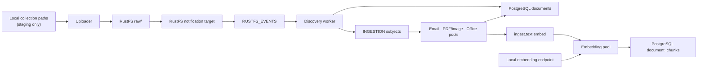

# Ingestion Design

This document is the design authority for Pocket Advisor’s write path: upload, discovery, extraction, indexing, queues, failure handling, runtime composition, and ingestion observability. [PDF text extraction](pdf-to-text.md) owns PDF classification, layout reconstruction, rasterisation, and OCR. [Workspace isolation](workspace-isolation.md) owns credentials and store boundaries. [Retrieval](retrieval-design.md) owns the read path over the index produced here.

## 1. Current state

Ingestion is a bounded host process. One `pocket-advisor` binary contains the uploader, discovery logic, and six JetStream consumer pools. Kubernetes runs only the shared RustFS, PostgreSQL, and NATS stores.

The central invariants are:

1. RustFS is the sole authoritative store for document bytes. Local collection paths are staging feeds used only by the uploader.
2. Root document identity is content-addressed within a workspace and collection.
3. Discovery is the only component that creates root documents. Container workers create children with explicit lineage.
4. Every worker is idempotent under at-least-once delivery.
5. Indexed text is extracted source text only. No generated summaries or answers enter Tier 2 or Tier 3.
6. Every chunk is an exact byte slice of `documents.normalized_text` and retains its document identity and offsets.
7. A known unsupported input is `SKIPPED`; work that should have succeeded and did not is `FAILED` and dead-lettered.
8. Every run is fixed to one workspace and connects using only that workspace’s credentials.



## 2. Tier model and identity

### 2.1 Tier 1: RustFS

Each workspace has its own bucket. Object keys do not repeat the workspace id because the bucket is already the boundary:

```text
raw/<sha256-prefix>/<sha256>
extracted/<sha256-prefix>/<sha256>
```

`raw/` holds uploaded root objects. `extracted/` holds child objects unrolled from email and archive containers. Keys are stable content hashes, so identical bytes in one collection converge on one object and repeated uploads can use an exact existence check.

The object metadata carries the provenance that a content-addressed key cannot:

| Metadata | Purpose |
| --- | --- |
| `source-filename` | original basename |
| `source-path` | path relative to the collection root |
| `collection-id` | collection scope used for document identity |
| `uploaded-at` | upload timestamp |
| `uploader-run-id` | upload run correlation |
| `alias-filenames` | additional names observed for identical content |
| collection attributes | ingestion type and collection-specific metadata |

Aliases are JSON-encoded in object metadata. Non-ASCII metadata is decoded on read before names are compared.

### 2.2 Tier 2: PostgreSQL documents

Root identity is deterministic:

```text
doc_id = UUIDv5(namespace, workspace_id || collection_id || sha256)
```

The `documents` table holds:

- parent/child and thread lineage;
- workspace and collection ids;
- processing status;
- detected type and MIME type;
- Tier 1 URI and content hash;
- original filename;
- extracted `normalized_text`;
- email subject, sender, recipients, and date as separate columns; and
- JSON metadata for provenance and failure details.

Email headers are not embedded into body text. `normalized_text` contains body prose, and metadata remains queryable as structured fields.

### 2.3 Tier 3: PostgreSQL chunks

A workspace stores each exact normalised passage once in `chunks`, keyed by its embedding model and a SHA-256 of whitespace-collapsed text. That row owns `chunk_text`, its `halfvec(N)` embedding, the HNSW cosine index, and the BM25 lexical index. Similar text is never merged: identity is exact after whitespace normalisation only.

`document_chunks` is the placement relation. It holds a deterministic `chunk_id`, `doc_id`, shared passage `content_id`, workspace id, chunk index, and the start and end byte offsets into that document's `normalized_text`. Retrieval searches shared passages, joins placements to recover document-specific provenance, and cites the matched placement rather than an arbitrary document sharing the same text. Replacing a document's chunks atomically creates or reuses passage rows, replaces its placements, and removes passages with no remaining placement.

The BM25 lexical index is a `pg_textsearch` index over `chunks.chunk_text` using the `simple` text configuration. It is not part of the base DDL. A full ingest drops it before streaming chunk writes and rebuilds it after the queues drain. Small scan and reconciliation runs leave it in place.

### 2.4 Schema bootstrap

The vector width is resolved by probing the configured embedding endpoint. The host applies the schema as the workspace’s own PostgreSQL role and records the embedding model and dimension in the single-row `schema_metadata` table.

Startup verifies that the endpoint’s model and vector width match `schema_metadata`. A mismatch is fatal. The current schema bootstrap is idempotent for an unchanged model and dimension; it is not a schema migration or re-embedding system.

**Target state:** a model change is handled as an explicit re-embed into a distinct model namespace, with the existing namespace remaining queryable until backfill and cutover complete. The migration and backfill workflow is not implemented.

## 3. Upload and discovery

### 3.1 Workspace resolution

`--ingest-all` resolves collections from `workspaces/workspace-config.yaml`, or the configured override, before touching a store. Unknown workspace ids and missing collection references are errors.

Collection paths are resolved relative to the registry file. Only the uploader reads those paths; workers and retrieval never do.

### 3.2 Upload

For every regular file in the selected collections, the uploader:

1. streams the file and computes SHA-256;
2. forms the canonical `raw/` key;
3. checks whether that exact key exists;
4. uploads missing bytes with provenance metadata; or
5. records a duplicate and, when necessary, adds an alias filename.

The uploader does not classify formats. Discovery owns format knowledge so a format change has one routing authority.

The uploader and worker clients use the same workspace RustFS identity. `rustfs.Vault` adds an application-level role guard: a worker-role client refuses writes or deletes under `raw/`, while an uploader-role client may perform them. This is a defence against application mistakes, not a RustFS credential boundary; [workspace isolation](workspace-isolation.md) owns that trade-off.

### 3.3 Live notification path

The chart configures one RustFS NATS notification target per workspace. `deploy-workspaces` binds that workspace’s bucket to its target for `s3:ObjectCreated:*` events under `raw/` only. Each target connects anonymously (NATS has no accounts, users, or passwords) and publishes into that workspace’s namespaced `RUSTFS_EVENTS_<SUFFIX>` stream.

The discovery event worker:

1. decodes the RustFS NATS payload;
2. validates the canonical `raw/` key;
3. fetches the object and provenance;
4. verifies that the object bytes match the key hash;
5. creates a deterministic Tier 2 stub;
6. classifies the bytes; and
7. publishes the corresponding Protobuf command.

Events for invalid keys are rejected or ignored without allowing worker-produced `extracted/` objects to become roots.

### 3.4 Exact reconciliation

Notifications reduce latency; reconciliation remains the completeness authority. `--scan` and `--ingest-all` enumerate `raw/`, compare object URIs with Tier 2, and identify objects without document rows.

For each gap, discovery uses the uploader-role vault to perform a same-object copy that preserves metadata. RustFS emits a fresh notification, so both new uploads and reconciled gaps enter through the same event worker.

The scan applies high- and low-water marks to the main stream. It pauses above 10,000 pending messages and resumes at or below 2,000 so enumeration cannot outrun extraction indefinitely.

## 4. Routing and extraction

Discovery classifies bytes rather than trusting extensions.

| Detected content | Subject | Handler |
| --- | --- | --- |
| RFC 822 email | `ingest.emails.raw` | email worker |
| ZIP, tar, and tar.gz archives | `ingest.emails.raw` | container unrolling |
| detected 7z and bzip2 archives | `ingest.emails.raw` | currently fail as unsupported during unrolling |
| PDF | `ingest.pdfs.raw` | document worker |
| DOCX, XLSX, PPTX, ODT, RTF | `ingest.docx.raw` | office worker |
| image | `ingest.images.raw` | image viability and OCR |
| plain text, Markdown, CSV, HTML | `ingest.text.embed` | direct indexing |
| CFBF Office and Outlook MSG | none | `SKIPPED / UNSUPPORTED_FORMAT` |
| other unsupported content | none | `SKIPPED / UNSUPPORTED_FORMAT` |

### 4.1 Email and archive worker

The email worker parses RFC 822 messages and supported archives in memory. It:

- extracts and compacts body text;
- strips markup, quoted reply chains, signature boilerplate, and machine-generated tracking URLs over the configured structural threshold;
- records headers in structured columns;
- derives thread ids from message headers, with subject/participant/date fallback;
- writes child bytes under `extracted/`;
- creates child stubs before publishing child commands; and
- enforces nesting and expansion bounds for hostile containers.

Child commands carry `parent_doc_id`, thread context, depth, and the parent trace id. Root creation remains exclusive to discovery.

### 4.2 PDF and image worker

The document worker has separate PDF and image consumer pools sharing one extraction implementation and one process-wide CPU semaphore. PDF extraction, masking, layout, rasterisation, OCR, page ordering, and image viability are specified in [PDF to Text](pdf-to-text.md).

OCR is compiled behind the `ocr` build tag. The supported build command enables it. A binary built without that tag remains usable but records scanned PDFs and images as `SKIPPED / OCR_UNAVAILABLE`.

### 4.3 Office worker

The pure-Go office worker handles:

- DOCX paragraphs and row-wise tables;
- XLSX sheets and tab-separated rows, using cached formula values;
- PPTX slide text and notes;
- ODT text; and
- RTF control-word stripping.

Row-wise spreadsheet output preserves the relationship between fields such as dates, descriptions, and amounts.

### 4.4 Plain text

Discovery writes supported plain text directly to `documents.normalized_text` before publishing `EmbedTextCommand`. Commands carry references, not document content.

## 5. Commands and queues

Every ingestion command is Protobuf and begins with `DocumentMetadata` containing document identity, workspace, collection, lineage, MIME type, content hash, trace context, and container depth.

| Command | Subject | Payload role |
| --- | --- | --- |
| `ProcessEmailCommand` | `ingest.emails.raw` | Tier 1 URI and metadata |
| `ProcessPdfCommand` | `ingest.pdfs.raw` | Tier 1 URI and metadata |
| `ProcessOfficeCommand` | `ingest.docx.raw` | Tier 1 URI, subtype, metadata |
| `ProcessImageCommand` | `ingest.images.raw` | Tier 1 URI, dimensions, size, metadata |
| `EmbedTextCommand` | `ingest.text.embed` | document reference and text length |

Extracted text is written to Tier 2 before an embed command is published. This keeps large OCR output below NATS payload limits and gives `normalized_text` one durable owner.

The workspace has three streams:

- `INGESTION`: work-queue retention over the five command subjects;
- `INGESTION_DLQ`: limits retention for terminal failures; and
- `RUSTFS_EVENTS`: work-queue retention for native RustFS events, with a 10-minute duplicate window.

Streams are created by `./pocket-advisor.sh deploy-workspaces`, not by the Go process.

## 6. Idempotency and failure handling

### 6.1 Stub then publish

Discovery and the email worker create a Tier 2 stub before publishing work. The database commit and JetStream publish are separate operations, so a crash can leave a `PENDING` row without a queued command.

Publishing waits for a JetStream acknowledgement and retries with bounded backoff. `--reconcile` claims up to 500 rows that have remained `PENDING` beyond `--stale-after` and republishes them.

### 6.2 Worker idempotency

- Stub creation uses conflict-safe insertion.
- Tier 1 child writes are content-addressed.
- Chunk replacement deletes and reinserts one document’s chunks within the same transaction that marks the document complete.
- Duplicate command delivery redoes work for the same deterministic document rather than creating another document.

### 6.3 Delivery and dead letters

Consumers use explicit acknowledgements, `MaxDeliver = 3`, and a five-minute `AckWait`. While a handler runs, the runtime sends `InProgress` heartbeats so legitimate long OCR work does not expire its acknowledgement window.

Terminal failure handling:

1. marks the message terminal rather than requesting another delivery;
2. republishes the original payload to `ingest.dlq`;
3. records failure reason, worker, delivery count, original subject, and trace context in headers; and
4. updates the document to `FAILED`.

Failure reasons are a closed `domain.FailureReason` vocabulary. Unclassified failures use `UNCLASSIFIED` so missing classification stays visible.

Expected declines set `SKIPPED` and never create DLQ entries.

### 6.4 Current recovery boundary

Reconciliation republishes stale `PENDING` rows only. Rows left `PROCESSING` by an interrupted handler and rows marked `FAILED` require an explicit reset or forget-and-ingest workflow. Automated redrive needs a durable distinction between transient and terminal failures and remains an open design decision.

## 7. Chunking and embedding

The indexer loads `normalized_text` by `doc_id`, then:

1. splits it into approximately 512-token windows with 64-token overlap;
2. prefers paragraph, line, sentence, then word boundaries in the final 40% of a window;
3. preserves UTF-8 byte offsets so `normalized_text[start:end] == chunk_text`;
4. batches after chunking, with at most 64 chunks or approximately 16,000 tokens per embedding request;
5. embeds exactly `chunk_text`, without subject, filename, or parent context; and
6. replaces all chunks for the document transactionally.

A document may require several embedding requests, but no chunks become visible until the complete document transaction commits.

## 8. Process topology and concurrency

One process constructs shared store clients, model clients, logging, metrics, and a CPU semaphore. Pool sizes derive from `runtime.NumCPU()`:

| Pool | Lanes |
| --- | --- |
| RustFS event discovery | `2 × CPU` |
| email | `2 × CPU` |
| PDF | `CPU` |
| image | `CPU` |
| office | `CPU` |
| embedding | `2 × CPU` |
| rasterisation and OCR CPU semaphore | `CPU` shared slots |

Embedding concurrency is separately configurable because it is a capacity limit of the model endpoint rather than the host CPU. PostgreSQL’s pool is sized above the combined lane demand.

PDFium uses the wazero WebAssembly backend. Its instance pool is lazy and sized to the document lanes. Tesseract uses CGo. PDF rasterisation remains serial per document, while page OCR can run concurrently under the shared semaphore and stores results by page index.

## 9. Run lifecycle

`--ingest-all`, `--scan`, and `--reconcile` start all pools before feeding work, then wait until every consumer is idle and every queue has remained empty for a three-second settling period. The settling window prevents a run from finishing during the brief gap between a parent completing and its child commands becoming visible.

`--listen` starts the same pools and waits until interrupted. It does not upload or scan.

Interrupt handling has two stages:

1. the first signal stops fetching and allows in-flight handlers to finish and acknowledge;
2. a second signal, or expiry of the drain grace period, cancels active handlers.

Resume state is composed from Tier 1 objects, Tier 2 rows, and durable JetStream messages. No separate checkpoint file exists.

## 10. Reset semantics

`--forget <sha256>` deletes matching document rows; foreign-key cascades remove their document-specific descendants and chunk placements. It then deletes the `raw/` and `extracted/` objects whose own key uses the selected hash. It does not traverse descendant rows to delete extracted child objects with different hashes, so those objects may remain in Tier 1 until a workspace-wide delete. Shared passage rows that have no remaining placement are currently retained until an explicit storage cleanup is introduced.

`--delete-data` removes all objects and document-related PostgreSQL rows for the workspace and purges `INGESTION`, `INGESTION_DLQ`, and `RUSTFS_EVENTS`. Like `--forget`, it currently retains shared passage rows released by the operation until an explicit storage cleanup is introduced. It requires all three stores to be reachable before beginning and prompts unless `--yes` is supplied. Reset operations update PostgreSQL, RustFS, and NATS in a defined order but are not transactional across stores; rerunning after a partial failure converges the remaining work.

The uploader never treats absence from a later local scan as deletion.

## 11. Observability

Ingestion exposes Prometheus metrics on the configured host port and writes JSON logs by role under the configured log directory.

Implemented metrics include:

| Metric | Purpose |
| --- | --- |
| `rag_uploader_files_total{outcome}` | uploaded, duplicate, failed files |
| `rag_uploader_bytes_total` | Tier 1 ingress bytes |
| `rag_discovery_files_total{mode,outcome}` | discovery and reconciliation outcomes |
| `rag_discovery_unstubbed_objects` | Tier 1 gaps found by reconciliation |
| `rag_discovery_stale_pending` | stale rows found by reconciliation |
| `rag_ingestion_tasks_total{worker,status}` | worker terminal outcomes |
| `rag_ingestion_duration_seconds{worker,doc_type}` | stage latency |
| `rag_pdf_classification_total{type}` | digital and scanned routing |
| `rag_office_extracted_total{format}` | office extraction throughput |
| `rag_skipped_total{reason}` | expected declines |
| `rag_dlq_total{worker,reason}` | terminal failures |
| `rag_embedding_tokens_processed_total` | approximate embedding volume |

The process creates and propagates W3C `traceparent` values and records their trace ids in logs. It does not currently export spans to an external tracing backend.

During ingestion, the terminal dashboard owns stdout and shows uploader progress, queue depth, active lanes, retry/skip/dead-letter counts, CPU slots, embedding sessions, and PostgreSQL pool use. Non-terminal output falls back to summaries. `--query` and the `mcp` subcommands log to stderr instead of role files. Current ingestion logs include local source paths and filenames for diagnosis; `logs/` is gitignored and must be treated as private workspace material.

## 12. Deployment boundary

The `pocket-advisor-infra` chart deploys one shared StatefulSet and Service for each store. Store administrator identities (`postgres`, RustFS `admin`/`admin`) are hardcoded literals in the chart; there is no private values file and no per-workspace credential of any kind. `./pocket-advisor.sh deploy-workspaces` creates, for every registered workspace, its database, role, extensions, bucket, public policy, notification binding, and streams.

The binary never holds store administrator credentials. It connects as the selected workspace and applies only the dimension-dependent application schema.

**Target state:** an authenticated control plane records and dispatches ingestion operations to a host agent using this same bounded process. Moving ingestion into Kubernetes requires deliberate designs for source upload and model/OCR access; it is not implied by the target API. See [API Server Design](api-server-design.md).

## 13. Verification

The supported checks are documented in [README §9](../README.md#9-verification). Ingestion changes normally require:

```sh
./pocket-advisor.sh build
./pocket-advisor.sh test
./pocket-advisor.sh race
./pocket-advisor.sh lint
git diff --check
git status --short
```

Manual checks should confirm:

- an idempotent second upload performs no object writes;
- scan-triggered notification processing closes every Tier 1/Tier 2 gap;
- interrupted work resumes without duplicate chunks;
- unsupported inputs are skipped without DLQ entries;
- terminal failures carry diagnostic DLQ headers;
- chunk offsets resolve byte-for-byte into `normalized_text`;
- the BM25 index exists after a full ingest; and
- no table contains generated answer text.

## 14. Open decisions

1. **Schema migrations and model changes.** The current bootstrap only creates an empty schema and rejects model or dimension drift. A migration runner and a resumable namespace backfill are required before changing a populated index.
2. **Failed and processing redrive.** Recovery needs transient/terminal classification, attempt history, and an operator surface that does not retry permanently corrupt documents on every ingest.
3. **Storage durability.** The local deployment uses one replica per store and has no integrated backup workflow. Tier 1 loss is corpus loss unless external source material or a separate backup exists.
4. **PostgreSQL contention.** Bulk writes and retrieval share one server. Measure query latency during ingest before introducing workload separation.
5. **Horizontal ingestion.** Pool sizes assume one host process. Multiple processes can share JetStream, but CPU and lifecycle coordination are not designed.
6. **Log retention.** Role logs append across runs and have no built-in rotation policy.
