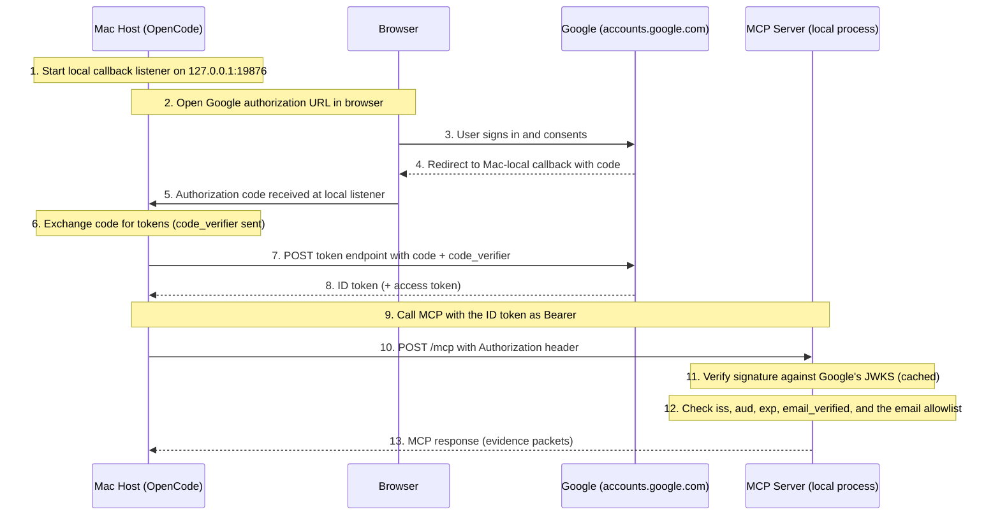

# MCP Server Design

This document is the design authority for Pocket Advisor's Model Context Protocol (MCP) server: both the stdio adapter for local agents and the authenticated Streamable HTTP adapter for remote and hosted clients. It defines the tool contract, evidence interface, citation system, pagination, response bounds, authentication, transport, deployment, and testing.

The retrieval package remains transport-independent; both MCP adapters are thin boundaries over `internal/retrieval` and the shared `internal/mcp.QueryTool`. Answer generation is performed by the MCP client or another external consumer of evidence packets — Pocket Advisor returns evidence, not answers.

## Current state

Pocket Advisor exposes retrieval evidence through two MCP transports:

- a workspace-bound stdio MCP server over newline-delimited JSON-RPC; and
- a workspace-bound Streamable HTTP MCP resource server, running as a local process, optionally authenticated against Google.

Both transports expose the same typed JSON Schema 2020-12 compact-search and cursor-based evidence-page results with a text compatibility representation. Each process is fixed to one workspace at startup. Stdio negotiates the connection-oriented final revisions through 2025-11-25. Streamable HTTP uses the official Go MCP SDK for the current stateless 2026-07-28 transport and 2025-11-25 compatibility required by OpenCode 1.18.15.

The stdio adapter is the default local integration, started with `mcp stdio`. The HTTP adapter, started with `mcp start`, runs as a local process bound to loopback by default and serves remote, browser, and hosted agent clients directly or behind an operator-supplied reverse proxy. Authentication is optional; when enabled, Google is the sole supported identity provider. The Go process is the resource server: it verifies every bearer token as a Google-issued OIDC ID token against Google's published JWKS (signature, issuer, audience, expiry), checks the verified `email`/`email_verified` claims against an operator-maintained allowlist, then keys continuation state by issuer and subject. RFC 9728 protected-resource metadata advertises the Google issuer. There is no token-result cache, so an ID token remains valid for its own natural (Google-issued) lifetime — revoking a caller means removing their email from the allowlist and restarting the server.

## Tool contract

### Tools

Each workspace-bound MCP server exposes two tools:

- `search_<workspace>` — accepts a bounded question and optional `top_k`, runs retrieval once, creates an immutable session-local snapshot, and returns a compact ranked evidence index.
- `read_<workspace>_evidence` — accepts only an opaque cursor returned by that session and returns admitted text segments.

Neither tool accepts a workspace, result identifier, document identifier, source URI, credential, byte range, or other client-selected scope. The workspace is fixed at process startup and absent from tool arguments.

Both tools advertise closed inputs, one JSON Schema 2020-12 evidence-page output, and read-only, non-destructive, idempotent, closed-world annotations.

### Input bounds

Valid request frames are limited to 8 MiB. Request identifiers are limited to 256 encoded bytes. Questions are limited to 8,192 Unicode characters before whitespace trimming. Cursors are limited to 256 bytes. `top_k` is limited to 50.

### Tool metadata and description

Tool descriptions instruct the MCP agent that the tool returns workspace evidence rather than general knowledge or a generated answer. The search description explains that complete result-scoped references should be cited (such as `R0123456789ab:E1`), that `complete=false` means the model should call the named continuation tool with exactly `next_cursor`, and that only `complete=true` means all evidence has been admitted.

The continuation description instructs the agent to accept only the opaque cursor returned by search or by this tool, to not construct a cursor or request a byte range, document, result, or workspace directly, to cite complete result-scoped references on the page, and to call the tool again with `next_cursor` when `complete=false`.

## Evidence interface

### Evidence page structure

Every successful page contains structured and readable representations derived from the same typed value. The compact search page includes:

- original question and effective sub-queries;
- packets in stable rank order with collision-free result-scoped references;
- warnings;
- budget used and allowed with explicit UTF-8 byte unit;
- document and chunk identifiers;
- source hash and Tier 1 URI;
- matched snippet and admitted-text availability;
- start and end offsets with explicit UTF-8 byte unit;
- relevance score and contributing search legs;
- related-document counts and admitted-text availability;
- explicit indication when text was omitted by the shared budget;
- `complete` flag;
- nullable `next_cursor` and `continuation_tool`;
- aggregate evidence budget; and
- response budget.

Text pages preserve the same packet reference and identify the server-selected UTF-8 byte range and whether that document text is complete. Collections are never null. Absent metadata is nullable. Retrieval warning and relationship semantics survive the adapter.

### Citation contract

References include a server-issued result namespace and stable collision-free packet references such as `R0123456789ab:E1`. The namespace is preserved across every page of a result, so multi-call and multi-page citations are unambiguous even when several searches each have a first-ranked packet.

The compact index and every later text page preserve the same complete reference. Tool descriptions and readable pages instruct the agent to reproduce that complete reference rather than shorten it to a local rank.

A consuming agent should be able to:

- cite a packet without inventing a source;
- distinguish the matched passage from surrounding document or lineage context;
- preserve source attribution and relation labels;
- report retrieval warnings; and
- say that no evidence was found instead of answering from general knowledge;
- distinguish a completed admitted-evidence review from a partial result.

The MCP server validates its result shape and provenance fields. It does not validate the external agent's final prose or become an answer-generation service.

### Cursor and snapshot contract

The initial search creates an immutable bounded in-memory snapshot. Opaque unguessable cursors address server-selected pages in that snapshot and never rerun decomposition, embedding, retrieval, reranking, selection, or expansion.

Cursors are:

- cryptographically random and opaque;
- bound to the current MCP session and fixed workspace;
- bound by construction to the authorization issuer and subject (HTTP) or connection (stdio);
- idempotent on retry;
- safe under concurrent calls;
- subject to a documented sliding TTL and least-recently-used memory eviction; and
- released on shutdown or caller-state expiry.

Invalid, expired, evicted, malformed, wrong-session, and wrong-workspace cursors return a bounded correctable error. Token renewal by the same subject preserves continuation; another caller or workspace receives the same bounded cursor error. A supplied session header has no authority over identity or state.

The HTTP adapter retains at most 128 active caller namespaces and closes the least recently used namespace before admitting another. Each state namespace retains at most eight snapshots and 2 MiB of encoded snapshot data, evicts the least recently used snapshot when necessary, and expires after fifteen idle minutes. Access extends a ten-minute expiry. Snapshots and cursors are released on shutdown or caller-state expiry.

When `complete` is false, the readable fallback prominently instructs the model to call the named reader with exactly `next_cursor`. MCP does not automatically paginate arbitrary tool results: the model chooses whether to continue. It may stop after enough cited evidence for a narrow answer, but it cannot make an exhaustive or negative admitted-evidence claim until continuation reaches `complete: true`.

### Response and evidence bounds

The default 120,000 UTF-8-byte retrieval allowance is an aggregate budget across the immutable result, not a per-page allowance. A response limit never silently reduces the admitted result or depends on a client's truncation or local spill-file behavior.

Each encoded `CallToolResult`, including `structuredContent` and readable `content` together, targets at most 48 KiB. Readable content targets at most 1,800 lines. The complete JSON-RPC response has an absolute 51,200-byte ceiling, and successful readable content never exceeds 2,000 lines. These margins keep normal pages below documented client limits without depending on result truncation or spill-file recovery.

The compact index is paged at packet boundaries when necessary. Admitted primary and related text is paged independently, so one document larger than a response is delivered without loss. Text boundaries preserve valid UTF-8 and prefer a paragraph boundary in the latter half of the largest fitting segment.

### Error contract

Separate protocol errors from tool execution errors according to MCP semantics. Invalid arguments are correctable by the model. Unknown tools are protocol errors. Retrieval and dependency failures return a bounded generic tool error, and the MCP log records only a safe failure kind rather than endpoint, SQL, question, or evidence details. Evidence metadata that cannot fit a bounded page is rejected with an instruction to narrow and rerun the question. Internal retrieval details are never returned to the client.

## Transports

### stdio MCP

`./bin/pocket-advisor mcp stdio --workspace-id <id>` serves newline-delimited JSON-RPC over standard input and output. The process is fixed to the selected workspace at startup and exposes generated search and evidence-reading tools.

Stdio implements the final MCP revisions from 2024-11-05 through 2025-11-25, negotiates only those revisions, enforces initialize/initialized lifecycle order, supports ping and cancellation, and does not open a network listener. The direct protocol implementation remains smaller than introducing an SDK for this bounded method set; every advertised revision and method is covered by protocol tests.

Stdio snapshots are connection-local and share the same memory and eviction limits as HTTP: at most eight snapshots, 2 MiB of encoded snapshot data, and a ten-minute access expiry. The adapter directly implements its small connection-oriented method set.

### Streamable HTTP MCP

`./bin/pocket-advisor mcp start --workspace-id <id> ...` serves the same two tools through the official Go MCP SDK. It implements stateless MCP 2026-07-28 HTTP and retains 2025-11-25 compatibility for OpenCode 1.18.15. The adapter converts SDK calls into the existing `QueryTool.Call` boundary and converts the existing bounded result back; it does not construct a second retrieval request, evidence model, or cursor.

The HTTP endpoint is `/mcp`. MCP 2026-07-28 is stateless: each POST carries protocol version, client information, capabilities, method, and tool name in the normative body and mirrored headers, which the SDK compares before dispatch. The compatibility handler is also stateless and issues no legacy transport session identifier; a client-supplied session header cannot select identity or evidence state. JSON responses are selected; request-scoped SSE remains client-supported but is not needed because these tools send no progress notifications or server requests. HTTP disconnect cancels current-protocol retrieval. Legacy 2025-11-25 clients may initialize through the same endpoint; standalone GET is not offered.

The SDK's own loopback DNS-rebinding guard is disabled: `secureEnvelope` already owns Host and forwarded-header validation against an explicit allowlist and trusted-proxy set, and a reverse proxy in front of this server (if any) forwards the public Host, which the SDK's own guard would otherwise refuse.

HTTP snapshots are isolated by OAuth issuer and subject, permitting token rotation by the same caller without permitting cross-caller continuation.

### Transport parity

Stdio and HTTP adapters expose the same tool schema, structured result, warnings, citations, and error semantics. Both expose the same result-scoped references, aggregate-versus-page budgets, response bounds, immutable snapshot, and opaque continuation behavior.

Cancellation uses `notifications/cancelled` with the original request ID. Closing stdin or terminating the process cancels in-flight retrieval before shutdown. Protocol diagnostics go to the private application log; stdout remains JSON-RPC only.

### Binding and origin security

The server must bind to an explicit loopback address; binding to all interfaces is rejected unconditionally, whether or not Google auth is configured. Remote access goes through SSH tunneling or an operator-supplied reverse proxy, not a non-loopback bind.

The `Origin` header is validated on every relevant request before reading or acting on the MCP payload. An explicit allowlist is maintained and the specification-required forbidden response is returned for an invalid origin. Missing, null, malformed, deceptive, and DNS-rebinding origins are tested.

Host and forwarded headers are validated only through a trusted proxy configuration. Authority or workspace is not inferred from untrusted forwarding headers.

## Authentication and authorization

Authentication is optional. With no `mcp.oauth` configured, the HTTP server runs unauthenticated on loopback — for local development only. Setting `google_client_id` and `allowed_emails` turns it into a resource server that trusts Google as the sole identity provider: it publishes RFC 9728 protected-resource metadata at `/.well-known/oauth-protected-resource/mcp` identifying `https://accounts.google.com` as the issuer, verifies every bearer token as a Google-issued OIDC ID token against Google's published JWKS (signature, issuer, audience, expiry — fetched and cached locally by the verifier, not looked up per request against a confidential endpoint), and checks the verified `email`/`email_verified` claims against the configured allowlist. There is no secret on the resource-server side: ID-token verification is a public-key operation, so there is nothing equivalent to a Keycloak introspection client credential to provision or rotate.

### Authentication flow

The following diagram shows the end-to-end flow when an MCP client (such as OpenCode on a local Mac) connects to a Google-authenticated MCP server running locally:



**Flow summary:**

1. The client starts a local HTTP listener on the Mac at `127.0.0.1:19876` to receive the OAuth callback.
2. The client opens Google's authorization URL in the user's browser, requesting the `openid email` scope with the PKCE code challenge and the redirect URI pointing to the Mac-local listener.
3. The user signs in with their Google account and consents.
4. Google redirects the browser back to the Mac-local callback with an authorization code.
5. The local listener receives the code.
6. The client exchanges the code for tokens at Google's token endpoint, including the PKCE code verifier.
7. The client sends the token request to Google.
8. Google returns an ID token (a signed JWT carrying the user's `sub` and, with the `email` scope, `email`/`email_verified` claims).
9. The client prepares to call the MCP server with the ID token in the `Authorization: Bearer` header.
10. The client sends the MCP request to the server.
11. The MCP server verifies the ID token's signature against Google's published JWKS (`https://www.googleapis.com/oauth2/v3/certs`, fetched once and cached).
12. The MCP server checks the issuer is Google, the audience matches the configured Google OAuth client ID, the token is unexpired, `email_verified` is true, and the email is on the configured allowlist.
13. The MCP server returns the MCP response (evidence packets).

**Key points:**

- The `127.0.0.1` in the redirect URI is the Mac host's own loopback; it is where the client, not the server, receives the OAuth callback.
- The MCP server never sees the user's Google credentials, only the resulting ID token.
- There is no revocation check: an ID token remains verifiable for its own (Google-issued, typically short) lifetime. Removing someone's access means removing their email from the allowlist and restarting the server, not revoking a token.

### Google OAuth client configuration

Google does not support dynamic client registration, so the operator registers one OAuth 2.0 Client ID in Google Cloud Console (APIs & Services → Credentials), of the application type that supports a loopback redirect URI (a Desktop app client, per RFC 8252). Configure:

- the client ID in `config.yaml`'s `mcp.oauth.google_client_id` — this is the audience the server checks every ID token against; it is not a secret;
- the exact loopback redirect URI the MCP client uses (such as `http://127.0.0.1:19876/mcp/oauth/callback`) in the client's registered redirect URIs; and
- the allowed caller emails in `mcp.oauth.allowed_emails`.

The client the operator registers is a public/native client: whatever client secret Google issues for it belongs to the MCP client's OAuth flow, never to this server, and is not configured here.

### Design requirements

The design requires:

- TLS for the public MCP resource URI whenever Google auth is enabled (enforced by `internal/mcp.normalizeHTTPOptions`);
- strict redirect URI validation, owned by the registered Google OAuth client, not this server;
- audience and issuer validation against Google's fixed, non-configurable issuer;
- an explicit, non-empty email allowlist — a Google-authenticated server refuses to start without one;
- clear 401 behavior that does not reveal workspace existence; and
- no committed secret, because none is required.

If the selected client cannot implement the required authorization flow, the incompatibility is resolved rather than adding a shared static fallback credential for remote access.

## Workspace isolation

Each `mcp start`/`mcp stdio` process is fixed to one workspace at startup, via `--workspace-id`. A workspace ID in a URL, request body, OAuth claim, MCP argument, mirrored header, or tool name cannot change that process's configured database or credentials.

Both MCP transports follow the same rule: `--workspace-id <id>` fixes the workspace before the retrieval service, tool, or listener is created. Neither search nor continuation accepts a workspace argument. The tool name, public route, and Google-verified subject are routing and authorization inputs, not the storage boundary; the selected PostgreSQL credential and asserted database scope remain that boundary.

Serving more than one workspace over HTTP means running one `mcp start --workspace-id <id>` process per workspace, each on its own address (`--addr`); nothing multiplexes several workspaces' credentials inside one process. Each process receives no RustFS, NATS, provisioning, or shared PostgreSQL administrative credential — only what `WorkspacePostgresDSN` resolves for its own workspace.

The Go process validates every request itself. When Google auth is enabled it requires a Google ID token whose audience matches the configured client ID and whose verified email is on the allowlist; there is no separate gateway performing authentication on its behalf. Continuation snapshots are partitioned by issuer and subject, so renewing a token does not lose a result and another authenticated caller cannot acquire it.

## Deployment

### Local execution

The MCP server is built into the `pocket-advisor` binary and runs as a local process — there is no Kubernetes deployment for it. Start it with:

```sh
./bin/pocket-advisor mcp start --workspace-id <workspace>
```

Configuration is in `config.yaml` under the `mcp:` section:

```yaml
mcp:
  http:
    addr: "127.0.0.1:8080"
    endpoint: "/mcp"
    resource_uri: "https://mcp.example.test/mcp"
  # Omit this whole oauth: block to run unauthenticated on loopback (local
  # development). Set both fields to require Google sign-in.
  oauth:
    google_client_id: "1234567890-abc.apps.googleusercontent.com"
    allowed_emails:
      - "you@example.com"
```

The server binds to loopback by default (`127.0.0.1:8080`), so it is only accessible from the local machine. For remote access, use SSH tunneling or deploy a reverse proxy.

### TLS (optional)

The server can terminate TLS itself. Provide a certificate and key in `config.yaml`:

```yaml
mcp:
  tls:
    cert_file: "/path/to/cert.pem"
    key_file: "/path/to/key.pem"
```

Both fields are required together; setting one without the other is a startup error. Google auth additionally requires `resource_uri` to be `https://…` — TLS (self-terminated here, or via a reverse proxy) is a prerequisite for enabling it, not a separate concern. Without a cert/key pair the server serves plain HTTP, which is fine behind a reverse proxy (Caddy, nginx) that terminates TLS instead.

## Testing

### Protocol tests

The committed synthetic suite covers:

- input and output JSON Schema compilation and validation;
- pre-trim Unicode question bounds and rejection of workspace, result, and byte-range selectors;
- stable completed empty evidence;
- result-scoped citation uniqueness across searches;
- one large multibyte document reconstructed byte-for-byte;
- many short lines reaching the line target before the byte target;
- several packets preserving references and text across pages;
- valid UTF-8 at snippet and page boundaries;
- idempotent cursor retry, including the terminal page;
- concurrent reads of the same cursor;
- snapshot expiry and least-recently-used eviction;
- wrong-session and wrong-workspace cursor rejection;
- cancellation before continuation access;
- complete JSON-RPC response size enforcement; and
- protocol lifecycle, concurrent tool calls, serialized writes, cancellation, safe errors, and clean shutdown.

### Authentication and authorization tests

`internal/mcp/http_test.go` runs the real Google verifier against a fake OIDC provider (a locally-signed JWKS and issuer serving `/.well-known/openid-configuration`), so these are integration tests of the actual production code path, not mocks of it:

- unauthenticated, malformed, expired, wrong-audience, wrong-issuer, unverified-email, and non-allowlisted-email tokens;
- invalid Origin, Host, forwarded headers, and non-authoritative session identifiers;
- DNS rebinding attempts;
- request smuggling and oversized JSON or SSE traffic;
- attempts to establish or fix a transport session on the stateless endpoint;
- cross-caller and cross-workspace continuation cursor use, expiry, caller-state and snapshot eviction, and idempotent retry, including attempts to override caller identity with a legacy session header;
- disconnect and cancellation resource cleanup;
- startup validation (non-loopback bind, insecure resource URI with Google auth on, missing allowlist, cert-without-key, invalid proxy CIDRs/hosts); and
- attempts to select another workspace by every transport field.

There is no cluster or real-Google end-to-end test: authenticated HTTP MCP is a local process now, and Google itself is not something this repository stands up a fake of beyond the JWKS/discovery double above.

### Client compatibility

A small manual compatibility matrix records client version, negotiated MCP revision, model-visible structured-content support, text fallback behavior, response-size behavior, pagination, empty-result refusal, cancellation, and citation rendering.

The evaluated OpenCode 1.18.15 compatibility:

| Behavior | Result |
| --- | --- |
| Negotiated revision | `2025-11-25` |
| Tool discovery | Both tools connected and callable |
| Model-visible representation | Readable output text retained; `structuredContent` not separately persisted |
| Populated result | Search cursors followed to `complete: true`; distinct first-ranked references preserved across searches |
| Large result | 156,200 admitted UTF-8 bytes delivered through one search and seven reader calls |
| Empty result | Completed empty search caused explicit refusal to invent an answer |
| Spill-file dependency | None; the model used MCP continuation only |
| Cancellation | Interrupting the CLI terminated the process without emitting `notifications/cancelled` (client limitation, not server defect) |

## Verification

Use the repository commands in [README §9](../README.md#9-verification). MCP behavior is covered by unit tests under `internal/mcp`, protocol-fixture tests, race tests for concurrent cancellation, cursor access and serialized writes, schema validation, non-ASCII snippet and page-boundary tests, response byte and line-limit tests, large single-document and multi-packet tests, snapshot lifecycle and workspace-isolation tests, and the supported-client smoke matrix.

Use only synthetic MCP requests and evidence in committed fixtures. Confirm protocol output remains valid when diagnostics are active.

## Operational pitfalls

- **Allowlist changes need a restart**: `allowed_emails` is read once at `mcp start`. Adding or removing an email does not take effect until the server is restarted (`mcp stop` then `mcp start`).
- **No revocation**: a Google ID token is valid until it naturally expires; there is no introspection call to make it stop working early. Removing an email from the allowlist prevents a *new* token for that address from being accepted after restart, but does not invalidate one already in flight.
- **`mcp start` fails fast on a stale PID file only if the process is actually dead**: if a previous server was killed with `-9` and its PID has since been reused by an unrelated process, `mcp status`/`mcp start` cannot distinguish that from the original server still running. This is inherent to PID-based liveness checks; prefer `mcp stop` over killing the process directly.

## Non-goals

- Do not implement the general administrative API or Web UI.
- Do not add answer generation.
- Do not expose ingestion, reset, provisioning, or workspace lifecycle through MCP.
- Do not multiplex many workspace credentials inside one MCP process.
- Do not weaken stdio support.
- Do not implement obsolete HTTP+SSE transport when intended clients support final Streamable HTTP.
- Do not claim remote support before the complete authentication path is tested.
- Do not advertise experimental MCP capabilities that are not required by supported clients.
- Do not log protocol payloads containing questions or evidence.

## Primary references

- [MCP 2026-07-28 Streamable HTTP transport](https://modelcontextprotocol.io/specification/2026-07-28/basic/transports/streamable-http)
- [MCP 2026-07-28 authorization framework](https://modelcontextprotocol.io/specification/2026-07-28/basic/authorization)
- [MCP 2026-07-28 protocol overview](https://modelcontextprotocol.io/specification/2026-07-28/basic)
- [MCP 2025-11-25 schema](https://modelcontextprotocol.io/specification/2025-11-25/schema)
- [MCP 2025-11-25 tool structured-content and output-schema contract](https://modelcontextprotocol.io/specification/2025-11-25/server/tools)
- [MCP 2025-11-25 Streamable HTTP compatibility contract](https://modelcontextprotocol.io/specification/2025-11-25/basic/transports)
