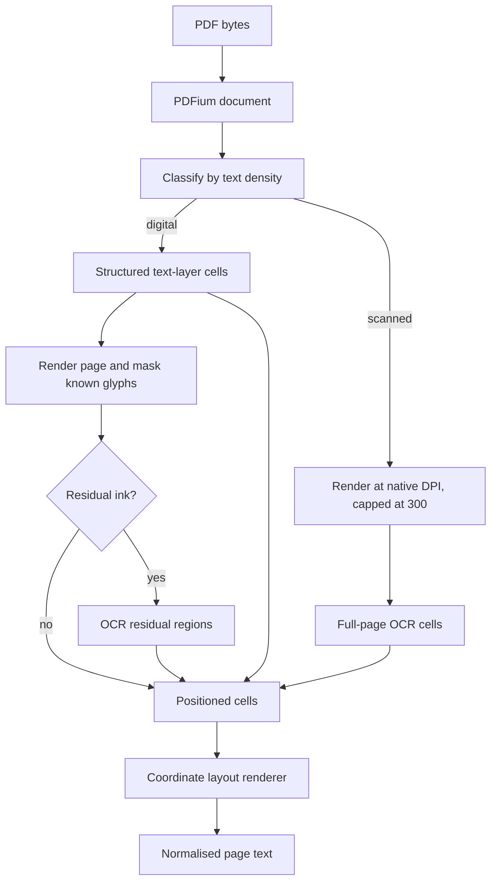

# PDF to Text

This document is the design authority for PDF classification, text-layer extraction, layout reconstruction, rasterisation, OCR, and image viability. [Ingestion Design](ingestion-design.md) owns queueing, worker lifecycle, persistence, and indexing around this stage.

## 1. Current state

PDFs do not provide a reliable sequence of lines and paragraphs. They provide drawing instructions, glyphs, and coordinates. Three properties shape the extraction design:

- characters may arrive in drawing order rather than reading order;
- line structure must be reconstructed from geometry; and
- a dense text layer can still omit visible words or entire page regions.

Pocket Advisor treats every page as a set of positioned cells. Cells may come from the PDF text layer, OCR, or both. Digital and scanned paths converge on the same layout renderer.



PDFium runs in-process through `go-pdfium` and wazero. Tesseract is linked through CGo when the binary is built with the `ocr` tag. No OS subprocess or temporary document file is used.

## 2. Classification

The extractor first reads the available text layer and classifies the document from characters per page. The current digital threshold is 100 characters per page.

Classification decides the source of the page’s main words:

- a digital page starts from structured text-layer characters and searches rendered residue for omissions;
- a scanned page renders the page and obtains all words through OCR.

Classification does not decide reading order. Both paths use positioned output and the same layout renderer.

## 3. Text-layer extraction

`internal/engine/pdf` exposes structured characters, lines, and bounding boxes from PDFium.

### 3.1 Line reconstruction

The extractor walks characters in content-stream order and detects a line break when the next character retreats against the direction of travel.

Direction is measured per run:

- the run remains uncommitted until it has moved five points horizontally;
- a right-moving run treats a significant left retreat as a break;
- a left-moving run treats a significant right retreat as a break; and
- vertical runs remain uncommitted on the horizontal axis and are handled separately by the layout renderer.

The back-jump tolerance is 30 points. These values preserve words under page rotation while avoiding false line breaks from kerning and table geometry.

### 3.2 Exposed geometry

The PDF engine provides:

- reconstructed page lines with text and position;
- character boxes aligned to each line’s runes; and
- all non-whitespace character boxes for masking.

The text-layer boxes are the trusted source for regions the PDF explicitly represents.

## 4. Recovering omitted visible text

Every digital page is rendered at 200 DPI. The worker paints the text-layer character boxes white and inspects what remains.

### 4.1 Subtract and inspect

Masking divides the page into disjoint sources:

- known text-layer regions remain represented by PDFium; and
- visible residue is eligible for OCR.

This avoids reconciling two competing readings of the same glyph.

### 4.2 Ink gate

The masked image is sampled on a stride of three pixels. OCR is skipped unless at least 200 dark samples remain. A complete text layer therefore pays for rendering and a cheap pixel scan, not a Tesseract call.

### 4.3 Residue confidence

Residual OCR uses an 80 percent word-confidence floor because the trusted text layer remains available beside it and residue commonly contains logos or partial marks. Full-page OCR uses no confidence floor because an uncertain reading is still the only reading available.

### 4.4 Fragment filter

Mask boundaries can leave small glyph fragments. The filter evaluates each contiguous run of recovered words rather than deleting short words individually. A recovered run is retained when it contains at least one readable token, preserving legitimate single-letter list markers and short words that occur inside a meaningful phrase.

## 5. Layout reconstruction

The renderer converts positioned cells to text that preserves page structure closely enough for tables, forms, and citations to remain meaningful.

### 5.1 Rows

Cells are grouped by baseline, not glyph top. Baseline grouping keeps punctuation and letters together. The tolerance is half the page’s median non-vertical glyph height, with a two-point minimum.

For scanned pages, cells carry the line box assigned by Tesseract. Row grouping uses that deskewed line baseline rather than the individual word baseline.

### 5.2 Reading axes

Tesseract returns word boxes in the original image coordinate system even when it correctly recognises a rotated page. The renderer derives the direction words advance within a line and the direction lines advance through the page from Tesseract’s word order, then snaps those directions to page axes. All four quarter-turn orientations therefore use the same ordering logic.

### 5.3 Columns

Each row is emitted on a character grid. Character pitch is the median width per rune of the page’s non-vertical cells, with a safe fallback when geometry is sparse. Cells that round to the same column remain separated by at least one space.

### 5.4 Leader runs

Dense runs of leader punctuation use their measured right edge as well as their left edge. When the rendered run would exceed that width, leader characters are shortened to fit. Text and figures are not shortened. When a row has several leader runs, they share the compression.

### 5.5 Paragraphs and trimming

A vertical gap substantially larger than the page’s median line spacing creates a paragraph break. Final trimming removes blank lines at the document edges and trailing spaces while retaining leading indentation that represents page layout.

## 6. Vertical text

Vertical runs are transposed to horizontal text and emitted above the page body, one run per line, ordered down the page. This preserves each run as searchable text without inserting it into an unrelated body row.

Rotated labels may arrive as one-character extracted lines. The renderer gathers at least three such whole-line cells when they align in one column. Eligibility depends on the cell being the complete extracted line, which keeps ordinary short list markers out of this path.

Vertical cell dimensions are excluded from type-size and line-spacing statistics.

## 7. Scanned pages

### 7.1 Page segmentation and orientation

Tesseract uses page segmentation mode 1 (`PSM_AUTO_OSD`). It is set with:

```text
tessedit_pageseg_mode=1
```

The value is applied as a Tesseract variable because gosseract applies variables after initialisation. Orientation and script detection are required for pages whose pixels are rotated without corresponding PDF rotation metadata.

### 7.2 Resolution

The worker estimates a page’s native image DPI and renders at that resolution up to the 300 DPI ceiling. Pages without a usable estimate use 300 DPI. Upscaling a low-resolution scan does not restore missing detail and only increases memory and OCR cost.

### 7.3 Concurrency and order

One PDF document owns one PDFium instance and renders pages serially. Each rendered page may be OCRed concurrently while rendering proceeds to the next page.

A page slot is acquired before rendering and released only after OCR finishes with the bitmap. This bounds the number of live bitmaps. OCR results are stored by page index, so concurrent completion cannot reorder the document.

PDF rasterisation and OCR share the process-wide CPU semaphore described in [Ingestion Design §8](ingestion-design.md#8-process-topology-and-concurrency).

## 8. Standalone image viability

Standalone images share Tesseract and the CPU semaphore but do not use the PDF layout renderer.

An image is declined before OCR when:

- either dimension is below 200 pixels;
- area is below 40,000 square pixels; or
- encoded size is below 8 KiB.

After OCR, the text must contain at least five word-like tokens. A token counts when it contains a run of at least four letters; digits may occur inside the token but do not establish a word by themselves.

A declined image remains in Tier 1 and retains its Tier 2 row and lineage. It is recorded as `SKIPPED / IMAGE_NOT_VIABLE` and produces no chunks or DLQ entry.

## 9. Resource bounds

Rasterisation is the main memory pressure. An A4 page at 300 DPI occupies roughly 35 MiB as uncompressed RGBA before PDFium and Tesseract overhead.

The resource model is:

- one lazily allocated PDFium instance per document lane;
- one shared CPU/page-slot semaphore sized from `runtime.NumCPU()`;
- serial rendering within a document;
- concurrent OCR across rendered pages within the shared bound; and
- explicit bitmap cleanup after each page.

The OCR language set defaults to `eng+rus`. Required Tesseract language data must be installed; missing language support can yield plausible but incorrect text rather than a clean parser error.

## 10. Failure semantics

- An unavailable OCR build declines scanned PDFs and images with `OCR_UNAVAILABLE`.
- A PDF that cannot be opened fails with `PDF_OPEN_FAILED`.
- Full-page OCR failure uses `OCR_FAILED`.
- An empty final extraction is declined with `EMPTY_EXTRACTION`.
- A digital-page layout or residue failure is non-fatal when the native text layer is still usable; the worker logs the failure and retains the text-layer extraction.
- For a scanned or hybrid document, the worker retains whichever complete result is richer when both native text and OCR output exist.

## 11. Verification

Automated verification covers:

- words staying whole at all quarter-turn orientations;
- page-segmentation mode reaching Tesseract;
- mixed-orientation OCR;
- row grouping across text-layer and OCR cells;
- punctuation baselines;
- reading axes;
- vertical-run handling and list markers;
- leader compression;
- trimming; and
- image viability thresholds.

The strongest text invariant is that digital extraction does not lose text-layer words. Tests compare extracted output with source-layer words while allowing deliberate layout reordering and leader compression.

Visual sampling remains required for extraction changes. Word-presence checks cannot detect every ordering defect, such as a sentence containing all original words in the wrong order or a recovered phrase inserted on the wrong side of punctuation. Manual extraction tests render representative fixtures and write inspection output outside source corpora.

## 12. Code ownership

| Concern | Implementation |
| --- | --- |
| PDFium access, classification, lines, character boxes, rendering | `internal/engine/pdf/pdfium.go` |
| Tesseract configuration and OCR geometry | `internal/engine/ocr/tesseract.go` |
| OCR-disabled build | `internal/engine/ocr/disabled.go` |
| image viability | `internal/engine/ocr/viability.go` |
| masking, ink gate, residue filtering | `internal/worker/residue_mask.go` |
| layout, vertical runs, reading axes | `internal/worker/layout.go` |
| PDF/image worker flow and page concurrency | `internal/worker/document_worker.go` |

## 13. Open decisions

1. **Visual regression corpus.** The current automated invariants cannot prove reading order. A durable, non-private set of rendered fixtures and expected page images would make visual comparison repeatable.
2. **Language availability check.** Startup should verify that every configured OCR language is installed rather than relying on Tesseract’s runtime behaviour.
3. **Extraction quality reporting.** The worker records terminal outcomes but does not expose a per-document confidence or coverage summary suitable for operator review.
