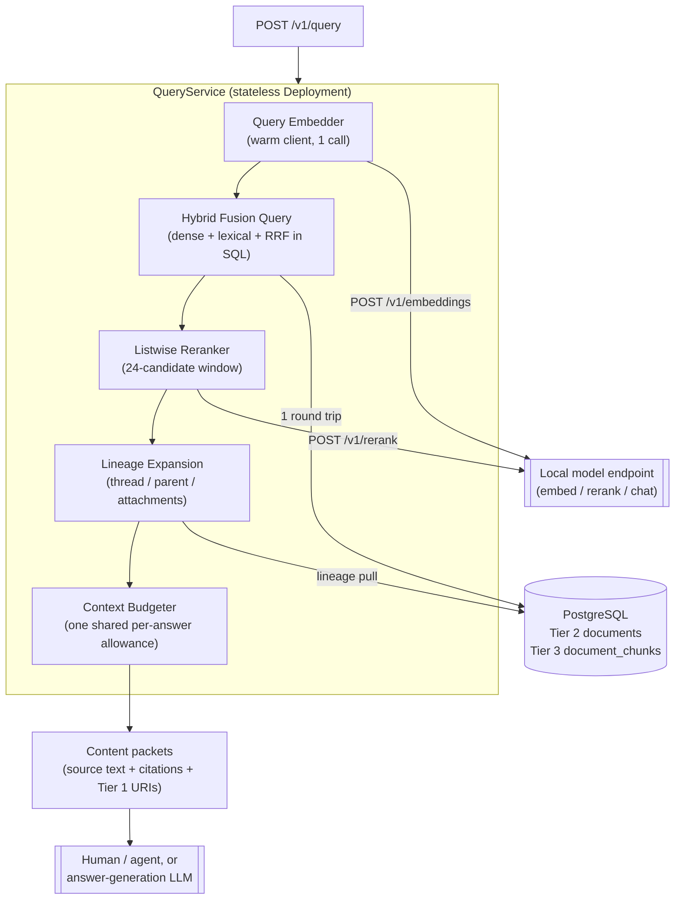

# RAG Retrieval & Answer-Generation Architecture

**Version:** `1.0.0`

**Architecture Paradigm:** Stateless Query Service, Hybrid Dense + Lexical Retrieval, In-Database Rank Fusion

**Target Runtime:** Go service over PostgreSQL + pgvector, HTTP to local model endpoints

**Status:** holistic design of record for the read path. Every retrieval
concern lives in this file. Its peers are `docs/ingestion-design.md`, which
owns the write path (§7 there states the contract between them, and this
document does not restate ingestion mechanics); `docs/workspace-isolation.md`,
which owns the per-workspace database boundary every query in this document
runs against — the workspace scoping in §3.1, §3.3, and §7.1 assumes that
isolation, it does not design it; and `docs/api-server-design.md`, which
owns whether `POST /v1/query` (§7 here) is served by a mode of the
ingestion binary or its own long-running service — an open question this
document does not resolve either.

---

## 1. Principles

1. **Source-of-truth retrieval only.** The index contains compacted email
   bodies and extracted attachment text — no summaries, abstracts, or other
   generated text (`ingestion-design.md` pillar 8, §4.3). Every retrieved
   passage is something a person actually wrote or a document actually says.
2. **Summarisation is the answer stage's job.** Compression happens once, at
   the end, by a model that can see the question and the retrieved sources.
   Retrieval's job is to put the right sources in front of it, not to
   pre-digest them.
3. **Hybrid by default.** Dense and lexical legs fail on different queries —
   dense misses exact identifiers (account numbers, case references, proper
   nouns), lexical misses paraphrase. Neither leg is optional and there is no
   "vector-only" fast path.
4. **Every answer is traceable to bytes.** A citation resolves to a
   `doc_id`, a character range, and a Tier 1 object URI. A passage that
   cannot be located in a real file is not returned.
5. **Scope is always enforced.** The workspace filter is applied on every
   query with no unfiltered path and no nullable filter type. This is a
   correctness boundary, not an optimisation.
6. **Retrieval is stateless.** The query service holds warm model clients and
   nothing else. All state is in PostgreSQL.

---

## 2. End-to-End Query Flow

```text
question
   │
   ├─► query embedding (one HTTP call)
   │
   ├─────────────┬──────────────┐
   │             │              │
 dense leg   lexical leg   (both scoped to workspace)
 HNSW cosine  GIN tsvector
   │             │
   └──────► RRF fusion (in-database, single round trip)
                 │
         listwise rerank (top 24 window, one prompt)
                 │
         top-k cut (15) + per-answer context budget
                 │
         relational expansion via Tier 2 lineage
                 │
         delimited content packets (cited, source-only)
                 │
         ┌───────┴────────┐
         │                │
   human / agent    answer-generation LLM
   reads packets    (summarises HERE, not at ingestion)
```



---

## 3. Candidate Generation

### 3.1 Two legs, both scoped

| Leg | Index | Candidates | Finds what the other misses |
| --- | --- | --- | --- |
| Dense | HNSW cosine on `halfvec` | 50 | paraphrase, cross-lingual matches, conceptual similarity |
| Lexical | GIN on `tsvector` (`simple`) | 50 | exact identifiers, account numbers, names, rare terms |

Both are filtered to the requesting workspace and to the active
`embed_model` namespace.

### 3.2 No query translation

The corpus is bilingual (`eng+rus`) and the query is never translated. A
Russian passage and an English question are expected to embed into a
comparable space directly. Translating first would add a model hop, a failure
mode, and a paraphrase that degrades match quality before search even starts.

**This makes cross-lingual capability a hard requirement on the embedding
model, not a nice-to-have.** The selected model is
`jina-embeddings-v5-text-small-mlx` (`ingestion-design.md` §4.4); its multilingual
coverage of Russian must be verified against the corpus before the index is
built, because if it is monolingual the no-translation decision silently
halves recall on half the corpus. Acceptance criterion 4 (§10) is the check.

The lexical leg matches this with the `simple` text-search configuration —
no stemming, because Postgres cannot select a stemmer per row and English
stemming applied to Russian produces wrong stems silently. This is an index
property set at ingestion (`ingestion-design.md` §4.2); changing it on the
query side alone would mismatch the index.

### 3.3 Fusion in the database

v2 fused in Python because SQLite could not. Postgres can, so fusion is one
round trip instead of transferring two candidate sets to the client:

```sql
WITH dense AS (
    SELECT chunk_id,
           ROW_NUMBER() OVER (ORDER BY embedding <=> $2::halfvec) AS rank
    FROM document_chunks
    WHERE workspace_id = $1 AND embed_model = $3
    ORDER BY embedding <=> $2::halfvec
    LIMIT $4                                    -- vec_candidates (50)
),
lexical AS (
    SELECT c.chunk_id,
           ROW_NUMBER() OVER (ORDER BY ts_rank_cd(c.fulltext_search, q) DESC) AS rank
    FROM document_chunks c, websearch_to_tsquery('simple', $5) AS q
    WHERE c.workspace_id = $1 AND c.fulltext_search @@ q
    ORDER BY ts_rank_cd(c.fulltext_search, q) DESC
    LIMIT $6                                    -- fts_candidates (50)
),
fused AS (
    SELECT chunk_id,
           COALESCE(1.0 / ($7 + d.rank + 1), 0)
         + COALESCE(1.0 / ($7 + l.rank + 1), 0) AS rrf_score   -- rrf_k = 60
    FROM dense d FULL OUTER JOIN lexical l USING (chunk_id)
)
SELECT f.chunk_id, c.doc_id, c.chunk_text,
       c.start_char_offset, c.end_char_offset, f.rrf_score
FROM fused f JOIN document_chunks c USING (chunk_id)
ORDER BY f.rrf_score DESC
LIMIT $8;                                       -- rerank_candidates (24)
```

`FULL OUTER JOIN` is required, not an inner join: a chunk found by only one
leg is exactly the case RRF exists to handle, and an inner join would discard
it.

### 3.4 The workspace-filter recall trap

This is the single most likely source of silently wrong results in the
system, and it must be closed deliberately.

An HNSW scan traverses the graph and *then* applies `WHERE workspace_id =
$1`. With several workspaces indexed, `LIMIT 50` can yield far fewer than 50
in-workspace rows — or none — while the query reports success. The dense leg
degrades to lexical-only and nothing errors, nothing logs, and result quality
drops in a way that looks like "the model isn't very good."

Mitigation, in order of preference:

1. `hnsw.iterative_scan = relaxed_order` (pgvector ≥ 0.8) with
   `hnsw.max_scan_tuples` bounded — the scan continues until the limit is
   satisfied *after* filtering.
2. Raise `hnsw.ef_search` above the default 40. Necessary but not sufficient
   alone; it widens the search without guaranteeing post-filter yield.
3. If the workspace set stays small and static, partial indexes per
   `workspace_id` remove the problem entirely, at the cost of index
   maintenance per workspace.

The query service asserts post-filter yield: if the dense leg returns
materially fewer rows than requested while unfiltered chunks exist in the
workspace, it emits a warning on the response and increments
`rag_query_dense_underfill_total`. A silent recall failure must become a
visible one.

---

## 4. Reranking

The 24-candidate fused window goes to a listwise cross-encoder in a **single
prompt** — the reranker concatenates all candidates into one sequence, which
is why the window is small. The tail beyond 24 keeps its RRF order and only
the top 15 is returned.

Candidate text is truncated to 600 characters for reranking. In v2 this
measured ~47 ms per candidate versus ~140 ms at ~1000 characters — the
latency/thoroughness dial, and the largest single component of query latency.

Reranking is on by default. When the reranker endpoint is unavailable, the
service falls back to plain RRF ordering and flags the degradation on the
response rather than failing the query: a slightly worse ranking is more
useful than no answer.

---

## 5. Expansion and Content Packets

Reranked chunks are deduplicated to documents — **one match per document**,
best-ranked chunk wins — then expanded through Tier 2 lineage. Each packet
carries:

* the matched document, its match provenance, and the matched chunk's
  character range;
* the full readable text of the matched document;
* `parent_doc_id` and direct children (an attachment's parent email, an
  email's attachments);
* the thread's chronological message list;
* extracted attachment text alongside its parent email when the match was in
  an attachment;
* the Tier 1 object URI and `raw_sha256` for citation and manual retrieval.

### 5.1 One shared context budget

Readable context is budgeted against a single **per-answer** allowance
(`thread_context_chars`, 120 000) shared across all returned packets — not
per packet, which would let a 15-packet answer blow any context window.

Fill order:

1. matched documents, always in full, drawing the budget down first;
2. direct parents and children;
3. immediate chronological neighbours;
4. remaining thread chronology.

Levels 2–4 are added only while they still fit. Omitted context keeps its
`doc_id` and Tier 1 URI so the reader can pull it manually.

### 5.2 Relationship honesty

Chronological adjacency is never presented as a reply edge. A message that
merely follows another in time is labelled as such; only `In-Reply-To`
lineage recorded at ingestion is labelled as a reply. Conflating them
manufactures a conversational structure that does not exist, which is exactly
the kind of error a reader cannot detect downstream.

---

## 6. Handoff to Generation

Retrieval ends at the content packets. They are the deliverable, and they are
complete on their own — the immediate consumer is a human or agent reading
`POST /v1/query` output.

Answer generation is **out of scope for this document** and will be specified
in `docs/generation-design.md` when it is taken up. Only the boundary is
fixed here:

* Generation is a **separate, separately-failable call**. A generation outage
  degrades the product to "here are your sources" rather than taking it down.
  Nothing in the retrieval path may depend on it.
* Generation is **where all summarisation in this system happens** — it sees
  the question and the retrieved sources together, which is precisely the
  information an ingestion-time summariser lacks
  (`ingestion-design.md` §4.3).
* Packets carry the provenance a generation pass needs to cite: `doc_id`,
  character range, and Tier 1 URI per packet (§5).

---

## 7. Service Shape

**Unbuilt, and the shape below is one candidate, not a decision.** The write
path collapsed five Deployments into one host binary because it is one-shot
(`ingestion-design.md` §11.4) — that argument does not automatically carry
over to a service answering live queries, and whether `QueryService` becomes
a mode of `pocket-advisor` or its own long-running process is still open.
What follows sketches it as a separate Deployment, `cmd/query-api/`, because
that is the shape that needs the most new design; revisit this section
first if the open decision resolves the other way.

`QueryService` is a stateless Deployment exposing `POST /v1/query`.

v2 ran a warm daemon to avoid per-invocation cold start of a CLI process. A
long-lived Kubernetes pod is warm by construction, so the daemon concept
dissolves into the service rather than being ported. What must survive from
it is the **warm client seam**: embedding and reranker clients are
constructed once at startup and injected, never per request. Rebuilding them
per query reintroduces exactly the cost the daemon existed to avoid.

Scaling is on request rate; 2 replicas minimum. The service is CPU-light —
its latency is dominated by waiting on the model endpoint and on Postgres.

None of this exists yet: no `cmd/query-api`, no HTTP handler, no query-side
Go code at all. `internal/domain`, `internal/storage/postgres`, and the
`document_chunks` schema this design queries are real and already shipped
(`ingestion-design.md` §4.2, §8.1).

### 7.1 Request and response

```
POST /v1/query
{
  "workspace_id": "...",
  "question": "...",
  "top_k": 15,                 // optional, default 15
  "rerank": true               // optional, default true
}

200 OK
{
  "packets": [ { doc_id, thread_id, match: {chunk_id, start, end, score},
                 text, lineage: {...}, citation: {raw_uri, raw_sha256} } ],
  "warnings": [ "dense_leg_underfill", "reranker_unavailable" ],
  "budget": { "chars_used": 98341, "chars_allowed": 120000 }
}
```

`warnings` is not decorative. Silent degradation is the dominant failure mode
of a retrieval system — every mechanism that can quietly reduce quality
(dense underfill §3.4, reranker fallback §4, budget truncation §5.1) reports
itself here.

---

## 8. Configuration

Carried over from v2's tuning, all free to change at any time — none of these
invalidate the index:

```yaml
query:
  fts_candidates: 50
  vec_candidates: 50
  rrf_k: 60
  default_top_k: 15
  rerank_enabled: true
  rerank_candidates: 24
  rerank_text_chars: 600
  thread_context_chars: 120000   # per ANSWER, shared across packets
```

Index-invalidating settings (embedding model, chunk size, text-search
configuration) belong to ingestion and are not restated here.

---

## 9. Observability

| Metric | Type | Description |
| --- | --- | --- |
| `rag_query_duration_seconds{stage}` | Histogram | `embed`, `fuse`, `rerank`, `expand` |
| `rag_query_candidates{leg}` | Histogram | Post-filter candidate yield per leg |
| `rag_query_dense_underfill_total` | Counter | Dense leg returned fewer rows than requested (§3.4) |
| `rag_query_reranker_fallback_total` | Counter | Queries served on RRF order after reranker failure |
| `rag_query_budget_truncated_total` | Counter | Answers where context was dropped to fit the budget |
| `rag_query_empty_results_total` | Counter | Queries returning zero packets |

Each query is one trace: `query.embed` → `query.fuse` → `query.rerank` →
`query.expand`. Because ingestion traces are rooted at discovery
(`ingestion-design.md` §5.2), a slow query attributable to a specific
document can be joined to that document's ingestion trace by `doc_id`.

Alerting targets: sustained `rag_query_dense_underfill_total` growth (recall
is silently broken), and `rag_query_duration_seconds{stage="rerank"}` p99
above budget (the reranker is the latency bottleneck by design, so it is the
first thing to regress).

---

## 10. Acceptance Criteria

1. Dense and lexical legs each independently find a chunk the other misses,
   and RRF returns both.
2. With two workspaces indexed, a query scoped to one returns the full
   requested candidate count from the dense leg and **zero** rows from the
   other — the filter-recall trap (§3.4) is demonstrably closed.
3. A query whose dense leg underfills reports `dense_leg_underfill` in
   `warnings` rather than returning quietly degraded results.
4. A Russian-language passage is retrieved by an English-language question
   with no translation step anywhere in the path.
5. An exact identifier (account number, case reference) present in exactly
   one chunk is retrieved by the lexical leg even when the dense leg ranks it
   outside the candidate window.
6. A result set carries at most one match per document.
7. Readable context across all packets respects the single per-answer
   `thread_context_chars` budget, with matched documents included in full and
   exempt from it.
8. Every returned packet resolves to a Tier 1 object URI and a character
   range within that document's extracted text.
9. No returned text is model-generated — packets contain only ingested source
   text.
10. With the reranker endpoint down, queries still succeed on RRF ordering
    and report `reranker_unavailable`.
11. Chronological neighbours are labelled distinctly from reply-lineage
    relationships.

---

## 11. Open Decisions

1. **Iterative scan versus partial indexes (§3.4).** Iterative scan is the
   default choice; partial indexes are better if the workspace set proves
   small and static. Decide once the real workspace count is known — this
   affects index DDL.
2. **Generation pass scope.** §6 specifies constraints on the
   answer-generation LLM but not the prompt, the model, or whether generation
   runs inside `QueryService` or as a separate deployment. Retrieval is
   complete and useful without it.
3. **Query-time date and sender filters.** Tier 2 holds the metadata for
   structured pre-filters (date ranges, participants); no API surface is
   specified. Add when a real query pattern demands it, not before.
