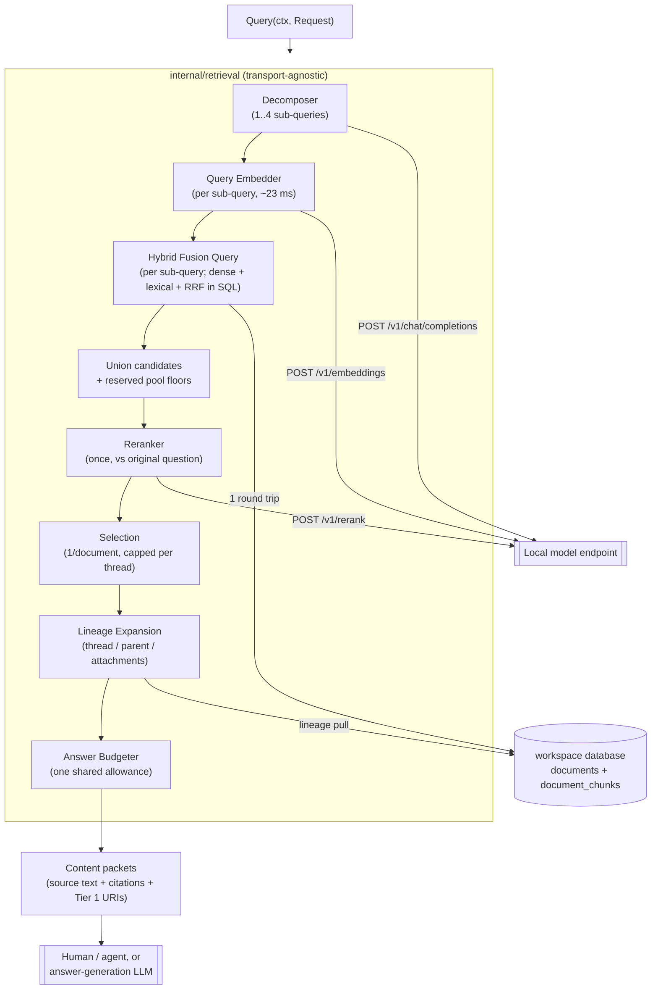

# RAG Retrieval & Answer-Generation Architecture

**Version:** `2.8.0`

**Architecture Paradigm:** Hybrid Dense + Lexical Retrieval, In-Database Rank
Fusion, transport-agnostic Go package

**Target Runtime:** Go over PostgreSQL + pgvector + pg_textsearch, HTTP to
local model endpoints

**Changes in 2.8.0:** resolves the read-service topology with
`api-server-design.md`. Retrieval is a long-running Kubernetes service per
workspace; MCP and HTTP are adapters over the same transport-agnostic query
package. The current Claude-over-MCP answer path remains, while the new
`generation-design.md` records a future separately deployable generation
neighbour. The control plane authenticates and authorises a workspace before
routing, rather than trusting a tool name or request parameter.

**Changes in 2.7.0:** the lexical leg is real BM25 (`pg_textsearch`), not
`ts_rank_cd` scoring a hand-built disjunctive `tsquery`. `ts_rank_cd` has no
IDF, no term-frequency saturation, and no document-length normalisation, which
is exactly why §3.3's `lexical_df_ceiling` existed — a document-frequency cutoff
standing in for the IDF the ranking function itself lacked. BM25 has real IDF,
so the caller no longer builds a query at all: `to_bm25query` tokenises the
raw sub-query text against the index's own `text_config`, in the same round
trip as fusion. `lexical_df_ceiling` is removed along with the code path it
configured. §3.3 is rewritten; the retired construction's measured history
stays, compressed, because the facts it established (why `websearch_to_tsquery`
is unusable, why chunk atomicity makes AND unsatisfiable) remain true
regardless of which ranking function scores the OR. Schema change: the
`fulltext_search` generated column and its GIN index are dropped — nothing
reads them once BM25 owns the lexical leg — replaced by a `bm25` index built
and dropped around each ingest run rather than maintained live, since
`pg_textsearch`'s write path is not yet tuned for continuous per-row inserts
(`ingestion-design.md`, `docker-images/postgres/Dockerfile`).

**Changes in 2.6.0:** adds a relevance floor to selection (§5.1). `top_k`
previously returned fifteen results whether or not fifteen were relevant,
which is harmless for a human skimming and actively harmful for the agent
that §6.1 makes the consumer. The threshold is calibrated rather than
guessed: off-domain questions score every candidate below zero, so zero is
the model's own boundary and the system can now return nothing and mean it.

**Changes in 2.5.0:** generation was decided as Claude over MCP, outside the
retrieval codebase, with the local LLM restricted to query preparation. The
future service topology was subsequently specified in 2.8.0.

**Changes in 2.4.0:** the reranker and the general-purpose LLM are fixed at
`jina-reranker-v3-mlx` and `Qwen3.5-4B-MLX-4bit` rather than configured — every
figure here was measured against those two, and both slots degrade silently
when filled wrongly. §4's latency figures are restored and no longer
provisional: the 2.5x regression that prompted the warning was sustained-load
throttling, not a real change, and the original numbers reproduce on an idle
machine.

**Changes in 2.3.1:** records the endpoint constraint that makes the
decomposition stage stateless (§3.6) and the multi-turn session boundary
(§12 item 7), both with measurements. No design changes.

**Changes in 2.3.0:** the lexical leg is disjunction-only. 2.2.0 specified an
AND-then-OR fallback; measurement showed the AND branch essentially never
fires, because three specific terms rarely co-occur inside one ~2000-character
atomic chunk. An LLM keyword-extraction stage was tested as the fix and
rejected — the extraction was good (0.94 s, clean output, well-chosen terms)
and AND still returned zero, while the same terms disjoined returned 91. §3.3
records the experiment so keyword quality is not offered later as the missing
piece. Removes `lexical_min_hits`, the `lexical_or_fallback` warning and its
counter.

**Changes in 2.2.0:** four changes, all measured against the live corpus.
The lexical leg was **inert** — `websearch_to_tsquery` ANDs every word and
`simple` strips no stopwords, so real questions matched nothing and every
fusion query run during this design was dense-only; §3.3 replaces it with
lexeme-derived construction, frequency-based noise filtering, and an
AND-then-OR fallback. Query decomposition is adopted (§3.6) after a
two-topic question was measured losing one topic entirely. The rerank pool
reserves floors for structurally disadvantaged candidates (§4.1), since a
chunk ranked last by both legs outscores the best dense-only match. And §4's
latency figures are marked provisional after an unattributed 2.5x regression.

**Changes in 2.1.0:** chunks are atomic — `ingestion-design.md` deviation 13
removed the per-chunk context header from both the vector and the lexical
index, so §3.5 is rewritten from "the reranker must see header + text" to the
opposite, and situating a passage becomes wholly this document's job. Adds the
one-line reply problem and the typed-edge constraint that any later
conversation-graph work has to respect (§3.5, §12 item 8).

**Changes in 2.0.0:** stabilised from a design sketch into an
implementation-ready specification, and corrected against the shipped code.
`docs/retrieval-design-guideline.md` — generic RAG advice that contradicted
this document in several places — is folded into §11 and deleted. Substantive
corrections: the workspace-filter recall trap (§3.4) was written against a
shared database that no longer exists and is re-aimed at `embed_model`; chunk
text no longer contains inline headers (§3.5); reranking reads whole passages
and the v2 latency figures are replaced with measured ones (§4); result sets
are capped per thread (§5.1); the service-shape question is resolved (§7); the
cross-lingual premise is verified rather than flagged (§3.2); and the
contradiction between §5.2 and the old acceptance criterion 7 is settled.

**Status:** design of record for the read path, and implementation-ready —
every parameter below is either measured against the live corpus or is a
stated default with its reasoning. **Nothing here is built yet.** Its peers
are `docs/ingestion-design.md`, which owns the write path and the schema this
queries; `docs/workspace-isolation.md`, which owns the per-workspace database
boundary; and `docs/api-server-design.md`, which owns how this is eventually
exposed over HTTP — §7 resolves what this document needs from that question
without pre-empting the rest of it.

---

## 1. Principles

1. **Source-of-truth retrieval only.** The index contains compacted email
   bodies and extracted document text — no summaries, abstracts, or other
   generated text (`ingestion-design.md` §4.3). Every retrieved passage is
   something a person actually wrote or a document actually says.
2. **Summarisation is the answer stage's job.** Compression happens once, at
   the end, by a model that can see the question and the retrieved sources.
   Retrieval's job is to put the right sources in front of it, not to
   pre-digest them.
3. **Hybrid by default.** Dense and lexical legs fail on different queries —
   dense misses exact identifiers, lexical misses paraphrase. Neither leg is
   optional and there is no "vector-only" fast path.
4. **Every answer is traceable to bytes.** A citation resolves to a `doc_id`,
   a character range, and a Tier 1 object URI. As of `ingestion-design.md`
   deviation 11 this is a guaranteed invariant rather than an aspiration:
   `chunk_text` is byte-identical to `normalized_text[start:end]`.
5. **Scope is enforced by Postgres, not by WHERE clauses.** Each workspace is
   its own database with its own role (`workspace-isolation.md` §2.1). A
   query cannot reach another workspace's data because the role has no grant
   on it — see §3.4.
6. **Retrieval is stateless.** Warm model clients and nothing else. All state
   is in PostgreSQL.
7. **Silent degradation is the enemy.** Every mechanism that can quietly
   reduce quality reports itself (§7.1). A retrieval system that returns
   worse results without saying so is worse than one that errors.

---

## 2. End-to-End Query Flow

```text
question
   │
   ├─► decompose into 1..4 independent queries (~1.1 s)   §3.6
   │
   ├── per sub-query, concurrently ──────────────┐
   │      │                                      │
   │   query embedding (~23 ms)                  │
   │      ├─────────────┬──────────────┐         │
   │    dense leg   lexical leg                  │
   │    HNSW cosine  BM25 (pg_textsearch)        │
   │      └──────► RRF fusion (~5 ms)            │
   └──────────────────────────────────────────── ┘
                 │
         union candidates; reserve pool floors        §4.1
                 │
         rerank ONCE against the original question    §4
         (24 candidates, whole passages, ~2 s)
                 │
         one match per document, capped per thread
                 │
         lineage expansion + shared answer budget
                 │
         content packets (cited, source-only)
                 │
         ┌───────┴────────┐
   human / agent    answer-generation LLM
```



Measured against the live `test` workspace (96 documents, 348 chunks). The
reranker dominates: decomposition adds ~1.1 s and fanning out three
sub-queries adds ~84 ms, against ~2 s for a single rerank pass — which is
the entire reason the union is reranked once rather than per sub-query. End
to end a decomposed query is roughly 3 s, of which the reranker is two
thirds.

---

## 3. Candidate Generation

### 3.1 Two legs

| Leg | Index | Candidates | Finds what the other misses |
| --- | --- | --- | --- |
| Dense | HNSW cosine on `halfvec` | 50 | paraphrase, cross-lingual matches, conceptual similarity |
| Lexical | `bm25` (`pg_textsearch`, `simple`) | 50 | exact identifiers, account numbers, names, rare terms |

Both are filtered to the active `embed_model` namespace — and **only** to it;
see §3.4 for why the workspace filter is gone.

**Neither leg is guaranteed to contribute**, and the two reasons are worth
keeping apart because only one of them is legitimate.

*Legitimately:* a cross-lingual query. Asking *"What did we agree about the
children's school holidays?"* against a Russian thread produced ten results
whose RRF scores were all exactly `1/(60+rank)` — the lexical leg matched
nothing, because English terms do not appear in Russian text. That is correct
behaviour, but it means hybrid degenerates to dense-only on such queries, and
§4.1 exists so those results are not then penalised for it.

*Illegitimately:* the query construction in version 2.0.0, under which the
lexical leg returned nothing for **any** natural-language question in either
language. That was a defect, not a property of hybrid retrieval, and it is
what §3.3 fixes. It is called out here because the symptom is identical —
a dense-only result set — and a system that cannot tell the two apart will
read a broken leg as a hard query. `rag_query_lexical_candidates` (§9) exists
to distinguish them: an occasional zero is expected, a mode at zero is a
bug.

### 3.2 No query translation

The corpus is bilingual (`eng+rus`) and the query is never translated. A
Russian passage and an English question embed into a comparable space
directly. Translating first would add a model hop, a failure mode, and a
paraphrase that degrades match quality before search even starts.

**This makes cross-lingual capability a hard requirement on the embedding
model.** Version 1.0.0 flagged this as unverified. It is now measured against
`jina-embeddings-v5-text-small-mlx` (1024 dimensions), the model the index is
actually built with:

| | cosine to an English question |
| --- | --- |
| Russian relevant passage | **0.578** |
| English relevant passage | 0.674 |
| Russian irrelevant passage | 0.038 |
| English irrelevant passage | 0.044 |

There is a modest same-language advantage (~0.10) and an overwhelming
relevant/irrelevant separation in both languages. Confirmed end-to-end on the
real corpus: an English question retrieved a Russian thread
(`Про встречу в пятницу`) as its top ten results. The
premise holds; acceptance criterion 4 (§10) keeps it honest as the model
changes.

The lexical leg matches this with the `simple` text-search configuration — no
stemming, because Postgres cannot select a stemmer per row and English
stemming applied to Russian produces wrong stems silently. This is an index
property set at ingestion (`ingestion-design.md` §4.2); changing it on the
query side alone would mismatch the index.

### 3.3 Fusion in the database

Postgres can fuse, so fusion is one round trip rather than transferring two
candidate sets to the client:

```sql
-- $4 is the sub-query's own raw text — to_bm25query tokenises it inline,
-- against the bm25 index's own text_config. No separate query-construction
-- round trip, and no dynamic SQL to build: it is a parameterised argument
-- like the dense leg's query vector, not a string assembled by the caller.
WITH dense AS (
    SELECT chunk_id,
           ROW_NUMBER() OVER (ORDER BY embedding <=> $1::halfvec) AS rank
    FROM document_chunks
    WHERE embed_model = $2
    ORDER BY embedding <=> $1::halfvec
    LIMIT $3                                    -- vec_candidates (50)
),
lexical AS (
    SELECT c.chunk_id,
           ROW_NUMBER() OVER (
               ORDER BY c.chunk_text <@> to_bm25query($4, 'chunks_bm25_idx') ASC
           ) AS rank
    FROM document_chunks c
    WHERE $4 <> '' AND c.embed_model = $2
    ORDER BY c.chunk_text <@> to_bm25query($4, 'chunks_bm25_idx') ASC
    LIMIT $5                                    -- fts_candidates (50)
),
fused AS (
    SELECT chunk_id,
           COALESCE(1.0 / ($6 + d.rank), 0)
         + COALESCE(1.0 / ($6 + l.rank), 0) AS rrf_score   -- rrf_k = 60
    FROM dense d FULL OUTER JOIN lexical l USING (chunk_id)
)
SELECT f.chunk_id, c.doc_id, d.thread_id, c.chunk_text,
       c.start_char_offset, c.end_char_offset, f.rrf_score
FROM fused f
JOIN document_chunks c USING (chunk_id)
JOIN documents d USING (doc_id)
ORDER BY f.rrf_score DESC
LIMIT $7;                                       -- rerank_candidates (24)
```

Four things are load-bearing:

* **`FULL OUTER JOIN`, not inner.** A chunk found by only one leg is exactly
  the case RRF exists to handle; an inner join would discard it.
* **`1/(k + rank)`, not `1/(k + rank + 1)`.** `ROW_NUMBER()` is already
  1-based, so the extra `+1` in version 1.0.0 was an off-by-one against the
  canonical RRF formula. It does not change ordering, but it is not RRF.
* **The lexical leg filters `embed_model` too**, which version 1.0.0 omitted.
  It is not a semantic filter for lexical matching, but without it a re-embed
  backfill (`ingestion-design.md` §4.4) surfaces the same text twice under
  two namespaces, as two different `chunk_id`s that RRF cannot recognise as
  duplicates.
* **`<@>` returns a *negated* BM25 score, so the lexical `ORDER BY` is `ASC`**
  — the opposite of `ts_rank_cd`'s `DESC`. `pg_textsearch` negates it because
  Postgres index scans only support ascending order; getting this backwards
  silently inverts relevance rather than raising an error.

#### The lexical leg is `pg_textsearch`, not a hand-built query

Version 2.3.0–2.6.0 scored the lexical leg with `ts_rank_cd` over a
disjunctive `tsquery` this codebase built by hand, term by term, because
`ts_rank_cd` has no inverse document frequency, no term-frequency saturation,
and no document-length normalisation — the three things an actual BM25 formula
provides natively. `pg_textsearch` (v1.3.1) adds a real `bm25` index type and
scores with the standard Okapi BM25 formula, so none of that hand-rolling is
needed any more:

* **No tsquery construction.** `to_bm25query(text, index_name)` tokenises the
  raw sub-query directly against the index's `text_config`. There is no
  lexeme-extraction step, no frequency-based term dropping, and nothing built
  as a SQL string — the whole `tsquerySQL` round trip this document used to
  describe here is gone.
* **`text_config = 'simple'`**, same choice as before and for the same reason
  — the corpus is bilingual (§3.2) and Postgres cannot select a stemmer per
  row.
* **The index is not part of `schemaSQL`.** `pg_textsearch`'s own guidance is
  to load data before indexing it — its write path is not yet tuned for
  continuous per-row inserts, which is exactly this application's ingestion
  pattern (a NATS worker streaming one chunk at a time, not a bulk load).
  `DropSearchIndex` runs before a full `--ingest-all` run's writes begin;
  `BuildSearchIndex` runs once, after `pipe.WaitDrained` confirms every write
  has landed (`internal/cli/ingest.go`). `--scan`/`--reconcile` leave the
  index in place, since they add a handful of documents to an
  already-queried workspace rather than streaming a whole corpus.
* **Cost is unmeasured against the live corpus** — there is exactly one query
  now instead of a fusion query plus a separate tsquery-building query, so it
  is strictly less work than before, but no figure is recorded here until it
  is actually timed against real data.

#### Why a hand-rolled query existed at all (history)

The measurements below motivated the `tsquerySQL` construction 2.7.0 retires.
They are kept because the facts remain true regardless of which ranking
function scores the result — BM25 does not change what a `tsquery` operator
does, only what replaces it.

**`websearch_to_tsquery` is unusable.** It ANDs every term, and `simple` —
mandatory for a bilingual corpus — strips no stopwords, so a real question
becomes a conjunction including its own grammar: `'What was the closing
balance?'` → `'what' & 'was' & 'the' & 'closing' & 'balance'`, and all five
must co-occur inside one ~2000-character chunk. Measured against the live
corpus, that returns **zero** for every natural-language question tried — the
lexical leg was not weak, it was inert. `plainto_tsquery` and
`phraseto_tsquery` hard-code AND too; there is no Postgres-native "match any
term" tsquery constructor.

**Conjunction dies at three terms, structurally.** `AND` with two terms
(`closing & balance`) returned 55 candidates, precise and correct. Three terms
(`agreed & children & school`) returned zero, and so did every four-term set
tried. The cause is chunk atomicity, not query quality: `chunk_text` is an
atomic ~2000-character passage (`ingestion-design.md` deviation 13), and
requiring three specific words to co-occur inside one is an unlikely event
independent of which words they are. **The more atomic the chunk, the less
satisfiable any conjunction becomes.** This is also why AND is structurally
unable to serve a multi-topic question: no chunk contains keywords from two
topics that live in different documents.

**Better keywords did not rescue AND**, tested directly rather than assumed.
An LLM keyword extraction for a real question produced five clean, well-chosen
terms; ANDed, it still returned zero — one term didn't match due to a
stemming mismatch (`holiday` vs `holidays`), and removing it left three
present-in-corpus terms that still didn't co-occur. The same five terms
disjoined returned 91 candidates, ranked sensibly — which is what disjunction
plus a real ranking function was always going to give, keyword quality being
equal.

**Frequency identifies noise; it cannot select signal.** In a domain corpus,
content words can be *more common* than stopwords — `balance` appeared in
38.5% of chunks against `what` at 8.6%, for the question `What was the closing
balance?`. This is why `tsquerySQL`'s document-frequency ceiling could only
ever be a drop filter, never a keyword selector, and why it was language-blind
by construction rather than an approximated stopword list: `the` crossed the
threshold at 58% of chunks while no Russian term ever did, because Russian was
the minority language and its function words were globally rare there. BM25's
own IDF term generalises this correctly — continuous weighting by rarity,
not a binary cutoff — which is the concrete thing 2.7.0 gains over the ceiling
it replaces.

**What `websearch_to_tsquery` gave up, and BM25 does not restore.** User-typed
search syntax — `"quoted phrases"`, `OR`, `-exclusion` — was never available
under lexeme construction and still isn't: `pg_textsearch` v1.3.1 stores term
frequencies, not positions, so it cannot evaluate phrase queries either
(v1.3.1 known limitation). That cost nothing before and costs nothing now —
there is no search box, no API, no UI, and queries are natural-language
questions, not typed syntax.

**Empty query guard.** A blank sub-query — decomposition producing an empty
line, not a real degenerate case for user input — reports `lexical_query_empty`
in `warnings` (§7.1) before the fusion query runs, rather than letting it look
like a lexical miss. This is now a plain string check rather than a detection
based on tokenisation output: BM25 has no "empty tsquery" failure mode the
way `to_tsvector` did, since it doesn't build an intermediate query object a
caller can inspect for emptiness.

### 3.4 The post-filter recall trap — now about `embed_model`

An HNSW scan traverses the graph and *then* applies the `WHERE` clause, so a
`LIMIT 50` can yield far fewer than 50 rows after filtering — or none — while
the query reports success. The dense leg degrades to lexical-only, nothing
errors, and quality drops in a way that looks like "the model isn't very
good."

**Version 1.0.0 aimed this at `workspace_id`, and that is no longer the
hazard.** Every workspace is its own database with its own role
(`workspace-isolation.md` §2.1), so `document_chunks` in any given database
holds exactly one workspace's rows — verified on the live corpus, where all
348 chunks carry the same `workspace_id`. The filter matched 100% of rows; it
could not under-fill. The old acceptance criterion "with two workspaces
indexed, a query scoped to one returns zero rows from the other" was not
merely passing, it was **not executable** — two workspaces are never in one
database.

The hazard is real for **`embed_model`**, and it is transient rather than
permanent. `ingestion-design.md` §4.4 prescribes exactly the situation that
triggers it: on a model change, "write into a new `embed_model` namespace,
backfill, then drop the old namespace — the old index stays queryable
throughout." During that backfill the table holds two namespaces, the HNSW
index spans both, and post-filtering genuinely under-fills.

Mitigation, in order:

1. **`hnsw.iterative_scan = relaxed_order`** with `hnsw.max_scan_tuples`
   bounded — the scan continues until the limit is satisfied *after*
   filtering. pgvector is 0.8.5 on this cluster, so this is available
   (it requires ≥ 0.8).
2. **Raise `hnsw.ef_search`** above the default 40. Necessary but not
   sufficient alone; it widens the search without guaranteeing post-filter
   yield.
3. Partial indexes per `embed_model` would remove the problem entirely, but
   they must be created and dropped in step with each backfill, which is
   more moving parts than iterative scan for a window that is temporary by
   design.

The service asserts post-filter yield: if the dense leg returns materially
fewer rows than requested while more chunks exist in the namespace, it
reports `dense_leg_underfill` and increments
`rag_query_dense_underfill_total`. A silent recall failure must become a
visible one.

**Workspace scoping is asserted once, not filtered per query.** Adding a
`WHERE workspace_id = $x` that is always true gives false comfort: it would
silently *hide* foreign data rather than reveal that it should not be there.
Instead, on startup the retrieval package asserts that the connected database
contains exactly one distinct `workspace_id` and that it matches the
configured one, and refuses to serve if not. That catches the failure the
filter would have masked.

**Index note for ingestion.** `chunks_workspace_idx` is
`btree(workspace_id, embed_model)` — a composite whose leading column is now
constant in every database, making it effectively an index on `embed_model`
with dead leading bytes. Narrowing it to `btree(embed_model)` belongs to
`ingestion-design.md`'s schema, not here, and is worth doing next time that
DDL changes for another reason.

### 3.5 What a chunk is, and where context comes from

Chunks are **atomic**. `chunk_text` is exactly
`normalized_text[start:end]`, that string alone is what was embedded, and the
`bm25` index (§3.3) indexes the same string and no more. Nothing about the
document or thread a chunk belongs to is encoded into it
(`ingestion-design.md` deviation 13).

That is a deliberate division of labour, and it puts a job squarely on this
document. Retrieval does three different things:

| job | question | mechanism |
| --- | --- | --- |
| **Locate** | which passage answers this? | vector / lexical similarity |
| **Situate** | what is this passage part of? | **lookup** — a foreign key |
| **Disambiguate** | which of several similar passages? | ranking signal |

Situating is not a similarity problem. `parent_doc_id`, `thread_id`,
`email_subject`, `email_date` and `source_filename` are exact, stored, and
indexed — recovering them is a join, not an approximation. Ingestion
deliberately declines to pre-solve it by stamping context into vectors, so
the read path solves it properly instead.

**Consequences for the implementation:**

1. **The reranker is shown `chunk_text` and nothing else** — the same string
   that was embedded, so it judges what actually matched. (Version 1.0.0 of
   this document, and briefly the code, prepended a context header here. Both
   are wrong now.)
2. **Context is attached after selection, not before matching.** §5.2's
   expansion is the *only* context mechanism; it walks lineage by key.
3. **Subject and filename matching is a document-level query**, against
   `documents.email_subject` / `documents.source_filename`, not a chunk-level
   one. One row per message rather than one per chunk, so a single thread
   cannot flood the candidate budget on a shared subject.

#### The one-line reply problem

This is the case atomic chunking makes hardest, and it is named here rather
than hidden. A message whose entire body is `Сегодня в 22.00` has almost no
semantic content. No query embedding will find it on its own merits, and its
meaning lives entirely in what it replied to.

Three things are true about that, and they bound what a solution must do:

* **The previous design did not solve it either.** Prefixing the thread
  subject made such a message findable *as a member of its thread* — which is
  the thread being the real retrieval unit, expressed as a per-chunk hack.
* **Similarity is the wrong tool for the relation involved.** The relation
  that matters is *response*, and a response is frequently semantically
  distant from what it answers: "Will you agree to the July dates?" → "No.";
  "Can you cover the school fees?" → "I've lost my job." The
  highest-similarity pairs in an email corpus tend to be restatements, not
  exchanges. Any approach that adds edges on cosine alone builds a topic
  graph and mislabels it a conversation.
* **The deterministic signal is available and unused.** `thread_id`,
  `parent_doc_id` and `email_date` already order a conversation exactly.

So the intended shape is: match on chunks that *do* carry content, then walk
to the thread and present the exchange in order, letting a one-liner arrive
as a positioned neighbour of the message that gives it meaning rather than as
a standalone hit. Whether that is sufficient is genuinely unknown until the
linear pipeline is running and can be measured — see §12 item 8.

**On edge types, if this is later extended.** A metadata edge asserts a fact
about the world (*B was composed as a reply to A*); a similarity edge asserts
a measurement against a chosen threshold. These must stay separately typed
and never collapsed. §5.4 already forbids presenting chronological adjacency
as a reply edge; an inferred semantic edge is *more* dangerous than a
chronological one precisely because it looks more like a real relation, and
for this corpus "she replied agreeing" and "she wrote something similar that
week" are different claims with different evidential weight.

Note also that a semantic edge does not need to be stored. Given a retrieved
chunk, its semantic neighbours are just another query against the index
already present — computed for the handful of nodes in play, not
precomputed all-pairs.

### 3.6 Query decomposition

**Runs before §3.1–§3.3**, despite appearing after them here.

A single embedding of a multi-topic question lands *between* its topics
rather than on either. Measured, and the failure is total rather than
marginal — for *"What was the closing balance and what did the solicitor say
about parenting arrangements?"*:

| | top 8 |
| --- | --- |
| compound query | **zero bank statements** — entirely parenting-side |
| sub-query "What was the closing balance?" | 8/8 bank statements |
| sub-query "What did the solicitor say about parenting arrangements?" | parenting emails and letters |

The compound query did not rank the balance topic poorly; it lost it
completely. Version 1.0.0 listed decomposition as deferred "until a real
query pattern demands it" — this is that pattern.

**Mechanism.** An LLM splits the question into independent search queries, or
returns it unchanged when it asks one thing. Measured on
`Qwen3.5-4B-MLX-4bit` — fixed, not configurable (§8) — at temperature 0 with
thinking disabled: **~1.1 s**, clean
one-query-per-line output, and a single-topic question correctly returned
verbatim (0.86 s). Because the no-op case is handled by the model, it is
called unconditionally — no "should I decompose?" classifier is needed.

**Fan out cheaply, rerank once.** The naive shape — N sub-queries through the
whole pipeline — multiplies the only expensive stage. The costs are lopsided
enough to exploit:

| stage | cost | fan out? |
| --- | --- | --- |
| embed | 23 ms | **yes**, per sub-query |
| fuse | 5 ms | **yes**, per sub-query |
| rerank | ~2 s | **no** — union the candidates, rerank **once** against the *original* question |

Three sub-queries therefore add ~84 ms of retrieval, not three rerank passes.
The reranker is given the user's actual question, not a sub-query, because
that is what the answer must be relevant to.

**Guards, each with a measured reason:**

* **Cap sub-queries at 4.** Observed over-decomposition: the drug-testing /
  cruise question produced three sub-queries where two sufficed, one being a
  superset of the others. Harmless at 28 ms each, but unbounded splitting
  would turn one good query into several vague ones.
* **Reserve rerank-pool slots per sub-query** (§4). Without it a sub-query
  whose topic is under-represented in the union can be entirely crowded out,
  which reintroduces the failure decomposition exists to fix.
* **Fall back to the original question as a single sub-query** if the model
  fails or is unavailable, and flag `decomposition_unavailable`. Same
  degradation pattern as the reranker (§4).
* **Record the sub-queries in the result.** Silently transforming someone's
  question is exactly the kind of invisible behaviour §7.1 exists to prevent,
  and for an evidence corpus the reader must be able to see what was searched.

**Use `/v1/chat/completions`, never `/v1/responses`.** The endpoint choice is
a correctness constraint, not a preference. `chat/completions` is stateless —
verified: a codeword given in one call is entirely unknown to the next, since
each request carries its own complete `messages` array. `/v1/responses`
exposes `previous_response_id`, `store` and `conversation`, which is
server-side conversation state, and it is the newer and apparently more
capable API — exactly the one a developer would reach for by default.

Statelessness here is what makes principle 6 true rather than aspirational.
The only way anything reaches the model is by being composed into the prompt,
so there is no accidental context channel to defend against, and the same
question always produces the same search.

**Two known behaviours, neither disqualifying:**

*Context leaks between clauses.* *"Compare the January and April bank
statements and tell me about the drug test"* produced
`"Find information about drug test in bank statements"` — an invented
constraint. Measured damage is mild: the drug test report slips from rank 3
to rank 4, because the semantic pull of the real terms still dominates.
Degradation, not corruption.

*Output style varies by question and cannot be controlled.* At temperature 0
decomposition is deterministic — identical across runs, which matters for
reproducibility — but the *style* is input-dependent. The balance/parenting
question yielded full sentences; the drug-testing/cruise question yielded
keyword phrases. Both are reproducible; neither is predictable.

That last point is why decomposition must not be relied on to fix the lexical
leg. Keyword-style output happens to strip stopwords and revive it — measured,
`solicitor drug testing` and `solicitor cruise` each produced dual-leg hits
where the compound question produced none — but sentence-style output does
not, and you cannot tell in advance which you will get. The lexical fix
belongs in query construction (§3.3), where it is deterministic.

---

## 4. Reranking

The 24-candidate fused window goes to a cross-encoder, which re-scores it and
returns the top `top_k` (15). The tail beyond 24 keeps its RRF order.

**Whole passages, no truncation.** Version 1.0.0 specified
`rerank_text_chars: 600`, carried over from v2's tuning. Against the actual
index that truncates **93% of candidates** (324 of 348) — chunks are
`TargetChars = 2048` with a measured median of 1956 characters, so the
reranker would judge each candidate on its first third. The setting is
deleted rather than retuned; the reranker sees exactly what was embedded
(§3.5).

**The reranker is fixed at `jina-reranker-v3-mlx`**, not configurable. It is
the model every figure here was measured against, and the slot is unusually
easy to get wrong: a non-cross-encoder placed here degrades ranking silently
rather than erroring. `Qwen3-Reranker-0.6B-4bit` is also served and behaves
comparably, but nothing is gained by making the choice a knob.

Thinking must be disabled on it server-side. That is an operational
requirement, not a config value, and it applies to every model this design
calls (§3.6).

Measured warm, on an otherwise idle machine:

| candidates | @600 chars | @1024 | @2048 (real chunk size) |
| --- | --- | --- | --- |
| 12 | 237 ms | 378 ms | 898 ms |
| 24 | ~0.6 s | 995 ms | **~2.0 s** |
| 50 | 1504 ms | 2155 ms | 4373 ms |

So the specified configuration costs ~2 s per query against ~0.6 s truncated.
That is the deliberate trade: roughly 1.4 s for the reranker seeing the whole
passage, on a single-user local tool where the alternative is silently judging
a third of each candidate.

**Measure on an idle machine.** These figures moved by **2.5x** mid-design —
24 candidates at 2048 chars read 1872 ms early, then 4707 ms after several
hours of continuous embedding, reranking and generation, then 2045 ms again
after a quiet interval. The high readings were stable across runs and were
*not* memory pressure: they reproduced with only the embedding and reranker
models resident. It was sustained-load throttling on Apple Silicon.

Two things are worth carrying forward from that. A change made shortly before
a measurement moves is not evidence it caused it — the shift was initially
attributed to a coinciding server setting, wrongly. And every latency figure
in this document was taken while the endpoint was under heavy sequential
testing, so all of them carry the same exposure; the reranker is simply where
it was large enough to notice.

Note that v2's "~47 ms per candidate at 600 characters" was roughly right
(~21 ms measured) — the figure was not wrong, it was measured against a
different chunk size than the one now in use.

**Version 1.0.0 justified the small window by claiming the reranker
"concatenates all candidates into one sequence".** That is an unverifiable
claim about a model's internals, and it is not why the window is small.
Latency scales roughly linearly with candidate count, so the real constraint
is simply per-candidate cost. The API is Cohere-shaped — `query` plus
`documents[]`, returning `index` and `relevance_score` — and the client code
is identical either way.

Reranking is on by default. When the endpoint is unavailable the service
falls back to RRF ordering and reports `reranker_unavailable` rather than
failing the query: a slightly worse ranking is more useful than no answer.

### 4.1 Reserved slots in the rerank pool

The 24-candidate pool is filled by RRF score, and RRF systematically favours
candidates that both legs found. That is usually the point — agreement is
evidence — but it is wrong whenever a leg *cannot* fire rather than having
declined to.

The arithmetic is stark:

| candidate | RRF score |
| --- | --- |
| ranked **1st by dense**, absent from lexical | 1/61 = **0.01639** |
| ranked **50th (last) by both legs** | 1/110 + 1/110 = **0.01818** |

A chunk ranked dead last by both legs outscores the single best dense-only
match. Two situations make that a systematic bias rather than a curiosity:

* **Cross-lingual queries.** An English question against Russian text cannot
  produce lexical hits at all — verified, the lexical leg contributed exactly
  zero to a Russian thread's top ten. Treating a script mismatch as absence of
  evidence penalises the entire minority-language corpus.
* **Decomposition (§3.6).** Candidates from a sub-query whose topic is
  thinly represented can be crowded out by another sub-query's dual-leg hits,
  reintroducing the topic loss decomposition exists to prevent.

So the pool reserves a floor rather than filling purely by score: a minimum
share for top dense-only candidates, and a minimum share per sub-query when
decomposition ran. Both are the same mechanism — protecting a stream that is
structurally disadvantaged rather than genuinely less relevant — and both
report `pool_floor_applied` when the floor displaced a higher-scoring
candidate, so the intervention is visible rather than silent.

---

## 5. Selection, Expansion, and Packets

### 5.1 Selection: relevance floor, one per document, capped per thread

Applied in that order, and the floor is absolute — a candidate below it is
never returned, not even to backfill a slot freed by the thread cap.

#### The relevance floor

Candidates scoring below `min_relevance_score` (**0.0**) are discarded, even
when that leaves fewer than `top_k` results — including zero.

Unlike every other threshold in this document, this one is not a tuned guess.
`jina-reranker-v3-mlx` returns scores centred on zero, and zero turns out to
be the model's own relevant/not-relevant boundary. Measured over 24
candidates per query:

| query | max score | above zero |
| --- | --- | --- |
| *"what did we agree about the children's school holidays?"* | **+0.172** | 6 / 24 |
| *"what is the recipe for sourdough bread?"* | **−0.030** | **0 / 24** |
| *"how do I configure a Kubernetes ingress controller?"* | **−0.041** | **0 / 24** |

For questions with nothing relevant in the corpus, *every* candidate lands
below zero. So the floor gives the system something it otherwise cannot do:
**return nothing, and mean it.** A query about sourdough should produce no
packets, not fifteen family-law passages ranked by which is least unlike
bread.

**Why this matters more than it first appears.** Without a floor, `top_k: 15`
returns fifteen results regardless of whether fifteen are relevant. A real
query measured on this corpus scored `0.246, 0.164, 0.083, 0.012, 0.006,
0.000, -0.007, -0.014` — three genuinely relevant, the rest noise. A human
reading packets skims past the tail harmlessly; **an agent treats everything
in its context as evidence**, and §6.1's generation stage is an agent. In the
demonstration recorded there the model cited sources scoring 0.012 and 0.006
as supporting evidence for claims about the case.

**What the floor does not fix, stated so it is not over-credited.** Both
attribution errors in §6.1 came from a source scoring **0.083** — a genuinely
relevant document, misread by a weak model. No floor calibrated on relevance
would have prevented them, because relevance was not the problem there. The
floor removes noise from the context; it does not make a model read the
remaining sources correctly. That is why §6.1 changes the model rather than
relying on this.

Returning fewer results is therefore not a degradation to hide but the
correct behaviour, and it is reported: `relevance_floor_applied` when the
floor reduced the count below what would otherwise have been returned, and
zero packets when nothing clears it.

#### One match per document

Reranked chunks are then reduced to **one per document**, best-ranked chunk
wins.

That alone is not enough, and the live corpus proves it. The fusion query for
*"What did we agree about the children's school holidays?"* returns **10 of
10 results from a single email thread** — a 23-message conversation that is
24% of the corpus. Those are 23 distinct documents, so per-document dedup
sees nothing wrong, and the answer is fifteen slices of one argument with the
bank statement and the solicitor's letter never surfacing.

#### Capped per thread

Results are additionally **capped at `max_per_thread` (3) per
`thread_id`**, with freed slots backfilled from the next-best documents in
other threads.

**`thread_id = ''` is not a thread.** It is the default for any document that
never went through email threading — 22 of the 104 documents in the live
corpus, every standalone PDF among them. Capping on it naively would treat
all of them as one conversation and return at most three. Documents with an
empty `thread_id` are each their own group and are never capped against one
another.

This interacts with ingestion and the interaction is deliberate: putting the
subject on every chunk raised same-thread chunk similarity (`ingestion-design.md`
§5.6); removing it lowered it again, to a measured 0.403 same-thread versus
0.270 cross-thread over the whole live corpus. But the cap is not merely a
counterweight to that — see below.

`rag_query_thread_capped_total` counts queries where the cap displaced at
least one result, so its effect is observable rather than assumed.

### 5.2 Expansion

Selected documents are expanded through Tier 2 lineage. Each packet carries:

* the matched document, its match provenance, and the matched chunk's
  character range;
* the matched document's subject or filename as a labelled field — read from
  `documents`, not from the chunk (§3.5);
* the readable text of the matched document;
* `parent_doc_id` and direct children — an attachment's parent email, an
  email's attachments;
* the thread's chronological message list;
* extracted attachment text alongside its parent email when the match was in
  an attachment;
* the Tier 1 object URI and `raw_sha256` for citation and manual retrieval.

Expansion is where a document's *provenance* reaches the reader. This is why
an attachment does not carry its parent email's subject in its embedding
(`ingestion-design.md` §5.6) — the covering email arrives here, through
lineage, rather than by contaminating the index.

When several selected documents share a thread, the thread chronology is
attached **once** and referenced, not repeated per packet.

### 5.3 One shared answer budget

Readable text is budgeted against a single **per-answer** allowance
(`answer_context_chars`, 120 000) shared across all packets — not per packet,
which would let a 15-packet answer blow any context window.

Fill order:

1. matched documents in full;
2. direct parents and children;
3. immediate chronological neighbours;
4. remaining thread chronology.

**Matched documents draw the budget down; they are not exempt from it.**
Version 1.0.0 said both — §5.1 had them "drawing the budget down first" while
acceptance criterion 7 called them "included in full and exempt from it".
Exempting them means there is no bound at all, which defeats the purpose: 15
documents at the corpus mean of 5305 characters is ~80 000, and a single
document in this corpus reaches 58 843. If matched documents alone exhaust
the budget, the remaining packets carry citations and offsets without full
text, and the response reports `budget_truncated`. Levels 2–4 are added only
while they still fit; omitted context keeps its `doc_id` and Tier 1 URI so a
reader can pull it manually.

On the size: 120 000 characters is ~30 000 tokens, sized to the **consumer's
context window** — the served chat models expose 262 144 — not to the corpus.
Judged against the current test corpus it looks enormous (24% of all 509 284
characters in it), but that corpus is a fixture, and sizing a budget to a
fixture would be a mistake.

### 5.4 Relationship honesty

Chronological adjacency is never presented as a reply edge. A message that
merely follows another in time is labelled as such; only `In-Reply-To`
lineage recorded at ingestion is labelled as a reply. Conflating them
manufactures a conversational structure that does not exist — exactly the
kind of error a reader cannot detect downstream.

---

## 6. Handoff to Generation

Retrieval ends at the content packets. They are the deliverable and are
complete on their own — the immediate consumer is a human or agent reading
the result.

Answer generation stays **out of the retrieval service**, and the boundary is
fixed here. `docs/generation-design.md` owns the future generation service;
today, an MCP client performs that role outside Pocket Advisor.

* Generation is a **separate, separately-failable call**. A generation outage
  degrades the product to "here are your sources" rather than taking it down.
  Nothing in the retrieval path may depend on it.
* Generation is **where all summarisation in this system happens** — it sees
  the question and the retrieved sources together, which is precisely the
  information an ingestion-time summariser lacks (`ingestion-design.md`
  §4.3).
* Packets carry the provenance a generation pass needs to cite: `doc_id`,
  character range, and Tier 1 URI per packet.

### 6.1 Who generates, and how

**Today: generation is performed by Claude, reached over MCP.** Retrieval
exposes `Query` as an MCP tool; the agent calls it, receives packets, and
writes the cited answer itself. This remains the shipped answer path. A future
Pocket Advisor generation service is separately-failable, per workspace, and
calls retrieval rather than its evidence stores directly
(`generation-design.md` §1–§3).

**One tool per workspace, named from the registry** (`internal/mcp`):
`search_<workspace_id>`, with the workspace's own description. A single
generic tool would leave the agent choosing a corpus from a parameter, and two
servers advertising the same name would leave it disambiguating on description
alone. Picking the wrong corpus is not a soft failure here — it answers a
financial question from legal correspondence, and cites confidently either
way.

**MCP is an adapter to the per-workspace retrieval service.** Stdio remains
the desktop-client transport. Streamable HTTP is the deployment transport for
the future Kubernetes retrieval service: one `/mcp` endpoint per workspace,
behind the API gateway/control plane. It returns ordinary `application/json`
responses rather than SSE because this read-only service has no
server-initiated messages. The gateway authenticates the caller and authorises
the workspace before it reaches this endpoint; a tool name, URL path, or
request parameter is not authority to select a corpus. Neither transport owns
retrieval logic.


**`infra.llm` is for query preparation only and must never be used for answer
generation.** It is already wired up, fast and local, which makes it exactly
what someone would reach for; this is written down to stop that. The split is
deliberate:

| stage | model | why |
| --- | --- | --- |
| query preparation (§3.6) | `Qwen3.5-4B-MLX-4bit`, local | mechanical, low-stakes, ~1 s, runs on every query |
| answer generation | Claude, over MCP | reasoning over evidence, where attribution must be exact |

**The evidence for that split**, measured against this corpus. Feeding five
real packets to the local 4B model produced a fluent, confident, cited answer
that was wrong in ways this corpus cannot tolerate. Source [3] reads
*"Valentina was surprised to hear that, she said that she was under
impression that Svetlana and myself are in agreement on these arrangements"*;
the model reported that as **Svetlana** confirming it — quoting text
containing "Svetlana and myself" while attributing it to Svetlana. It also
described Valentina, the nanny, as *"(the mother)"*, and missed entirely the
one source that directly answered the question, a Russian email stating
agreement to a one-month trip from mid-June to mid-July.

For a family-law corpus, misattributing who said what is not a quality
regression, it is the failure that makes output unusable. Retrieval's own
principle 4 — every answer traceable to bytes — is worth little if the stage
that reads those bytes reassigns them to the wrong person.

**Consequences of choosing MCP over an API call from inside the binary:**

* **Case data does not leave the machine as a side effect of querying.**
  Everything in this stack is local by construction, and this corpus is
  privileged correspondence, financial disclosure and children's matters. An
  in-binary generation call would make every query an automatic export to a
  third party. Over MCP the operator decides what enters a conversation, which
  is a different thing from the system deciding for them.
* **No new dependency.** No API key, no network egress path, no failure mode
  added to a pipeline that currently has none.
* **The separately-failable requirement above is satisfied structurally**
  rather than by discipline: retrieval does not know generation exists.
* **They are adapters, not second implementations** — §7's transport-agnostic
  package means the MCP surfaces sit alongside the CLI over the same `Query`.

`docs/api-server-design.md` owns the API/control-plane surface; this section
owns the constraint that retrieval ends at cited packets.

---

## 7. Shape

**Resolved: `internal/retrieval` is a transport-agnostic Go package.** Version
1.0.0 deferred this to `docs/api-server-design.md`, which deferred it back —
neither decided, and the question blocked implementation.

It does not need deciding. `api-server-design.md` §2 already sets the rule
for exactly this situation: *"write new operational logic as plain,
transport-agnostic Go functions in a reusable package — not inline in CLI
flag handling. A CLI mode calls the function directly today; an API handler
calls the identical function later."* Retrieval is new logic, so it follows
that rule.

```go
// Service holds warm clients and nothing else. Constructed once.
type Service struct {
    DB       *postgres.DB
    Embedder *embedding.Client
    Reranker *reranking.Client
    Cfg      QueryConfig
    Log      *slog.Logger
}

func (s *Service) Query(ctx context.Context, req Request) (*Result, error)
```

No HTTP types in the signature, no `net/http` import in the package. `Query`
is reached by the existing `--query` CLI mode today and by a separate
per-workspace Kubernetes retrieval deployment in the target architecture.
The deployment's bootstrap, HTTP/MCP adapters, and identity belong outside
this package (`api-server-design.md` §3–§4).

What must survive from v2's warm daemon is the **warm client seam**:
embedding and reranker clients are constructed once and injected, never per
request. Rebuilding them per query reintroduces exactly the cost the daemon
existed to avoid — and at 23 ms warm versus 4.5 s cold for the embedding
endpoint, that cost is two orders of magnitude.

None of this exists yet: no `internal/retrieval`, no reranking client, no
query-side Go code at all. `internal/domain`, `internal/storage/postgres`,
`internal/client/embedding` and the schema this queries are real and shipped.

### 7.1 Request and result

```
Request{ Question string; TopK int; Rerank *bool; Decompose *bool }

Result{
  Packets    []Packet // doc_id, thread_id, match{chunk_id, start, end, score},
                      // text, lineage{...},
                      // citation{raw_uri, raw_sha256}
  SubQueries []string // what was actually searched; 1 entry when not decomposed
  Warnings   []string
  Budget     struct{ CharsUsed, CharsAllowed int }
}

`SubQueries` is not diagnostics. The system may silently rewrite the user's
question into several different ones, and for an evidence corpus a reader has
to be able to see what was actually asked of the index before trusting what
came back.
```

`Warnings` is not decorative — it is principle 7 made concrete. Every
mechanism that can quietly reduce quality reports itself:

| warning | raised when | §ref |
| --- | --- | --- |
| `dense_leg_underfill` | dense leg returned materially fewer rows than requested | §3.4 |
| `lexical_query_empty` | the sub-query was blank before it ever reached BM25 | §3.3 |
| `decomposition_unavailable` | decomposer failed; served on the original question | §3.6 |
| `pool_floor_applied` | a reserved floor displaced a higher-scoring candidate | §4.1 |
| `reranker_unavailable` | served on RRF order after a reranker failure | §4 |
| `relevance_floor_applied` | results were dropped for scoring below the floor | §5.1 |
| `thread_capped` | the per-thread cap displaced at least one result | §5.1 |
| `budget_truncated` | context was dropped to fit the answer budget | §5.3 |

---

## 8. Configuration

The read path calls two models beyond the embedder, and neither is a
configurable choice. Version 1.0.0 required a reranker while never saying
which one or where it lived — an implementation blocker — so both are named
here, and only their location is a setting:

```yaml
infra:
  reranking:
    endpoint: http://localhost:8000/v1/rerank
    timeout: 60s
  llm:
    # Query preparation only. Never answer generation — see §6.1.
    endpoint: http://localhost:8000/v1/chat/completions
    timeout: 30s
```

```go
// Fixed, not configurable. Both were selected by measurement (§4, §3.6), and
// both slots fail silently rather than loudly when filled wrongly.
const (
    RerankModel = "jina-reranker-v3-mlx"
    LLMModel    = "Qwen3.5-4B-MLX-4bit"
)
```

**Why fixed rather than a knob.** The project's standing rule is that a
setting exists when a real case forces it, and nothing forces these. Every
latency and quality figure in this document was measured against these two
models specifically, so a swapped model invalidates the numbers the design is
built on. Both slots also degrade quietly when filled wrongly: a
non-cross-encoder in the rerank slot reorders badly rather than erroring, and
a reasoning model in the LLM slot returns chain-of-thought where queries were
expected. The embedding model stays configurable by contrast, because it has
a real forcing case — `schema_metadata` records it and the vector dimension
must match (`ingestion-design.md` §4.4).

`infra.llm` is named for what it is rather than for its first use. Query
decomposition is currently the only thing that calls it; naming it
`decomposition` would misdescribe a general-purpose chat model and invite a
second block the first time anything else needs one.

**Thinking must be disabled on both, server-side.** It is an operational
requirement rather than a config value, and it is not a preference: with
thinking enabled the decomposition call took 5.2 s and returned a
chain-of-thought preamble instead of queries, against ~1 s and clean output
with it off.

Query-side tuning, none of which invalidates the index:

```yaml
query:
  vec_candidates: 50
  fts_candidates: 50
  rrf_k: 60
  default_top_k: 15
  rerank_enabled: true
  rerank_candidates: 24            # ~2 s at real chunk sizes (§4)
  min_relevance_score: 0.0         # reranker's own boundary, not a guess (§5.1)
  max_per_thread: 3                # §5.1
  answer_context_chars: 120000     # per ANSWER, shared across packets (§5.3)

  # Query decomposition (§3.6)
  decompose_enabled: true
  max_sub_queries: 4

  # Reserved rerank-pool slots (§4.1)
  pool_floor_dense_only: 6         # of rerank_candidates
  pool_floor_per_sub_query: 4
```

`min_relevance_score` is the exception to what follows: it is calibrated
against the model rather than chosen (§5.1). The two pool floors are the
least-grounded numbers here. They work on 348 chunks against the queries in
this document; neither has been swept. Each has an acceptance criterion (§10)
rather than a claim to being tuned.

`k1` (1.2) and `b` (0.75) are `pg_textsearch`'s own BM25 defaults, set on the
index (`WITH (text_config='simple')`, §3.3), not this table — they are
index-invalidating in the same way chunk size and embedding model are, so
they belong to ingestion's schema, not to per-query tuning.

`rerank_text_chars` is deliberately absent — see §4.

Index-invalidating settings (embedding model, chunk size, text-search
configuration) belong to ingestion and are not restated here.

---

## 9. Observability

| Metric | Type | Description |
| --- | --- | --- |
| `rag_query_duration_seconds{stage}` | Histogram | `embed`, `fuse`, `rerank`, `expand` |
| `rag_query_candidates{leg}` | Histogram | Post-filter candidate yield per leg |
| `rag_query_dense_underfill_total` | Counter | Dense leg returned fewer rows than requested (§3.4) |
| `rag_query_reranker_fallback_total` | Counter | Queries served on RRF order after reranker failure |
| `rag_query_thread_capped_total` | Counter | Queries where the per-thread cap displaced a result (§5.1) |
| `rag_query_floored_candidates` | Histogram | Candidates dropped below the relevance floor; a mode at 0 means the floor is inert (§5.1) |
| `rag_query_lexical_candidates` | Histogram | Lexical yield — a mode at zero means the leg is inert (§3.3) |
| `rag_query_sub_queries` | Histogram | Sub-queries per question; a mode at 1 means decomposition rarely fires (§3.6) |
| `rag_query_pool_floor_total` | Counter | Queries where a reserved floor displaced a candidate (§4.1) |
| `rag_query_budget_truncated_total` | Counter | Answers where context was dropped to fit the budget |
| `rag_query_empty_results_total` | Counter | Queries returning zero packets |

Each query is one trace: `query.decompose` → `query.embed` → `query.fuse` →
`query.rerank` → `query.expand`. Because ingestion traces are rooted at discovery
(`ingestion-design.md` §5.2), a slow query attributable to a specific
document can be joined to that document's ingestion trace by `doc_id`.

Alerting targets: sustained `rag_query_dense_underfill_total` growth outside
a known backfill window (recall is silently broken), and
`rag_query_duration_seconds{stage="rerank"}` p99 above budget — the reranker
is ~99% of query latency by design, so it is the first thing to regress.

---

## 10. Acceptance Criteria

1. Dense and lexical legs each independently find a chunk the other misses,
   and RRF returns both.
2. A query whose dense leg under-fills reports `dense_leg_underfill` rather
   than returning quietly degraded results. Exercised by indexing two
   `embed_model` namespaces in one database — the backfill state of
   `ingestion-design.md` §4.4 — not by two workspaces, which cannot coexist
   in one database.
3. Startup refuses to serve if the connected database contains rows for any
   `workspace_id` other than the configured one (§3.4).
4. A Russian-language passage is retrieved by an English-language question
   with no translation step anywhere in the path.
5. An exact identifier present in exactly one chunk is retrieved by the
   lexical leg even when the dense leg ranks it outside the candidate window.
6. A result set carries at most one match per document, and at most
   `max_per_thread` per non-empty `thread_id`. Documents with an empty
   `thread_id` are not capped against one another.
7. Readable text across all packets respects the single `answer_context_chars`
   budget. Matched documents draw it down rather than being exempt, and an
   answer whose matched documents alone exhaust it reports `budget_truncated`.
8. Every returned packet resolves to a Tier 1 object URI, and its
   `chunk_text` is byte-identical to `normalized_text[start:end]` of its
   document.
9. The reranker is given `chunk_text` alone, matching what was embedded
   (§3.5). No document-level metadata reaches the matching or ranking path;
   it is attached to packets after selection, as labelled fields.
10. No returned text is model-generated — packets contain only ingested
    source text.
11. With the reranker endpoint down, queries still succeed on RRF ordering
    and report `reranker_unavailable`.
12. Chronological neighbours are labelled distinctly from reply-lineage
    relationships.
13. A blank sub-query reports `lexical_query_empty` rather than silently
    returning dense-only results. A stopword-only or punctuation-only
    *natural-language* input is no longer this case — BM25 has no "empty
    tsquery" failure mode, it just scores such a query weakly — so this now
    exercises the one real degenerate input, an empty string, rather than the
    tsquery-construction edge cases §3.3 used to document.
14. **A natural-language question produces a non-empty lexical leg.** This is
    the criterion whose absence let §3.3's pre-2.7.0 construction ship an
    inert leg while the design claimed hybrid retrieval. Kept as a standing
    regression guard, not just history: it must be exercised with a full
    question — "What was the closing balance?" — not a keyword phrase, and in
    both languages.
15. A three-or-more-term question still yields lexical candidates. Under the
    retired `tsquery` construction this was the criterion that would have
    caught AND's conjunction failure (§3.3 history); BM25 has no AND/OR choice
    to fail, but the criterion is kept as a general regression guard for the
    lexical leg on longer questions.
16. A multi-topic question retrieves both topics. Concretely: a question
    combining a bank-statement topic and a correspondence topic returns at
    least one document of each, which the undecomposed form does not (§3.6).
17. A single-topic question is not decomposed — the decomposer returns it
    unchanged and `rag_query_sub_queries` records 1 (§3.6).
18. With the decomposer unavailable, queries still succeed on the original
    question and report `decomposition_unavailable` (§3.6).
19. A cross-lingual query, whose lexical leg cannot fire, still places its
    top dense-only candidates in the rerank pool rather than having them
    displaced by lower-ranked dual-leg candidates (§4.1).
20. **A question with no relevant answer in the corpus returns zero packets**,
    not a ranked list of the least-irrelevant ones. Exercised with an
    off-domain question — a cooking recipe, a systems-administration
    question — against which every candidate scores below the floor (§5.1).
21. A query whose results are reduced by the floor reports
    `relevance_floor_applied`, and returning fewer than `top_k` for that
    reason is not treated as an error (§5.1).

---

## 11. Alternatives Considered and Rejected

`docs/retrieval-design-guideline.md` was a scratch brief of general RAG
technique, kept while this design was forming. It is superseded and deleted;
what it raised is recorded here with a decision, so these are not
re-litigated from scratch.

| Technique | Decision |
| --- | --- |
| **Vector-only baseline first, hybrid later** | **Rejected.** The guideline recommended starting with vector search and adding hybrid third. Principle 3 rules this out: the corpus turns on exact identifiers — account numbers, case references like `265642`, BSBs — which dense retrieval is structurally bad at. A vector-only phase would be a phase with known-broken recall on the queries that matter most. |
| **Cross-encoder reranking** | **Adopted** (§4), and it is the single largest quality lever, as the guideline argued. |
| **HyDE** (hypothetical document embeddings) | **Deferred.** Bridges short questions to long documents by generating a hypothetical answer first. Costs an LLM call before search and injects generated text into the matching path, which sits awkwardly with principle 1. Revisit if short queries prove to be a measured bottleneck. |
| **Query rewriting / expansion** | **Deferred**, with two constraints fixed now. Expansion must stay in English — translating into Russian is prohibited regardless of technique (§3.2). And rewriting must not be used to fix the lexical leg: decomposition already produces keyword-style output *sometimes*, which revives it by accident, and building on an accident that varies per question is worse than the deterministic fix in §3.3. |
| **Query decomposition** | **Adopted** (§3.6). Deferred in 2.0.0 pending "a real query pattern"; a measured total loss of one topic in a two-topic question is that pattern. |
| **Router / adaptive pattern** | **Rejected for now.** Skipping retrieval for greetings assumes a chat surface that does not exist; there is no interactive front end, and the cost saved is one 23 ms embedding call. |
| **Agentic / iterative retrieval** | **Rejected for now.** Higher latency and LLM cost, on a read path whose single-pass form was still unbuilt when this was decided. Reconsider only after the linear pipeline is measured and found wanting. |
| **Parent–child / auto-merging** | **Partly adopted, differently.** The guideline's small-chunks-for-precision, large-context-for-generation idea is served by §5.2's lineage expansion, which uses real document structure — thread, parent, attachments — rather than an artificial chunk hierarchy. |
| **Prompt compression** | **Rejected.** Directly contradicts principle 2 and `ingestion-design.md` §4.3: compression happens once, at the answer stage, by a model that can see the question. |

---

## 12. Open Decisions

1. **Iterative scan tuning (§3.4).** `hnsw.iterative_scan = relaxed_order` is
   the chosen mechanism, but `hnsw.max_scan_tuples` and `hnsw.ef_search`
   values are unmeasured — there has never been a two-namespace backfill on
   this cluster to measure against. Set them when the first model change
   happens, not before.
2. **Generation configuration.** The boundary and per-workspace service shape
   are decided in §6 and `generation-design.md`; the answer model, prompt,
   citation-validation depth, persistence, and streaming policy remain open.
   Retrieval is complete and useful without it.
3. **Query-time date and sender filters.** Now *implementable* — `email_date`
   is an indexed `TIMESTAMPTZ` and `email_from`/`email_to` are columns as of
   `ingestion-design.md` deviation 11, where previously the data existed only
   inside body text. Still unspecified as an API surface, and still waiting
   on a real query pattern rather than speculation.
4. **Whether `max_per_thread` should scale with `top_k`.** Fixed at 3 against
   a `top_k` of 15. A much smaller `top_k` would make the cap nearly
   inactive; a much larger one would make it aggressive. Left fixed until
   there is usage to tune against.

   Measured after atomic chunking shipped: the cap is **not** mostly a
   counterweight to context prefixing, which an earlier draft of this section
   claimed. Removing the prefix dropped same-thread chunk similarity from
   0.514 to a measured 0.403 (against 0.270 cross-thread, over 586 same-thread
   pairs on the live corpus) — but the query that returned 10 of 10 results
   from one thread still returns **9 of 10**. The concentration is
   overwhelmingly genuine topical clustering: those 23 messages really are
   about the same subject. The cap is load-bearing on its own merits.

5. **Threshold values in §8 are unswept.** `pool_floor_dense_only` (6) and
   `pool_floor_per_sub_query` (4) were each chosen to satisfy a measured case,
   not by sweeping. They are cheap to change and index-invariant, and each has
   an acceptance criterion; tune once there is a query log rather than a
   handful of examples. `lexical_df_ceiling`, formerly listed here, is gone
   along with the code path it configured (§3.3, 2.7.0); `pg_textsearch`'s
   `k1`/`b` are index-level and left at the extension's own defaults,
   unswept for the same reason as everything else in this list.

6. **Resolved by 2.7.0: whether chunk size and the lexical leg should be tuned
   together.** This asked whether larger chunks would make `AND` viable and
   blunt the dense leg, since §3.3 found conjunction unusable at three terms
   inside a ~2000-character chunk. The question dissolved rather than being
   answered: BM25 has no `AND`/`OR` choice to be sensitive to chunk size in
   the first place, so this tension no longer exists for the lexical leg to
   be tuned against.

7. **Multi-turn sessions are entirely out of scope, deliberately.** `Request`
   carries a question, not a conversation, and there is no chat surface, API
   or UI to have a session with. Recording the decision because the failure
   mode is someone appending history to the decomposition prompt casually.

   Measured against `Qwen3.5-4B-MLX-4bit` with two turns of history:

   * *Contamination is milder than expected.* A topic pivot — bank statements
     in history, "what about the children's school holidays?" as the question
     — produced no bank-statement leakage.
   * *But references go unresolved unless explicitly asked for.* "When was
     that agreed?" passed through untouched and would embed to nothing.
   * *And asking for resolution causes inflation.* A self-contained question
     was expanded from one sub-query into three; a pivot produced the same
     sub-query twice.

   That last one is the real hazard, and it is not contamination. Duplicate
   and near-duplicate sub-queries collide with the reserved pool floors
   (§4.1): three near-identical sub-queries would claim twelve of
   twenty-four slots for one topic, so the floors amplify redundancy instead
   of protecting diversity — the exact inverse of their purpose.

   If a session surface is ever built, the shape that preserves everything
   else in this document is: **contextualisation and decomposition are one
   call**, since both transform an utterance into the queries actually run,
   and **that stage's output is a self-contained question**. Everything
   downstream then still receives a complete question and stays stateless.
   With bounded history (2-3 turns, questions only, never retrieved content),
   sub-query deduplication before fan-out, floors applied per *distinct*
   sub-query, and the rewritten question recorded alongside the original.

   The constraint that makes this safe already holds: `/v1/chat/completions`
   keeps no state, so history can only reach the model by being composed into
   a prompt deliberately (§3.6).

   Reproducibility is the reason to be careful rather than the reason to
   avoid it. Today the same question always searches for the same thing; with
   history it would not, and for an evidence corpus "why did this return
   different documents last time" must be answerable. Recording the rewritten
   question makes the session an auditable *input* to a reproducible query
   rather than an invisible modifier of one.

8. **Whether thread-walk expansion is sufficient for one-line replies
   (§3.5).** The intended answer is that a contentless message arrives as a
   positioned neighbour in its thread rather than as a standalone hit.
   Unknown until the linear pipeline runs and can be measured. If it is not
   sufficient, the candidates are thread-level aggregation (score a thread by
   its best chunks, return the thread as the unit) or a typed edge model —
   **not** reintroducing context into the index, which was tried and removed.
   Any edge work must keep deterministic and inferred edges separately typed
   and must not present an inferred edge in reply-to language.
