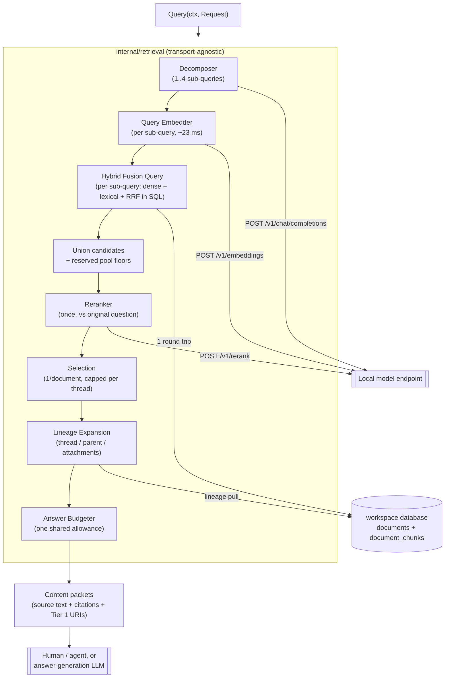

# RAG Retrieval & Answer-Generation Architecture

**Version:** `2.3.0`

**Architecture Paradigm:** Hybrid Dense + Lexical Retrieval, In-Database Rank
Fusion, transport-agnostic Go package

**Target Runtime:** Go over PostgreSQL + pgvector, HTTP to local model endpoints

**Changes in 2.3.0:** the lexical leg is disjunction-only. 2.2.0 specified an
AND-then-OR fallback; measurement showed the AND branch essentially never
fires, because three specific terms rarely co-occur inside one ~2000-character
atomic chunk. An LLM keyword-extraction stage was tested as the fix and
rejected — the extraction was good (0.94 s, clean output, well-chosen terms)
and AND still returned zero, while the same terms disjoined returned 91. §3.3
records the experiment so keyword quality is not offered later as the missing
piece. Removes `lexical_min_hits`, the `lexical_or_fallback` warning and its
counter.

**Changes in 2.2.0:** four changes, all measured against the live corpus.
The lexical leg was **inert** — `websearch_to_tsquery` ANDs every word and
`simple` strips no stopwords, so real questions matched nothing and every
fusion query run during this design was dense-only; §3.3 replaces it with
lexeme-derived construction, frequency-based noise filtering, and an
AND-then-OR fallback. Query decomposition is adopted (§3.6) after a
two-topic question was measured losing one topic entirely. The rerank pool
reserves floors for structurally disadvantaged candidates (§4.1), since a
chunk ranked last by both legs outscores the best dense-only match. And §4's
latency figures are marked provisional after an unattributed 2.5x regression.

**Changes in 2.1.0:** chunks are atomic — `ingestion-design.md` deviation 13
removed the per-chunk context header from both the vector and the lexical
index, so §3.5 is rewritten from "the reranker must see header + text" to the
opposite, and situating a passage becomes wholly this document's job. Adds the
one-line reply problem and the typed-edge constraint that any later
conversation-graph work has to respect (§3.5, §12 item 5).

**Changes in 2.0.0:** stabilised from a design sketch into an
implementation-ready specification, and corrected against the shipped code.
`docs/retrieval-design-guideline.md` — generic RAG advice that contradicted
this document in several places — is folded into §11 and deleted. Substantive
corrections: the workspace-filter recall trap (§3.4) was written against a
shared database that no longer exists and is re-aimed at `embed_model`; chunk
text no longer contains inline headers (§3.5); reranking reads whole passages
and the v2 latency figures are replaced with measured ones (§4); result sets
are capped per thread (§5.1); the service-shape question is resolved (§7); the
cross-lingual premise is verified rather than flagged (§3.2); and the
contradiction between §5.2 and the old acceptance criterion 7 is settled.

**Status:** design of record for the read path, and implementation-ready —
every parameter below is either measured against the live corpus or is a
stated default with its reasoning. **Nothing here is built yet.** Its peers
are `docs/ingestion-design.md`, which owns the write path and the schema this
queries; `docs/workspace-isolation.md`, which owns the per-workspace database
boundary; and `docs/api-server-design.md`, which owns how this is eventually
exposed over HTTP — §7 resolves what this document needs from that question
without pre-empting the rest of it.

---

## 1. Principles

1. **Source-of-truth retrieval only.** The index contains compacted email
   bodies and extracted document text — no summaries, abstracts, or other
   generated text (`ingestion-design.md` §4.3). Every retrieved passage is
   something a person actually wrote or a document actually says.
2. **Summarisation is the answer stage's job.** Compression happens once, at
   the end, by a model that can see the question and the retrieved sources.
   Retrieval's job is to put the right sources in front of it, not to
   pre-digest them.
3. **Hybrid by default.** Dense and lexical legs fail on different queries —
   dense misses exact identifiers, lexical misses paraphrase. Neither leg is
   optional and there is no "vector-only" fast path.
4. **Every answer is traceable to bytes.** A citation resolves to a `doc_id`,
   a character range, and a Tier 1 object URI. As of `ingestion-design.md`
   deviation 11 this is a guaranteed invariant rather than an aspiration:
   `chunk_text` is byte-identical to `normalized_text[start:end]`.
5. **Scope is enforced by Postgres, not by WHERE clauses.** Each workspace is
   its own database with its own role (`workspace-isolation.md` §2.1). A
   query cannot reach another workspace's data because the role has no grant
   on it — see §3.4.
6. **Retrieval is stateless.** Warm model clients and nothing else. All state
   is in PostgreSQL.
7. **Silent degradation is the enemy.** Every mechanism that can quietly
   reduce quality reports itself (§7.1). A retrieval system that returns
   worse results without saying so is worse than one that errors.

---

## 2. End-to-End Query Flow

```text
question
   │
   ├─► decompose into 1..4 independent queries (~1.1 s)   §3.6
   │
   ├── per sub-query, concurrently ──────────────┐
   │      │                                      │
   │   query embedding (~23 ms)                  │
   │      ├─────────────┬──────────────┐         │
   │    dense leg   lexical leg                  │
   │    HNSW cosine  GIN tsvector                │
   │      └──────► RRF fusion (~5 ms)            │
   └──────────────────────────────────────────── ┘
                 │
         union candidates; reserve pool floors        §4.1
                 │
         rerank ONCE against the original question    §4
         (24 candidates, whole passages)
                 │
         one match per document, capped per thread
                 │
         lineage expansion + shared answer budget
                 │
         content packets (cited, source-only)
                 │
         ┌───────┴────────┐
   human / agent    answer-generation LLM
```



Measured against the live `test` workspace (96 documents, 348 chunks). The
reranker dominates: decomposition adds ~1.1 s and fanning out three
sub-queries adds ~84 ms, against seconds for a single rerank pass — which is
the entire reason the union is reranked once rather than per sub-query.

---

## 3. Candidate Generation

### 3.1 Two legs

| Leg | Index | Candidates | Finds what the other misses |
| --- | --- | --- | --- |
| Dense | HNSW cosine on `halfvec` | 50 | paraphrase, cross-lingual matches, conceptual similarity |
| Lexical | GIN on `tsvector` (`simple`) | 50 | exact identifiers, account numbers, names, rare terms |

Both are filtered to the active `embed_model` namespace — and **only** to it;
see §3.4 for why the workspace filter is gone.

**Neither leg is guaranteed to contribute**, and the two reasons are worth
keeping apart because only one of them is legitimate.

*Legitimately:* a cross-lingual query. Asking *"What did we agree about the
children's school holidays?"* against a Russian thread produced ten results
whose RRF scores were all exactly `1/(60+rank)` — the lexical leg matched
nothing, because English terms do not appear in Russian text. That is correct
behaviour, but it means hybrid degenerates to dense-only on such queries, and
§4.1 exists so those results are not then penalised for it.

*Illegitimately:* the query construction in version 2.0.0, under which the
lexical leg returned nothing for **any** natural-language question in either
language. That was a defect, not a property of hybrid retrieval, and it is
what §3.3 fixes. It is called out here because the symptom is identical —
a dense-only result set — and a system that cannot tell the two apart will
read a broken leg as a hard query. `rag_query_lexical_candidates` (§9) exists
to distinguish them: an occasional zero is expected, a mode at zero is a
bug.

### 3.2 No query translation

The corpus is bilingual (`eng+rus`) and the query is never translated. A
Russian passage and an English question embed into a comparable space
directly. Translating first would add a model hop, a failure mode, and a
paraphrase that degrades match quality before search even starts.

**This makes cross-lingual capability a hard requirement on the embedding
model.** Version 1.0.0 flagged this as unverified. It is now measured against
`jina-embeddings-v5-text-small-mlx` (1024 dimensions), the model the index is
actually built with:

| | cosine to an English question |
| --- | --- |
| Russian relevant passage | **0.578** |
| English relevant passage | 0.674 |
| Russian irrelevant passage | 0.038 |
| English irrelevant passage | 0.044 |

There is a modest same-language advantage (~0.10) and an overwhelming
relevant/irrelevant separation in both languages. Confirmed end-to-end on the
real corpus: an English question retrieved a Russian thread
(`Про встречу в пятницу`) as its top ten results. The
premise holds; acceptance criterion 4 (§10) keeps it honest as the model
changes.

The lexical leg matches this with the `simple` text-search configuration — no
stemming, because Postgres cannot select a stemmer per row and English
stemming applied to Russian produces wrong stems silently. This is an index
property set at ingestion (`ingestion-design.md` §4.2); changing it on the
query side alone would mismatch the index.

### 3.3 Fusion in the database

Postgres can fuse, so fusion is one round trip rather than transferring two
candidate sets to the client:

```sql
-- $4 is a prepared tsquery, built by the caller (see below) — not raw text
-- handed to websearch_to_tsquery.
WITH dense AS (
    SELECT chunk_id,
           ROW_NUMBER() OVER (ORDER BY embedding <=> $1::halfvec) AS rank
    FROM document_chunks
    WHERE embed_model = $2
    ORDER BY embedding <=> $1::halfvec
    LIMIT $3                                    -- vec_candidates (50)
),
lexical AS (
    SELECT c.chunk_id,
           ROW_NUMBER() OVER (ORDER BY ts_rank_cd(c.fulltext_search, $4::tsquery) DESC) AS rank
    FROM document_chunks c
    WHERE c.embed_model = $2 AND c.fulltext_search @@ $4::tsquery
    ORDER BY ts_rank_cd(c.fulltext_search, $4::tsquery) DESC
    LIMIT $5                                    -- fts_candidates (50)
),
fused AS (
    SELECT chunk_id,
           COALESCE(1.0 / ($6 + d.rank), 0)
         + COALESCE(1.0 / ($6 + l.rank), 0) AS rrf_score   -- rrf_k = 60
    FROM dense d FULL OUTER JOIN lexical l USING (chunk_id)
)
SELECT f.chunk_id, c.doc_id, d.thread_id, c.chunk_text,
       c.start_char_offset, c.end_char_offset, f.rrf_score
FROM fused f
JOIN document_chunks c USING (chunk_id)
JOIN documents d USING (doc_id)
ORDER BY f.rrf_score DESC
LIMIT $7;                                       -- rerank_candidates (24)
```

Three things are load-bearing:

* **`FULL OUTER JOIN`, not inner.** A chunk found by only one leg is exactly
  the case RRF exists to handle; an inner join would discard it.
* **`1/(k + rank)`, not `1/(k + rank + 1)`.** `ROW_NUMBER()` is already
  1-based, so the extra `+1` in version 1.0.0 was an off-by-one against the
  canonical RRF formula. It does not change ordering, but it is not RRF.
* **The lexical leg filters `embed_model` too**, which version 1.0.0 omitted.
  It is not a semantic filter for lexical matching, but without it a re-embed
  backfill (`ingestion-design.md` §4.4) surfaces the same text twice under
  two namespaces, as two different `chunk_id`s that RRF cannot recognise as
  duplicates.

#### Building the lexical query

**Do not use `websearch_to_tsquery`.** Version 1.0.0 specified it and it is
the obvious choice, which is why this says otherwise explicitly.

It ANDs every term of the input, and `simple` — mandatory for a bilingual
corpus, §3.2 — strips no stopwords. So a real question becomes a conjunction
including its own grammar:

```
'What was the closing balance?'  →  'what' & 'was' & 'the' & 'closing' & 'balance'
```

All five must co-occur inside one ~2000-character chunk. Measured against the
live corpus, **that returns zero**, and so does every natural-language
question tried. The lexical leg is not merely weak under this construction,
it is inert — every fusion query run during this design was dense-only, which
makes principle 3 false in practice rather than in principle.

Nor is this fixable by choosing a different builder: `plainto_tsquery` and
`phraseto_tsquery` also hard-code AND, and Postgres ships no "match any term"
constructor. Any correct behaviour here requires building the tsquery
directly.

**Construction.** Derive lexemes with `to_tsvector`, drop the ones that would
flood, and join what remains:

```sql
WITH lex AS (
  SELECT lexeme,
         (SELECT count(*) FROM document_chunks c
          WHERE c.fulltext_search @@ (quote_literal(lexeme))::tsquery) df
  FROM unnest(to_tsvector('simple', $1))
)
SELECT string_agg(quote_literal(lexeme), ' | ')::tsquery
FROM lex WHERE df < (SELECT count(*) * 0.5 FROM document_chunks);
```

**Drop by document frequency, not by a stopword list.** The threshold is not
approximating "stopword" — it directly measures *would this term flood the
result set*, which is the actual concern, and it is therefore language-blind.
That matters here because a stopword list would need an English one, a
Russian one, and maintenance forever, and would still miss corpus-specific
noise like a case reference appearing in every solicitor email.

Measured on the live corpus, `the` occupies 58% of chunks and is dropped;
no Russian term crosses the threshold at all, because Russian is the minority
language and its function words are globally rare. That looks like
under-filtering and is not: a term too rare to flood needs no filtering. The
threshold self-corrects with corpus composition.

**Do not use frequency to *select* keywords.** The inverse operation fails,
and the failure is counter-intuitive enough to be worth recording. Frequencies
for `What was the closing balance?`:

| term | % of chunks | |
| --- | --- | --- |
| `the` | 58.0% | stopword |
| **`balance`** | **38.5%** | **content** |
| **`closing`** | **16.1%** | **content** |
| `what` | 8.6% | stopword |
| `was` | 8.3% | stopword |

The content words are *more common* than the stopwords, because in a domain
corpus every bank statement says "balance" and almost nothing says "what".
Any threshold aggressive enough to remove `what` would remove `balance` and
`closing` first. Frequency identifies noise at the extreme top; it cannot
separate signal from grammar in general.

**Disjunction, always.** The terms are joined with `|`, never `&`. This was
not the first answer — an AND-then-OR fallback was specified and removed once
measured — and the reasoning matters, because conjunction is the intuitive
choice and looks strictly more precise.

| form | behaviour |
| --- | --- |
| AND, 2 terms (`closing & balance`) | 55 candidates — precise and correct |
| AND, 3 terms (`agreed & children & school`) | **0** |
| AND, 4 terms | **0** — every four-term set tried |
| OR, unfiltered | 280 of 348 candidates, top-ranked by `the` density — **confidently wrong** |
| **OR, frequency-filtered** | 179 candidates, bank statements ranked top — correct |

AND survives two terms and dies at three. The cause is the chunking decision,
not the query: `chunk_text` is an atomic passage of ~2000 characters
(`ingestion-design.md` deviation 13), and requiring three specific words to
co-occur inside one such passage is simply an unlikely event. **The more
atomic the chunk, the less satisfiable any conjunction becomes** — the two
decisions are in direct tension, and chunk atomicity wins because it is load
bearing for the dense leg.

It is also *structurally* incapable of serving a multi-topic question: no
chunk contains keywords from two topics that live in different documents.

**Better keywords do not rescue it**, and this was tested directly rather
than assumed. Asking `Qwen3.5-4B-MLX-4bit` for five FTS keywords from *"What
did we agree about the children's school holidays in July during our last
email exchange?"* produced, in 0.94 s and with no preamble,
`agreed, children, school, holidays, July` — a good extraction. Through
`websearch_to_tsquery` with AND it returned **zero**. Two independent causes:

* `holidays` matches no chunk; the corpus says `holiday`, and `simple` does
  not stem. One zero-matching term zeroes the conjunction. The same failure
  appears in Russian more severely — the model lemmatises `Россию` to
  `Россия`, which matches nothing at all, while the surface form matches five
  chunks.
* Removing that term changes nothing. `agreed & children & school`, three
  terms present in 17, 66 and 15 chunks, still returns zero.

The same five keywords under OR returned 91 candidates, ranked sensibly. So
an LLM keyword-extraction stage is viable and fast, but it earns nothing: for
OR its output is what the question's own lexemes already give, minus a
network call, minus the lemmatisation hazard, and minus a non-deterministic
dependency in a path that should be reproducible. It is recorded here as
tested and rejected specifically so that "the keywords weren't good enough"
is not offered as an explanation later — they were.

OR always yields a ranked list, which is what RRF actually consumes. The
leg's job is to contribute an ordered 50, not to be a filter; the reranker
already exists to discard the tail.

**Injection safety comes free.** `to_tsvector` reduces input to lexemes
before any operator can be interpreted, and `quote_literal` handles embedded
quotes. Verified against adversarial input: `balance & !parenting` yields
`'balance' | 'parenting'`, `foo' | 'bar` yields `'bar' | 'foo'`, and
`;drop table documents;--` yields three inert lexemes.

**What this gives up.** `websearch_to_tsquery` supports user-typed search
syntax — `"quoted phrases"`, `OR`, `-exclusion`. Lexeme construction discards
all of it: `closing <-> balance` becomes a plain disjunction. That costs
nothing today because nothing can type a quote — there is no search box, no
API, no UI, and queries are natural-language questions. If a UI appears and
phrase search is wanted, route queries containing explicit syntax through
`websearch_to_tsquery` and keep lexeme construction for plain questions.
Not before.

**Empty query guard.** A stopword-only or punctuation-only input yields an
empty tsquery matching nothing — `!!! ???` and `''` both produce one. The
caller checks before executing and reports `lexical_query_empty` in
`warnings` (§7.1) rather than letting it look like a lexical miss.

**Cost.** 2.9 ms including the per-term frequency counts, at 348 chunks.
Those counts are GIN lookups and stay cheap, but they are per query term and
per query; at substantially larger corpora, precompute a term-frequency table
refreshed after ingest rather than counting inline.

### 3.4 The post-filter recall trap — now about `embed_model`

An HNSW scan traverses the graph and *then* applies the `WHERE` clause, so a
`LIMIT 50` can yield far fewer than 50 rows after filtering — or none — while
the query reports success. The dense leg degrades to lexical-only, nothing
errors, and quality drops in a way that looks like "the model isn't very
good."

**Version 1.0.0 aimed this at `workspace_id`, and that is no longer the
hazard.** Every workspace is its own database with its own role
(`workspace-isolation.md` §2.1), so `document_chunks` in any given database
holds exactly one workspace's rows — verified on the live corpus, where all
348 chunks carry the same `workspace_id`. The filter matched 100% of rows; it
could not under-fill. The old acceptance criterion "with two workspaces
indexed, a query scoped to one returns zero rows from the other" was not
merely passing, it was **not executable** — two workspaces are never in one
database.

The hazard is real for **`embed_model`**, and it is transient rather than
permanent. `ingestion-design.md` §4.4 prescribes exactly the situation that
triggers it: on a model change, "write into a new `embed_model` namespace,
backfill, then drop the old namespace — the old index stays queryable
throughout." During that backfill the table holds two namespaces, the HNSW
index spans both, and post-filtering genuinely under-fills.

Mitigation, in order:

1. **`hnsw.iterative_scan = relaxed_order`** with `hnsw.max_scan_tuples`
   bounded — the scan continues until the limit is satisfied *after*
   filtering. pgvector is 0.8.5 on this cluster, so this is available
   (it requires ≥ 0.8).
2. **Raise `hnsw.ef_search`** above the default 40. Necessary but not
   sufficient alone; it widens the search without guaranteeing post-filter
   yield.
3. Partial indexes per `embed_model` would remove the problem entirely, but
   they must be created and dropped in step with each backfill, which is
   more moving parts than iterative scan for a window that is temporary by
   design.

The service asserts post-filter yield: if the dense leg returns materially
fewer rows than requested while more chunks exist in the namespace, it
reports `dense_leg_underfill` and increments
`rag_query_dense_underfill_total`. A silent recall failure must become a
visible one.

**Workspace scoping is asserted once, not filtered per query.** Adding a
`WHERE workspace_id = $x` that is always true gives false comfort: it would
silently *hide* foreign data rather than reveal that it should not be there.
Instead, on startup the retrieval package asserts that the connected database
contains exactly one distinct `workspace_id` and that it matches the
configured one, and refuses to serve if not. That catches the failure the
filter would have masked.

**Index note for ingestion.** `chunks_workspace_idx` is
`btree(workspace_id, embed_model)` — a composite whose leading column is now
constant in every database, making it effectively an index on `embed_model`
with dead leading bytes. Narrowing it to `btree(embed_model)` belongs to
`ingestion-design.md`'s schema, not here, and is worth doing next time that
DDL changes for another reason.

### 3.5 What a chunk is, and where context comes from

Chunks are **atomic**. `chunk_text` is exactly
`normalized_text[start:end]`, that string alone is what was embedded, and
`fulltext_search` indexes the same string and no more. Nothing about the
document or thread a chunk belongs to is encoded into it
(`ingestion-design.md` deviation 13).

That is a deliberate division of labour, and it puts a job squarely on this
document. Retrieval does three different things:

| job | question | mechanism |
| --- | --- | --- |
| **Locate** | which passage answers this? | vector / lexical similarity |
| **Situate** | what is this passage part of? | **lookup** — a foreign key |
| **Disambiguate** | which of several similar passages? | ranking signal |

Situating is not a similarity problem. `parent_doc_id`, `thread_id`,
`email_subject`, `email_date` and `source_filename` are exact, stored, and
indexed — recovering them is a join, not an approximation. Ingestion
deliberately declines to pre-solve it by stamping context into vectors, so
the read path solves it properly instead.

**Consequences for the implementation:**

1. **The reranker is shown `chunk_text` and nothing else** — the same string
   that was embedded, so it judges what actually matched. (Version 1.0.0 of
   this document, and briefly the code, prepended a context header here. Both
   are wrong now.)
2. **Context is attached after selection, not before matching.** §5.2's
   expansion is the *only* context mechanism; it walks lineage by key.
3. **Subject and filename matching is a document-level query**, against
   `documents.email_subject` / `documents.source_filename`, not a chunk-level
   one. One row per message rather than one per chunk, so a single thread
   cannot flood the candidate budget on a shared subject.

#### The one-line reply problem

This is the case atomic chunking makes hardest, and it is named here rather
than hidden. A message whose entire body is `Сегодня в 22.00` has almost no
semantic content. No query embedding will find it on its own merits, and its
meaning lives entirely in what it replied to.

Three things are true about that, and they bound what a solution must do:

* **The previous design did not solve it either.** Prefixing the thread
  subject made such a message findable *as a member of its thread* — which is
  the thread being the real retrieval unit, expressed as a per-chunk hack.
* **Similarity is the wrong tool for the relation involved.** The relation
  that matters is *response*, and a response is frequently semantically
  distant from what it answers: "Will you agree to the July dates?" → "No.";
  "Can you cover the school fees?" → "I've lost my job." The
  highest-similarity pairs in an email corpus tend to be restatements, not
  exchanges. Any approach that adds edges on cosine alone builds a topic
  graph and mislabels it a conversation.
* **The deterministic signal is available and unused.** `thread_id`,
  `parent_doc_id` and `email_date` already order a conversation exactly.

So the intended shape is: match on chunks that *do* carry content, then walk
to the thread and present the exchange in order, letting a one-liner arrive
as a positioned neighbour of the message that gives it meaning rather than as
a standalone hit. Whether that is sufficient is genuinely unknown until the
linear pipeline is running and can be measured — see §12 item 5.

**On edge types, if this is later extended.** A metadata edge asserts a fact
about the world (*B was composed as a reply to A*); a similarity edge asserts
a measurement against a chosen threshold. These must stay separately typed
and never collapsed. §5.4 already forbids presenting chronological adjacency
as a reply edge; an inferred semantic edge is *more* dangerous than a
chronological one precisely because it looks more like a real relation, and
for this corpus "she replied agreeing" and "she wrote something similar that
week" are different claims with different evidential weight.

Note also that a semantic edge does not need to be stored. Given a retrieved
chunk, its semantic neighbours are just another query against the index
already present — computed for the handful of nodes in play, not
precomputed all-pairs.

### 3.6 Query decomposition

**Runs before §3.1–§3.3**, despite appearing after them here.

A single embedding of a multi-topic question lands *between* its topics
rather than on either. Measured, and the failure is total rather than
marginal — for *"What was the closing balance and what did the solicitor say
about parenting arrangements?"*:

| | top 8 |
| --- | --- |
| compound query | **zero bank statements** — entirely parenting-side |
| sub-query "What was the closing balance?" | 8/8 bank statements |
| sub-query "What did the solicitor say about parenting arrangements?" | parenting emails and letters |

The compound query did not rank the balance topic poorly; it lost it
completely. Version 1.0.0 listed decomposition as deferred "until a real
query pattern demands it" — this is that pattern.

**Mechanism.** An LLM splits the question into independent search queries, or
returns it unchanged when it asks one thing. Measured on
`Qwen3.5-4B-MLX-4bit` at temperature 0, thinking disabled: **~1.1 s**, clean
one-query-per-line output, and a single-topic question correctly returned
verbatim (0.86 s). Because the no-op case is handled by the model, it is
called unconditionally — no "should I decompose?" classifier is needed.

**Fan out cheaply, rerank once.** The naive shape — N sub-queries through the
whole pipeline — multiplies the only expensive stage. The costs are lopsided
enough to exploit:

| stage | cost | fan out? |
| --- | --- | --- |
| embed | 23 ms | **yes**, per sub-query |
| fuse | 5 ms | **yes**, per sub-query |
| rerank | seconds | **no** — union the candidates, rerank **once** against the *original* question |

Three sub-queries therefore add ~84 ms of retrieval, not three rerank passes.
The reranker is given the user's actual question, not a sub-query, because
that is what the answer must be relevant to.

**Guards, each with a measured reason:**

* **Cap sub-queries at 4.** Observed over-decomposition: the drug-testing /
  cruise question produced three sub-queries where two sufficed, one being a
  superset of the others. Harmless at 28 ms each, but unbounded splitting
  would turn one good query into several vague ones.
* **Reserve rerank-pool slots per sub-query** (§4). Without it a sub-query
  whose topic is under-represented in the union can be entirely crowded out,
  which reintroduces the failure decomposition exists to fix.
* **Fall back to the original question as a single sub-query** if the model
  fails or is unavailable, and flag `decomposition_unavailable`. Same
  degradation pattern as the reranker (§4).
* **Record the sub-queries in the result.** Silently transforming someone's
  question is exactly the kind of invisible behaviour §7.1 exists to prevent,
  and for an evidence corpus the reader must be able to see what was searched.

**Two known behaviours, neither disqualifying:**

*Context leaks between clauses.* *"Compare the January and April bank
statements and tell me about the drug test"* produced
`"Find information about drug test in bank statements"` — an invented
constraint. Measured damage is mild: the drug test report slips from rank 3
to rank 4, because the semantic pull of the real terms still dominates.
Degradation, not corruption.

*Output style varies by question and cannot be controlled.* At temperature 0
decomposition is deterministic — identical across runs, which matters for
reproducibility — but the *style* is input-dependent. The balance/parenting
question yielded full sentences; the drug-testing/cruise question yielded
keyword phrases. Both are reproducible; neither is predictable.

That last point is why decomposition must not be relied on to fix the lexical
leg. Keyword-style output happens to strip stopwords and revive it — measured,
`solicitor drug testing` and `solicitor cruise` each produced dual-leg hits
where the compound question produced none — but sentence-style output does
not, and you cannot tell in advance which you will get. The lexical fix
belongs in query construction (§3.3), where it is deterministic.

---

## 4. Reranking

The 24-candidate fused window goes to a cross-encoder, which re-scores it and
returns the top `top_k` (15). The tail beyond 24 keeps its RRF order.

**Whole passages, no truncation.** Version 1.0.0 specified
`rerank_text_chars: 600`, carried over from v2's tuning. Against the actual
index that truncates **93% of candidates** (324 of 348) — chunks are
`TargetChars = 2048` with a measured median of 1956 characters, so the
reranker would judge each candidate on its first third. The setting is
deleted rather than retuned; the reranker sees exactly what was embedded
(§3.5).

**Latency figures below are provisional.** They were measured warm on
`jina-reranker-v3-mlx`, then re-measured after a server-side change and came
back **2.5x higher** — 509 ms to 1287 ms at 600 chars, 1872 ms to 4707 ms at
2048. The regression is stable across runs and is not memory pressure: it
reproduces with only the embedding and reranker models resident, exactly the
state of the original measurement. It is unattributed. Treat the table as the
shape of the trade rather than a settled budget, and re-measure before tuning
`rerank_candidates` against it.

Measured warm on `jina-reranker-v3-mlx`, the model this endpoint serves:

| candidates | @600 chars | @1024 | @2048 (real chunk size) |
| --- | --- | --- | --- |
| 12 | 237 ms | 378 ms | 898 ms |
| 24 | 509 ms | 995 ms | **1872 ms** |
| 50 | 1504 ms | 2155 ms | 4373 ms |

So the specified configuration costs ~1.9 s per query, against ~0.5 s for the
truncated version. That is the deliberate trade: 1.4 s for the reranker
seeing the whole passage, on a single-user local tool where the alternative
is silently judging a third of each candidate.

Note that v2's "~47 ms per candidate at 600 characters" was roughly right
(~21 ms measured) — the figure was not wrong, it was measured against a
different chunk size than the one now in use.

**Version 1.0.0 justified the small window by claiming the reranker
"concatenates all candidates into one sequence".** That is an unverifiable
claim about a model's internals, and it is not why the window is small.
Latency scales roughly linearly with candidate count, so the real constraint
is simply per-candidate cost. The API is Cohere-shaped — `query` plus
`documents[]`, returning `index` and `relevance_score` — and the client code
is identical either way.

Reranking is on by default. When the endpoint is unavailable the service
falls back to RRF ordering and reports `reranker_unavailable` rather than
failing the query: a slightly worse ranking is more useful than no answer.

### 4.1 Reserved slots in the rerank pool

The 24-candidate pool is filled by RRF score, and RRF systematically favours
candidates that both legs found. That is usually the point — agreement is
evidence — but it is wrong whenever a leg *cannot* fire rather than having
declined to.

The arithmetic is stark:

| candidate | RRF score |
| --- | --- |
| ranked **1st by dense**, absent from lexical | 1/61 = **0.01639** |
| ranked **50th (last) by both legs** | 1/110 + 1/110 = **0.01818** |

A chunk ranked dead last by both legs outscores the single best dense-only
match. Two situations make that a systematic bias rather than a curiosity:

* **Cross-lingual queries.** An English question against Russian text cannot
  produce lexical hits at all — verified, the lexical leg contributed exactly
  zero to a Russian thread's top ten. Treating a script mismatch as absence of
  evidence penalises the entire minority-language corpus.
* **Decomposition (§3.6).** Candidates from a sub-query whose topic is
  thinly represented can be crowded out by another sub-query's dual-leg hits,
  reintroducing the topic loss decomposition exists to prevent.

So the pool reserves a floor rather than filling purely by score: a minimum
share for top dense-only candidates, and a minimum share per sub-query when
decomposition ran. Both are the same mechanism — protecting a stream that is
structurally disadvantaged rather than genuinely less relevant — and both
report `pool_floor_applied` when the floor displaced a higher-scoring
candidate, so the intervention is visible rather than silent.

---

## 5. Selection, Expansion, and Packets

### 5.1 One match per document, capped per thread

Reranked chunks are reduced to **one per document**, best-ranked chunk wins.

That alone is not enough, and the live corpus proves it. The fusion query for
*"What did we agree about the children's school holidays?"* returns **10 of
10 results from a single email thread** — a 23-message conversation that is
24% of the corpus. Those are 23 distinct documents, so per-document dedup
sees nothing wrong, and the answer is fifteen slices of one argument with the
bank statement and the solicitor's letter never surfacing.

So results are additionally **capped at `max_per_thread` (3) per
`thread_id`**, with freed slots backfilled from the next-best documents in
other threads.

**`thread_id = ''` is not a thread.** It is the default for any document that
never went through email threading — 22 of the 104 documents in the live
corpus, every standalone PDF among them. Capping on it naively would treat
all of them as one conversation and return at most three. Documents with an
empty `thread_id` are each their own group and are never capped against one
another.

This interacts with ingestion and the interaction is deliberate: putting the
subject on every chunk raised same-thread chunk similarity (`ingestion-design.md`
§5.6); removing it lowered it again, to a measured 0.403 same-thread versus
0.270 cross-thread over the whole live corpus. But the cap is not merely a
counterweight to that — see below.

`rag_query_thread_capped_total` counts queries where the cap displaced at
least one result, so its effect is observable rather than assumed.

### 5.2 Expansion

Selected documents are expanded through Tier 2 lineage. Each packet carries:

* the matched document, its match provenance, and the matched chunk's
  character range;
* the matched document's subject or filename as a labelled field — read from
  `documents`, not from the chunk (§3.5);
* the readable text of the matched document;
* `parent_doc_id` and direct children — an attachment's parent email, an
  email's attachments;
* the thread's chronological message list;
* extracted attachment text alongside its parent email when the match was in
  an attachment;
* the Tier 1 object URI and `raw_sha256` for citation and manual retrieval.

Expansion is where a document's *provenance* reaches the reader. This is why
an attachment does not carry its parent email's subject in its embedding
(`ingestion-design.md` §5.6) — the covering email arrives here, through
lineage, rather than by contaminating the index.

When several selected documents share a thread, the thread chronology is
attached **once** and referenced, not repeated per packet.

### 5.3 One shared answer budget

Readable text is budgeted against a single **per-answer** allowance
(`answer_context_chars`, 120 000) shared across all packets — not per packet,
which would let a 15-packet answer blow any context window.

Fill order:

1. matched documents in full;
2. direct parents and children;
3. immediate chronological neighbours;
4. remaining thread chronology.

**Matched documents draw the budget down; they are not exempt from it.**
Version 1.0.0 said both — §5.1 had them "drawing the budget down first" while
acceptance criterion 7 called them "included in full and exempt from it".
Exempting them means there is no bound at all, which defeats the purpose: 15
documents at the corpus mean of 5305 characters is ~80 000, and a single
document in this corpus reaches 58 843. If matched documents alone exhaust
the budget, the remaining packets carry citations and offsets without full
text, and the response reports `budget_truncated`. Levels 2–4 are added only
while they still fit; omitted context keeps its `doc_id` and Tier 1 URI so a
reader can pull it manually.

On the size: 120 000 characters is ~30 000 tokens, sized to the **consumer's
context window** — the served chat models expose 262 144 — not to the corpus.
Judged against the current test corpus it looks enormous (24% of all 509 284
characters in it), but that corpus is a fixture, and sizing a budget to a
fixture would be a mistake.

### 5.4 Relationship honesty

Chronological adjacency is never presented as a reply edge. A message that
merely follows another in time is labelled as such; only `In-Reply-To`
lineage recorded at ingestion is labelled as a reply. Conflating them
manufactures a conversational structure that does not exist — exactly the
kind of error a reader cannot detect downstream.

---

## 6. Handoff to Generation

Retrieval ends at the content packets. They are the deliverable and are
complete on their own — the immediate consumer is a human or agent reading
the result.

Answer generation is **out of scope for this document** and will be specified
in `docs/generation-design.md` when it is taken up. Only the boundary is
fixed here:

* Generation is a **separate, separately-failable call**. A generation outage
  degrades the product to "here are your sources" rather than taking it down.
  Nothing in the retrieval path may depend on it.
* Generation is **where all summarisation in this system happens** — it sees
  the question and the retrieved sources together, which is precisely the
  information an ingestion-time summariser lacks (`ingestion-design.md`
  §4.3).
* Packets carry the provenance a generation pass needs to cite: `doc_id`,
  character range, and Tier 1 URI per packet.

---

## 7. Shape

**Resolved: `internal/retrieval` is a transport-agnostic Go package.** Version
1.0.0 deferred this to `docs/api-server-design.md`, which deferred it back —
neither decided, and the question blocked implementation.

It does not need deciding. `api-server-design.md` §2 already sets the rule
for exactly this situation: *"write new operational logic as plain,
transport-agnostic Go functions in a reusable package — not inline in CLI
flag handling. A CLI mode calls the function directly today; an API handler
calls the identical function later."* Retrieval is new logic, so it follows
that rule.

```go
// Service holds warm clients and nothing else. Constructed once.
type Service struct {
    DB       *postgres.DB
    Embedder *embedding.Client
    Reranker *reranking.Client
    Cfg      QueryConfig
    Log      *slog.Logger
}

func (s *Service) Query(ctx context.Context, req Request) (*Result, error)
```

No HTTP types in the signature, no `net/http` import in the package. Whether
`Query` is later reached by a `--query` CLI mode, a `--serve` mode of the
existing binary, or a separate deployment is `api-server-design.md`'s open
decision 1 and is unaffected by anything here.

What must survive from v2's warm daemon is the **warm client seam**:
embedding and reranker clients are constructed once and injected, never per
request. Rebuilding them per query reintroduces exactly the cost the daemon
existed to avoid — and at 23 ms warm versus 4.5 s cold for the embedding
endpoint, that cost is two orders of magnitude.

None of this exists yet: no `internal/retrieval`, no reranking client, no
query-side Go code at all. `internal/domain`, `internal/storage/postgres`,
`internal/client/embedding` and the schema this queries are real and shipped.

### 7.1 Request and result

```
Request{ Question string; TopK int; Rerank *bool; Decompose *bool }

Result{
  Packets    []Packet // doc_id, thread_id, match{chunk_id, start, end, score},
                      // text, lineage{...},
                      // citation{raw_uri, raw_sha256}
  SubQueries []string // what was actually searched; 1 entry when not decomposed
  Warnings   []string
  Budget     struct{ CharsUsed, CharsAllowed int }
}

`SubQueries` is not diagnostics. The system may silently rewrite the user's
question into several different ones, and for an evidence corpus a reader has
to be able to see what was actually asked of the index before trusting what
came back.
```

`Warnings` is not decorative — it is principle 7 made concrete. Every
mechanism that can quietly reduce quality reports itself:

| warning | raised when | §ref |
| --- | --- | --- |
| `dense_leg_underfill` | dense leg returned materially fewer rows than requested | §3.4 |
| `lexical_query_empty` | the query produced an empty tsquery | §3.3 |
| `decomposition_unavailable` | decomposer failed; served on the original question | §3.6 |
| `pool_floor_applied` | a reserved floor displaced a higher-scoring candidate | §4.1 |
| `reranker_unavailable` | served on RRF order after a reranker failure | §4 |
| `thread_capped` | the per-thread cap displaced at least one result | §5.1 |
| `budget_truncated` | context was dropped to fit the answer budget | §5.3 |

---

## 8. Configuration

Reranking needs its own endpoint block. Version 1.0.0 specified
`rerank_enabled` and friends while never saying which model or where it
lives, which is an implementation blocker: `config.yaml` has no reranking
section at all today. It follows the shape of `infra.embedding`:

```yaml
infra:
  reranking:
    endpoint: http://localhost:8000/v1/rerank
    model: jina-reranker-v3-mlx     # Qwen3-Reranker-0.6B-4bit also served
    timeout: 60s
  decomposition:
    endpoint: http://localhost:8000/v1/chat/completions
    model: Qwen3.5-4B-MLX-4bit      # temperature 0; thinking must be disabled
    timeout: 30s
```

Thinking is not a preference on the decomposition model, it is a requirement:
with it enabled the same call took 5.2 s and returned a chain-of-thought
preamble instead of queries, against 1.1 s and clean output with it off.

Query-side tuning, none of which invalidates the index:

```yaml
query:
  vec_candidates: 50
  fts_candidates: 50
  rrf_k: 60
  default_top_k: 15
  rerank_enabled: true
  rerank_candidates: 24            # see §4 — latency figure is provisional
  max_per_thread: 3                # §5.1
  answer_context_chars: 120000     # per ANSWER, shared across packets (§5.3)

  # Lexical query construction (§3.3)
  lexical_df_ceiling: 0.5          # drop lexemes present in >50% of chunks

  # Query decomposition (§3.6)
  decompose_enabled: true
  max_sub_queries: 4

  # Reserved rerank-pool slots (§4.1)
  pool_floor_dense_only: 6         # of rerank_candidates
  pool_floor_per_sub_query: 4
```

`lexical_df_ceiling` and the two pool floors are the least-grounded numbers
here. They work on 348 chunks against the queries in this document; none has
been swept. Each has an acceptance criterion (§10) rather than a claim to
being tuned.

`rerank_text_chars` is deliberately absent — see §4.

Index-invalidating settings (embedding model, chunk size, text-search
configuration) belong to ingestion and are not restated here.

---

## 9. Observability

| Metric | Type | Description |
| --- | --- | --- |
| `rag_query_duration_seconds{stage}` | Histogram | `embed`, `fuse`, `rerank`, `expand` |
| `rag_query_candidates{leg}` | Histogram | Post-filter candidate yield per leg |
| `rag_query_dense_underfill_total` | Counter | Dense leg returned fewer rows than requested (§3.4) |
| `rag_query_reranker_fallback_total` | Counter | Queries served on RRF order after reranker failure |
| `rag_query_thread_capped_total` | Counter | Queries where the per-thread cap displaced a result (§5.1) |
| `rag_query_lexical_candidates` | Histogram | Lexical yield — a mode at zero means the leg is inert (§3.3) |
| `rag_query_sub_queries` | Histogram | Sub-queries per question; a mode at 1 means decomposition rarely fires (§3.6) |
| `rag_query_pool_floor_total` | Counter | Queries where a reserved floor displaced a candidate (§4.1) |
| `rag_query_budget_truncated_total` | Counter | Answers where context was dropped to fit the budget |
| `rag_query_empty_results_total` | Counter | Queries returning zero packets |

Each query is one trace: `query.decompose` → `query.embed` → `query.fuse` →
`query.rerank` → `query.expand`. Because ingestion traces are rooted at discovery
(`ingestion-design.md` §5.2), a slow query attributable to a specific
document can be joined to that document's ingestion trace by `doc_id`.

Alerting targets: sustained `rag_query_dense_underfill_total` growth outside
a known backfill window (recall is silently broken), and
`rag_query_duration_seconds{stage="rerank"}` p99 above budget — the reranker
is ~99% of query latency by design, so it is the first thing to regress.

---

## 10. Acceptance Criteria

1. Dense and lexical legs each independently find a chunk the other misses,
   and RRF returns both.
2. A query whose dense leg under-fills reports `dense_leg_underfill` rather
   than returning quietly degraded results. Exercised by indexing two
   `embed_model` namespaces in one database — the backfill state of
   `ingestion-design.md` §4.4 — not by two workspaces, which cannot coexist
   in one database.
3. Startup refuses to serve if the connected database contains rows for any
   `workspace_id` other than the configured one (§3.4).
4. A Russian-language passage is retrieved by an English-language question
   with no translation step anywhere in the path.
5. An exact identifier present in exactly one chunk is retrieved by the
   lexical leg even when the dense leg ranks it outside the candidate window.
6. A result set carries at most one match per document, and at most
   `max_per_thread` per non-empty `thread_id`. Documents with an empty
   `thread_id` are not capped against one another.
7. Readable text across all packets respects the single `answer_context_chars`
   budget. Matched documents draw it down rather than being exempt, and an
   answer whose matched documents alone exhaust it reports `budget_truncated`.
8. Every returned packet resolves to a Tier 1 object URI, and its
   `chunk_text` is byte-identical to `normalized_text[start:end]` of its
   document.
9. The reranker is given `chunk_text` alone, matching what was embedded
   (§3.5). No document-level metadata reaches the matching or ranking path;
   it is attached to packets after selection, as labelled fields.
10. No returned text is model-generated — packets contain only ingested
    source text.
11. With the reranker endpoint down, queries still succeed on RRF ordering
    and report `reranker_unavailable`.
12. Chronological neighbours are labelled distinctly from reply-lineage
    relationships.
13. A stopword-only query reports `lexical_query_empty` rather than silently
    returning dense-only results.
14. **A natural-language question produces a non-empty lexical leg.** This is
    the criterion whose absence let §3.3's original construction ship an
    inert leg while the design claimed hybrid retrieval. It must be exercised
    with a full question — "What was the closing balance?" — not a keyword
    phrase, and in both languages.
15. A three-or-more-term question still yields lexical candidates. This is
    the criterion that would have caught the conjunction failure: good
    keywords ANDed together returned zero while the same terms disjoined
    returned 91 (§3.3).
16. A multi-topic question retrieves both topics. Concretely: a question
    combining a bank-statement topic and a correspondence topic returns at
    least one document of each, which the undecomposed form does not (§3.6).
17. A single-topic question is not decomposed — the decomposer returns it
    unchanged and `rag_query_sub_queries` records 1 (§3.6).
18. With the decomposer unavailable, queries still succeed on the original
    question and report `decomposition_unavailable` (§3.6).
19. A cross-lingual query, whose lexical leg cannot fire, still places its
    top dense-only candidates in the rerank pool rather than having them
    displaced by lower-ranked dual-leg candidates (§4.1).

---

## 11. Alternatives Considered and Rejected

`docs/retrieval-design-guideline.md` was a scratch brief of general RAG
technique, kept while this design was forming. It is superseded and deleted;
what it raised is recorded here with a decision, so these are not
re-litigated from scratch.

| Technique | Decision |
| --- | --- |
| **Vector-only baseline first, hybrid later** | **Rejected.** The guideline recommended starting with vector search and adding hybrid third. Principle 3 rules this out: the corpus turns on exact identifiers — account numbers, case references like `265642`, BSBs — which dense retrieval is structurally bad at. A vector-only phase would be a phase with known-broken recall on the queries that matter most. |
| **Cross-encoder reranking** | **Adopted** (§4), and it is the single largest quality lever, as the guideline argued. |
| **HyDE** (hypothetical document embeddings) | **Deferred.** Bridges short questions to long documents by generating a hypothetical answer first. Costs an LLM call before search and injects generated text into the matching path, which sits awkwardly with principle 1. Revisit if short queries prove to be a measured bottleneck. |
| **Query rewriting / expansion** | **Deferred**, with two constraints fixed now. Expansion must stay in English — translating into Russian is prohibited regardless of technique (§3.2). And rewriting must not be used to fix the lexical leg: decomposition already produces keyword-style output *sometimes*, which revives it by accident, and building on an accident that varies per question is worse than the deterministic fix in §3.3. |
| **Query decomposition** | **Adopted** (§3.6). Deferred in 2.0.0 pending "a real query pattern"; a measured total loss of one topic in a two-topic question is that pattern. |
| **Router / adaptive pattern** | **Rejected for now.** Skipping retrieval for greetings assumes a chat surface that does not exist; there is no interactive front end, and the cost saved is one 23 ms embedding call. |
| **Agentic / iterative retrieval** | **Rejected for now.** Higher latency and LLM cost for a read path that is not yet built once. Reconsider only after the linear pipeline is measured and found wanting. |
| **Parent–child / auto-merging** | **Partly adopted, differently.** The guideline's small-chunks-for-precision, large-context-for-generation idea is served by §5.2's lineage expansion, which uses real document structure — thread, parent, attachments — rather than an artificial chunk hierarchy. |
| **Prompt compression** | **Rejected.** Directly contradicts principle 2 and `ingestion-design.md` §4.3: compression happens once, at the answer stage, by a model that can see the question. |

---

## 12. Open Decisions

1. **Iterative scan tuning (§3.4).** `hnsw.iterative_scan = relaxed_order` is
   the chosen mechanism, but `hnsw.max_scan_tuples` and `hnsw.ef_search`
   values are unmeasured — there has never been a two-namespace backfill on
   this cluster to measure against. Set them when the first model change
   happens, not before.
2. **Generation pass scope.** §6 fixes the boundary but not the prompt, the
   model, or where generation runs. Retrieval is complete and useful without
   it.
3. **Query-time date and sender filters.** Now *implementable* — `email_date`
   is an indexed `TIMESTAMPTZ` and `email_from`/`email_to` are columns as of
   `ingestion-design.md` deviation 11, where previously the data existed only
   inside body text. Still unspecified as an API surface, and still waiting
   on a real query pattern rather than speculation.
4. **Whether `max_per_thread` should scale with `top_k`.** Fixed at 3 against
   a `top_k` of 15. A much smaller `top_k` would make the cap nearly
   inactive; a much larger one would make it aggressive. Left fixed until
   there is usage to tune against.

   Measured after atomic chunking shipped: the cap is **not** mostly a
   counterweight to context prefixing, which an earlier draft of this section
   claimed. Removing the prefix dropped same-thread chunk similarity from
   0.514 to a measured 0.403 (against 0.270 cross-thread, over 586 same-thread
   pairs on the live corpus) — but the query that returned 10 of 10 results
   from one thread still returns **9 of 10**. The concentration is
   overwhelmingly genuine topical clustering: those 23 messages really are
   about the same subject. The cap is load-bearing on its own merits.

5. **Threshold values in §8 are unswept.** `lexical_df_ceiling` (0.5),
   `pool_floor_dense_only` (6) and `pool_floor_per_sub_query` (4) were each
   chosen to satisfy a measured case, not by sweeping. They are cheap to change and index-invariant, and
   each has an acceptance criterion; tune once there is a query log rather
   than a handful of examples.

6. **Whether chunk size and the lexical leg should be tuned together.**
   §3.3 found conjunction unusable because three terms rarely co-occur inside
   one ~2000-character chunk. That is a property of the chunk size, not of the
   query: larger chunks would make AND viable and blunt the dense leg, smaller
   ones sharpen the dense leg and push the lexical leg further toward pure
   disjunction. The two have been tuned independently so far, and the
   interaction is unmeasured.

7. **Whether thread-walk expansion is sufficient for one-line replies
   (§3.5).** The intended answer is that a contentless message arrives as a
   positioned neighbour in its thread rather than as a standalone hit.
   Unknown until the linear pipeline runs and can be measured. If it is not
   sufficient, the candidates are thread-level aggregation (score a thread by
   its best chunks, return the thread as the unit) or a typed edge model —
   **not** reintroducing context into the index, which was tried and removed.
   Any edge work must keep deterministic and inferred edges separately typed
   and must not present an inferred edge in reply-to language.
