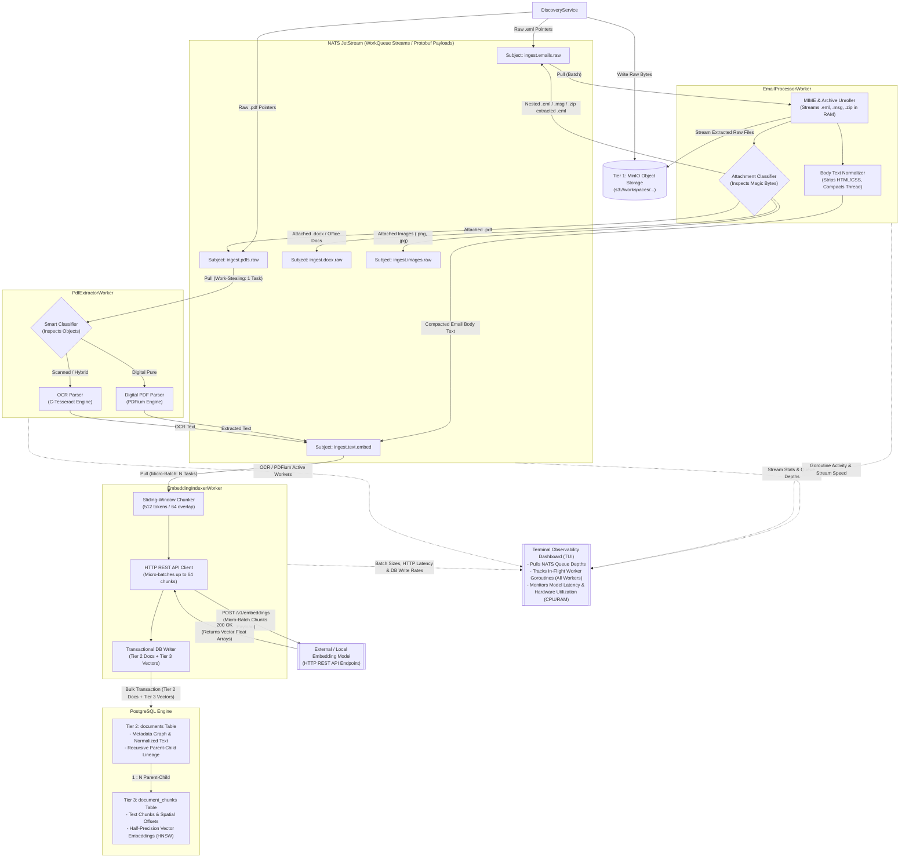

# Pocket Advisor Design

Here is the complete, comprehensive **Enterprise RAG Ingestion Pipeline Specification** updated to reflect all our architectural decisions: the unrolled pipeline topology, 100% Go runtime with in-memory parsing, NATS JetStream work-stealing queues, corrected worker naming, centralized Postgres writes, and decoupled terminal observability monitoring **all** active workers—including `EmbeddingIndexerWorker`.

---

# Enterprise RAG Ingestion Pipeline Specification

**Version:** `2.2.0-abstract`

**Architecture Paradigm:** Event-Driven Microservices, In-Memory Pipeline Processing, 3-Tier Storage Model

**Target Runtime:** 100% Go (Golang) Microservices with CGo bindings to C-engines

**Target Deployment:** Cloud-Native / On-Premise / Bare-Metal Containerized Environment

---

## 1. System Vision & Operational Guardrails

This specification defines a high-throughput, deterministic document ingestion system engineered for multi-workspace Retrieval-Augmented Generation (RAG). It processes complex, deeply nested document trees—such as emails with nested `.eml` files, zip archives, bank statements, scanned contracts, and multi-part PDF attachments—with zero temporary file creation on local disk storage and zero process-forking overhead.

### Non-Negotiable Core Principles

1. **Unrolled Pipeline Topology:** The pipeline decouples discovery from extraction. `DiscoveryService` routes payloads to format-specific handlers. `EmailProcessorWorker` recursively parses emails and archive containers, routing nested emails back to itself, direct PDFs to `PdfExtractorWorker`, and clean body text downstream to `EmbeddingIndexerWorker`.
2. **Unified Go Runtime:** All pipeline worker microservices must be implemented in Go. File parsing, archive unrolling, layout reconstruction, and OCR execute entirely in-memory using CGo bindings to native engines (`PDFium` and `Tesseract`). Invoking CLI binaries via OS subprocesses is strictly prohibited.
3. **Strict 3-Tier Data Separation:**
* **Tier 1 (Immutable Binary Vault):** Object storage serves as the byte-exact source of truth for raw `.eml`, `.pdf`, `.docx`, images, and `.zip` files.
* **Tier 2 (Relational Graph & Metadata):** PostgreSQL maintains parent-child document lineage (`parent_doc_id`), thread grouping, and full normalized text representations.
* **Tier 3 (Vector Similarity Store):** PostgreSQL (`pgvector`) stores text chunks, character provenance offsets, and quantized vector embeddings indexed via HNSW.

4. **Asynchronous Backpressure & Work-Stealing:** Inter-service routing relies on a message broker using competing-consumer work queues. CPU-intensive operations (such as OCR) use pull consumers with a single-task fetching limit (`batch = 1`), while I/O-bound tasks use micro-batch fetching.
5. **Compact Binary Serialization:** Inter-service control commands pass over the message queue as binary Protocol Buffers (Protobuf) payloads rather than human-readable text like JSON, minimizing memory overhead and network serialization latency.
6. **In-Memory PDF Classification:** PDFs pass through a lightweight, in-memory object inspection stage before text extraction. Digital PDFs with native text layers use a direct parsing path, while scanned or hybrid PDFs route to an in-memory OCR pipeline.
7. **Centralized DB Persistence with Decoupled Observability:** To maximize hardware saturation, database writes are strictly centralized inside `EmbeddingIndexerWorker` via atomic, micro-batched bulk transactions. Real-time system monitoring (TUI Dashboard) is decoupled from the database—observing live worker goroutine activity, NATS queue backlogs, HTTP model latency, and hardware pressure directly via NATS/Prometheus metrics.

---

## 2. Pipeline Architecture & Data Flow

---

## 3. Elaborated Component Mechanics

### A. `EmailProcessorWorker`

The primary unrolling engine for container formats (`.eml`, `.msg`, `.zip` archives) in RAM:

1. **MIME & Archive Parsing:** Fetches raw bytes directly from MinIO into RAM (`[]byte`). Unrolls multipart attachments, embedded files, and archives. Writes extracted raw files to MinIO as Tier 1 records and assigns child storage URIs.
2. **Body Text Normalization:** Converts HTML/RTF bodies to plain text, stripping CSS blocks, tracking pixels, and signature noise. Emits an `EmbedTextCommand` directly to `ingest.text.embed`.
3. **Recursive Attachment Routing:** Inspects magic bytes and MIME types for every extracted attachment file:
* **Nested Emails / Archives:** Emits a `ProcessEmailCommand` back to `ingest.emails.raw` (recursive pass).
* **PDF Files:** Emits a `ProcessPdfCommand` to `ingest.pdfs.raw`.
* **Word Documents:** Emits to `ingest.docx.raw`.
* **Images:** Emits to `ingest.images.raw`.

### B. `PdfExtractorWorker`

Handles digital, scanned, and hybrid PDF documents using an in-memory 2ms inspection pass:

* **Digital Pure Path:** Extracted directly using PDFium to obtain plain text and character bounding box $(X, Y)$ coordinates for table/layout reconstruction.
* **Scanned / Hybrid Path:** Renders page streams in memory into bitmap images and passes them directly to C-Tesseract via CGo bindings.
* Emits extracted text payloads to `ingest.text.embed`.

### C. `EmbeddingIndexerWorker`

The centralized persistence boundary and model integration worker:

1. **Sliding-Window Chunker:** Breaks text payloads into overlapping token chunks with precise start/end character offsets.
2. **HTTP REST API Client:** Pulls micro-batches (up to 64 items) from NATS and issues bulk POST requests to the embedding model endpoint.
3. **Transactional DB Writer:** Opens an atomic PostgreSQL transaction to write Tier 2 metadata (`documents`) and Tier 3 vector chunks (`document_chunks` with `halfvec(1536)` quantization).

---

## 4. Real-Time Terminal Observability Architecture

To monitor full hardware saturation and pipeline health in real time without introducing PostgreSQL write-lock contention, the **Terminal Observability Dashboard (TUI)** queries live telemetry sources directly:

1. **NATS JetStream Telemetry:** Reads queue depths (`num_pending`), message ingress/egress rates, and unacknowledged in-flight task counts (`num_ack_pending`) across all streams.
2. **Worker Runtime Metrics:** Every worker process (`EmailProcessorWorker`, `PdfExtractorWorker`, and `EmbeddingIndexerWorker`) exposes lightweight Prometheus/OpenTelemetry counters over an internal HTTP endpoint or NATS advisory subject:
* **`EmailProcessorWorker`:** Active goroutines, unrolled files/sec.
* **`PdfExtractorWorker`:** Active PDFium threads, active C-Tesseract OCR threads, page render times.
* **`EmbeddingIndexerWorker`:** Active micro-batch workers, REST API round-trip latency, vector generation throughput, and PostgreSQL bulk insert transaction speeds.

3. **Hardware Utilization:** Samples cgroups / OS CPU core usage, memory footprint, and disk/network I/O to verify hardware is running at peak capacity.

---

## 5. Storage Strategy & Data Lifecycle

### Tier 1: Immutable Binary Vault (MinIO)

* **Purpose:** Primary object store holding raw binary representations of all ingested files.
* **Naming Policy:** `s3://workspaces/{workspace_id}/threads/{thread_id}/{resource_type}/{file_hash}.ext`
* **Access Pattern:** Workers stream files directly into memory buffers (`[]byte`). Zero disk temp writes.

### Tier 2: Metadata & Relational Lineage Graph (PostgreSQL)

* **Purpose:** Stores the relational document tree, thread grouping, and full normalized plain text.
* **Lineage Rules:** Root emails set `parent_doc_id = NULL`. Attachments set `parent_doc_id` to their enclosing email's primary key (`doc_id`). Deleting a parent cascades deletions down the hierarchy.

### Tier 3: Vector Similarity Store (PostgreSQL + pgvector)

* **Purpose:** Stores broken-down text chunks alongside positional provenance metadata and vector embeddings.
* **Indexing & Quantization:** Uses 16-bit float quantization (`halfvec`) and Hierarchical Navigable Small World (HNSW) graph indexing with cosine distance.

---

## 6. Message Wire Contracts (Protobuf Specifications)

Services communicate over NATS using compiled Protocol Buffers:

* **`DocumentMetadata`:** Envelope containing `workspace_id`, `thread_id`, `parent_doc_id`, filename, MIME type, and creation timestamps.
* **`ProcessEmailCommand`:** Sent to `ingest.emails.raw`. Carries the MinIO URI for raw `.eml`/`.msg`/`.zip` objects.
* **`ProcessPdfCommand`:** Sent to `ingest.pdfs.raw`. Carries the MinIO URI for raw `.pdf` objects and task priority.
* **`EmbedTextCommand`:** Sent to `ingest.text.embed`. Carries normalized text payloads ready for chunking, REST API embedding, and database indexing.

---

## 7. Error Handling & Resilience

1. **Dead-Letter Routing:** JetStream limits redelivery attempts (`max_deliver = 3`). Corrupt files automatically move to a dead-letter queue after 3 failed attempts.
2. **Transactional Integrity:** `EmbeddingIndexerWorker` executes Tier 2 and Tier 3 database writes within a single atomic PostgreSQL transaction. Any API or database error triggers a clean rollback.
3. **Stateless Scale-Out:** All worker microservices remain fully stateless, allowing them to scale horizontally across CPU cores and nodes based on NATS queue depth metrics.
