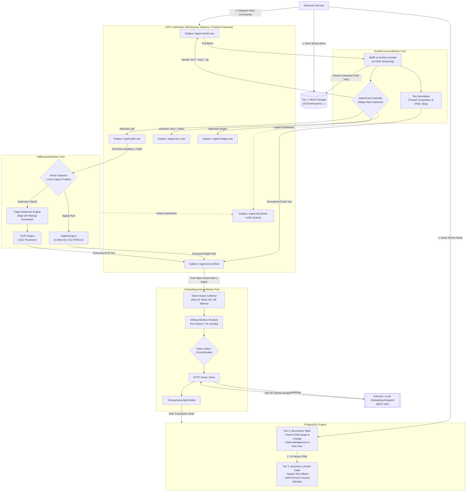

# High-Throughput Event-Driven Enterprise RAG Ingestion Engine Architecture

**Version:** `2.0.0`

**Architecture Paradigm:** Event-Driven Microservices, In-Memory Pipeline Processing, 3-Tier Storage Model

**Target Runtime:** 100% Go Worker Microservices with CGo Bindings (`PDFium`, `Tesseract`)

**Target Deployment:** Kubernetes Self-Hosted On-Premise or Cloud

---

## 1. Executive Summary & Architecture Principles

This system provides a high-throughput, deterministic document ingestion pipeline optimized for enterprise, multi-workspace RAG solutions. It is designed to handle complex, deeply nested document trees (such as emails containing nested `.eml` attachments, archives, scanned contracts, and digital bank statements) with **zero local disk I/O** and **zero OS subprocess forking**.

### Core Pillars

1. **In-Memory CGo Processing:** Direct C-library memory integration (`libpdfium` and `libtesseract`) inside Go microservices eliminates shell execution overhead and disk I/O latency.
2. **Strict 3-Tier Data Lifecycle:**
* **Tier 1 (Immutable Vault):** Object storage (`MinIO` / S3) preserves exact byte representations of original files.
* **Tier 2 (Relational Graph & Lineage):** Relational storage (`PostgreSQL`) tracks workspace boundaries, thread contexts, and parent-child document trees.
* **Tier 3 (Vector Similarity Index):** Vector storage (`pgvector`) retains spatial text chunk offsets and half-precision (`halfvec(1536)`) HNSW similarity indices.


3. **Smart Work-Stealing & Backpressure:** Message broker queues with pull-based consumers manage load dynamically across workers based on CPU and memory demands.
4. **Binary Wire Protocol:** Protocol Buffers over high-speed messaging minimize serialization penalties and network footprint.
5. **Deterministic Classification:** In-memory object inspection routes digital documents through microsecond parsing paths while directing scanned or hybrid assets to specialized OCR pipelines.

---

## 2. Dynamic Workflow & Failure Recovery Mechanisms

### 2.1 Async Parent Stubbing (Preventing Race Conditions)

To eliminate foreign key lookup failures caused by concurrent event consumption, top-level ingestion tasks immediately record a **Document Stub** in Tier 2 before issuing work to down-stream processing queues.

```
[Discovery Service]
       │
       ├─── 1. Write Raw Object ─────────────────────────► [Tier 1: MinIO Storage]
       │
       ├─── 2. Transactional Create Document Stub ───────► [Tier 2: PostgreSQL Documents]
       │       (State: 'PENDING', parent_doc_id assigned)
       │
       └─── 3. Emit Async Command Payload ───────────────► [NATS JetStream WorkQueue]

```

When child attachments are processed, their `parent_doc_id` exists in Tier 2, ensuring relational integrity regardless of consumption order.

### 2.2 Token-Aware Dynamic Micro-Batching

Instead of fetching fixed message counts, embedding workers collect tasks using dual constraints: **Max Task Count** or **Max Cumulative Token/Character Budget**. This prevents memory spikes and HTTP gateway timeouts when processing large text payloads.

### 2.3 DLQ and Poison Pill Management

Unparseable or corrupted files are protected against re-delivery loops. Messages exceeding maximum delivery thresholds are terminated, written to a **Dead Letter Queue (DLQ)** with failure diagnostic headers, and flagged in Tier 2 with an `ERROR` state for operational auditing.

---

## 3. End-to-End System Architecture



---

## 4. Contract Specifications & Data Schemas

### 4.1 Interface Protocols (Protobuf System Contracts)

The internal messaging protocol relies on immutable command messages containing tracing headers, workspace scope, and document lineage pointers.

* **DocumentMetadata Schema:** Captures context including `workspace_id`, `thread_id`, `parent_doc_id` (empty for root entities), `source_filename`, `mime_type`, and OpenTelemetry correlation headers (`trace_parent`).
* **ProcessEmailCommand:** Wraps object storage references (`minio_raw_uri`) and metadata for inbound email and archive tasks.
* **ProcessPdfCommand:** Contains object references, lineage metadata, and explicit processing priority flags for PDF processing.
* **EmbedTextCommand:** Transfers cleaned, normalized text payloads ready for chunking, token budgeting, and vector indexing.

---

### 4.2 Database Storage Architecture (PostgreSQL)

```
+-----------------------------------------------------------------------------------+
| TIER 2: DOCUMENTS (Relational Lineage & Normalization Graph)                      |
+-----------------------------------------------------------------------------------+
| - doc_id (UUID, PK)                                                               |
| - parent_doc_id (UUID, FK -> documents.doc_id ON DELETE CASCADE)                  |
| - workspace_id (VARCHAR, Indexed)                                                 |
| - thread_id (VARCHAR, Indexed)                                                    |
| - processing_status (ENUM: PENDING, PROCESSING, COMPLETED, FAILED)                |
| - doc_type & mime_type (VARCHAR)                                                  |
| - minio_raw_uri & raw_sha256 (TEXT/VARCHAR)                                       |
| - normalized_text (TEXT)                                                          |
| - metadata_headers (JSONB)                                                        |
| - created_at / updated_at (TIMESTAMPTZ)                                           |
+-----------------------------------------------------------------------------------+
                                          │
                                          │ 1 : N Lineage
                                          ▼
+-----------------------------------------------------------------------------------+
| TIER 3: DOCUMENT CHUNKS (Vector Index & Positional Provenance)                    |
+-----------------------------------------------------------------------------------+
| - chunk_id (UUID, PK)                                                             |
| - doc_id (UUID, FK -> documents.doc_id ON DELETE CASCADE)                         |
| - workspace_id (VARCHAR, Composite Index)                                         |
| - chunk_index (INT)                                                               |
| - start_char_offset & end_char_offset (INT)                                       |
| - chunk_text (TEXT)                                                               |
| - embedding (halfvec(1536), HNSW Cosine Index m=16, ef_construction=64)           |
| - fulltext_search (TSVECTOR, GIN Index for Hybrid Search)                         |
+-----------------------------------------------------------------------------------+

```

---

## 5. Microservice Domain Blueprint

### 5.1 Email Processor Service (`EmailProcessorWorker`)

* **Role:** Unrolls MIME structures, `.msg` containers, and archive formats (`.zip`, `.tar.gz`) directly in RAM.
* **Key Operations:**
* Extracts body text, strips HTML markup, and removes boilerplate signature lines.
* Streams nested attachments directly to Tier 1 Object Storage.
* Creates Tier 2 stubs for child documents before publishing commands back to NATS topic routes based on magic-byte classification.


### 5.2 PDF Extractor Service (`PdfExtractorWorker`)

* **Role:** High-speed document inspection and dual-engine text extraction.
* **Key Operations:**
* Runs a sub-2ms inspection pass on incoming PDFs (checking character densities and image bounding box dimensions).
* Directs pure digital PDFs to the `PDFium` engine for low-latency text extraction.
* Directs scanned or hybrid PDFs to an intermediate rasterizer, rendering high-DPI bitmaps page-by-page before passing them to the `Tesseract` OCR engine.
* Manages C-heap memory lifecycles explicitly per request to prevent runtime memory growth.


### 5.3 Embedding & Indexing Service (`EmbeddingIndexerWorker`)

* **Role:** Text chunking, vector embedding generation, and database persistence.
* **Key Operations:**
* Pulls commands using dynamic token/character budgeting.
* Applies sliding-window chunking (e.g., 512 tokens with 64-token overlap).
* Manages outbound REST requests to embedding endpoints via rate limiters and circuit breakers.
* Performs transactional multi-row writes across Tier 2 (updating status to `COMPLETED`) and Tier 3 (bulk vector insertion).


---

## 6. Deployment Infrastructure Strategy

### 6.1 Unified Deployment Topology

```
+-----------------------------------------------------------------------------------+
| KUBERNETES CLUSTER (Namespace: ingestion-engine)                                  |
+-----------------------------------------------------------------------------------+
|                                                                                   |
|   [ Ingress / Discovery API ] ──► [ Internal K8s DNS Service Discovery ]          |
|                                                                                   |
|   +--------------------------+   +--------------------------+                     |
|   | StatefulSet: MinIO       |   | StatefulSet: NATS        |                     |
|   | - Tier 1 Immutable Vault |   | - JetStream WorkQueues   |                     |
|   +--------------------------+   +--------------------------+                     |
|                                                                                   |
|   +---------------------------------------------------------+                     |
|   | StatefulSet: PostgreSQL + pgvector                      |                     |
|   | - Tier 2 Document Tree & Tier 3 HNSW Vector Indices     |                     |
|   +---------------------------------------------------------+                     |
|                                                                                   |
|   +---------------------------------------------------------+                     |
|   | Deployment: Email Processor Worker Pool (HPA Trigger: Q) |                     |
|   +---------------------------------------------------------+                     |
|                                                                                   |
|   +---------------------------------------------------------+                     |
|   | Deployment: PDF Extractor Worker Pool   (HPA Trigger: CPU)|                     |
|   +---------------------------------------------------------+                     |
|                                                                                   |
|   +---------------------------------------------------------+                     |
|   | Deployment: Embedding Indexer Worker Pool (HPA Trigger: Q)|                   |
|   +---------------------------------------------------------+                     |
|                                                                                   |
+-----------------------------------------------------------------------------------+

```

### 6.2 Component Resource Planning

| Service Role | Minimum Scaling Unit | Primary Bottleneck | Horizontal Auto-scaler Metric |
| --- | --- | --- | --- |
| **Discovery Service** | 2 Replicas | Network I/O | Request Rate |
| **Email Processor** | 2 Replicas | RAM / Parsing | Queue Depth (`ingest.emails.raw`) |
| **PDF Extractor** | 3 Replicas | CPU / CGo RAM | CPU Utilization / Queue Depth (`ingest.pdfs.raw`) |
| **Embedding Indexer** | 2 Replicas | Network I/O / DB Ops | Queue Depth (`ingest.text.embed`) |
| **PostgreSQL + pgvector** | Stateful Set | Disk IOPS / RAM | Memory / Storage Capacity |
| **NATS JetStream** | Stateful Set | Network / Memory | Queue Backpressure |

---

## 7. Verification & Operational Lifecycle

```
[ Phase 1: Setup ]
  │── Apply Storage Schemas (PostgreSQL DDL & HNSW Indices)
  └── Provision NATS JetStream Streams & Retries (WorkQueue mode)

[ Phase 2: Deployment ]
  │── Roll out Container Bundles (Go Binaries + Pre-compiled C-Libs)
  └── Initialize Service Health Checks & Metrics Exporters

[ Phase 3: Observability & Tuning ]
  │── Trace Execution via OpenTelemetry Spans
  │── Track CGo Heap Allocations & Process Recycling Thresholds
  └── Monitor Dynamic Micro-Batch Budgets against Embedding Latencies

```
